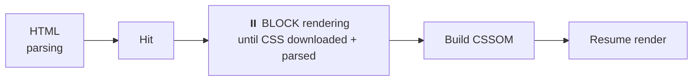

# Lesson 03 — Critical CSS & Loading

## CSS Is Render-Blocking

The browser **cannot render anything** until all CSS in `<head>` is downloaded and parsed. This is because:

1. The browser needs to build the CSSOM before creating the render tree
2. Rendering without CSS would cause a Flash of Unstyled Content (FOUC)



## Critical CSS

**Critical CSS** = the minimum CSS needed to render the **above-the-fold content** (what's visible without scrolling). Strategy:

1. Inline critical CSS in `<head>` (no network request)
2. Load the rest asynchronously

```html
<head>
  <!-- Critical CSS inlined — renders immediately -->
  <style>
    body { margin: 0; font-family: system-ui; }
    .header { height: 60px; background: #333; color: white; }
    .hero { padding: 60px 20px; text-align: center; }
    /* ... just above-the-fold styles ... */
  </style>
  
  <!-- Non-critical CSS loaded asynchronously -->
  <link rel="preload" href="/styles/full.css" as="style" 
        onload="this.onload=null;this.rel='stylesheet'">
  <noscript><link rel="stylesheet" href="/styles/full.css"></noscript>
</head>
```

### Tools for Extracting Critical CSS

- **Critical** (npm): `critical generate --src index.html --css styles.css`
- **PurgeCSS**: Removes unused CSS from your bundle
- **Chrome Coverage tool**: Shows which CSS bytes are actually used

## Media-Specific Loading

Non-matching media queries are still downloaded but are **not render-blocking**:

```html
<!-- Render-blocking (matches default screen): -->
<link rel="stylesheet" href="main.css">

<!-- Not render-blocking on screen (downloaded in background): -->
<link rel="stylesheet" href="print.css" media="print">

<!-- Not render-blocking on wide screens: -->
<link rel="stylesheet" href="mobile.css" media="(max-width: 768px)">
```

## Font Loading Performance

Fonts cause two problems:

1. **FOIT** (Flash of Invisible Text): Text is invisible while font loads
2. **FOUT** (Flash of Unstyled Text): Text shown in fallback, then swaps

### `font-display` — Control the Swap Behavior

```css
@font-face {
  font-family: 'MyFont';
  src: url('/fonts/myfont.woff2') format('woff2');
  font-display: swap;  /* show fallback immediately, swap when loaded */
}
```

| Value | Block Period | Swap Period | Use Case |
|-------|-------------|-------------|----------|
| `auto` | Browser decides | Browser decides | Default |
| `block` | 3 seconds (invisible) | Infinite | Icon fonts |
| `swap` | 0 (show fallback) | Infinite | Body text |
| `fallback` | 100ms | 3 seconds | Balanced |
| `optional` | 100ms | 0 (give up) | Non-essential |

### Font Preloading

```html
<link rel="preload" href="/fonts/myfont.woff2" as="font" type="font/woff2" crossorigin>
```

`crossorigin` is required even for same-origin fonts (font requests use anonymous CORS).

### Reducing Font Size

```css
/* Only load characters you need: */
@font-face {
  font-family: 'MyFont';
  src: url('/fonts/myfont-latin.woff2') format('woff2');
  unicode-range: U+0000-00FF;  /* Latin characters only */
}
```

## Resource Hints

```html
<!-- Preload: high-priority fetch for current page -->
<link rel="preload" href="critical.css" as="style">
<link rel="preload" href="hero.woff2" as="font" type="font/woff2" crossorigin>

<!-- Prefetch: low-priority fetch for NEXT page -->
<link rel="prefetch" href="next-page.css">

<!-- Preconnect: establish connection early -->
<link rel="preconnect" href="https://fonts.googleapis.com">
<link rel="preconnect" href="https://fonts.gstatic.com" crossorigin>

<!-- DNS Prefetch: just resolve DNS -->
<link rel="dns-prefetch" href="https://analytics.example.com">
```

## CSS Bundig Strategy

| Strategy | When to Use |
|----------|-------------|
| **Single bundle** | Small sites (< 50KB CSS) |
| **Route-based splitting** | SPAs — load CSS per route |
| **Component-based** | CSS Modules, styled-components — loaded with component |
| **Critical + async** | Content sites — inline critical, defer rest |

## DevTools: Coverage Tool

1. DevTools → `Ctrl+Shift+P` → "Coverage"
2. Click reload button
3. See **percentage of CSS bytes actually used** on this page
4. Red bars = unused CSS
5. Click a file → see line-by-line usage

## Summary

- CSS is render-blocking — minimize what's in `<head>`
- Inline critical CSS, async-load the rest
- Use `font-display: swap` for faster text rendering
- Preload critical fonts and stylesheets
- Use Coverage tool to find unused CSS

## Next

→ [Lesson 04: Profiling & Measurement](04-profiling.md)
