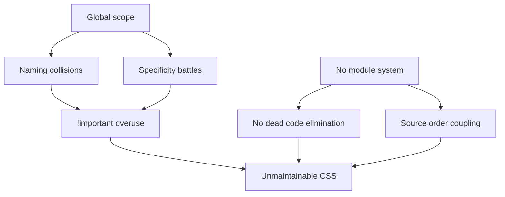

# Lesson 01 — The Scaling Problem

## Why CSS Breaks at Scale

CSS was designed for documents, not applications. Four problems emerge as projects grow:

### 1. Global Namespace

Every CSS rule is global. Two developers writing `.button` styles in different files **will conflict**.

```css
/* developer-a.css */
.button { padding: 8px 16px; background: blue; }

/* developer-b.css */
.button { padding: 12px 24px; background: green; }
/* ← whoever loads second wins */
```

### 2. Specificity Wars

Overriding styles leads to escalating specificity:

```css
/* Sprint 1: */
.nav .link { color: blue; }

/* Sprint 3: need different color */
.nav .link.active { color: red; }

/* Sprint 5: still not working in some context */
.sidebar .nav .link.active { color: red; }

/* Sprint 8: developer gives up */
.link { color: red !important; }
```

### 3. Dead Code Accumulation

No tool (without runtime analysis) can safely determine if a CSS rule is unused, because:
- Classes may be added by JavaScript
- HTML may be server-rendered
- Selectors may target dynamic content

Result: CSS bundles grow monotonically — nobody dares delete rules.

### 4. Source Order Coupling

The cascade means file/import order matters. Moving an `@import` can break styles across the entire app.

## The Root Cause



## Three Approaches to Solving This

| Approach | How It Solves the Problem | Trade-off |
|----------|-------------------------|-----------|
| **Methodology** (BEM) | Naming conventions prevent collisions | Requires discipline, verbose classes |
| **Utility-first** (Tailwind) | No custom classes, compose utilities | HTML becomes verbose, learning curve |
| **Scoped** (CSS Modules) | Tooling enforces scope automatically | Build tool dependency, harder to share |

Each has legitimate use cases. There is no single best approach.

## Measuring CSS Health

Signs of an unhealthy CSS codebase:

| Symptom | Metric |
|---------|--------|
| Specificity wars | High number of IDs and `!important` |
| Dead code | Coverage tool shows > 50% unused |
| Bundle bloat | CSS size grows faster than feature count |
| Override chains | Nested selectors > 3 levels deep |
| Fragile changes | Changing one class breaks unrelated components |

```bash
# Quick check: count !important usage
grep -c '!important' styles/**/*.css

# Count ID selectors
grep -c '#[a-zA-Z]' styles/**/*.css
```

## Next

→ [Lesson 02: BEM & Methodologies](02-bem.md)
