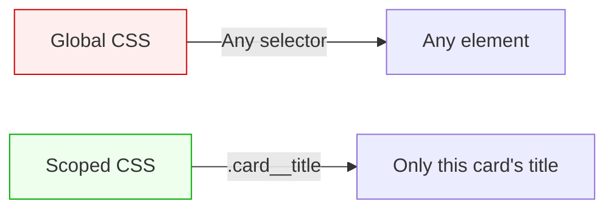
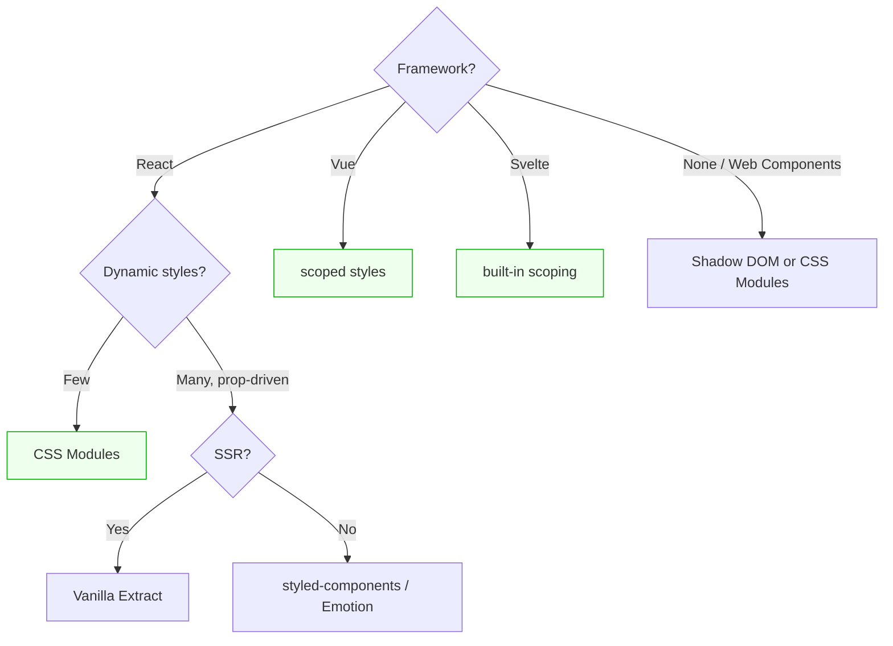

# Lesson 04 — Component-Scoped CSS

## The Scoping Problem

Global CSS means any selector can affect any element. Component-scoped CSS restricts styles to a single component boundary.



## CSS Modules

**Build-time scoping.** The bundler (webpack, Vite) transforms class names into unique hashes:

```css
/* Card.module.css */
.title {
  font-size: 18px;
  font-weight: bold;
}

.body {
  color: #666;
}
```

```jsx
// Card.jsx
import styles from './Card.module.css';

function Card() {
  return (
    <div>
      <h3 className={styles.title}>Hello</h3>
      <p className={styles.body}>World</p>
    </div>
  );
}
```

**Output in the browser:**

```html
<h3 class="Card_title_x7f2a">Hello</h3>
<p class="Card_body_k9d1e">World</p>
```

### How It Solves the Problems

| Problem | Solution |
|---------|----------|
| Global namespace | Hash makes names unique per file |
| Specificity wars | All selectors are single class |
| Dead code | Unused exports are tree-shaken |
| Source order | Each component's CSS is independent |

### Composition

Share styles between modules without inheritance:

```css
/* shared.module.css */
.truncate {
  overflow: hidden;
  text-overflow: ellipsis;
  white-space: nowrap;
}

/* Card.module.css */
.title {
  composes: truncate from './shared.module.css';
  font-size: 18px;
}
```

## CSS-in-JS

Styles defined in JavaScript, scoped by runtime or build-time extraction.

### Runtime (styled-components, Emotion)

```jsx
import styled from 'styled-components';

const Card = styled.div`
  border: 1px solid #ddd;
  border-radius: 8px;
  padding: ${props => props.$compact ? '8px' : '16px'};
`;

const Title = styled.h3`
  font-size: 18px;
  color: ${props => props.theme.colors.heading};
`;

function App() {
  return (
    <Card $compact>
      <Title>Hello</Title>
    </Card>
  );
}
```

**How it works:** Injects a `<style>` tag at runtime with generated class names.

### Build-Time Extraction (Vanilla Extract, Linaria)

```typescript
// Card.css.ts (vanilla-extract)
import { style } from '@vanilla-extract/css';

export const card = style({
  border: '1px solid #ddd',
  borderRadius: 8,
  padding: 16,
});

export const title = style({
  fontSize: 18,
  fontWeight: 'bold',
});
```

Extracts to real CSS files at build time — no runtime cost.

### Trade-Off Matrix

| Feature | CSS Modules | Runtime CSS-in-JS | Build-Time CSS-in-JS |
|---------|-------------|-------------------|---------------------|
| Scoping | Build-time hash | Runtime hash | Build-time hash |
| Dynamic styles | ❌ Class toggle | ✅ Props-based | ⚠️ CSS variables |
| Runtime cost | None | ~10-20KB JS + injection | None |
| Type safety | ❌ | ⚠️ Template literals | ✅ TypeScript |
| SSR | ✅ Simple | ⚠️ Needs extraction | ✅ Simple |
| Debugging | Readable hashes | Generated names | Readable hashes |

## Framework Scoped Styles

### Vue `<style scoped>`

```vue
<template>
  <div class="card">
    <h3 class="title">{{ title }}</h3>
  </div>
</template>

<style scoped>
.card {
  border: 1px solid #ddd;
}
.title {
  font-size: 18px;
}
</style>
```

Compiled output:

```html
<div class="card" data-v-7ba5bd90>
  <h3 class="title" data-v-7ba5bd90>Hello</h3>
</div>
```

```css
.card[data-v-7ba5bd90] { border: 1px solid #ddd; }
.title[data-v-7ba5bd90] { font-size: 18px; }
```

Vue adds a **data attribute** and appends it to selectors. Specificity is (0,1,1) — slightly higher than a bare class.

### Svelte

```svelte
<div class="card">
  <h3 class="title">{title}</h3>
</div>

<style>
  .card { border: 1px solid #ddd; }
  .title { font-size: 18px; }
</style>
```

Similar to Vue — Svelte adds a unique class (`.svelte-abc123`) to elements and selectors.

### Shadow DOM (Web Components)

True browser-native encapsulation:

```javascript
class MyCard extends HTMLElement {
  constructor() {
    super();
    const shadow = this.attachShadow({ mode: 'open' });
    shadow.innerHTML = `
      <style>
        .card { border: 1px solid #ddd; border-radius: 8px; }
        .title { font-size: 18px; font-weight: bold; }
        /* These styles CANNOT leak out */
        /* External styles CANNOT reach in (mostly) */
      </style>
      <div class="card">
        <h3 class="title"><slot></slot></h3>
      </div>
    `;
  }
}
customElements.define('my-card', MyCard);
```

**Key behaviors:**
- Styles inside shadow DOM don't affect the page
- Page styles don't affect shadow DOM (except inherited properties like `color`, `font`)
- `::part()` allows targeted external styling
- CSS custom properties **do** penetrate the shadow boundary

## Choosing Your Approach



**Practical recommendation for most React projects:**

1. **CSS Modules** for component styles (zero runtime cost)
2. **CSS custom properties** for theming and dynamic values
3. **A small utility layer** for common one-off adjustments
4. **Global CSS** only for reset, typography, and CSS variable definitions

---

## Module 12 Summary

You learned:
- **Why CSS breaks at scale** — global namespace, specificity wars, dead code, source order coupling
- **BEM** — naming convention that encodes component relationships
- **ITCSS** — organizational strategy from generic to specific
- **Utility-first** — single-purpose classes, design token enforcement, when it fits
- **Component scoping** — CSS Modules, CSS-in-JS, framework scoped styles, Shadow DOM

## Next

→ [Module 13: Preprocessors & Tooling](../13-preprocessors-tooling/README.md)
