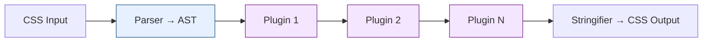

# Lesson 02 — PostCSS

## What PostCSS Is

PostCSS is **not** a preprocessor. It's a **CSS transformer** — it parses CSS into an AST, runs plugins over it, and serializes back to CSS.



PostCSS itself does nothing. Its power comes from plugins.

## Essential Plugins

### Autoprefixer

Adds vendor prefixes based on your browser target:

```css
/* Input */
.card {
  user-select: none;
  backdrop-filter: blur(10px);
}

/* Output (with targets: "> 1%, last 2 versions") */
.card {
  -webkit-user-select: none;
     -moz-user-select: none;
          user-select: none;
  -webkit-backdrop-filter: blur(10px);
          backdrop-filter: blur(10px);
}
```

Uses [Can I Use](https://caniuse.com/) data via Browserslist.

Configure targets in `package.json`:

```json
{
  "browserslist": [
    "> 1%",
    "last 2 versions",
    "not dead"
  ]
}
```

### cssnano

Minifies CSS:

```css
/* Input */
.card {
  margin: 10px 10px 10px 10px;
  color: #ff0000;
  font-weight: bold;
  background: none;
}

/* Output */
.card{margin:10px;color:red;font-weight:700;background:0 0}
```

Optimizations:
- Shorthand merging (`margin: 10px 10px 10px 10px` → `10px`)
- Color shortening (`#ff0000` → `red`)
- Keyword replacement (`bold` → `700`)
- Whitespace and comment removal
- Duplicate rule merging

### postcss-preset-env

Use future CSS syntax today. It transforms modern features to compatible output:

```css
/* Input — using Stage 2+ features */
.card {
  /* Nesting */
  & .title {
    color: oklch(40% 0.2 260);  /* oklch color */
  }

  /* Custom media queries */
  @custom-media --tablet (min-width: 768px);
  @media (--tablet) {
    padding: 24px;
  }
}
```

Configure which stage of features to enable:

```json
{
  "postcss-preset-env": {
    "stage": 2,
    "features": {
      "nesting-rules": true,
      "custom-media-queries": true
    }
  }
}
```

### PurgeCSS / CSS Tree Shaking

Removes unused CSS by scanning your HTML/JS for class references:

```javascript
// postcss.config.js
module.exports = {
  plugins: [
    require('@fullhuman/postcss-purgecss')({
      content: [
        './src/**/*.html',
        './src/**/*.jsx',
        './src/**/*.tsx',
      ],
      // Safelist classes that are added dynamically
      safelist: ['is-active', 'is-open', /^modal-/],
    }),
  ],
};
```

**Danger:** PurgeCSS does static analysis. It can't detect dynamically composed class names:

```jsx
// ❌ PurgeCSS won't find this
const cls = `text-${color}-500`;

// ✅ PurgeCSS can find this
const cls = color === 'red' ? 'text-red-500' : 'text-blue-500';
```

## PostCSS Configuration

```javascript
// postcss.config.js
module.exports = {
  plugins: [
    require('postcss-import'),        // Inline @import
    require('postcss-preset-env')({   // Future CSS
      stage: 2,
      autoprefixer: { grid: true },
    }),
    require('cssnano')({              // Minify (production only)
      preset: 'default',
    }),
  ],
};
```

**Plugin order matters.** Plugins run in array order:
1. `postcss-import` — resolve `@import` first
2. `postcss-preset-env` — transform syntax
3. `autoprefixer` — add prefixes (often included in preset-env)
4. `cssnano` — minify last

## Writing a Simple Plugin

```javascript
// postcss-plugin-remove-comments.js
module.exports = () => ({
  postcssPlugin: 'remove-comments',
  Comment(comment) {
    // Remove all comments except license headers
    if (!comment.text.startsWith('!')) {
      comment.remove();
    }
  },
});
module.exports.postcss = true;
```

The plugin API walks the AST nodes:

| Node Type | Examples |
|-----------|---------|
| `Root` | The stylesheet |
| `AtRule` | `@media`, `@keyframes` |
| `Rule` | `.card { }` |
| `Declaration` | `color: red` |
| `Comment` | `/* text */` |

## PostCSS vs Sass

| Feature | Sass | PostCSS |
|---------|------|---------|
| Variables | `$var` (compile-time) | Uses native `var()` or plugin |
| Nesting | Built-in | `postcss-nesting` (spec-compliant) |
| Mixins | `@mixin` / `@include` | `postcss-mixins` (less powerful) |
| Color functions | `darken()`, `lighten()` | Native `color-mix()` via preset-env |
| Math | Built-in | `postcss-calc` |
| Loops / conditionals | `@each`, `@if` | Not available |
| Prefixing | Not built-in | Autoprefixer |
| Minification | Not built-in | cssnano |

**Common combination:** Sass for authoring → PostCSS for optimization.

## Next

→ [Lesson 03: Native CSS vs Preprocessors](03-native-vs-preprocessor.md)
