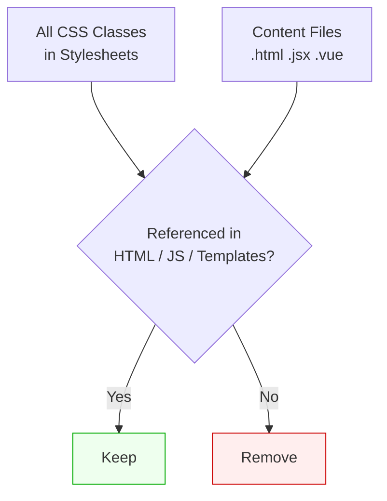
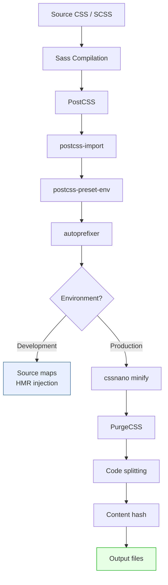

# Lesson 04 — Build Pipelines

## CSS in the Build Process

Modern CSS goes through multiple transformations before reaching the browser:

```mermaid
graph LR
    A[Source Files<br>.scss .css .module.css] --> B[Preprocessor<br>Sass → CSS]
    B --> C[PostCSS<br>Autoprefixer<br>Preset-env]
    C --> D[Bundler<br>Concat / Split]
    D --> E[Minifier<br>cssnano]
    E --> F[Output<br>style.[hash].css]
    
    style A fill:#f5f5f5,stroke:#999
    style F fill:#e6ffe6,stroke:#0a0
```

## Build Tools

### Vite

Modern, fast build tool. CSS handling is built in:

```javascript
// vite.config.js
import { defineConfig } from 'vite';

export default defineConfig({
  css: {
    // Sass — just install `sass` package, Vite detects .scss automatically
    preprocessorOptions: {
      scss: {
        additionalData: `@use "src/styles/variables" as *;`,
      },
    },

    // PostCSS — reads postcss.config.js automatically
    // No additional config needed here

    // CSS Modules — enabled for *.module.css by default
    modules: {
      localsConvention: 'camelCase',  // .my-class → styles.myClass
      generateScopedName: '[name]__[local]__[hash:5]',
    },

    // Dev: injects styles via <style> tags (HMR)
    // Build: extracts to CSS files
    devSourcemap: true,
  },
});
```

**Key behaviors:**
- `.css` files are processed through PostCSS
- `.scss` files are compiled then processed through PostCSS
- `.module.css` files get CSS Modules scoping
- Dev server: styles injected as `<style>` tags with HMR
- Production build: styles extracted to hashed `.css` files

### Webpack

```javascript
// webpack.config.js
module.exports = {
  module: {
    rules: [
      {
        test: /\.scss$/,
        use: [
          'style-loader',          // 4. Injects <style> (dev)
          // MiniCssExtractPlugin.loader,  // 4. Extracts to file (prod)
          'css-loader',            // 3. Resolves @import, url()
          'postcss-loader',        // 2. Runs PostCSS plugins
          'sass-loader',           // 1. Compiles SCSS → CSS
        ],
        // Loaders run BOTTOM-TO-TOP
      },
      {
        test: /\.module\.css$/,
        use: [
          'style-loader',
          {
            loader: 'css-loader',
            options: { modules: true },  // Enable CSS Modules
          },
          'postcss-loader',
        ],
      },
    ],
  },
};
```

**Loader execution order** (bottom-to-top / right-to-left):

```
Source.scss
  → sass-loader    (SCSS → CSS)
  → postcss-loader (autoprefixer, preset-env)
  → css-loader     (resolve imports, url(), modules)
  → style-loader   (inject into DOM)
```

## CSS Code Splitting

### Per-Route Splitting

When you dynamically import a component, its CSS is split automatically:

```jsx
// React with React.lazy
const Dashboard = React.lazy(() => import('./Dashboard'));
// Dashboard.css is only loaded when Dashboard is rendered

// Vue with defineAsyncComponent
const Dashboard = defineAsyncComponent(() => import('./Dashboard.vue'));
// <style> from Dashboard.vue is split into its own chunk
```

### The Critical CSS Pattern

```html
<!-- Inline critical CSS for above-the-fold content -->
<head>
  <style>
    /* Critical: header, hero, navigation */
    .header { /* ... */ }
    .hero { /* ... */ }
  </style>
  
  <!-- Load the rest asynchronously -->
  <link rel="preload" href="/styles.css" as="style" 
        onload="this.onload=null;this.rel='stylesheet'">
  <noscript><link rel="stylesheet" href="/styles.css"></noscript>
</head>
```

## CSS Purging in Production

### How It Works



### Tailwind's Content Configuration

```javascript
// tailwind.config.js
module.exports = {
  content: [
    './src/**/*.{html,js,jsx,ts,tsx,vue,svelte}',
    './public/index.html',
  ],
  // Tailwind scans these files for class names
  // Only generates utilities that are actually used
};
```

**Before purge:** ~3.5MB (all Tailwind utilities)
**After purge:** ~10-30KB (only used utilities)

### Safe Patterns for Dynamic Classes

```jsx
// ✅ Full class names are discoverable
const colorMap = {
  success: 'bg-green-500 text-white',
  error: 'bg-red-500 text-white',
  warning: 'bg-yellow-500 text-black',
};

// ❌ Interpolated — purger can't find these
const cls = `bg-${color}-500`;

// ✅ Safelist in config for truly dynamic classes
// tailwind.config.js
module.exports = {
  safelist: [
    { pattern: /^bg-(red|green|blue)-(100|500|900)$/ },
  ],
};
```

## Source Maps

Source maps connect minified/compiled CSS back to the original source:

```
Bundle:   .card_x7f2a{border:1px solid #ddd;padding:1rem}
Source:    .card { border: 1px solid #ddd; padding: 1rem; }
File:     src/components/Card.module.css:3
```

- **Development:** Always enable (fastest debugging)
- **Production:** Separate `.map` files (upload to error tracking, don't serve publicly) or disable

```javascript
// vite.config.js
export default defineConfig({
  css: { devSourcemap: true },
  build: { sourcemap: true },  // or 'hidden' for private maps
});
```

## Content Hashing

```
/* Development */
style.css

/* Production */
style.a1b2c3d4.css
```

The hash changes when content changes, enabling **aggressive caching**:

```
Cache-Control: public, max-age=31536000, immutable
```

Bundlers handle this automatically:

```javascript
// Vite — default behavior
build: {
  rollupOptions: {
    output: {
      assetFileNames: 'assets/[name].[hash].[ext]',
    },
  },
},
```

## Recommended Production Pipeline



---

## Module 13 Summary

You learned:
- **Sass** — variables, nesting, mixins, functions, `@use` modules
- **PostCSS** — plugin architecture, autoprefixer, cssnano, preset-env
- **Native replacements** — custom properties, native nesting, `color-mix()` replace many Sass features
- **Build pipelines** — loader order, code splitting, purging, source maps, content hashing

## Next

→ [Module 14: Modern CSS Features](../14-modern-css/README.md)
