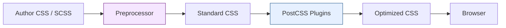

# Module 13 — Preprocessors & Tooling

## Overview

CSS preprocessors extend the language with variables, nesting, mixins, and functions. PostCSS transforms it with plugins. Modern CSS has adopted many preprocessor features natively. This module covers what still matters and how build tooling fits into the pipeline.

## Lessons

| # | File | Topic |
|---|------|-------|
| 01 | [01-sass.md](01-sass.md) | Sass/SCSS — nesting, variables, mixins, extends, functions |
| 02 | [02-postcss.md](02-postcss.md) | PostCSS — plugin architecture, autoprefixer, cssnano |
| 03 | [03-native-vs-preprocessor.md](03-native-vs-preprocessor.md) | Native CSS features that replace preprocessor features |
| 04 | [04-build-pipelines.md](04-build-pipelines.md) | Build tools (Vite, webpack), bundling, code splitting, purging |

## Prerequisites

- Completed Module 12 (Architecture)
- Node.js environment for build tool experiments

## Next

→ [Lesson 01: Sass/SCSS](01-sass.md)
