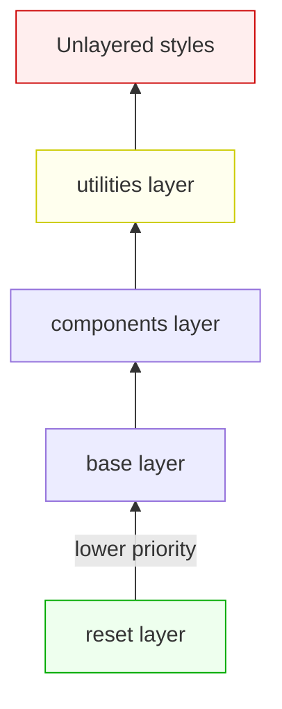
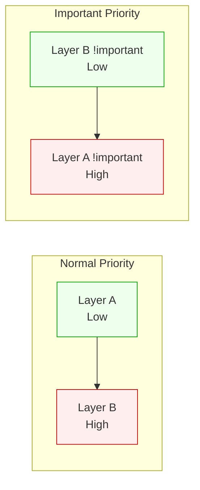

# Lesson 02 — Cascade Layers

## The Problem @layer Solves

Before `@layer`, controlling CSS precedence meant fighting specificity or manipulating source order. Third-party CSS (frameworks, component libraries) could override your styles unpredictably.

```css
/* Third-party framework (loaded first) */
.btn { padding: 12px 24px; background: blue; }     /* (0,1,0) */

/* Your code (loaded second — wins by source order) */
.btn { padding: 8px 16px; }                         /* (0,1,0) ✅ */

/* But if the framework uses higher specificity... */
.framework .btn { padding: 12px 24px; }             /* (0,2,0) 💥 */
/* Now you need to escalate too */
```

`@layer` creates **explicit precedence tiers** that override specificity and source order within/between layers.

## How Layers Work

```css
/* Declare layer order (first declaration wins) */
@layer reset, base, components, utilities;

/* Assign styles to layers */
@layer reset {
  * { margin: 0; box-sizing: border-box; }
}

@layer base {
  body { font-family: system-ui; line-height: 1.6; }
  a { color: var(--primary); }
}

@layer components {
  .btn { padding: 8px 16px; border-radius: 4px; }
  .card { border: 1px solid #ddd; }
}

@layer utilities {
  .hidden { display: none; }
  .sr-only { position: absolute; width: 1px; height: 1px; }
}
```

### Precedence Rules



**Key rules:**

1. **Layer order is set by the first `@layer` declaration** — subsequent `@layer` blocks add to existing layers
2. **Later layers beat earlier layers** — regardless of specificity
3. **Unlayered CSS beats ALL layers** — this is the escape hatch
4. **Within a layer**, normal specificity and source order rules apply

### Example: Layer Beats Specificity

```css
@layer framework, custom;

@layer framework {
  #app .container .btn.primary {   /* (1,3,0) — very high specificity */
    background: blue;
  }
}

@layer custom {
  .btn {                            /* (0,1,0) — low specificity */
    background: green;              /* ✅ WINS — custom layer is later */
  }
}
```

The `.btn` in the `custom` layer wins despite having much lower specificity, because `custom` is declared after `framework`.

## Layer Order Declaration

```css
/* Method 1: Explicit order statement */
@layer reset, base, components, utilities;

/* Method 2: Import into layers */
@import url('reset.css') layer(reset);
@import url('framework.css') layer(framework);

/* Method 3: Anonymous layers (use sparingly) */
@layer {
  /* This layer has no name — can't be reordered or appended to */
}
```

### Nested Layers

```css
@layer components {
  @layer card {
    .card { border: 1px solid #ddd; }
  }
  @layer button {
    .btn { padding: 8px 16px; }
  }
}

/* Reference nested layers with dot notation */
@layer components.card {
  .card__title { font-size: 18px; }
}
```

## Practical Pattern: Taming Third-Party CSS

```css
/* Establish order */
@layer reset, third-party, components, overrides;

/* Import framework into a controlled layer */
@import url('bootstrap.css') layer(third-party);

/* Your components always win over Bootstrap */
@layer components {
  .card {
    border-radius: 8px;     /* Beats any Bootstrap .card styles */
  }
}

/* Emergency overrides */
@layer overrides {
  .legacy-fix {
    margin: 0 !important;   /* !important within layers: reversed order */
  }
}
```

## !important and Layers

**`!important` reverses layer order.** This is unintuitive but logical:

```css
@layer A, B;
/* Normal: B wins over A */
/* !important: A wins over B */
```



Why? `!important` in a low layer is a **defense** — it says "this value must not be overridden by higher layers." If higher layers could still use `!important` to win, the defense would be useless.

```css
@layer reset, theme;

@layer reset {
  *, *::before, *::after {
    box-sizing: border-box !important;  /* Reset's !important WINS */
  }
}

@layer theme {
  .widget {
    box-sizing: content-box !important; /* Loses to reset's !important */
  }
}
```

## Experiment — Layer Precedence Visualizer

```html
<!DOCTYPE html>
<html lang="en">
<head>
<meta charset="UTF-8">
<meta name="viewport" content="width=device-width, initial-scale=1.0">
<title>@layer Precedence</title>
<style>
/* Declare layer order */
@layer reset, base, components, utilities;

@layer reset {
  * { margin: 0; box-sizing: border-box; }
}

@layer base {
  body {
    font-family: system-ui;
    padding: 2rem;
    background: #f8fafc;
  }
  .box {
    padding: 1.5rem;
    margin: 1rem 0;
    border: 2px solid #ddd;
    border-radius: 8px;
    font-size: 14px;
  }
}

@layer components {
  /* Medium specificity */
  .box {
    background: lightyellow;
    border-color: orange;
  }
  .box.special {
    background: lightcoral;
    border-color: red;
  }
}

@layer utilities {
  /* Low specificity but WINS because utilities layer is last */
  .bg-green {
    background: lightgreen;
    border-color: green;
  }
}

/* Unlayered — beats everything */
.unlayered-override {
  background: lavender;
  border-color: purple;
}

h1 { font-size: 1.5rem; margin-bottom: 0.5rem; }
h2 { font-size: 1.1rem; margin-bottom: 1rem; color: #666; }
code { background: #e2e8f0; padding: 2px 6px; border-radius: 3px; font-size: 13px; }
</style>
</head>
<body>
  <h1>@layer Precedence Demo</h1>
  <h2>Layer order: reset → base → components → utilities → unlayered</h2>

  <div class="box">
    <strong>1. Base layer only</strong><br>
    <code>.box</code> — styled by <code>base</code> layer (border: #ddd)
    and <code>components</code> layer (background: lightyellow, border: orange)
  </div>

  <div class="box special">
    <strong>2. Components layer with higher specificity</strong><br>
    <code>.box.special</code> — (0,2,0) in components layer: lightcoral
  </div>

  <div class="box special bg-green">
    <strong>3. Utilities beat components despite LOWER specificity</strong><br>
    <code>.box.special.bg-green</code> — <code>.bg-green</code> is (0,1,0) 
    but wins because utilities layer comes after components
  </div>

  <div class="box special bg-green unlayered-override">
    <strong>4. Unlayered CSS beats ALL layers</strong><br>
    <code>.unlayered-override</code> — not in any layer, so it wins over everything
  </div>

  <script>
    document.querySelectorAll('.box').forEach(box => {
      const styles = getComputedStyle(box);
      const info = document.createElement('div');
      info.style.cssText = 'margin-top:8px; font-size:12px; color:#666;';
      info.textContent = `Computed: background=${styles.backgroundColor}, border-color=${styles.borderColor}`;
      box.appendChild(info);
    });
  </script>
</body>
</html>
```

### What to Observe

1. Box 1: Components layer (lightyellow) overrides base layer (no background)
2. Box 2: `.box.special` (0,2,0) in components layer wins within the same layer
3. Box 3: `.bg-green` (0,1,0) in utilities beats `.box.special` (0,2,0) in components — **layer order > specificity**
4. Box 4: Unlayered `.unlayered-override` beats everything

## When to Use @layer

| Use Case | How |
|----------|-----|
| Third-party CSS control | `@import url('lib.css') layer(vendor);` |
| Reset/normalize ordering | `@layer reset { ... }` at lowest priority |
| Utility class guarantee | Utilities in the last layer always win |
| Team conventions | Agreed layer order in shared config |

## When NOT to Use @layer

- Small projects with few CSS files — overhead isn't worth it
- When source order is already well-controlled
- When CSS Modules / scoped styles already prevent conflicts

## Browser Support

`@layer` is Baseline 2022 — supported in Chrome 99+, Firefox 97+, Safari 15.4+.

## Next

→ [Lesson 03: Modern Selectors](03-selectors.md)
