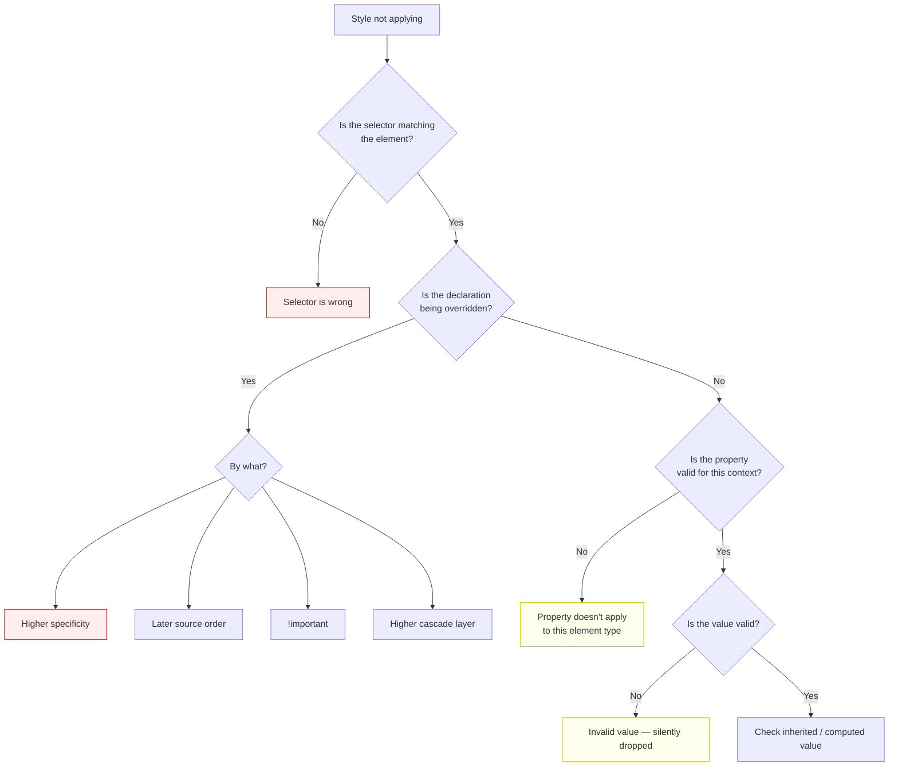

# Lesson 01 — Cascade Debugging

## "Why Isn't My Style Applying?"

This is the single most common CSS question. The answer always falls into one of these categories:



## Step 1: Is the Selector Matching?

### DevTools Check

1. Right-click the element → **Inspect**
2. **Styles panel** shows all rules matching the element
3. If your rule isn't listed → your selector doesn't match

### Common Selector Mismatches

```css
/* ❌ Typo in class name */
.card__tilte { }         /* "tilte" instead of "title" */

/* ❌ Wrong nesting — element isn't a descendant */
.sidebar .title { }      /* But .title is not inside .sidebar */

/* ❌ Specificity of :not() / :is() hiding matches */
:not(.active) .title { } /* Matches, but may not target what you think */

/* ❌ Dynamic class not applied yet */
.is-visible .tooltip { } /* JS hasn't added .is-visible */
```

### Verify with DevTools

Type in the Console:
```javascript
// Check if selector matches the element
document.querySelector('.your-selector')  // null = no match

// Check all matching elements
document.querySelectorAll('.card__title').length

// Check computed class list
$0.classList // $0 = currently selected element in Elements panel
```

## Step 2: Is It Being Overridden?

### Reading the Styles Panel

The Styles panel shows rules in **priority order** (highest first). Overridden declarations are ~~struck through~~.

Look for:
1. **Strikethrough text** — this declaration was overridden
2. **The winning rule above it** — shows what's winning and why
3. **Yellow warning triangle** — invalid property or value
4. **Gray text** — inherited property

### Specificity Conflicts

```css
/* File: components.css */
.card .title {           /* Specificity: (0,2,0) */
  color: blue;
}

/* File: overrides.css */
.title {                 /* Specificity: (0,1,0) — LOSES */
  color: red;
}
```

**DevTools shows:** `.title { color: red }` is struck through with `.card .title` winning above it.

**Fix options:**
1. Match or exceed specificity: `.card .title { color: red; }`
2. Use `@layer` to control precedence
3. Use `:where()` on the high-specificity selector to zero it out

### The !important Trap

```css
/* Someone added !important somewhere */
.legacy-header h2 {
  color: navy !important;        /* (0,2,0) + important */
}

/* Now you need to override it */
.card .title {
  color: blue;                   /* Loses to !important */
  color: blue !important;       /* Must escalate — this is a warning sign */
}
```

**DevTools tip:** Filter the Styles panel by typing "!" to find all `!important` declarations on an element.

## Step 3: Does the Property Apply?

Some properties only work in specific contexts:

| Property | Requires |
|----------|----------|
| `width` / `height` | Not an inline element (unless replaced) |
| `margin-top` / `margin-bottom` | Not an inline element |
| `top` / `left` / `right` / `bottom` | `position` is not `static` |
| `z-index` | Element creates a stacking context (positioned, flex/grid child, etc.) |
| `gap` | Flex or grid container |
| `justify-content` | Flex or grid container |
| `flex-grow` / `flex-shrink` | Flex item |
| `grid-column` / `grid-row` | Grid item |
| `vertical-align` | Inline or table-cell |
| `float` | Not in a flex/grid container |

### DevTools Check

If a property doesn't apply, DevTools shows it with a **yellow warning icon** or an **info tooltip** explaining why:

> `z-index has no effect on this element because it's not positioned or a flex/grid item.`

## Step 4: Check Computed Values

The **Computed tab** in DevTools shows the **final resolved value** for every property:

1. Select the element
2. Go to **Computed** tab
3. Search for the property
4. Click the arrow to see which rule set the value

**Key things to check:**
- `display` — is it what you expect?
- `position` — static, relative, absolute?
- `box-sizing` — border-box or content-box?
- `overflow` — visible, hidden, auto?
- Inherited values — color, font-size, line-height from ancestors

## Common "It's Not a Bug" Situations

### 1. Inline Elements Ignore Width/Height

```css
span { width: 200px; }  /* No effect — span is inline */
```

Fix: `display: inline-block` or `display: block`.

### 2. Percentage Height Requires Parent Height

```css
.child { height: 50%; }  /* No effect if parent has no explicit height */
```

Fix: Set `height` on parent, or use `min-height: 100vh` on a containing block.

### 3. Margin Collapsing Looks Like a Bug

```css
.box1 { margin-bottom: 20px; }
.box2 { margin-top: 30px; }
/* Gap is 30px, not 50px — margins collapse */
```

### 4. Flex/Grid Children Ignore Float

```css
.flex-container { display: flex; }
.flex-child { float: left; }  /* float is ignored in flex context */
```

### 5. Color Property Doesn't Affect Background

```css
.box {
  color: red;        /* Only affects text and currentColor */
  background: blue;  /* Must be set separately */
}
```

## DevTools Workflow Summary

| What to Check | Where in DevTools |
|---------------|-------------------|
| Which rules match | Styles panel |
| What's overriding what | Strikethrough in Styles |
| Final computed value | Computed tab |
| Why property has no effect | Warning icon / tooltip |
| Inherited values | Computed → "Show all" |
| User agent styles | Styles → "user agent stylesheet" label |
| Whether class is applied | Elements panel → class list |

## Next

→ [Lesson 02: Layout Debugging](02-layout-debugging.md)
