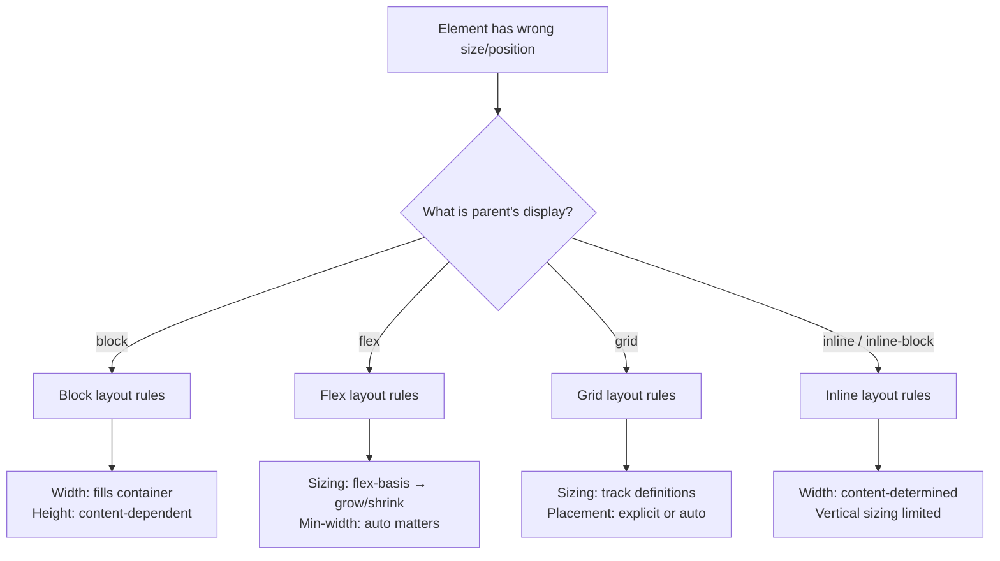
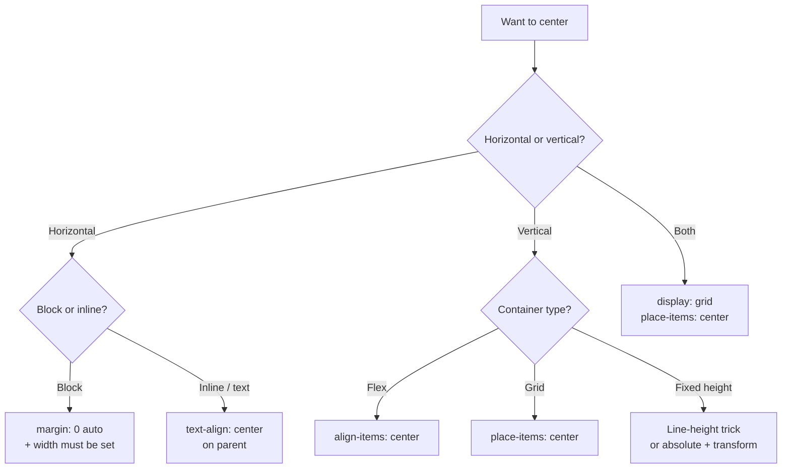

# Lesson 02 — Layout Debugging

## "Why Is This Element the Wrong Size/Position?"

Layout bugs come from misunderstanding the **layout algorithm** that's active. Each algorithm has different rules for sizing, positioning, and alignment.

## Step 1: Identify the Layout Context



### DevTools Check

1. Select the element → Computed tab → check `display`
2. Select the **parent** → check its `display` (this determines the layout algorithm for children)
3. Look for the layout overlay badges in DevTools (flex/grid icons)

## Step 2: Use the Box Model Diagram

The box model diagram in DevTools shows exact dimensions:

```
┌─────────── margin ───────────┐
│ ┌──────── border ──────────┐ │
│ │ ┌────── padding ───────┐ │ │
│ │ │                      │ │ │
│ │ │     content box      │ │ │
│ │ │   (width × height)   │ │ │
│ │ │                      │ │ │
│ │ └──────────────────────┘ │ │
│ └──────────────────────────┘ │
└──────────────────────────────┘
```

**Click each section** in the box model diagram to see the exact value. Hover to highlight on the page.

**Key things to check:**
- Is `box-sizing: border-box` applied? (padding included in width?)
- Is there unexpected margin (collapsed or not)?
- Is padding pushing content into unexpected positions?

## Common Layout Bugs

### 1. Element Wider Than Viewport (Horizontal Scroll)

```css
/* Diagnosis: something is overflowing */
```

**Debug method:**

```css
/* Temporary debug: add this to find the culprit */
* {
  outline: 1px solid red !important;
}
```

Or use DevTools: Elements → check for elements with computed width > viewport width.

**Common causes:**
- `width: 100vw` on an element inside a scrollable page (`100vw` includes scrollbar width)
- Fixed-width element inside a flex/grid container
- `pre` or `code` block with long lines and no `overflow-x: auto`
- Negative margins creating overflow

**Fix for 100vw:**
```css
/* ❌ Includes scrollbar width */
width: 100vw;

/* ✅ Uses available space */
width: 100%;
```

### 2. Flex Item Not Shrinking

```css
.flex-container { display: flex; }
.flex-item {
  /* This item refuses to shrink below its content width */
  flex: 1;
}
```

**Cause:** `min-width: auto` (the default for flex items) prevents shrinking below content size.

**Fix:**
```css
.flex-item {
  flex: 1;
  min-width: 0;    /* Allow shrinking below content */
  /* or */
  overflow: hidden; /* Also resets min-width behavior */
}
```

### 3. Grid Item Overflow

Same issue as flex — grid items have `min-width: auto` and `min-height: auto`:

```css
.grid-item {
  min-width: 0;    /* Allow grid item to shrink */
  overflow: hidden;
}
```

### 4. Element Not Centering



**Why `margin: 0 auto` doesn't work:**
- Element needs a defined `width` (not 100%)
- Doesn't work on inline elements
- Doesn't work on absolutely positioned elements
- Doesn't center vertically

### 5. Percentage Height Not Working

```css
.parent {
  /* No explicit height */
}
.child {
  height: 50%;  /* 50% of what? Parent has no height → resolves to auto */
}
```

**Fix:** Set explicit height on ancestors up to a known reference:

```css
html, body { height: 100%; }
.parent { height: 100%; }
.child { height: 50%; }

/* Or use viewport units */
.child { height: 50vh; }

/* Or use flexbox */
.parent { display: flex; flex-direction: column; min-height: 100vh; }
.child { flex: 1; }
```

### 6. Absolute Positioning Relative to Wrong Parent

```css
.child {
  position: absolute;
  top: 0;
  left: 0;
  /* Positioned relative to the nearest POSITIONED ancestor */
  /* If no ancestor is positioned → relative to initial containing block (viewport) */
}
```

**Debug:** In DevTools, hover over the absolutely positioned element — the highlighted containing block shows what it's positioned relative to.

**Fix:**
```css
.intended-parent {
  position: relative;   /* Makes this the containing block */
}
```

### 7. Sticky Not Working

```css
.header {
  position: sticky;
  top: 0;
  /* Not sticking? Check these: */
}
```

**Checklist:**
1. ✅ Has a `top` (or `bottom`, `left`, `right`) value
2. ❓ Is any ancestor `overflow: hidden` or `overflow: auto`? (breaks sticky)
3. ❓ Is the container tall enough? (sticky stops at container boundary)
4. ❓ Is `height: 100%` set on the parent? (no room to scroll within)

## DevTools Layout Debugging Tools

### Flex Inspector

Click the **flex** badge next to a flex container in the Elements panel:
- See flex lines and item boundaries
- View free space distribution
- See flex-basis vs actual size

### Grid Inspector

Click the **grid** badge:
- Toggle grid line visibility
- See named lines and areas
- View track sizes
- Show line numbers

### Layout Overlays

In the **Layout** panel:
- Enable **grid overlays** for all grid containers
- Enable **flex overlays** for flex containers
- These persist while navigating the DOM

### Element Size Debugging

```javascript
// In Console — get exact dimensions
const el = $0;  // Currently selected element
console.log({
  offsetWidth: el.offsetWidth,
  offsetHeight: el.offsetHeight,
  clientWidth: el.clientWidth,
  clientHeight: el.clientHeight,
  scrollWidth: el.scrollWidth,
  scrollHeight: el.scrollHeight,
  boundingRect: el.getBoundingClientRect(),
});
```

| Property | What It Measures |
|----------|-----------------|
| `offsetWidth` | border-box width (content + padding + border) |
| `clientWidth` | padding-box width (content + padding, no border, no scrollbar) |
| `scrollWidth` | Total scrollable content width |
| `getBoundingClientRect()` | Position + size relative to viewport |

## Next

→ [Lesson 03: Visual Debugging](03-visual-debugging.md)
