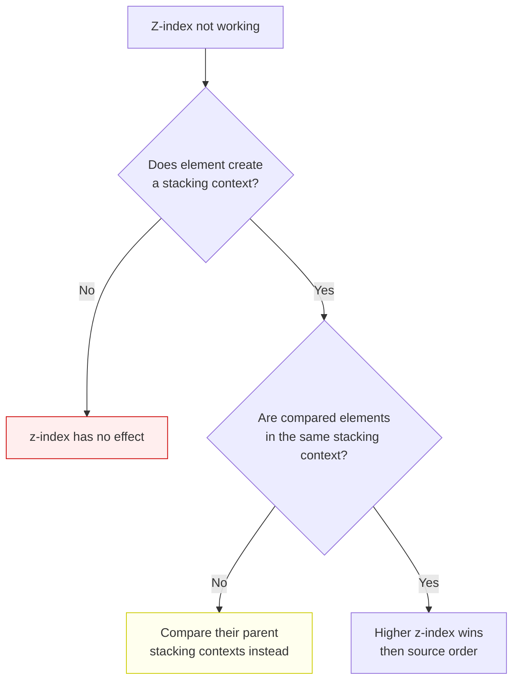
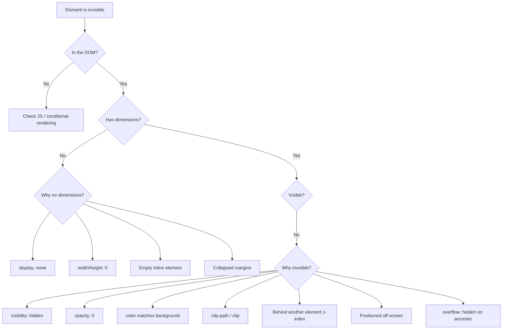

# Lesson 03 — Visual Debugging

## Stacking & Overlap Issues

### "Why is this element behind/in front of the wrong thing?"



### Common Stacking Context Triggers

If you set `z-index` and it "doesn't work," the element probably needs a stacking context:

```css
/* Position + z-index (most common) */
.element {
  position: relative;  /* or absolute, fixed, sticky */
  z-index: 10;
}

/* Flex/grid children automatically participate */
.flex-container { display: flex; }
.flex-child { z-index: 10; }    /* Works without position */

/* These ALSO create stacking contexts (often accidentally): */
.element {
  opacity: 0.99;          /* Any value < 1 */
  transform: translateZ(0); /* Any transform */
  filter: blur(0);        /* Any filter */
  will-change: transform; /* will-change */
  isolation: isolate;     /* Explicit isolation */
}
```

### Debugging with DevTools 3D View

Chrome: More Tools → **Layers** panel
- Shows all compositor layers as a 3D stack
- Rotate to see stacking order
- Click layer to see why it was created

### Stacking Context Detector

Paste in Console to find all stacking contexts:

```javascript
function findStackingContexts(root = document.body, depth = 0) {
  const results = [];
  for (const el of root.children) {
    const style = getComputedStyle(el);
    const creates = 
      style.position !== 'static' && style.zIndex !== 'auto' ||
      style.opacity !== '1' ||
      style.transform !== 'none' ||
      style.filter !== 'none' ||
      style.willChange === 'transform' || style.willChange === 'opacity' ||
      style.isolation === 'isolate' ||
      style.mixBlendMode !== 'normal' ||
      (style.display === 'flex' || style.display === 'grid') && style.zIndex !== 'auto';
    
    if (creates) {
      results.push({
        element: el,
        tag: el.tagName + (el.className ? '.' + el.className.split(' ')[0] : ''),
        zIndex: style.zIndex,
        reason: [
          style.position !== 'static' && style.zIndex !== 'auto' ? 'position+z-index' : '',
          style.opacity !== '1' ? 'opacity' : '',
          style.transform !== 'none' ? 'transform' : '',
          style.filter !== 'none' ? 'filter' : '',
          style.isolation === 'isolate' ? 'isolation' : '',
        ].filter(Boolean).join(', '),
        depth,
      });
    }
    results.push(...findStackingContexts(el, depth + 1));
  }
  return results;
}

console.table(findStackingContexts());
```

## Overflow Issues

### Content Clipped Unexpectedly

```css
/* Any of these clip or scroll descendant content */
.parent {
  overflow: hidden;   /* Clips everything */
  overflow: auto;     /* Adds scrollbar, clips rest */
  overflow: scroll;   /* Always shows scrollbar */
}
```

**Debug:** Search ancestors for `overflow` values:

```javascript
// Find all ancestors with non-visible overflow
let el = $0;
while (el) {
  const style = getComputedStyle(el);
  if (style.overflow !== 'visible' || style.overflowX !== 'visible' || style.overflowY !== 'visible') {
    console.log(el.tagName, el.className, {
      overflow: style.overflow,
      overflowX: style.overflowX,
      overflowY: style.overflowY,
    });
  }
  el = el.parentElement;
}
```

### Unexpected Scrollbar

**Causes:**
1. Content wider than container (long words, images, pre-formatted text)
2. `100vw` includes scrollbar width
3. Margin/padding pushing content wider
4. Absolutely positioned element extending beyond container

**Find the overflowing element:**

```javascript
// Find elements wider than their parent
document.querySelectorAll('*').forEach(el => {
  if (el.offsetWidth > el.parentElement?.offsetWidth) {
    console.log('Overflow:', el.tagName, el.className, 
      el.offsetWidth, '>', el.parentElement.offsetWidth);
  }
});
```

## Text Rendering Issues

### Text Not Wrapping

```css
/* Default: words wrap at whitespace */
.text { /* normal behavior */ }

/* Long strings without spaces don't wrap (URLs, hashes) */
.text {
  overflow-wrap: break-word;  /* Break within words if needed */
  word-break: break-all;     /* Break at any character (CJK style) */
  hyphens: auto;             /* Break with hyphens (needs lang attribute) */
}
```

### Text Truncation

```css
/* Single line */
.truncate {
  white-space: nowrap;
  overflow: hidden;
  text-overflow: ellipsis;
  /* ALL THREE are required */
}

/* Multi-line */
.line-clamp {
  display: -webkit-box;
  -webkit-line-clamp: 3;
  -webkit-box-orient: vertical;
  overflow: hidden;
}
```

## Invisible Elements

### "Where did my element go?"



**Quick DevTools check:**
1. Search for element in Elements panel (Ctrl+F)
2. Check Computed tab for `display`, `visibility`, `opacity`
3. Check box model for zero dimensions
4. Click "Scroll into view" (right-click → "Scroll into view")

## Paint & Rendering Issues

### Paint Flashing

**DevTools → Rendering tab → Paint flashing**

Green rectangles show areas being repainted. Look for:
- Large green areas on scroll (inefficient painting)
- Green flashes on hover/interaction (expected)
- Full-page green flash (entire page repaint — investigate)

### Rendering Tab Options

| Setting | What It Shows |
|---------|--------------|
| Paint flashing | Green overlay on repainted areas |
| Layout shift regions | Blue overlay on elements that shifted |
| Layer borders | Orange/olive borders on compositor layers |
| Scrolling performance issues | Highlights slow scroll handlers |
| Core Web Vitals | LCP, CLS real-time overlay |

### Janky Animations

If animations stutter:

1. **Check which properties animate** — `transform` and `opacity` are GPU-accelerated; `width`, `height`, `top`, `left` trigger layout
2. **Performance panel** → Record during animation → Look for long frames
3. **Check for layout thrashing** — JS reading layout properties during animation

```css
/* ❌ Triggers layout every frame */
.animate { transition: left 0.3s; }
.animate:hover { left: 100px; }

/* ✅ Compositor-only — smooth */
.animate { transition: transform 0.3s; }
.animate:hover { transform: translateX(100px); }
```

## Cross-Browser Issues

### User Agent Style Differences

Browsers have different default styles. Check:

```css
/* In Styles panel, look for rules from "user agent stylesheet" */
/* Common differences: */
button {
  /* Safari adds extra padding and appearance */
  -webkit-appearance: none;
  appearance: none;
}

input {
  /* Firefox has different default padding */
  padding: 2px;  /* Firefox */
  padding: 1px;  /* Chrome */
}
```

### Feature Detection

```css
/* Use @supports for feature detection */
.card {
  display: flex;  /* Fallback */
}

@supports (display: grid) {
  .card {
    display: grid;
    grid-template-columns: repeat(auto-fit, minmax(250px, 1fr));
  }
}

/* Check for specific property values */
@supports (backdrop-filter: blur(10px)) {
  .overlay {
    backdrop-filter: blur(10px);
    background: rgba(255, 255, 255, 0.5);
  }
}

@supports not (backdrop-filter: blur(10px)) {
  .overlay {
    background: rgba(255, 255, 255, 0.9);
  }
}
```

## Next

→ [Lesson 04: Systematic Debugging Method](04-systematic-method.md)
