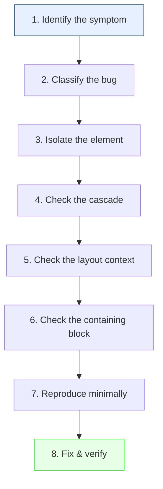

# Lesson 04 — Systematic Debugging Method

## The CSS Debugging Algorithm

A repeatable, step-by-step process for any CSS bug:



## Step 1: Describe the Symptom Precisely

Don't say "it's broken." Say:

| Vague | Precise |
|-------|---------|
| "The layout is broken" | "The sidebar is below the main content instead of beside it" |
| "It doesn't look right" | "The card has 30px gap instead of 16px" |
| "The button is weird" | "The button text is clipped on the right side" |
| "It's not working" | "z-index: 999 doesn't bring the modal above the header" |

## Step 2: Classify the Bug

Every CSS bug falls into one of four categories:

| Category | Symptoms | First Tool |
|----------|----------|------------|
| **Cascade** | Wrong color, font, size, or style | Styles panel → who's winning? |
| **Layout** | Wrong position, size, overflow | Box model diagram + layout overlay |
| **Stacking** | Wrong overlap, z-index issues | Layers panel, 3D view |
| **Paint** | Flickering, blurring, artifacts | Rendering tab, Performance panel |

## Step 3: Isolate the Element

1. **Inspect** the exact element that looks wrong
2. **Check if the element itself** has the wrong style, or if it's an **ancestor** causing the issue
3. Walk up the DOM hierarchy checking computed styles

**Quick isolation technique:**
```css
/* Add temporarily to the suspect element */
outline: 3px solid red !important;
background: rgba(255, 0, 0, 0.1) !important;
```

## Step 4: Check the Cascade (Who Wins?)

For every property that looks wrong:

1. **Computed tab** → What's the final value?
2. **Click the arrow** → Which rule set it?
3. **Styles panel** → Are other rules struck through?
4. If inherited → Check which ancestor provides the value

### Cascade Checklist

```
□ Is the selector matching? (rule visible in Styles?)
□ Is another rule overriding? (strikethrough?)
□ Is !important involved?
□ Is @layer ordering affecting it?
□ Is the property valid for this element type?
□ Is the value valid? (no warning icon?)
```

## Step 5: Check the Layout Context

1. What is the **parent's `display`**? (block, flex, grid, inline)
2. What layout algorithm is in effect for this element?
3. Does the element participate correctly? (is it a flex item? grid item?)

### Layout Checklist

```
□ What is the parent's display? ________
□ Is box-sizing border-box? ________
□ Is there a width constraint? ________
□ Does min-width/max-width affect it? ________
□ Flex: what is flex-basis / flex-grow / flex-shrink? ________
□ Grid: which track is it in? What's the track size? ________
□ Is min-width: auto preventing shrinking? ________
```

## Step 6: Check the Containing Block

The containing block determines how percentages, positioning, and sizing resolve.

| Element's Position | Containing Block |
|-------------------|-----------------|
| `static` / `relative` | Nearest block-level ancestor's content box |
| `absolute` | Nearest positioned ancestor's padding box |
| `fixed` | Viewport (unless ancestor has transform/filter) |
| `sticky` | Nearest scrollable ancestor |

**Gotcha:** `transform`, `filter`, `will-change`, or `contain` on an ancestor changes the containing block for `fixed` elements — they're no longer fixed to the viewport.

```css
/* This breaks fixed positioning for descendants */
.ancestor {
  transform: translateZ(0);  /* Now fixed children are relative to this */
}
```

## Step 7: Create a Minimal Reproduction

If you can't find the bug in DevTools:

1. **Create a new HTML file** with only the relevant elements
2. **Copy the computed styles** (not the source) for the affected elements
3. **Remove styles one at a time** until the bug disappears → last removed style is the cause
4. **Remove elements** until the minimum structure that reproduces the bug remains

### Binary Search Debugging

When you have hundreds of CSS rules:

1. Comment out the bottom half of your CSS
2. Does the bug persist? → It's in the top half
3. Comment out the bottom half of the remaining slice
4. Repeat until you find the specific rule

```css
/* Step 1: Comment bottom half */
.rule-1 { ... }
.rule-2 { ... }
/* 
.rule-3 { ... }
.rule-4 { ... }
*/

/* Bug persists? → It's rule-1 or rule-2 */
/* Bug gone? → It's rule-3 or rule-4 */
```

## Step 8: Fix and Verify

### Fix Strategies

| Problem | Fix |
|---------|-----|
| Specificity conflict | Match specificity, use @layer, or restructure selectors |
| Wrong layout algorithm | Change parent's display, or change how child participates |
| Missing containing block | Add `position: relative` to intended parent |
| Overflow | Set `overflow` property, or fix the overflowing child |
| min-width: auto | Set `min-width: 0` or `overflow: hidden` |
| z-index in wrong context | Ensure element creates a stacking context |

### Verify the Fix

1. **Test the original bug** — is it fixed?
2. **Test related elements** — did the fix break anything else?
3. **Test responsive** — does it work at different viewport sizes?
4. **Test content variations** — does it handle long text, missing images, empty states?

## Quick Reference: Debug Commands

Paste these into DevTools Console as needed:

```javascript
// Highlight all elements with their box model
document.querySelectorAll('*').forEach(el => {
  el.style.outline = '1px solid rgba(255,0,0,0.3)';
});

// Find elements wider than viewport
document.querySelectorAll('*').forEach(el => {
  if (el.scrollWidth > document.documentElement.clientWidth) {
    console.log('Wide:', el.tagName, el.className, el.scrollWidth);
    el.style.outline = '3px solid red';
  }
});

// Get computed style for selected element
const s = getComputedStyle($0);
console.log({
  display: s.display,
  position: s.position,
  width: s.width,
  height: s.height,
  overflow: s.overflow,
  zIndex: s.zIndex,
  opacity: s.opacity,
  transform: s.transform,
});

// Find all positioned elements (potential containing blocks)
document.querySelectorAll('*').forEach(el => {
  const pos = getComputedStyle(el).position;
  if (pos !== 'static') {
    console.log(pos, el.tagName, el.className);
  }
});
```

## The Mental Model

```
Source Code → Parse → Cascade → Computed → Layout → Paint → Composite
                ↑          ↑         ↑         ↑        ↑
            Selector   Specificity  Display   Position  Transform
            matching   resolution   algorithm  offset   opacity
```

**Every CSS bug lives at one of these stages.** When debugging:
1. Start from the **symptom** (what you see → usually Paint or Layout)
2. Work **backwards** through the pipeline
3. The bug is at the stage where reality diverges from expectation

---

## Module 15 Summary

You learned:
- **Cascade debugging** — reading the Styles panel, finding overrides, checking computed values
- **Layout debugging** — identifying layout context, box model inspection, common sizing bugs
- **Visual debugging** — stacking contexts, overflow, paint flashing, cross-browser differences
- **Systematic method** — 8-step repeatable process: symptom → classify → isolate → cascade → layout → containing block → reproduce → fix

## Next

→ [Module 16: Real-World Systems](../16-real-world/README.md)
