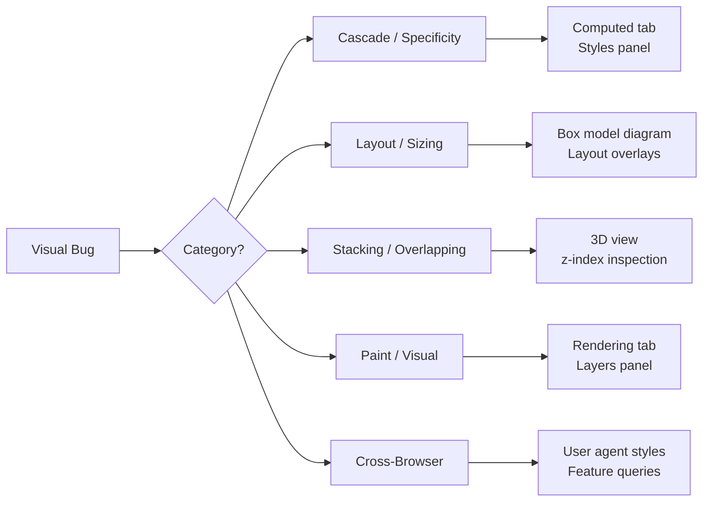

# Module 15 — CSS Debugging

## Overview

Debugging CSS requires understanding **which part of the rendering pipeline** is causing the issue. Most "CSS bugs" are actually predictable behaviors — you're just not seeing the right mental model.

This module teaches systematic debugging: how to identify the category of problem, use the right DevTools panel, and fix it without trial-and-error.

## Lessons

| # | File | Topic |
|---|------|-------|
| 01 | [01-cascade-debugging.md](01-cascade-debugging.md) | Why a style isn't applying — specificity, cascade, computed values |
| 02 | [02-layout-debugging.md](02-layout-debugging.md) | Why an element is the wrong size or position |
| 03 | [03-visual-debugging.md](03-visual-debugging.md) | Stacking, overflow, paint, and rendering issues |
| 04 | [04-systematic-method.md](04-systematic-method.md) | A repeatable debugging methodology for any CSS problem |

## Prerequisites

- Completed Modules 01-14
- Chrome DevTools familiarity

## Next

→ [Lesson 01: Cascade Debugging](01-cascade-debugging.md)
