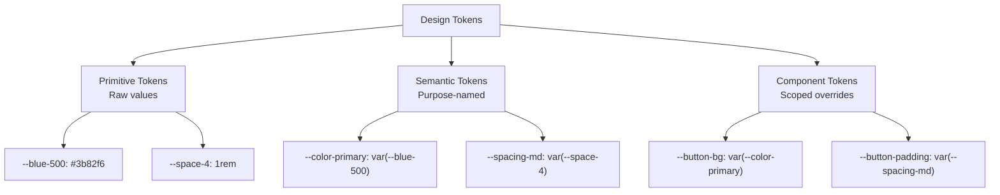

# Lesson 01 — Design Tokens

## What Are Design Tokens?

Design tokens are the **atomic values** of a design system — the named constants for colors, spacing, typography, shadows, and borders that every component consumes.



## The Three-Tier Token System

### Tier 1: Primitive Tokens (Raw Values)

```css
:root {
  /* Colors — raw palette */
  --gray-50:  #f8fafc;
  --gray-100: #f1f5f9;
  --gray-200: #e2e8f0;
  --gray-300: #cbd5e1;
  --gray-400: #94a3b8;
  --gray-500: #64748b;
  --gray-600: #475569;
  --gray-700: #334155;
  --gray-800: #1e293b;
  --gray-900: #0f172a;
  --gray-950: #020617;

  --blue-50:  #eff6ff;
  --blue-100: #dbeafe;
  --blue-500: #3b82f6;
  --blue-600: #2563eb;
  --blue-700: #1d4ed8;

  --red-500:  #ef4444;
  --red-600:  #dc2626;

  --green-500: #22c55e;
  --green-600: #16a34a;

  /* Spacing — 4px base scale */
  --space-0: 0;
  --space-px: 1px;
  --space-0-5: 0.125rem;   /* 2px */
  --space-1: 0.25rem;      /* 4px */
  --space-2: 0.5rem;       /* 8px */
  --space-3: 0.75rem;      /* 12px */
  --space-4: 1rem;         /* 16px */
  --space-5: 1.25rem;      /* 20px */
  --space-6: 1.5rem;       /* 24px */
  --space-8: 2rem;         /* 32px */
  --space-10: 2.5rem;      /* 40px */
  --space-12: 3rem;        /* 48px */
  --space-16: 4rem;        /* 64px */

  /* Typography scale */
  --text-xs: 0.75rem;      /* 12px */
  --text-sm: 0.875rem;     /* 14px */
  --text-base: 1rem;       /* 16px */
  --text-lg: 1.125rem;     /* 18px */
  --text-xl: 1.25rem;      /* 20px */
  --text-2xl: 1.5rem;      /* 24px */
  --text-3xl: 1.875rem;    /* 30px */
  --text-4xl: 2.25rem;     /* 36px */

  /* Font weights */
  --font-normal: 400;
  --font-medium: 500;
  --font-semibold: 600;
  --font-bold: 700;

  /* Border radius */
  --radius-sm: 4px;
  --radius-md: 6px;
  --radius-lg: 8px;
  --radius-xl: 12px;
  --radius-full: 9999px;

  /* Shadows */
  --shadow-sm: 0 1px 2px rgba(0,0,0,0.05);
  --shadow-md: 0 4px 6px -1px rgba(0,0,0,0.1), 0 2px 4px -2px rgba(0,0,0,0.1);
  --shadow-lg: 0 10px 15px -3px rgba(0,0,0,0.1), 0 4px 6px -4px rgba(0,0,0,0.1);
  --shadow-xl: 0 20px 25px -5px rgba(0,0,0,0.1), 0 8px 10px -6px rgba(0,0,0,0.1);
}
```

**Rules:**
- Primitive tokens are **never used directly** by components
- They define the raw palette — all possible values
- Named by their inherent properties (color value, size step)

### Tier 2: Semantic Tokens (Purpose-Named)

```css
:root {
  /* Surface & background */
  --color-bg: var(--gray-50);
  --color-bg-surface: white;
  --color-bg-surface-raised: white;
  --color-bg-muted: var(--gray-100);
  --color-bg-inverse: var(--gray-900);

  /* Text */
  --color-text: var(--gray-900);
  --color-text-secondary: var(--gray-600);
  --color-text-muted: var(--gray-400);
  --color-text-inverse: white;
  --color-text-link: var(--blue-600);

  /* Borders */
  --color-border: var(--gray-200);
  --color-border-strong: var(--gray-300);

  /* Interactive */
  --color-primary: var(--blue-600);
  --color-primary-hover: var(--blue-700);
  --color-primary-text: white;

  /* Feedback */
  --color-danger: var(--red-600);
  --color-success: var(--green-600);

  /* Spacing semantic aliases */
  --spacing-xs: var(--space-1);
  --spacing-sm: var(--space-2);
  --spacing-md: var(--space-4);
  --spacing-lg: var(--space-6);
  --spacing-xl: var(--space-8);
  --spacing-2xl: var(--space-12);

  /* Typography semantic */
  --font-size-body: var(--text-base);
  --font-size-body-sm: var(--text-sm);
  --font-size-heading-1: var(--text-4xl);
  --font-size-heading-2: var(--text-3xl);
  --font-size-heading-3: var(--text-2xl);
  --font-size-caption: var(--text-xs);

  --line-height-tight: 1.25;
  --line-height-normal: 1.5;
  --line-height-relaxed: 1.75;
}
```

**Rules:**
- Semantic tokens describe **purpose**, not value
- Components use these exclusively
- Theming overrides these (dark mode changes `--color-bg`, not every component)

### Tier 3: Component Tokens (Scoped)

```css
.button {
  --btn-bg: var(--color-primary);
  --btn-color: var(--color-primary-text);
  --btn-padding-x: var(--spacing-md);
  --btn-padding-y: var(--spacing-sm);
  --btn-radius: var(--radius-md);
  --btn-font-size: var(--font-size-body);

  background: var(--btn-bg);
  color: var(--btn-color);
  padding: var(--btn-padding-y) var(--btn-padding-x);
  border-radius: var(--btn-radius);
  font-size: var(--btn-font-size);
  border: none;
  cursor: pointer;
}

/* Variants override component tokens */
.button--sm {
  --btn-padding-x: var(--spacing-sm);
  --btn-padding-y: var(--spacing-xs);
  --btn-font-size: var(--font-size-body-sm);
}

.button--danger {
  --btn-bg: var(--color-danger);
}

.button--ghost {
  --btn-bg: transparent;
  --btn-color: var(--color-primary);
}
```

**Rules:**
- Component tokens create a **public styling API**
- Consumers can override without knowing internals
- Each component documents its token API

## Spacing System

### Why 4px Base?

4px divides evenly into common screen sizes and creates a harmonious visual rhythm:

```
4px  → tight labels, icons
8px  → compact spacing (pill padding, tag gaps)
12px → default inner padding
16px → standard spacing between elements
24px → section padding
32px → large spacing
48px → section gaps
64px → page-level margins
```

### Using the Scale

```css
.card {
  padding: var(--spacing-lg);           /* 24px */
  gap: var(--spacing-md);              /* 16px */
}

.card__header {
  padding-bottom: var(--spacing-sm);    /* 8px */
  border-bottom: 1px solid var(--color-border);
  margin-bottom: var(--spacing-md);     /* 16px */
}

.card__actions {
  display: flex;
  gap: var(--spacing-sm);              /* 8px */
  margin-top: var(--spacing-lg);       /* 24px */
}
```

## Typography Scale

### Modular Scale

A ratio-based scale creates harmonious size relationships:

```css
/* Major Third ratio (1.25) */
:root {
  --scale-ratio: 1.25;
  --text-base: 1rem;                                           /* 16px */
  --text-lg: calc(var(--text-base) * var(--scale-ratio));      /* 20px */
  --text-xl: calc(var(--text-lg) * var(--scale-ratio));        /* 25px */
  --text-2xl: calc(var(--text-xl) * var(--scale-ratio));       /* 31.25px */
  --text-3xl: calc(var(--text-2xl) * var(--scale-ratio));      /* 39px */
  --text-sm: calc(var(--text-base) / var(--scale-ratio));      /* 12.8px */
}
```

### Line Height Rules

```css
/* Smaller text needs more line height for readability */
.body    { font-size: var(--text-base); line-height: 1.5; }
.small   { font-size: var(--text-sm);   line-height: 1.6; }
.heading { font-size: var(--text-3xl);  line-height: 1.2; }
/* Large text: tighter. Small text: looser. */
```

## Token Storage & Distribution

### JSON Tokens (Standard Format)

```json
{
  "color": {
    "gray": {
      "50": { "value": "#f8fafc", "type": "color" },
      "100": { "value": "#f1f5f9", "type": "color" },
      "900": { "value": "#0f172a", "type": "color" }
    },
    "primary": {
      "value": "{color.gray.900}",
      "type": "color",
      "description": "Primary brand color"
    }
  },
  "spacing": {
    "sm": { "value": "8px", "type": "dimension" },
    "md": { "value": "16px", "type": "dimension" }
  }
}
```

Tools like **Style Dictionary** transform these into platform-specific outputs:

```
tokens.json → CSS custom properties
            → Sass variables  
            → JavaScript constants
            → iOS/Android values
            → Figma styles
```

## Next

→ [Lesson 02: Theming](02-theming.md)
