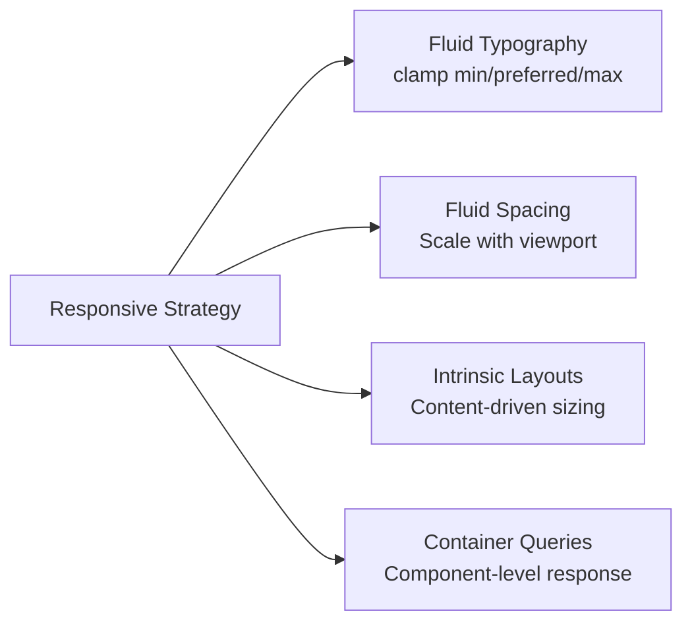
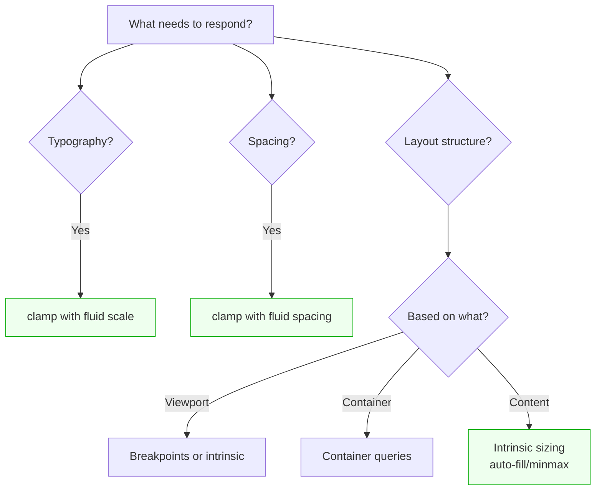

# Lesson 03 — Responsive Systems

## Beyond Breakpoints

Traditional responsive design uses breakpoints to switch between fixed layouts. Modern responsive design uses **fluid systems** that adapt continuously.



## Fluid Typography

### The clamp() Pattern

```css
/* clamp(minimum, preferred, maximum) */
h1 {
  font-size: clamp(1.5rem, 4vw + 0.5rem, 3rem);
  /*         24px     scales      48px      */
}

p {
  font-size: clamp(1rem, 0.5vw + 0.9rem, 1.125rem);
  /*         16px     scales         18px            */
}
```

**How it works:**
- Below a certain viewport → pins to minimum
- Above a certain viewport → pins to maximum
- Between → scales linearly with viewport

### Building a Fluid Type Scale

```css
:root {
  /* Fluid type scale — automatically scales between 320px and 1200px viewports */
  --fluid-min-width: 320;
  --fluid-max-width: 1200;

  --text-sm:  clamp(0.8rem,   0.17vw + 0.76rem,  0.875rem);
  --text-base: clamp(1rem,    0.23vw + 0.95rem,   1.125rem);
  --text-lg:  clamp(1.125rem, 0.34vw + 1.05rem,   1.25rem);
  --text-xl:  clamp(1.25rem,  0.45vw + 1.16rem,   1.5rem);
  --text-2xl: clamp(1.5rem,   0.68vw + 1.36rem,   2rem);
  --text-3xl: clamp(1.875rem, 1.14vw + 1.65rem,   2.5rem);
  --text-4xl: clamp(2.25rem,  1.59vw + 1.93rem,   3.5rem);
}

h1 { font-size: var(--text-4xl); }
h2 { font-size: var(--text-3xl); }
h3 { font-size: var(--text-2xl); }
p  { font-size: var(--text-base); }
```

### Calculating the Preferred Value

Formula: `preferred = (max - min) / (max-vw - min-vw) * 100vw + offset`

```
For clamp(1rem, ?vw + ?rem, 2rem) between 320px and 1200px:
  slope = (2 - 1) / (75 - 20) = 0.0182  → 1.82vw
  offset = 1 - (0.0182 * 20) = 0.636rem
  Result: clamp(1rem, 1.82vw + 0.636rem, 2rem)
```

(Where 75rem = 1200px, 20rem = 320px in the rem calculation)

**Or use a calculator:** [utopia.fyi](https://utopia.fyi/type/calculator/) generates the scale for you.

## Fluid Spacing

```css
:root {
  /* Spacing that scales with viewport */
  --space-sm: clamp(0.5rem,  0.3vw + 0.4rem,  0.75rem);
  --space-md: clamp(1rem,    0.5vw + 0.8rem,   1.5rem);
  --space-lg: clamp(1.5rem,  1vw + 1.1rem,     2.5rem);
  --space-xl: clamp(2rem,    2vw + 1.4rem,     4rem);
  --space-2xl: clamp(3rem,   3vw + 2rem,       6rem);
}

.section {
  padding-block: var(--space-2xl);
}

.card {
  padding: var(--space-md);
  gap: var(--space-sm);
}
```

## Intrinsic Layout Patterns

Instead of breakpoints, let **content determine layout**:

### 1. Auto-Fill Grid

```css
.grid {
  display: grid;
  grid-template-columns: repeat(auto-fill, minmax(min(280px, 100%), 1fr));
  gap: var(--space-md);
}
```

- Items are at least 280px wide (or 100% on narrow viewports)
- Automatically wraps to fewer columns as viewport shrinks
- **Zero breakpoints**

### 2. Flexbox Wrap

```css
.flex-grid {
  display: flex;
  flex-wrap: wrap;
  gap: var(--space-md);
}

.flex-grid > * {
  flex: 1 1 300px;  /* Grow, shrink, minimum 300px */
}
```

### 3. The Sidebar Pattern (No Breakpoints)

```css
.with-sidebar {
  display: flex;
  flex-wrap: wrap;
  gap: var(--space-lg);
}

.with-sidebar > :first-child {
  flex-basis: 250px;    /* Sidebar minimum */
  flex-grow: 1;
}

.with-sidebar > :last-child {
  flex-basis: 0;
  flex-grow: 999;       /* Main content takes all remaining space */
  min-width: 60%;       /* Forces wrap when too narrow */
}
```

When the main content can't reach 60% width, the sidebar wraps below.

### 4. The Switcher (Two-Column ↔ Stack)

```css
.switcher {
  display: flex;
  flex-wrap: wrap;
  gap: var(--space-md);
  --threshold: 500px;
}

.switcher > * {
  flex-grow: 1;
  flex-basis: calc((var(--threshold) - 100%) * 999);
  /* When container > threshold → both items fit side by side */
  /* When container < threshold → each item becomes full width */
}
```

## Container Queries for Components

Breakpoints respond to **viewport**. Container queries respond to **parent**:

```css
.card-container {
  container-type: inline-size;
}

.card {
  display: grid;
  gap: var(--space-sm);
}

/* Horizontal layout when container is wide enough */
@container (min-width: 500px) {
  .card {
    grid-template-columns: 200px 1fr;
    gap: var(--space-md);
  }
}

/* Full layout with sidebar */
@container (min-width: 800px) {
  .card {
    grid-template-columns: 250px 1fr auto;
  }
}
```

**Container queries let components adapt to their context**, not the viewport. A card in a sidebar behaves differently from the same card in the main content area.

## Responsive Strategy Decision Tree



## The Complete Responsive System

```css
/* === Fluid Foundation === */
:root {
  /* Type */
  --text-base: clamp(1rem, 0.23vw + 0.95rem, 1.125rem);
  --text-xl:   clamp(1.25rem, 0.45vw + 1.16rem, 1.5rem);
  --text-3xl:  clamp(1.875rem, 1.14vw + 1.65rem, 2.5rem);

  /* Space */
  --gutter: clamp(1rem, 2vw, 2rem);
  --section-space: clamp(3rem, 5vw, 6rem);
}

/* === Intrinsic Layout === */
.container {
  width: min(100% - var(--gutter) * 2, 1200px);
  margin-inline: auto;
}

.grid {
  display: grid;
  grid-template-columns: repeat(auto-fill, minmax(min(300px, 100%), 1fr));
  gap: var(--gutter);
}

/* === Breakpoints only when structure changes === */
@media (min-width: 768px) {
  .page-layout {
    grid-template-columns: 250px 1fr;     /* Sidebar appears */
    grid-template-areas: "sidebar main";
  }
}

/* === Container queries for components === */
.widget-slot {
  container-type: inline-size;
}

@container (min-width: 400px) {
  .widget { flex-direction: row; }
}
```

**Rules:**
1. Use **fluid type/spacing** for continuous scaling (no jumps)
2. Use **intrinsic layouts** (auto-fill, flexbox wrap) for content-driven responsiveness
3. Use **breakpoints** only for structural layout changes (sidebar, navigation mode)
4. Use **container queries** when components need to adapt to placement context

## Next

→ [Lesson 04: Component Library CSS](04-component-library-css.md)
