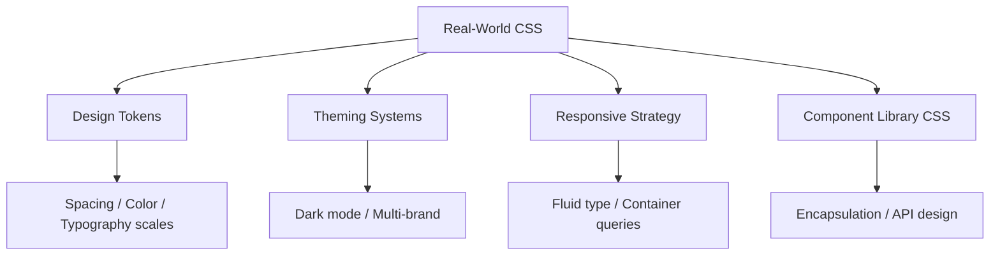

# Module 16 — Real-World Systems

## Overview

This module applies everything you've learned to production systems. Design systems, theming, responsive strategies, and CSS architecture patterns used by teams shipping real products.

This is not theory — it's the implementation patterns that survive contact with product requirements, multiple developers, and long maintenance cycles.

## Lessons

| # | File | Topic |
|---|------|-------|
| 01 | [01-design-tokens.md](01-design-tokens.md) | Design tokens — systematic spacing, color, typography scales |
| 02 | [02-theming.md](02-theming.md) | Theming — dark mode, multi-brand, user preferences |
| 03 | [03-responsive-systems.md](03-responsive-systems.md) | Responsive strategy — fluid typography, layout adaptation |
| 04 | [04-component-library-css.md](04-component-library-css.md) | Component library CSS — API surface, encapsulation, documentation |

## Prerequisites

- All previous modules (this module synthesizes everything)

## Next

→ [Lesson 01: Design Tokens](01-design-tokens.md)
