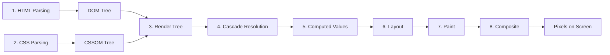

# CSS Mastery — From Rendering Engine to Production Systems

> A rigorous, first-principles CSS curriculum for experienced developers who want to understand **how browsers interpret, compute, and render CSS** — not just how to write it.

```mermaid id="course_overview"
flowchart LR
    subgraph "Phase 1: Foundations"
        M01[01 Browser Rendering]
        M02[02 The Cascade]
        M03[03 Box Model]
    end
    subgraph "Phase 2: Layout"
        M04[04 Layout Algorithms]
        M05[05 Positioning]
        M06[06 Stacking Contexts]
    end
    subgraph "Phase 3: Modern Layout"
        M07[07 Flexbox Algorithm]
        M08[08 CSS Grid]
        M09[09 Modern Layout Features]
    end
    subgraph "Phase 4: Rendering"
        M10[10 Painting & Compositing]
        M11[11 Performance]
    end
    subgraph "Phase 5: Systems"
        M12[12 Architecture]
        M13[13 Preprocessors & Tooling]
        M14[14 Modern CSS Features]
        M15[15 Debugging Mastery]
        M16[16 Real-World Systems]
    end
    M01 --> M02 --> M03 --> M04 --> M05 --> M06
    M06 --> M07 --> M08 --> M09
    M09 --> M10 --> M11
    M11 --> M12 --> M13 --> M14 --> M15 --> M16
```

---

## Who This Is For

| Requirement | Details |
|---|---|
| **Experience** | 3+ years of frontend development |
| **Comfort** | HTML, CSS in production codebases |
| **Familiarity** | Flexbox, Grid, media queries, preprocessors |
| **Goal** | Eliminate confusion about layout, stacking, rendering behavior |
| **Mindset** | Wants to understand **why** CSS works the way it does |

This is **not** a beginner tutorial. This is a deep dive into CSS as a **browser rendering system**.

---

## How Browsers Process CSS

This course teaches CSS in the order browsers process it:

Every module maps to a stage in this pipeline. By the end, you will have a **complete mental model** of how CSS becomes pixels.

---

## Module Map

| # | Module | Key Outcome |
|---|---|---|
| 01 | [Browser Rendering](01-browser-rendering/README.md) | Understand the full rendering pipeline |
| 02 | [The Cascade](02-cascade/README.md) | Master cascade origins, specificity, layers |
| 03 | [Box Model](03-box-model/README.md) | Deep box model with edge cases |
| 04 | [Layout Algorithms](04-layout-algorithms/README.md) | Block/inline formatting contexts |
| 05 | [Positioning](05-positioning/README.md) | Containing blocks, offset parents |
| 06 | [Stacking Contexts](06-stacking-contexts/README.md) | Stacking order, z-index, painting order |
| 07 | [Flexbox Algorithm](07-flexbox/README.md) | Specification-level flexbox understanding |
| 08 | [CSS Grid](08-grid/README.md) | Track sizing, auto placement algorithm |
| 09 | [Modern Layout](09-modern-layout/README.md) | Container queries, subgrid, logical properties |
| 10 | [Painting & Compositing](10-painting-compositing/README.md) | GPU layers, compositing, hardware acceleration |
| 11 | [Performance](11-performance/README.md) | Layout thrashing, repaint, DevTools profiling |
| 12 | [Architecture](12-architecture/README.md) | BEM, utility-first, component-scoped styles |
| 13 | [Preprocessors & Tooling](13-preprocessors-tooling/README.md) | SCSS, PostCSS, CSS Modules, build pipelines |
| 14 | [Modern CSS Features](14-modern-css/README.md) | @layer, @scope, CSS variables, cascade layers |
| 15 | [Debugging Mastery](15-debugging/README.md) | Systematic CSS debugging strategies |
| 16 | [Real-World Systems](16-real-world-systems/README.md) | Design systems, theming, component libraries |

---

## How to Use This Course

1. **Start with** [START_HERE.md](START_HERE.md) for orientation
2. **Read** [GETTING_STARTED.md](GETTING_STARTED.md) for setup instructions
3. **Reference** [QUICK_REFERENCE.md](QUICK_REFERENCE.md) for lookups
4. **Work through modules sequentially** — each builds on the previous
5. **Run every experiment** — copy, paste, observe, modify
6. **Use DevTools constantly** — Chrome DevTools is your lab

---

## Teaching Philosophy

- **Specification-grounded**: Explanations reference CSS spec behavior, not folklore
- **Browser-first**: Every concept tied to what the browser actually does
- **Experiment-driven**: Learners discover behavior through hands-on code
- **Edge-case aware**: We actively seek and explain the traps
- **Diagram-rich**: Mermaid diagrams for every mental model

---

## Estimated Time

| Phase | Modules | Time |
|---|---|---|
| Foundations | 01–03 | ~15 hours |
| Layout | 04–06 | ~15 hours |
| Modern Layout | 07–09 | ~15 hours |
| Rendering | 10–11 | ~10 hours |
| Systems | 12–16 | ~20 hours |
| **Total** | | **~75 hours** |

---

## Prerequisites

- Modern browser (Chrome recommended for DevTools)
- Text editor (VS Code recommended)
- Basic HTML/CSS proficiency
- Willingness to read specification excerpts
- Patience for experimentation
