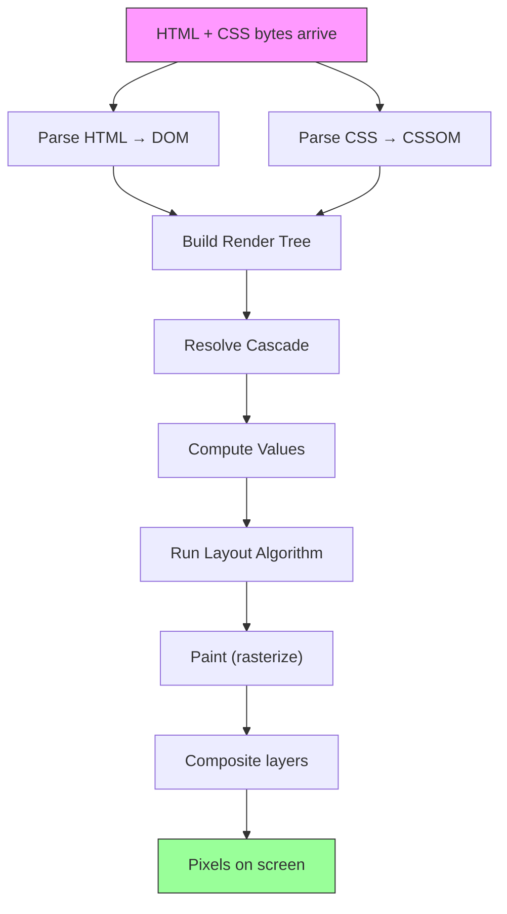

# START HERE — CSS Mastery Course

## What Makes This Course Different

Most CSS resources teach you **what** properties do. This course teaches you **how browsers process CSS** from parsing to pixels. You'll build the same mental model that browser engineers use.

After this course you will:
- Know exactly why a layout breaks and how to fix it in seconds
- Understand stacking contexts so deeply you never fight z-index again
- Predict flexbox/grid behavior before writing the code
- Optimize rendering performance with confidence
- Architect CSS systems that scale to millions of users

## The Core Mental Model

Everything in CSS flows through this pipeline:

**Every CSS bug you've ever had** maps to a misunderstanding at one of these stages.

## Learning Path

### Phase 1: Foundations (Modules 01–03)
Build your mental model of how CSS works at the engine level. Understand cascade resolution deeply. Master the box model including edge cases that trip up even senior developers.

### Phase 2: Layout (Modules 04–06)
Understand how browsers compute layout. Master positioning and containing blocks. Deeply understand stacking contexts — the #1 source of CSS confusion.

### Phase 3: Modern Layout (Modules 07–09)
Learn flexbox and grid from the specification perspective. Understand the actual algorithms browsers use. Explore modern layout features like container queries and subgrid.

### Phase 4: Rendering (Modules 10–11)
Understand painting order, compositing layers, and GPU acceleration. Learn to profile and optimize rendering performance.

### Phase 5: Systems (Modules 12–16)
Apply your deep knowledge to CSS architecture, tooling, modern features, debugging, and real-world production systems.

## How Each Lesson Works

Every lesson follows this structure:

1. **Concept** — What the browser does and why
2. **Diagram** — Visual mental model (Mermaid)
3. **Experiment** — Code you run and observe
4. **Edge Cases** — Traps and surprises
5. **DevTools** — How to inspect this behavior
6. **Production** — Real-world application

## Ground Rules

1. **Run every experiment.** Reading is not enough. Copy the code, open it in a browser, and observe.
2. **Use DevTools.** Keep the Elements panel, Computed panel, and Rendering tab open at all times.
3. **Modify experiments.** After running code as-is, change values and predict outcomes before checking.
4. **Read specification excerpts.** They're included for precision, not as busywork.
5. **Take your time.** Deep understanding beats speed. One module per week is a good pace.

## Next Step

→ [GETTING_STARTED.md](GETTING_STARTED.md) — Set up your environment
