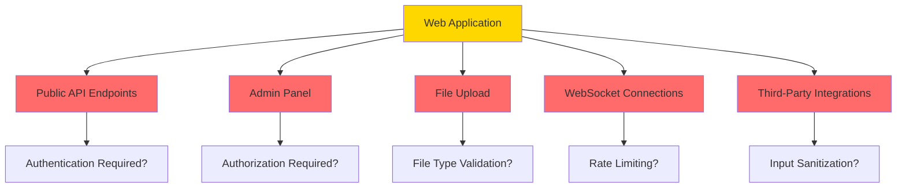
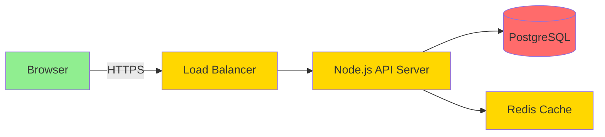

# 🎯 Module 01: Threat Modeling for Developers

**Difficulty:** 🟢 Fundamentals  
**Time:** 60-90 minutes

---

## What You'll Learn

- What threat modeling actually is (and why it's not scary)
- How to identify assets, threats, and attack surfaces
- The STRIDE framework (simplified)
- How to threat model a simple web application
- When to threat model (spoiler: early and often)

---

## What Is Threat Modeling?

**Threat modeling is answering four questions:**

1. **What are we building?**
2. **What can go wrong?**
3. **What should we do about it?**
4. **Did we do a good job?**

That's it. No PhD required.

---

## Why Developers Should Care

### The Problem

```typescript
// Developer writes this:
app.post('/api/users/:id/delete', async (req, res) => {
  await db.users.delete(req.params.id);
  res.json({ success: true });
});
```

**What's wrong?**

Without threat modeling, the developer might not ask:
- Who can call this endpoint?
- Can users delete other users?
- What if `:id` is `*` or `%`?
- Should deletion be logged?
- Can this be undone accidentally?

### The Solution

**Threat modeling forces you to ask "what can go wrong?" BEFORE shipping.**

---

## Core Concepts

### 1. Assets

**Assets are what you're protecting.**

Examples:
- User credentials
- Personal data (PII)
- Payment information
- API keys / secrets
- Business logic (pricing, algorithms)
- System availability

**Exercise:** List the assets in your last project.

---

### 2. Threat Actors

**Who would attack you, and why?**

| Actor | Motivation | Capability | Example |
|-------|------------|------------|---------|
| Opportunistic attackers | Automated scanning, low-hanging fruit | Low | Scanning for default passwords |
| Competitors | Steal data, cause disruption | Medium | DDOS attack during launch |
| Malicious users | Abuse features, steal from others | Low-Medium | Credential stuffing, account takeover |
| Insiders | Financial gain, revenge | High | Employee exfiltrating database |
| Nation-states | Espionage, sabotage | Very High | APT targeting infrastructure |

**For most web apps:** Focus on #1 and #3.

---

### 3. Attack Surface

**The attack surface is everything an attacker can interact with.**



**Key insight:** The larger the attack surface, the more places things can go wrong.

---

### 4. Trust Boundaries

**A trust boundary is where data moves from trusted to untrusted contexts (or vice versa).**

```typescript
// Trust boundary example
app.post('/api/comment', async (req, res) => {
  const { text } = req.body;  // ← TRUST BOUNDARY (user input)
  
  // Without sanitization, this is XSS vulnerable
  await db.comments.create({ text });
  
  res.json({ success: true });
});
```

**Common trust boundaries:**
- User input (query params, body, headers)
- External APIs
- Database queries
- File uploads
- Third-party libraries

---

## The STRIDE Framework (Simplified)

STRIDE is a mnemonic for thinking about threat categories.

| Category | Question | Example |
|----------|----------|---------|
| **S**poofing | Can someone pretend to be someone else? | Attacker sends requests with forged user ID |
| **T**ampering | Can data be modified maliciously? | SQL injection modifies database |
| **R**epudiation | Can someone deny they did something? | No audit logs of admin actions |
| **I**nformation Disclosure | Can sensitive data leak? | API returns full user objects with emails |
| **D**enial of Service | Can the service be disrupted? | Unbounded API requests crash server |
| **E**levation of Privilege | Can someone gain unauthorized access? | Regular user accesses admin panel |

**You don't need to memorize this.** Just use it as a checklist when reviewing features.

---

## Practical Threat Modeling: A Simple Web App

### The System

Imagine we're building a **simple blog platform**:

- Users can sign up and log in
- Users can create, edit, and delete their own posts
- Posts are public (anyone can read)
- Comments on posts (authenticated users only)

### Step 1: Architecture Diagram



---

### Step 2: Identify Assets

1. **User credentials** (passwords, sessions)
2. **User-generated content** (posts, comments)
3. **User PII** (email addresses, profile data)
4. **System availability** (uptime)

---

### Step 3: Identify Entry Points

| Entry Point | Authentication? | Input? |
|-------------|----------------|--------|
| `POST /api/signup` | No | Email, password |
| `POST /api/login` | No | Email, password |
| `GET /api/posts` | No | Query params (pagination) |
| `POST /api/posts` | Yes | Title, body |
| `PUT /api/posts/:id` | Yes | Title, body |
| `DELETE /api/posts/:id` | Yes | Post ID |
| `POST /api/posts/:id/comments` | Yes | Comment text |

---

### Step 4: Apply STRIDE

#### Spoofing
**Threat:** Attacker guesses/steals session tokens, impersonates users.

**Mitigations:**
- Use secure, HTTP-only cookies
- Implement strong session management
- Add CSRF protection
- Consider 2FA for sensitive actions

---

#### Tampering
**Threat:** SQL injection in post creation.

```typescript
// VULNERABLE
const query = `INSERT INTO posts (title, body) VALUES ('${title}', '${body}')`;
```

**Mitigations:**
- Use parameterized queries (ORM or prepared statements)
- Validate and sanitize all input

```typescript
// SECURE
await db.posts.create({ title, body });  // ORM handles escaping
```

---

#### Repudiation
**Threat:** User deletes a post and claims they didn't.

**Mitigations:**
- Log all sensitive actions (create, update, delete)
- Include timestamp, user ID, IP address
- Consider soft deletes (mark as deleted, don't actually remove)

---

#### Information Disclosure
**Threat:** API leaks sensitive user data.

```typescript
// VULNERABLE
app.get('/api/users/:id', async (req, res) => {
  const user = await db.users.findById(req.params.id);
  res.json(user);  // Returns password hash, email, etc.
});
```

**Mitigations:**
- Return only necessary fields
- Use serializers/DTOs

```typescript
// SECURE
app.get('/api/users/:id', async (req, res) => {
  const user = await db.users.findById(req.params.id);
  res.json({
    id: user.id,
    username: user.username,
    avatar: user.avatar
  });
});
```

---

#### Denial of Service
**Threat:** Attacker spams POST `/api/posts`, exhausting server resources.

**Mitigations:**
- Rate limiting (per IP, per user)
- Request size limits
- Pagination on list endpoints
- Database query timeouts

```typescript
import rateLimit from 'express-rate-limit';

const limiter = rateLimit({
  windowMs: 15 * 60 * 1000,  // 15 minutes
  max: 100  // 100 requests per window
});

app.use('/api/', limiter);
```

---

#### Elevation of Privilege
**Threat:** User modifies another user's post.

```typescript
// VULNERABLE
app.put('/api/posts/:id', async (req, res) => {
  await db.posts.update(req.params.id, req.body);
  res.json({ success: true });
});
```

**Mitigations:**
- Check ownership before allowing modification

```typescript
// SECURE
app.put('/api/posts/:id', async (req, res) => {
  const post = await db.posts.findById(req.params.id);
  
  if (post.authorId !== req.user.id) {
    return res.status(403).json({ error: 'Forbidden' });
  }
  
  await db.posts.update(req.params.id, req.body);
  res.json({ success: true });
});
```

---

### Step 5: Prioritize Risks

Not all threats are equal. Prioritize by:

**Impact × Likelihood**

| Threat | Impact | Likelihood | Priority |
|--------|--------|------------|----------|
| SQL injection | High | Medium | **Critical** |
| Session hijacking | High | Medium | **Critical** |
| Account takeover | High | Medium | **High** |
| Email enumeration | Low | High | **Medium** |
| DDOS | Medium | Low | **Medium** |
| Comment spam | Low | High | **Low** |

**Focus on Critical and High first.**

---

## Threat Modeling a Feature: Password Reset

Let's walk through threat modeling a **password reset** feature.

### Requirements
1. User enters email
2. System sends reset link
3. User clicks link, enters new password

### Assets
- User accounts
- Reset tokens
- Email addresses

### Threat Analysis

#### 1. Email Enumeration
**Threat:** Attacker uses reset form to check if email exists.

```typescript
// VULNERABLE
app.post('/api/reset-password', async (req, res) => {
  const user = await db.users.findByEmail(req.body.email);
  
  if (!user) {
    return res.status(404).json({ error: 'User not found' });  // ← LEAKS INFO
  }
  
  // Send reset email...
  res.json({ success: true });
});
```

**Mitigation:** Always return success, even if user doesn't exist.

```typescript
// SECURE
app.post('/api/reset-password', async (req, res) => {
  const user = await db.users.findByEmail(req.body.email);
  
  if (user) {
    // Send reset email
  }
  
  // Always return success
  res.json({ success: true, message: 'If that email exists, we sent a reset link' });
});
```

---

#### 2. Token Reuse
**Threat:** Attacker reuses old reset token after password change.

**Mitigation:**
- Invalidate token after use
- Set expiration time (e.g., 1 hour)
- Store token hash, not plaintext

---

#### 3. Token Guessing
**Threat:** Attacker brute-forces reset tokens.

**Mitigation:**
- Use cryptographically secure random tokens (128+ bits)
- Rate limit token verification attempts

```typescript
import crypto from 'crypto';

const resetToken = crypto.randomBytes(32).toString('hex');
```

---

#### 4. Token in URL
**Threat:** Token logged in proxy/CDN logs, browser history.

**Mitigation:**
- This is unavoidable if using URL-based reset
- Ensure tokens are single-use and short-lived
- Consider magic link + second factor

---

## When to Threat Model

### ✅ Always Threat Model
- New features (especially authentication, payments, admin panels)
- External integrations (APIs, webhooks)
- Architecture changes (migrating to microservices)
- High-value targets (billing, user management)

### 🤷 Sometimes Threat Model
- Minor UI changes (low risk)
- Internal tools (lower threat actor capability)

### ❌ Never Skip Threat Modeling
- Anything touching user credentials
- Anything with authorization logic
- Anything handling sensitive data

---

## Threat Modeling Checklist

Use this for every new feature:

```markdown
## Feature: [Feature Name]

### Assets
- [ ] What data/functionality are we protecting?

### Entry Points
- [ ] What endpoints/interfaces does this add?
- [ ] What inputs does it accept?

### Trust Boundaries
- [ ] Where does untrusted data enter?
- [ ] Where does data cross privilege levels?

### STRIDE Analysis
- [ ] Spoofing: Can someone impersonate?
- [ ] Tampering: Can data be modified maliciously?
- [ ] Repudiation: Can actions be denied?
- [ ] Information Disclosure: Can data leak?
- [ ] Denial of Service: Can it be abused?
- [ ] Elevation of Privilege: Can access be escalated?

### Mitigations
- [ ] What controls are in place?
- [ ] What's the residual risk?

### Follow-Up
- [ ] What monitoring/logging is needed?
- [ ] What documentation should be updated?
```

---

## Common Threat Modeling Mistakes

### 1. Too Late
**Mistake:** Threat modeling after shipping.

**Fix:** Threat model during design, not after implementation.

---

### 2. Too Abstract
**Mistake:** "An attacker might compromise the system."

**Fix:** Be specific. "An attacker could SQL inject the search parameter to dump the users table."

---

### 3. Too Tool-Focused
**Mistake:** "We'll run a scan."

**Fix:** Tools are validation, not substitutes for thinking.

---

### 4. Not Actionable
**Mistake:** "This could be vulnerable to XSS."

**Fix:** "Sanitize user input using DOMPurify before rendering."

---

## Summary

1. **Threat modeling is answering:** What can go wrong?
2. **Assets** = what you protect
3. **Threat actors** = who attacks and why
4. **Attack surface** = what attackers can touch
5. **Trust boundaries** = where untrusted data enters
6. **STRIDE** = a checklist for thinking about threats
7. **Prioritize** by impact × likelihood
8. **Threat model early** (design phase, not after shipping)

---

## Exercises

### Exercise 1: Threat Model Your Last Project
- What were the assets?
- What were the entry points?
- What threats existed?
- What mitigations were in place?

### Exercise 2: Password Reset Deep Dive
Design a secure password reset flow. Consider:
- Token generation
- Token storage
- Token validation
- Token expiration
- Account lockout after multiple attempts

### Exercise 3: Threat Model a File Upload Feature
- What could go wrong?
- How would you mitigate each threat?

---

## What's Next?

Now that you can think about threats systematically, let's explore the web application attack surface in detail.

→ **Next: [Module 02: Web Architecture & Attack Surface](../02-web-architecture/01-web-attack-surface.md)**

---

## Further Reading

- [OWASP Threat Modeling](https://owasp.org/www-community/Threat_Modeling)
- *Threat Modeling: Designing for Security* by Adam Shostack
- [Microsoft STRIDE](https://docs.microsoft.com/en-us/azure/security/develop/threat-modeling-tool-threats)
