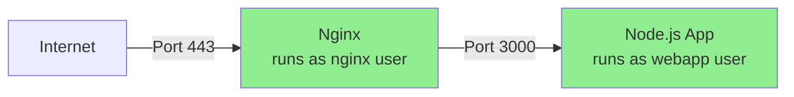
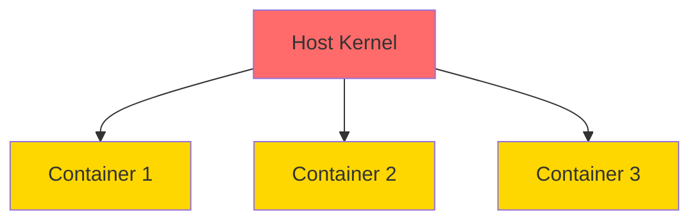
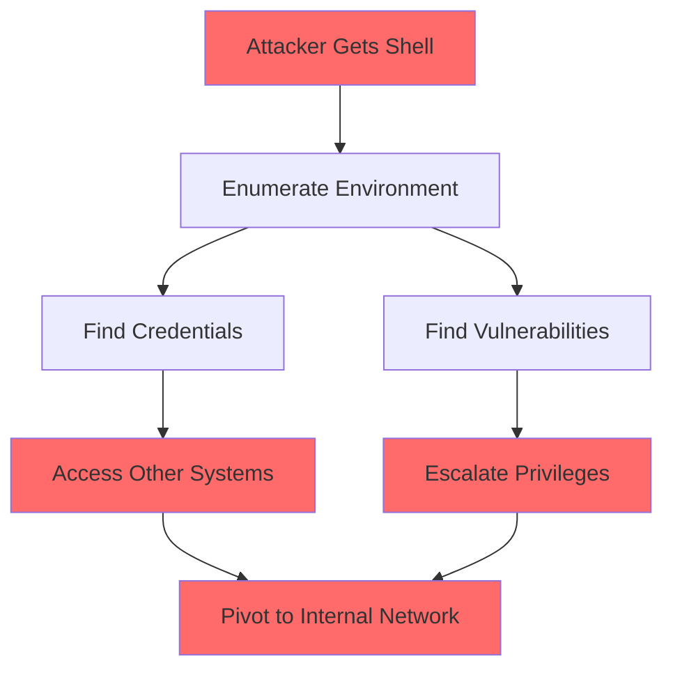

# 🐧 Module 06: Linux & OS-Level Security for Web Apps

**Difficulty:** 🟡 Intermediate  
**Time:** 90 minutes

---

## What You'll Learn

- How OS-level security affects web applications
- Processes, privileges, and the principle of least privilege
- File permissions and capabilities
- Why running as root is bad
- Container escape basics
- How attackers move after initial access

---

## Processes and Privileges

### The Root Problem

```bash
# BAD: Running web app as root
sudo node server.js

# If your app is compromised, attacker has root!
```

**Why this matters:** If an attacker finds RCE (remote code execution) in your app, they inherit the app's privileges.

---

### Principle of Least Privilege

**Every process should run with the minimum privileges needed.**

```bash
# Create dedicated user for your app
sudo useradd -r -s /bin/false webapp

# Run app as that user
sudo -u webapp node server.js
```

---

### Process Inspection

```bash
# List all processes
ps aux

# Find processes by user
ps aux | grep webapp

# Show process tree
ps auxf

# Real-time process monitoring
htop
```

---

### Understanding UID and EUID

```bash
# Check current user
id

# Output: uid=1000(user) gid=1000(user) groups=1000(user),27(sudo)
```

**UID** = Real User ID  
**EUID** = Effective User ID (what permission checks use)

---

## File Permissions

### Understanding `ls -la`

```bash
$ ls -la
drwxr-xr-x  2 user group 4096 Jan 1 12:00 directory
-rw-r--r--  1 user group  123 Jan 1 12:00 file.txt
-rwxr-xr-x  1 user group 4567 Jan 1 12:00 script.sh
```

**Format:** `[type][owner][group][others]`

| Symbol | Meaning |
|--------|---------|
| `d` | Directory |
| `-` | Regular file |
| `l` | Symbolic link |
| `r` | Read (4) |
| `w` | Write (2) |
| `x` | Execute (1) |

---

### Secure File Permissions for Web Apps

```bash
# Application files (read-only for app user)
chmod 644 /app/*.js
chown root:webapp /app/*.js

# Config files with secrets (read-only, owner only)
chmod 600 /app/config/secrets.env
chown webapp:webapp /app/config/secrets.env

# Log directory (writable by app)
mkdir /var/log/myapp
chown webapp:webapp /var/log/myapp
chmod 755 /var/log/myapp

# Upload directory (writable, but not executable)
mkdir /app/uploads
chown webapp:webapp /app/uploads
chmod 755 /app/uploads

# CRITICAL: Never make uploads executable!
find /app/uploads -type f -exec chmod 644 {} \;
```

---

### The Danger of 777

```bash
# NEVER DO THIS
chmod 777 /app/uploads

# This makes files readable, writable, AND executable by everyone!
# If attacker uploads a malicious script, they can execute it.
```

---

## SUID and SGID Binaries

### What Is SUID?

**SUID (Set User ID)** — When executed, the process runs with the owner's privileges, not the caller's.

```bash
# Example: passwd command
$ ls -l /usr/bin/passwd
-rwsr-xr-x 1 root root 68208 Jan 1 12:00 /usr/bin/passwd
      ↑
      SUID bit (runs as root)
```

**Why?** `passwd` needs to modify `/etc/shadow` (root-only), even when called by regular users.

---

### Security Risk: SUID Binaries

If a SUID binary has a vulnerability, attackers can escalate to root.

```bash
# Find all SUID binaries
find / -perm -4000 -type f 2>/dev/null

# Check for unexpected SUID binaries
find /home -perm -4000 -type f 2>/dev/null  # Should be empty!
```

---

### Exploiting a Vulnerable SUID Binary

**Scenario:** Custom SUID binary with command injection.

```c
// vulnerable.c (owned by root, SUID bit set)
#include <stdio.h>
#include <stdlib.h>

int main(int argc, char *argv[]) {
    char cmd[256];
    sprintf(cmd, "/bin/cat %s", argv[1]);  // Vulnerable!
    system(cmd);
    return 0;
}
```

**Exploit:**
```bash
./vulnerable "/etc/passwd; sh"
# Now you have a root shell!
```

---

## Capabilities (Linux Fine-Grained Privileges)

**Capabilities split root privileges into distinct units.**

### Example: Binding to Port 80

```bash
# Without capabilities: need root
sudo node server.js  # Runs on port 80

# With capabilities: grant specific permission
sudo setcap 'cap_net_bind_service=+ep' $(which node)
node server.js  # Can bind to port 80 without being root!
```

---

### Common Capabilities

| Capability | Allows |
|------------|--------|
| `CAP_NET_BIND_SERVICE` | Bind to ports < 1024 |
| `CAP_NET_RAW` | Use raw sockets (ping, tcpdump) |
| `CAP_SYS_ADMIN` | Mount filesystems, many admin tasks |
| `CAP_SETUID` | Change UID |

---

### Check Capabilities

```bash
# View file capabilities
getcap /usr/bin/node

# View process capabilities
grep Cap /proc/$$/status
```

---

## Running Web Apps Securely

### Bad: Running as Root

```bash
sudo node server.js
```

**Problems:**
- Full system access if compromised
- Can modify any file
- Can install backdoors
- Can execute system commands

---

### Good: Dedicated User, Reverse Proxy



**Setup:**

```bash
# 1. Create app user
sudo useradd -r -s /bin/false webapp

# 2. Set up app directory
sudo mkdir /app
sudo chown webapp:webapp /app

# 3. Run app as webapp user
sudo -u webapp node /app/server.js

# 4. Nginx listens on port 80/443, proxies to port 3000
```

**Nginx config:**
```nginx
server {
    listen 80;
    server_name example.com;
    
    location / {
        proxy_pass http://localhost:3000;
        proxy_set_header Host $host;
        proxy_set_header X-Real-IP $remote_addr;
    }
}
```

---

## systemd and Service Management

### Creating a Secure Service

```bash
# /etc/systemd/system/myapp.service
[Unit]
Description=My Web Application
After=network.target

[Service]
Type=simple
User=webapp
Group=webapp
WorkingDirectory=/app
ExecStart=/usr/bin/node /app/server.js

# Security hardening
PrivateTmp=yes
NoNewPrivileges=yes
ProtectSystem=strict
ProtectHome=yes
ReadWritePaths=/var/log/myapp /app/uploads

[Install]
WantedBy=multi-user.target
```

**What these do:**
- `PrivateTmp=yes` — Private /tmp directory
- `NoNewPrivileges=yes` — Can't escalate privileges
- `ProtectSystem=strict` — Read-only /usr, /boot, /efi
- `ProtectHome=yes` — No access to home directories
- `ReadWritePaths` — Explicitly allow write to specific dirs

---

### Service Management

```bash
# Enable service (start on boot)
sudo systemctl enable myapp

# Start service
sudo systemctl start myapp

# Check status
sudo systemctl status myapp

# View logs
sudo journalctl -u myapp -f
```

---

## Container Security Basics

### The Container Illusion

**Containers are NOT VMs.** They share the host kernel.



---

### Running Containers Securely

```bash
# BAD: Running as root inside container
docker run -it ubuntu bash
# Inside container: you're root!

# GOOD: Run as non-root user
docker run --user 1000:1000 -it ubuntu bash

# BETTER: Define in Dockerfile
```

**Dockerfile:**
```dockerfile
FROM node:18-alpine

# Create app user
RUN addgroup -S appgroup && adduser -S appuser -G appgroup

# Set working directory
WORKDIR /app

# Copy app files
COPY --chown=appuser:appgroup . .

# Install dependencies
RUN npm ci --only=production

# Switch to non-root user
USER appuser

# Run app
CMD ["node", "server.js"]
```

---

### Docker Security Options

```bash
# Drop all capabilities, add only what's needed
docker run --cap-drop=ALL --cap-add=NET_BIND_SERVICE myapp

# Read-only root filesystem
docker run --read-only --tmpfs /tmp myapp

# Limit resources
docker run -m 512m --cpus="1.0" myapp

# Use security profiles (AppArmor/SELinux)
docker run --security-opt apparmor=docker-default myapp
```

---

### Container Escape (Awareness)

**How attackers escape containers:**

1. **Privileged containers**
   ```bash
   # BAD: Full host access
   docker run --privileged ubuntu
   ```

2. **Mounting host filesystem**
   ```bash
   # BAD: Access to host /
   docker run -v /:/host ubuntu
   ```

3. **Docker socket mounted**
   ```bash
   # BAD: Control Docker daemon from inside container
   docker run -v /var/run/docker.sock:/var/run/docker.sock ubuntu
   ```

4. **Kernel exploits** (shared kernel = shared vulnerabilities)

---

## Post-Exploitation: Lateral Movement

### After Initial Access



---

### What Attackers Look For

```bash
# 1. Environment variables (secrets?)
env
printenv

# 2. Config files
find / -name "*.env" -o -name "config.json" 2>/dev/null

# 3. Command history (passwords typed in plaintext?)
cat ~/.bash_history

# 4. SSH keys
cat ~/.ssh/id_rsa

# 5. Database connection strings
grep -r "password" /app/

# 6. Running processes (what else is on this system?)
ps aux

# 7. Network connections (where can I pivot?)
ss -tunap
```

---

### Defense: Assume Breach

**If an attacker gets in, limit damage:**

1. **No secrets in environment variables** (use secret management)
2. **No secrets in code** (even in private repos)
3. **Least privilege** (limit what compromised user can do)
4. **Network segmentation** (limit lateral movement)
5. **Logging** (detect suspicious activity)

---

## Secure Secrets Management

### ❌ Bad

```bash
# .env file
DATABASE_PASSWORD=mypassword123
JWT_SECRET=supersecret
```

```bash
# Environment variables visible to all processes
export DATABASE_PASSWORD=mypassword123
ps auxe | grep DATABASE_PASSWORD  # Visible!
```

---

### ✅ Good

**Use a secrets manager:**

- **HashiCorp Vault**
- **AWS Secrets Manager**
- **Azure Key Vault**
- **Kubernetes Secrets** (with encryption at rest)

**Example:**
```typescript
// Instead of process.env.DATABASE_PASSWORD
const password = await secretsManager.getSecret('prod/db/password');
```

---

## Summary

1. **Never run as root** — use dedicated users
2. **File permissions matter** — 644 for files, 755 for dirs, 600 for secrets
3. **SUID binaries are risky** — audit them regularly
4. **Capabilities** provide fine-grained privileges
5. **Containers aren't magic** — still need to secure them
6. **Assume breach** — limit damage from compromised processes
7. **Secrets management** — never hardcode, use vaults

---

## Exercises

### Exercise 1: Audit Your System
```bash
# Find SUID binaries
find / -perm -4000 2>/dev/null

# Check running processes
ps aux | grep root

# Are there processes that shouldn't be root?
```

### Exercise 2: Secure a Service
1. Create a dedicated user for your app
2. Set up proper file permissions
3. Create a systemd service with security hardening
4. Test it works with limited privileges

### Exercise 3: Container Hardening
Take an existing Dockerfile and:
- Run as non-root user
- Make root filesystem read-only
- Drop unnecessary capabilities

---

## What's Next?

Now that you understand OS-level security, let's explore networking attacks and defenses.

→ **Next: [Module 07: Networking Attacks & Defenses](../07-networking-attacks/01-network-security.md)**

---

## Further Reading

- [Linux Privilege Escalation](https://book.hacktricks.xyz/linux-unix/privilege-escalation)
- [Docker Security Best Practices](https://docs.docker.com/develop/security-best-practices/)
- [systemd Security Hardening](https://www.freedesktop.org/software/systemd/man/systemd.exec.html#sandboxing)
