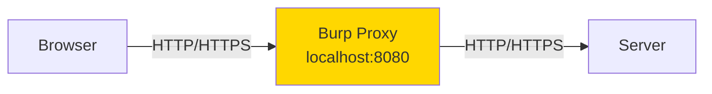

# 🔍 Module 08: Burp Suite for Developers

**Difficulty:** 🟡 Intermediate  
**Time:** 60 minutes

---

## What You'll Learn

- What Burp Suite is and why developers should use it
- Intercepting and modifying HTTP requests
- Finding authentication and authorization bugs
- Using Repeater for manual testing
- Understanding Burp as a learning tool, not magic

---

## What Is Burp Suite?

**Burp Suite is an HTTP proxy that sits between your browser and the server.**



**Why use it?**
- See **all** HTTP traffic (including AJAX, WebSockets)
- **Modify** requests before sending
- **Replay** requests with different parameters
- **Discover** hidden parameters and endpoints

---

## Setup: Proxy Configuration

### 1. Start Burp Suite

```bash
BurpSuiteCommunity
```

### 2. Configure Firefox

**Settings → Network Settings → Manual proxy configuration:**
- HTTP Proxy: `127.0.0.1`
- Port: `8080`
- Check: "Use this proxy for HTTPS"

### 3. Install Burp CA Certificate

1. Visit: `http://burpsuite`
2. Download "CA Certificate"
3. Firefox → Settings → Privacy & Security → Certificates → View Certificates → Import
4. Trust for websites

---

## Intercepting Traffic

### Enable Intercept

1. **Proxy tab → Intercept**
2. Toggle **Intercept ON**

### What You See

```http
GET /api/profile HTTP/2
Host: example.com
Cookie: session=abc123
Authorization: Bearer eyJhbGc...
User-Agent: Mozilla/5.0...
```

**You can now:**
- Modify any part of the request
- Forward (send to server)
- Drop (discard request)
- Send to Repeater (for manual testing)

---

## Use Case 1: Testing Authorization

**Scenario:** Check if user A can access user B's data.

### Step 1: Legitimate Request
```http
GET /api/users/123/profile HTTP/1.1
Authorization: Bearer <user-A-token>
```

**Response:**
```json
{
  "id": 123,
  "name": "Alice",
  "email": "alice@example.com"
}
```

### Step 2: Change ID
```http
GET /api/users/456/profile HTTP/1.1
Authorization: Bearer <user-A-token>
```

**If this returns user B's data → IDOR vulnerability!**

---

## Use Case 2: Finding Hidden Parameters

### Original Request
```http
POST /api/transfer HTTP/1.1
Content-Type: application/json

{
  "to": "bob",
  "amount": 100
}
```

### Test: Add Extra Parameters
```http
POST /api/transfer HTTP/1.1
Content-Type: application/json

{
  "to": "bob",
  "amount": 100,
  "fee": 0,
  "admin": true,
  "verified": true
}
```

**Does server process these? If yes, potential mass assignment bug.**

---

## Burp Repeater

**Repeater lets you modify and resend requests repeatedly.**

### How to Use

1. Intercept a request
2. Right-click → **Send to Repeater**
3. Repeater tab → Modify request → Click **Send**
4. See response instantly

---

### Example: Testing SQL Injection

**Original:**
```http
GET /search?q=test HTTP/1.1
```

**Test 1:**
```http
GET /search?q=test' HTTP/1.1
```

**If response has SQL error → SQL injection likely.**

**Test 2:**
```http
GET /search?q=test' OR '1'='1 HTTP/1.1
```

---

## Use Case 3: Session Management Testing

### Test 1: Session Fixation

1. Get session ID before login: `session=abc123`
2. Log in with that session
3. Check if session ID changed
4. If it didn't change → session fixation vulnerability

---

### Test 2: Session Timeout

1. Log in → get session token
2. Wait 30 minutes
3. Use old token in request
4. If still works → no timeout (security risk)

---

## Use Case 4: CSRF Testing

**Check if CSRF protection exists:**

1. Intercept a state-changing request (POST /transfer)
2. Look for CSRF token in request body or headers
3. Remove CSRF token, resend
4. If request succeeds → no CSRF protection

---

## Burp Intruder (Quick Overview)

**Intruder automates request modification.**

### Example: Brute Force User IDs

**Base request:**
```http
GET /api/users/§123§/profile HTTP/1.1
```

**Payload:** Numbers 1-1000

**Burp sends:**
```
GET /api/users/1/profile
GET /api/users/2/profile
...
GET /api/users/1000/profile
```

**Analyze which return 200 OK → enumerate valid user IDs.**

**Note: Rate limiting should prevent this!**

---

## Burp Scanner (Community Edition Limitations)

**Burp Professional has automated scanner.**

**Community Edition: Manual testing only.**

**That's fine! Manual testing teaches you more about vulnerabilities.**

---

## Common Findings with Burp

### 1. Missing Authentication

**Symptom:** API endpoint accessible without token.

```http
GET /api/admin/users HTTP/1.1
# No Authorization header
```

**If it works → authentication missing.**

---

### 2. IDOR (Insecure Direct Object Reference)

**Symptom:** Changing ID in URL accesses other users' data.

```http
GET /api/documents/456 HTTP/1.1
# User 123 can access document 456 (owned by user 789)
```

---

### 3. Parameter Tampering

**Symptom:** Modifying parameters changes behavior.

```http
POST /api/purchase HTTP/1.1

{
  "item": "premium-plan",
  "price": 0  // Changed from 99
}
```

**If server trusts client-side price → tamperering works.**

---

### 4. Information Disclosure

**Symptom:** Error messages leak info.

```http
GET /api/users/999999 HTTP/1.1
```

**Response:**
```json
{
  "error": "User not found in database 'production_users' table 'users'"
}
```

**Reveals:** Database name, table name.

---

## Burp Best Practices

### 1. Test Your Own Apps Only

**Legal and ethical:**
- ✅ Your own applications
- ✅ Deliberately vulnerable apps (DVWA, Juice Shop)
- ❌ Production apps without authorization
- ❌ Third-party sites

---

### 2. Use Target Scope

**Proxy → Options → Target → Scope**

Add your test domain to scope. Burp only intercepts in-scope requests.

---

### 3. Save Interesting Requests

Right-click request → **Save item** → Store for later analysis.

---

## Burp Alternatives (Free)

- **OWASP ZAP** (similar to Burp, fully free)
- **mitmproxy** (command-line proxy, scriptable)
- **Browser DevTools** (built-in, limited but useful)

---

## Summary

1. **Burp is an HTTP proxy** for intercepting and modifying requests
2. **Use Repeater** for manual testing
3. **Find AuthN/AuthZ bugs** by modifying requests
4. **Test IDOR** by changing IDs
5. **Check CSRF** by removing tokens
6. **Always test ethically** (your apps only)

---

## Exercises

### Exercise 1: Set Up Burp
1. Install Burp
2. Configure Firefox proxy
3. Visit a test site (Juice Shop)
4. Intercept a request

### Exercise 2: Find IDOR
1. Log in as two different users in Juice Shop
2. Access user A's resource
3. Change ID to user B's
4. Does it work?

### Exercise 3: Tamper a Request
1. Find a POST request (e.g., adding to cart)
2. Send to Repeater
3. Modify price/quantity
4. See if server validates

---

## What's Next?

Now let's learn Wireshark for packet-level analysis.

→ **Next: [Module 09: Wireshark for Developers](../09-wireshark/01-wireshark-basics.md)**

---

## Further Reading

- [Burp Suite Documentation](https://portswigger.net/burp/documentation)
- [OWASP ZAP](https://www.zaproxy.org/)
