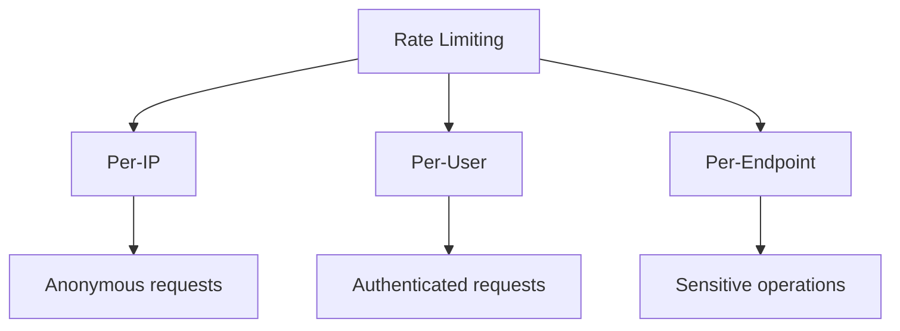

# 🌐 Module 12: Secure API Design

**Difficulty:** 🔴 Advanced  
**Time:** 90 minutes

---

## What You'll Learn

- Rate limiting
- Idempotency
- Authentication boundaries
- Pagination abuse
- Webhook security
- API versioning security
- GraphQL-specific risks

---

## Rate Limiting

### Why Rate Limit?

**Prevent:**
- Brute force attacks
- DoS (accidental or malicious)
- Scraping/data exfiltration
- Resource exhaustion

---

### Types of Rate Limits



---

### Implementation (Express)

**express-rate-limit:**

```typescript
import rateLimit from 'express-rate-limit';

// Global rate limit
const limiter = rateLimit({
  windowMs: 15 * 60 * 1000, // 15 minutes
  max: 100, // 100 requests per window
  message: 'Too many requests, please try again later',
  standardHeaders: true, // Return rate limit info in headers
  legacyHeaders: false,
});

app.use('/api/', limiter);
```

---

### Per-Endpoint Rate Limiting

```typescript
// Strict limit for login
const loginLimiter = rateLimit({
  windowMs: 15 * 60 * 1000,
  max: 5, // Only 5 login attempts per 15 minutes
  skipSuccessfulRequests: true, // Don't count successful logins
});

app.post('/api/login', loginLimiter, async (req, res) => {
  // Login logic
});

// Stricter limit for password reset
const resetLimiter = rateLimit({
  windowMs: 60 * 60 * 1000, // 1 hour
  max: 3, // Only 3 reset requests per hour
});

app.post('/api/reset-password', resetLimiter, async (req, res) => {
  // Reset logic
});
```

---

### Per-User Rate Limiting

```typescript
import rateLimit from 'express-rate-limit';
import RedisStore from 'rate-limit-redis';
import Redis from 'ioredis';

const redis = new Redis();

const userLimiter = rateLimit({
  store: new RedisStore({
    client: redis,
    prefix: 'rl:',
  }),
  windowMs: 15 * 60 * 1000,
  max: 1000, // 1000 requests per user per 15 min
  keyGenerator: (req) => req.user?.id || req.ip,
});

app.use('/api/', authenticate, userLimiter);
```

---

### Rate Limit Headers

**Standard headers:**

```
RateLimit-Limit: 100
RateLimit-Remaining: 87
RateLimit-Reset: 1640000000
```

**In response:**

```typescript
app.use((req, res, next) => {
  res.set({
    'RateLimit-Limit': '100',
    'RateLimit-Remaining': '87',
    'RateLimit-Reset': '1640000000'
  });
  next();
});
```

---

## Idempotency

### What Is Idempotency?

**Making the same request multiple times has the same effect as making it once.**

---

### Why It Matters

```typescript
// User clicks "Submit Payment" twice
// Without idempotency: Charged twice!
```

---

### HTTP Method Idempotency

| Method | Idempotent? | Notes |
|--------|-------------|-------|
| GET | ✅ Yes | Always safe |
| PUT | ✅ Yes | Replace entire resource |
| DELETE | ✅ Yes | Deleting twice = same result |
| POST | ❌ No | Creates new resource each time |
| PATCH | ⚠️ Maybe | Depends on implementation |

---

### Implementing Idempotency for POST

**Idempotency Key:**

```typescript
app.post('/api/payment', async (req, res) => {
  const idempotencyKey = req.headers['idempotency-key'];
  
  if (!idempotencyKey) {
    return res.status(400).json({ error: 'Idempotency-Key header required' });
  }
  
  // Check if request already processed
  const existing = await redis.get(`idempotency:${idempotencyKey}`);
  if (existing) {
    return res.json(JSON.parse(existing)); // Return cached response
  }
  
  // Process payment
  const payment = await processPayment(req.body);
  
  // Cache result (expire after 24 hours)
  await redis.setex(
    `idempotency:${idempotencyKey}`,
    86400,
    JSON.stringify(payment)
  );
  
  res.json(payment);
});
```

**Client usage:**

```typescript
import { v4 as uuidv4 } from 'uuid';

const idempotencyKey = uuidv4();

await fetch('/api/payment', {
  method: 'POST',
  headers: {
    'Content-Type': 'application/json',
    'Idempotency-Key': idempotencyKey
  },
  body: JSON.stringify({ amount: 100 })
});
```

---

## Authentication Boundaries

### ❌ Common Mistake: Inconsistent Auth

```typescript
// ❌ Public endpoint returns sensitive data
app.get('/api/users/:id', async (req, res) => {
  const user = await db.user.findUnique({
    where: { id: req.params.id },
    select: {
      id: true,
      username: true,
      email: true,      // ← Should be private!
      phoneNumber: true  // ← Should be private!
    }
  });
  res.json(user);
});
```

---

### ✅ Separate Public and Private Data

```typescript
// Public profile
app.get('/api/users/:id/profile', async (req, res) => {
  const user = await db.user.findUnique({
    where: { id: req.params.id },
    select: {
      id: true,
      username: true,
      bio: true,
      avatarUrl: true
    }
  });
  res.json(user);
});

// Private settings (requires auth)
app.get('/api/users/:id/settings', authenticate, authorize, async (req, res) => {
  if (req.user.id !== req.params.id) {
    return res.status(403).json({ error: 'Forbidden' });
  }
  
  const user = await db.user.findUnique({
    where: { id: req.params.id },
    select: {
      email: true,
      phoneNumber: true,
      notificationPreferences: true
    }
  });
  res.json(user);
});
```

---

### Resource-Based Authorization

```typescript
app.delete('/api/posts/:id', authenticate, async (req, res) => {
  const post = await db.post.findUnique({
    where: { id: req.params.id }
  });
  
  if (!post) {
    return res.status(404).json({ error: 'Not found' });
  }
  
  // Check ownership
  if (post.authorId !== req.user.id && req.user.role !== 'admin') {
    return res.status(403).json({ error: 'You can only delete your own posts' });
  }
  
  await db.post.delete({ where: { id: req.params.id } });
  res.status(204).send();
});
```

---

## Pagination Abuse

### ❌ Unlimited Results

```typescript
// ❌ Attacker can request millions of records
app.get('/api/posts', async (req, res) => {
  const limit = parseInt(req.query.limit) || 10;
  
  const posts = await db.post.findMany({
    take: limit  // ← No maximum!
  });
  
  res.json(posts);
});

// Attack: ?limit=999999999
```

---

### ✅ Enforce Maximum Page Size

```typescript
const MAX_PAGE_SIZE = 100;

app.get('/api/posts', async (req, res) => {
  const limit = Math.min(
    parseInt(req.query.limit) || 10,
    MAX_PAGE_SIZE
  );
  
  const page = parseInt(req.query.page) || 1;
  const skip = (page - 1) * limit;
  
  const [posts, total] = await Promise.all([
    db.post.findMany({
      skip,
      take: limit,
      orderBy: { createdAt: 'desc' }
    }),
    db.post.count()
  ]);
  
  res.json({
    data: posts,
    pagination: {
      page,
      limit,
      total,
      totalPages: Math.ceil(total / limit)
    }
  });
});
```

---

### Cursor-Based Pagination (More Efficient)

```typescript
app.get('/api/posts', async (req, res) => {
  const limit = Math.min(
    parseInt(req.query.limit) || 10,
    MAX_PAGE_SIZE
  );
  const cursor = req.query.cursor; // ID of last item from previous page
  
  const posts = await db.post.findMany({
    take: limit + 1, // Fetch one extra to check if more exist
    ...(cursor && {
      cursor: { id: cursor },
      skip: 1 // Skip the cursor itself
    }),
    orderBy: { createdAt: 'desc' }
  });
  
  const hasMore = posts.length > limit;
  const data = hasMore ? posts.slice(0, -1) : posts;
  
  res.json({
    data,
    pagination: {
      hasMore,
      nextCursor: hasMore ? data[data.length - 1].id : null
    }
  });
});
```

---

## Webhook Security

### Verify Webhook Signatures

**Stripe example:**

```typescript
import Stripe from 'stripe';

const stripe = new Stripe(process.env.STRIPE_SECRET_KEY);
const webhookSecret = process.env.STRIPE_WEBHOOK_SECRET;

app.post('/webhooks/stripe', 
  express.raw({ type: 'application/json' }), // Important: raw body needed
  async (req, res) => {
    const sig = req.headers['stripe-signature'];
    
    let event;
    try {
      // Verify signature
      event = stripe.webhooks.constructEvent(req.body, sig, webhookSecret);
    } catch (err) {
      console.error('Webhook signature verification failed:', err.message);
      return res.status(400).send(`Webhook Error: ${err.message}`);
    }
    
    // Handle event
    switch (event.type) {
      case 'payment_intent.succeeded':
        const paymentIntent = event.data.object;
        await handleSuccessfulPayment(paymentIntent);
        break;
      // ... other event types
    }
    
    res.json({ received: true });
  }
);
```

---

### Idempotent Webhook Processing

```typescript
app.post('/webhooks/payment', async (req, res) => {
  const eventId = req.body.id; // Unique event ID from provider
  
  // Check if already processed
  const existing = await db.webhookEvent.findUnique({
    where: { eventId }
  });
  
  if (existing) {
    return res.json({ received: true }); // Already processed
  }
  
  // Process event
  await handlePaymentEvent(req.body);
  
  // Mark as processed
  await db.webhookEvent.create({
    data: { eventId, processedAt: new Date() }
  });
  
  res.json({ received: true });
});
```

---

## API Versioning

### Why Version?

- Breaking changes without breaking clients
- Security fixes in newer versions
- Deprecate insecure endpoints

---

### Versioning Strategies

**URL path:**
```
/api/v1/users
/api/v2/users
```

**Header:**
```
GET /api/users
Accept-Version: 2.0
```

**Query parameter:**
```
/api/users?version=2
```

---

### Deprecation Headers

```typescript
app.get('/api/v1/users', (req, res) => {
  res.set({
    'Deprecation': 'true',
    'Sunset': 'Sat, 31 Dec 2024 23:59:59 GMT',
    'Link': '</api/v2/users>; rel="alternate"'
  });
  
  // ... old logic
});
```

---

## GraphQL-Specific Risks

### Query Depth Attacks

**Attack:**
```graphql
{
  user(id: 1) {
    posts {
      author {
        posts {
          author {
            posts {
              # ... 100 levels deep
            }
          }
        }
      }
    }
  }
}
```

**Defense:**

```typescript
import { createComplexityLimitRule } from 'graphql-validation-complexity';

const schema = buildSchema(typeDefs, resolvers);

const server = new ApolloServer({
  schema,
  validationRules: [
    createComplexityLimitRule(1000, {
      onCost: (cost) => console.log('Query cost:', cost)
    })
  ]
});
```

---

### Query Batching Attacks

**Attack:**
```json
[
  { "query": "{ users { id email } }" },
  { "query": "{ users { id email } }" },
  // ... 1000 queries
]
```

**Defense:**

```typescript
const server = new ApolloServer({
  schema,
  plugins: [
    {
      requestDidStart() {
        return {
          didResolveOperation({ request, document }) {
            // Limit to 10 operations per request
            if (request.operationName && document.definitions.length > 10) {
              throw new Error('Too many operations in batch');
            }
          }
        };
      }
    }
  ]
});
```

---

## Summary

| Risk | Impact | Mitigation |
|------|--------|------------|
| **No rate limiting** | DoS, brute force | express-rate-limit, Redis |
| **Non-idempotent POST** | Duplicate charges | Idempotency keys |
| **Weak auth boundaries** | Data leak | Resource-based authz |
| **Unlimited pagination** | DoS, data exfiltration | Max page size, cursor pagination |
| **Unverified webhooks** | Fake events | Signature verification |
| **No versioning** | Can't deprecate insecure endpoints | URL/header versioning |
| **GraphQL depth attacks** | DoS | Query complexity limits |

---

## Exercises

### Exercise 1: Add Rate Limiting

Add rate limiting to your API:
- 100 requests/15min globally
- 5 login attempts/15min

Test with:
```bash
for i in {1..10}; do curl http://localhost:3000/api/login; done
```

---

### Exercise 2: Implement Idempotency

Add idempotency key support to a POST endpoint. Test by sending the same request twice with the same key.

---

### Exercise 3: Fix Pagination

Given:
```typescript
app.get('/api/posts', async (req, res) => {
  const limit = req.query.limit || 10;
  const posts = await db.post.findMany({ take: limit });
  res.json(posts);
});
```

Fix the unlimited pagination vulnerability.

---

## What's Next?

Now let's explore CI/CD and supply chain security.

→ **Next: [Module 13: CI/CD & Supply Chain Security](../13-cicd-supply-chain/01-cicd-security.md)**

---

## Further Reading

- [OWASP API Security Top 10](https://owasp.org/www-project-api-security/)
- [Stripe Webhook Security](https://stripe.com/docs/webhooks/signatures)
- [GraphQL Security Best Practices](https://www.apollographql.com/blog/graphql-security-best-practices)
