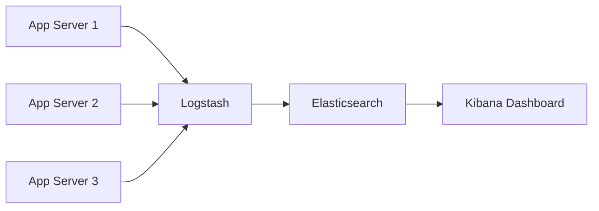
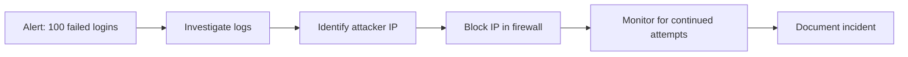

# 📊 Module 14: Security Logging & Monitoring

**Difficulty:** 🟡 Intermediate  
**Time:** 60 minutes

---

## What You'll Learn

- What to log (and what NOT to log)
- Security logs vs application logs
- Detecting abuse patterns
- Log aggregation and analysis
- Alert fatigue
- Incident response basics

---

## Security Logs vs Application Logs

### Application Logs

**Purpose:** Debugging, performance, business metrics

```typescript
logger.info('User purchased item', { userId, itemId, price });
logger.error('Database connection failed', { error });
```

---

### Security Logs

**Purpose:** Detect attacks, forensics, compliance

```typescript
securityLogger.warn('Failed login attempt', { 
  username, 
  ipAddress, 
  userAgent,
  timestamp 
});

securityLogger.alert('Admin privilege escalation', {
  userId,
  action: 'role_change',
  fromRole: 'user',
  toRole: 'admin',
  performedBy: adminId
});
```

---

## What to Log

### Authentication Events

```typescript
// ✅ Login success
logger.info('LOGIN_SUCCESS', {
  userId: user.id,
  username: user.username,
  ipAddress: req.ip,
  userAgent: req.headers['user-agent'],
  timestamp: new Date()
});

// ✅ Login failure
logger.warn('LOGIN_FAILED', {
  username: req.body.username,  // OK to log
  // ❌ NOT password: req.body.password
  ipAddress: req.ip,
  reason: 'invalid_credentials'
});

// ✅ Password reset
logger.info('PASSWORD_RESET_REQUESTED', {
  email: user.email,
  ipAddress: req.ip
});

// ✅ Multi-factor auth
logger.info('MFA_ENABLED', { userId: user.id });
logger.warn('MFA_FAILED', { userId: user.id, attempts: 3 });
```

---

### Authorization Events

```typescript
// ✅ Access granted
logger.info('ACCESS_GRANTED', {
  userId,
  resource: '/api/admin/users',
  action: 'READ'
});

// ✅ Access denied
logger.warn('ACCESS_DENIED', {
  userId,
  resource: '/api/admin/users',
  action: 'DELETE',
  reason: 'insufficient_permissions'
});

// ✅ Privilege escalation
logger.alert('PRIVILEGE_CHANGE', {
  targetUserId,
  fromRole: 'user',
  toRole: 'admin',
  performedBy: adminUserId
});
```

---

### Suspicious Activity

```typescript
// ✅ Rapid requests (potential DoS)
logger.warn('RATE_LIMIT_EXCEEDED', {
  identifier: req.ip || req.user?.id,
  endpoint: req.path,
  requestCount: 100,
  timeWindow: '15m'
});

// ✅ Unusual access patterns
logger.warn('UNUSUAL_ACCESS_PATTERN', {
  userId,
  ipAddress: req.ip,
  previousIp: user.lastIpAddress,
  location: geoip.lookup(req.ip),
  userAgent: req.headers['user-agent']
});

// ✅ SQL injection attempt
logger.alert('SQL_INJECTION_ATTEMPT', {
  userId: req.user?.id,
  ipAddress: req.ip,
  parameter: 'username',
  value: req.body.username,
  detectedPattern: 'OR 1=1'
});
```

---

## What NOT to Log

### ❌ Sensitive Data

```typescript
// ❌ NEVER log these
logger.info('User login', {
  password: req.body.password,        // ← NO
  creditCard: req.body.creditCard,    // ← NO
  ssn: req.body.ssn,                  // ← NO
  apiKey: req.headers['x-api-key'],   // ← NO
  sessionToken: req.cookies.session   // ← NO
});
```

---

### ✅ Redact Sensitive Data

```typescript
function sanitizeForLogging(data: any) {
  const sensitive = ['password', 'creditCard', 'ssn', 'token', 'apiKey'];
  const sanitized = { ...data };
  
  for (const key of Object.keys(sanitized)) {
    if (sensitive.some(s => key.toLowerCase().includes(s))) {
      sanitized[key] = '[REDACTED]';
    }
  }
  
  return sanitized;
}

logger.info('User data', sanitizeForLogging(req.body));
// Output: { username: 'john', password: '[REDACTED]' }
```

---

## Structured Logging

### ❌ Unstructured Logs

```typescript
console.log('User john logged in from 192.168.1.1');
// Hard to parse, query, alert on
```

---

### ✅ Structured Logs (JSON)

```typescript
import winston from 'winston';

const logger = winston.createLogger({
  format: winston.format.json(),
  transports: [
    new winston.transports.File({ filename: 'app.log' })
  ]
});

logger.info('LOGIN_SUCCESS', {
  event: 'login',
  userId: 'user123',
  username: 'john',
  ipAddress: '192.168.1.1',
  timestamp: new Date().toISOString()
});

// Output:
// {"level":"info","message":"LOGIN_SUCCESS","event":"login","userId":"user123",...}
```

**Benefits:**
- Easy to query: `grep '"event":"login"' app.log`
- Easy to parse: `jq '.userId' app.log`
- Easy to analyze with tools (ELK, Splunk, etc.)

---

## Log Levels

| Level | When to Use | Example |
|-------|-------------|---------|
| **DEBUG** | Detailed tracing | `SQL query executed: SELECT * FROM users WHERE id = 123` |
| **INFO** | Normal operations | `User logged in`, `API request completed` |
| **WARN** | Recoverable issues | `Failed login attempt`, `Rate limit approaching` |
| **ERROR** | Errors requiring attention | `Database connection failed`, `Payment processing error` |
| **FATAL** | System unusable | `Out of memory`, `Critical service down` |

**Security-specific:**

| Level | When to Use | Example |
|-------|-------------|---------|
| **SECURITY_INFO** | Security events (normal) | `MFA enabled` |
| **SECURITY_WARN** | Suspicious activity | `5 failed logins in 1 minute` |
| **SECURITY_ALERT** | Active attack | `SQL injection detected` |

---

## Detecting Attack Patterns

### Failed Login Threshold

```typescript
import Redis from 'ioredis';
const redis = new Redis();

const MAX_ATTEMPTS = 5;
const WINDOW = 15 * 60; // 15 minutes

app.post('/api/login', async (req, res) => {
  const { username, password } = req.body;
  const key = `login_attempts:${username}`;
  
  const attempts = await redis.incr(key);
  await redis.expire(key, WINDOW);
  
  if (attempts > MAX_ATTEMPTS) {
    logger.warn('BRUTE_FORCE_ATTEMPT', {
      username,
      ipAddress: req.ip,
      attempts
    });
    
    return res.status(429).json({ 
      error: 'Too many login attempts. Try again later.' 
    });
  }
  
  const user = await authenticateUser(username, password);
  
  if (!user) {
    logger.warn('LOGIN_FAILED', { username, ipAddress: req.ip, attempts });
    return res.status(401).json({ error: 'Invalid credentials' });
  }
  
  // Reset counter on success
  await redis.del(key);
  
  logger.info('LOGIN_SUCCESS', { 
    userId: user.id, 
    username, 
    ipAddress: req.ip 
  });
  
  res.json({ token: generateToken(user) });
});
```

---

### Velocity Checks

```typescript
// Detect if user is making too many requests
async function checkVelocity(userId: string, action: string) {
  const key = `velocity:${userId}:${action}`;
  const count = await redis.incr(key);
  await redis.expire(key, 60); // 1 minute window
  
  if (count > 10) {
    logger.warn('VELOCITY_EXCEEDED', {
      userId,
      action,
      count,
      window: '1m'
    });
    return false;
  }
  
  return true;
}

app.post('/api/posts', authenticate, async (req, res) => {
  if (!await checkVelocity(req.user.id, 'create_post')) {
    return res.status(429).json({ error: 'Too many posts' });
  }
  
  // Create post...
});
```

---

### Geographic Anomalies

```typescript
import geoip from 'geoip-lite';

app.post('/api/login', async (req, res) => {
  const user = await authenticateUser(req.body.username, req.body.password);
  if (!user) return res.status(401).json({ error: 'Invalid credentials' });
  
  const currentLocation = geoip.lookup(req.ip);
  const lastLocation = user.lastLoginLocation;
  
  if (lastLocation && currentLocation) {
    const distance = calculateDistance(lastLocation, currentLocation);
    
    // Impossible travel (e.g., 10,000 km in 1 hour)
    if (distance > 1000 && hoursSinceLastLogin < 12) {
      logger.alert('IMPOSSIBLE_TRAVEL', {
        userId: user.id,
        lastLocation,
        currentLocation,
        distance,
        timeSinceLastLogin: hoursSinceLastLogin
      });
      
      // Trigger additional verification (email, MFA, etc.)
      requireAdditionalAuth(user);
    }
  }
  
  await updateUserLastLogin(user.id, req.ip, currentLocation);
  res.json({ token: generateToken(user) });
});
```

---

## Log Aggregation

### Why Aggregate?

- Multiple servers → one place to search
- Correlation across services
- Long-term storage
- Advanced querying

---

### ELK Stack (Elasticsearch, Logstash, Kibana)



---

### Sending Logs to Elasticsearch

```typescript
import winston from 'winston';
import { ElasticsearchTransport } from 'winston-elasticsearch';

const logger = winston.createLogger({
  transports: [
    new ElasticsearchTransport({
      level: 'info',
      clientOpts: { node: 'http://localhost:9200' },
      index: 'app-logs'
    })
  ]
});

logger.info('LOGIN_SUCCESS', { userId: 'user123' });
// → Sent to Elasticsearch
```

---

### Querying Logs

**Elasticsearch query:**

```json
GET /app-logs/_search
{
  "query": {
    "bool": {
      "must": [
        { "match": { "message": "LOGIN_FAILED" } }
      ],
      "filter": [
        { "range": { "timestamp": { "gte": "now-1h" } } }
      ]
    }
  },
  "aggs": {
    "top_failed_ips": {
      "terms": { "field": "ipAddress", "size": 10 }
    }
  }
}
```

**Result:** Top 10 IPs with most failed logins in past hour.

---

## Alerting

### ❌ Alert Fatigue

**Too many alerts → ignored alerts**

```typescript
// ❌ Alert on EVERY failed login
if (loginFailed) {
  sendAlertToSlack('Login failed!');  // 1000 alerts/day → ignored
}
```

---

### ✅ Aggregate and Threshold

```typescript
// ✅ Alert only if threshold exceeded
const failedLogins = await countFailedLoginsLastHour();

if (failedLogins > 50) {
  sendAlertToSlack(`⚠️ ${failedLogins} failed logins in past hour`);
}
```

---

### Sample Alert Rules

| Condition | Action | Priority |
|-----------|--------|----------|
| 50+ failed logins in 1 hour | Slack notification | Medium |
| 10+ failed logins same user in 5 min | Email security team | High |
| Admin privilege granted | Immediate Slack + Email | Critical |
| SQL injection detected | Immediate PagerDuty | Critical |
| Rate limit exceeded 100+ times | Slack notification | Medium |

---

## Incident Response

### Detection → Investigation → Response → Recovery



---

### Investigation Checklist

When alert fires:

1. **What happened?**
   - Read the alert message
   - Time of incident
   - Affected resources

2. **Who was involved?**
   - User IDs
   - IP addresses
   - User agents

3. **What's the impact?**
   - Was data accessed?
   - Were accounts compromised?
   - Is attack ongoing?

4. **What's the root cause?**
   - Vulnerability exploited
   - Misconfiguration
   - Compromised credentials

5. **How to prevent recurrence?**
   - Patch vulnerability
   - Improve monitoring
   - Update documentation

---

## Compliance & Retention

### How Long to Keep Logs?

| Regulation | Retention Period |
|------------|------------------|
| **GDPR** | As needed (with anonymization) |
| **PCI DSS** | 1 year minimum |
| **HIPAA** | 6 years |
| **SOX** | 7 years |

**Balance:**
- Security/forensics: Keep longer
- Privacy: Keep shorter
- Cost: Storage is expensive

---

### Log Anonymization

```typescript
// After 90 days, anonymize logs
async function anonymizeOldLogs() {
  await db.logs.updateMany({
    where: {
      timestamp: { lt: new Date(Date.now() - 90 * 24 * 60 * 60 * 1000) }
    },
    data: {
      ipAddress: '[ANONYMIZED]',
      userId: '[ANONYMIZED]'
    }
  });
}
```

---

## Summary

| Principle | Example |
|-----------|---------|
| **Log security events** | Logins, access denials, privilege changes |
| **Don't log secrets** | Passwords, tokens, credit cards |
| **Use structured logging** | JSON format with consistent fields |
| **Detect patterns** | Failed login thresholds, velocity checks |
| **Aggregate logs** | ELK stack, Splunk, CloudWatch |
| **Alert wisely** | Threshold-based, avoid fatigue |
| **Retain appropriately** | Comply with regulations, balance privacy |

---

## Exercises

### Exercise 1: Add Security Logging

Add structured logging to your app for:
- Login success/failure
- Access denied events
- Password changes

Use `winston` or similar library.

---

### Exercise 2: Detect Brute Force

Implement failed login threshold:
- Allow 5 attempts per 15 minutes
- Log when threshold exceeded
- Return 429 status

---

### Exercise 3: Query Logs

If you have logs in JSON format:

```bash
# Find all failed logins
grep '"event":"LOGIN_FAILED"' app.log | jq .

# Count by IP address
grep '"event":"LOGIN_FAILED"' app.log | jq -r '.ipAddress' | sort | uniq -c | sort -nr
```

---

## What's Next?

Now let's analyze real-world security failures.

→ **Next: [Module 15: Real-World Security Failures](../15-real-world-failures/01-failure-analysis.md)**

---

## Further Reading

- [OWASP Logging Cheat Sheet](https://cheatsheetseries.owasp.org/cheatsheets/Logging_Cheat_Sheet.html)
- [Winston Documentation](https://github.com/winstonjs/winston)
- [ELK Stack Tutorial](https://www.elastic.co/guide/en/elastic-stack-get-started/current/get-started-elastic-stack.html)
