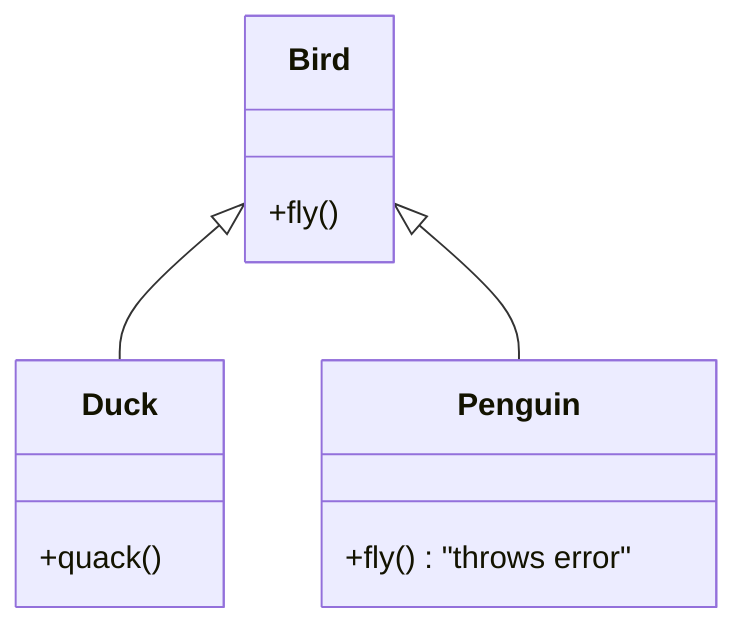
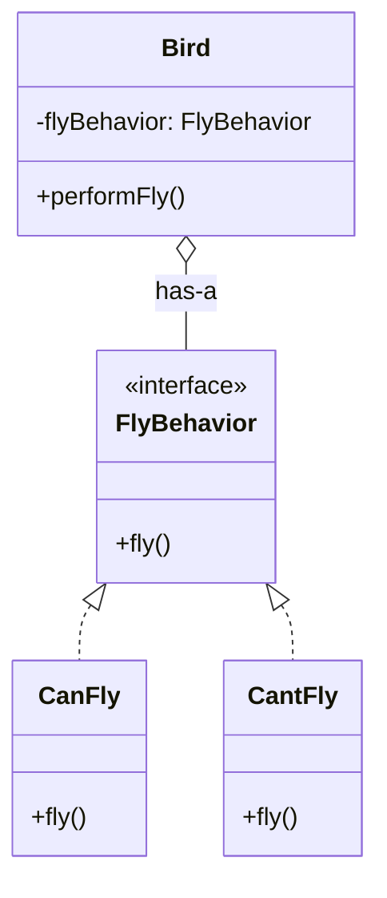

# 💣 Composition vs. Inheritance: The Final Showdown

If there's one holy war in OOP, this is it. And I'm here to tell you the war is over. Composition won. It wasn't even close.

Inheritance is the flashy, easy-to-understand tool that feels powerful at first. Composition is the quieter, more deliberate approach that saves your ass in the long run. Let's break down why your default instinct should always be to favor composition.

---

## 🧩 What's the Difference, Really?

*   **Inheritance** is an **"is-a"** relationship. `SuperDrone` **is a** `Drone`. This creates a tight, compile-time coupling between a parent and child class. The child gets everything from the parent, whether it wants it or not.
*   **Composition** is a **"has-a"** relationship. A `Car` **has an** `Engine`. This is about creating complex objects by combining simpler ones. The relationship is usually defined at runtime and is far more flexible.

---

## The Case Against Inheritance (Why It's a Trap)

We've already seen the "fragile base class" and "Liskov Substitution" problems. Let's summarize the core issues.

### 1. The Tightest Coupling Known to Man

When you inherit, you're not just getting the parent's public methods; you're also coupled to its protected implementation. If the author of the parent class decides to change a protected method you were relying on, your child class breaks.

This makes your code incredibly **rigid**. Change becomes difficult and dangerous.

### 2. The "Gorilla-Banana" Problem

> "You wanted a banana, but what you got was a gorilla holding the banana and the entire jungle." - Joe Armstrong

When you inherit from a class, you get *everything*. You can't pick and choose.

Imagine you need a `UserList` that's like an `Array`, but you want to log every time an item is added.

**The Inheritance Approach:**

```typescript
class LoggingUserList extends Array<string> {
  add(user: string) {
    console.log(`Adding user: ${user}`);
    this.push(user); // Uh oh, we're using a method from Array
  }
}

const list = new LoggingUserList();
list.add('Alice'); // "Adding user: Alice" -> Works!

// But what about this?
list.push('Bob'); // No log message!
```

You inherited `push`, `pop`, `slice`, `splice`, and 87 other methods from `Array`. You only wanted to modify the "add" behavior, but you got the whole gorilla. Now you have to remember to *only* use your custom `add` method, and your object is in an inconsistent state. This is a bug waiting to happen.

### 3. The Hierarchy Nightmare

Inheritance encourages you to build deep, complex taxonomies of objects. `Vehicle` -> `Car` -> `SportsCar` -> `Ferrari`. This looks smart on a whiteboard, but it's a nightmare in practice.

What happens when you need a `FlyingCar`? Does it inherit from `Car` and `Airplane`? Most languages don't support multiple inheritance for good reason (the "Diamond Problem"). You're forced to cram unrelated functionality into a base class or duplicate code.

---

## The Case for Composition (Why It's Your Best Friend)

Composition is about building things out of smaller, interchangeable parts. It's like LEGOs for code.

Let's solve the `LoggingUserList` problem with composition.

**The Composition Approach:**

```typescript
// We don't extend Array. We USE it.
class LoggingUserList {
  // It "has-a" list internally.
  private list: string[] = [];

  add(user: string) {
    console.log(`Adding user: ${user}`);
    this.list.push(user);
  }

  getUsers(): string[] {
    return [...this.list]; // Return a copy for safety
  }

  // We only expose the methods we actually want the outside world to use.
  // There's no .pop() or .slice() method unless we explicitly create one.
}

const list = new LoggingUserList();
list.add('Alice'); // "Adding user: Alice"
// list.push('Bob'); // Compile Error! .push is not a function.
```

Look at how much safer this is!
*   **No leaky abstractions:** The fact that we're using an `Array` internally is a hidden implementation detail. We could swap it for a `Set` or a linked list later, and nothing outside this class would break.
*   **Explicit API:** The public surface of our class is exactly what we define it to be. No surprise methods.
*   **Flexible:** We are in complete control.

---

## 🏗️ Structure Diagram: Inheritance vs. Composition

Let's visualize the `Bird`/`Penguin` problem.

### Inheritance Model (Brittle)


Here, `Penguin` is forced into a lie. It says it's a `Bird` but can't fulfill the `fly()` contract correctly.

### Composition Model (Flexible)


Here, the `Bird` class is composed with a `FlyBehavior`. It delegates the act of flying to another object. We can create birds that fly, birds that don't, and maybe even birds that `FlyWithARocket` later, all without changing the `Bird` class itself.

---

## 🔥 Real-World Example: The "User" Object

Think about a `User` in a modern application. What *is* a user?

*   A user can **authenticate** (using a password, or Google, or SAML).
*   A user has **permissions** (admin, editor, viewer).
*   A user has a **profile** (name, email, avatar).
*   A user might have a **subscription** (free tier, pro tier).

**The Inheritance Nightmare:**

```
class User {}
class AuthenticatedUser extends User {}
class AdminUser extends AuthenticatedUser {}
class ProSubscriptionAdminUser extends AdminUser {} // Oh god, stop.
```
This is completely unworkable. What if a user is an admin but *not* a pro subscriber? The hierarchy falls apart instantly.

**The Composition Masterpiece:**

```typescript
// Define roles/behaviors as separate concerns
class AuthStrategy { /* ... */ }
class PermissionSet { /* ... */ }
class UserProfile { /* ... */ }
class SubscriptionPlan { /* ... */ }

// The User object is a simple container of these concerns
class User {
  readonly id: string;
  readonly profile: UserProfile;
  readonly permissions: PermissionSet;
  readonly subscription: SubscriptionPlan;
  private auth: AuthStrategy;

  constructor(id, profile, permissions, subscription, auth) {
    // ... assign them
  }

  // Methods delegate to the composed objects
  can(action: string): boolean {
    return this.permissions.has(action);
  }

  isPro(): boolean {
    return this.subscription.isProTier();
  }
}
```
This is how modern systems are built. It's flexible, testable, and reflects the reality that objects are defined by what they *can do*, not by some rigid, philosophical taxonomy.

---

## ⚖️ When to Use Inheritance (Almost Never)

So, is inheritance completely useless? No, but its valid use cases are very narrow.

1.  **When you are modeling a true, stable "is-a" relationship where the Liskov Substitution Principle will NEVER be violated.** This is rare. UI component libraries sometimes use it (a `Button` is a `Control`), but even they are moving towards composition.
2.  **When you are purely extending for implementation details and the class is not meant to be used polymorphically.** This is often for framework-internal code where you know the risks.
3.  **When the base class is `abstract` and explicitly designed for extension.** This can be a way to enforce a common contract, but even then, an interface is often better.

**Your Rule of Thumb:**
If you can't decide, start with composition. If you have a strong, undeniable, never-going-to-change "is-a" relationship, you *might* consider inheritance. Then, probably still use composition.
