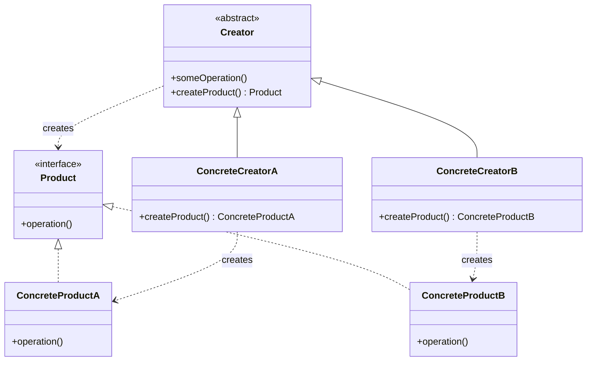

# Factory Method Pattern: Stop Letting Your Code Depend on Concrete Crap

The Factory Method pattern is your first step away from the `new` keyword being a cancer in your codebase. Every time you write `new SomeConcreteClass()`, you are tying your code to a specific implementation. The Factory Method provides a way to delegate this instantiation logic to subclasses, letting them decide which concrete class to create.

---

## 1. 🧩 What Problem Does This Solve?

The core problem is **decoupling**. You have a class (a "creator") that needs to create an object (a "product"), but you don't want the creator to be tightly coupled to the specific *type* of product it's creating. You want to be able to change or add new product types later without having to change the creator class.

**Real-world scenario:**
Imagine you're building a logistics application. You have a `ShippingManager` that needs to create a `Transport` object to deliver a package.

**The Naive (and coupled) Solution:**

```typescript
// The concrete products
class Truck {
  deliver(packageId: string) {
    console.log(`Delivering package ${packageId} by land in a truck.`);
  }
}
class Ship {
  deliver(packageId: string) {
    console.log(`Delivering package ${packageId} by sea in a ship.`);
  }
}

// The creator is tightly coupled to the concrete classes
class ShippingManager {
  planDelivery(packageId: string, method: 'land' | 'sea') {
    let transport;
    if (method === 'land') {
      transport = new Truck(); // <-- Concrete dependency
    } else if (method === 'sea') {
      transport = new Ship(); // <-- Concrete dependency
    }

    transport.deliver(packageId);
  }
}
```

What's the problem here? The `ShippingManager` is a mess.
1.  It's violating the **Open/Closed Principle**. If you want to add a new transport method, like `Air`, you have to go back and modify the `planDelivery` method.
2.  It's violating the **Single Responsibility Principle**. The `ShippingManager`'s job should be to *plan* deliveries, not to know the nitty-gritty details of how to construct every possible type of transport vehicle.

---

## 2. 🧠 Core Idea (No BS Version)

The Factory Method pattern solves this by defining a separate method (the "factory method") for creating the product. The base creator class knows *that* it needs a product, but it lets its subclasses decide *which specific* product to create.

1.  Define a common `interface` for all the products (`Transport`).
2.  Create concrete product classes (`Truck`, `Ship`) that implement this interface.
3.  Define an `abstract` creator class (`ShippingManager`) that contains the business logic. This class calls an `abstract` factory method to get a product object.
4.  Create concrete creator classes (`LandShippingManager`, `SeaShippingManager`) that extend the base creator and implement the factory method to return a specific product.

---

## 3. 🏗️ Structure Diagram (Mermaid REQUIRED)


The `Creator` class has a method `createProduct()` that is supposed to return a `Product`. The `ConcreteCreator` subclasses override this method to return specific kinds of products. The `Creator`'s other methods can then work with the `Product` interface without knowing its concrete type.

---

## 4. ⚙️ TypeScript Implementation

Let's refactor our logistics example to use the Factory Method pattern.

```typescript
// 1. The Product Interface
interface Transport {
  deliver(packageId: string): void;
}

// 2. The Concrete Products
class Truck implements Transport {
  deliver(packageId: string) {
    console.log(`Delivering package ${packageId} by land in a truck.`);
  }
}

class Ship implements Transport {
  deliver(packageId: string) {
    console.log(`Delivering package ${packageId} by sea in a ship.`);
  }
}

// 3. The Abstract Creator
abstract class ShippingManager {
  // This is the main business logic. It's decoupled from the concrete products.
  public planDelivery(packageId: string): void {
    // It calls the factory method to get a product...
    const transport = this.createTransport();
    // ...and then works with the product's interface.
    transport.deliver(packageId);
  }

  // The "Factory Method" itself. It's abstract, forcing subclasses to implement it.
  protected abstract createTransport(): Transport;
}

// 4. The Concrete Creators
class LandShippingManager extends ShippingManager {
  // This subclass decides which concrete product to create.
  protected createTransport(): Transport {
    return new Truck();
  }
}

class SeaShippingManager extends ShippingManager {
  protected createTransport(): Transport {
    return new Ship();
  }
}

// --- USAGE ---

function clientCode(manager: ShippingManager) {
  manager.planDelivery('pkg-123');
}

console.log('Client is working with LandShippingManager:');
clientCode(new LandShippingManager());
// Output: Delivering package pkg-123 by land in a truck.

console.log('\nClient is working with SeaShippingManager:');
clientCode(new SeaShippingManager());
// Output: Delivering package pkg-123 by sea in a ship.

// Now, let's add Air transport without touching the original code.
class Airplane implements Transport {
  deliver(packageId: string) {
    console.log(`Delivering package ${packageId} by air in an airplane.`);
  }
}

class AirShippingManager extends ShippingManager {
  protected createTransport(): Transport {
    return new Airplane();
  }
}

console.log('\nClient is working with AirShippingManager:');
clientCode(new AirShippingManager());
// Output: Delivering package pkg-123 by air in an airplane.
```
We added a whole new delivery method (`Airplane`) without touching the original `ShippingManager` or the client code. We just created a new `Transport` and a new `ShippingManager` subclass. This is the Open/Closed Principle in action.

---

## 5. 🔥 Real-World Example

**Backend (NestJS):** While NestJS's DI container handles a lot of object creation, you might use a Factory Method for creating dynamic providers. For example, you might have a `NotificationService` that can send notifications via email or SMS.

```typescript
// notification.providers.ts

// The factory provider
export const notificationServiceProvider = {
  provide: 'NotificationService',
  useFactory: (configService: ConfigService) => {
    const preferredMethod = configService.get('PREFERRED_NOTIFICATION_METHOD');
    if (preferredMethod === 'sms') {
      return new SmsService(); // Implements INotificationService
    } else {
      return new EmailService(); // Implements INotificationService
    }
  },
  inject: [ConfigService], // The factory depends on the config service
};
```
Here, `useFactory` is a factory method. It decides which concrete notification service to instantiate and provide based on the application's configuration. The rest of the application can then inject `'NotificationService'` without knowing or caring whether it's getting an `SmsService` or an `EmailService`.

---

## 6. ⚖️ When to Use

*   When a class can't anticipate the class of objects it must create.
*   When a class wants its subclasses to specify the objects it creates.
*   When you want to localize the logic for creating a product in one place, so you can easily change it later.

---

## 7. 🚫 When NOT to Use

*   When your object creation logic is simple and unlikely to change. A simple `new` is fine if you don't need the decoupling. Don't add a pattern just for the sake of it.
*   When you only have one concrete product type. The pattern is overkill and adds unnecessary complexity.

---

## 8. 💣 Common Mistakes

*   **Making it too complex.** The "classic" implementation with abstract classes and inheritance is just one way. Sometimes, a simple static factory method on a class is enough if you don't need the full polymorphic creator hierarchy.
*   **Confusing it with Abstract Factory.** The Factory Method is a single method for creating objects. The Abstract Factory is a whole object dedicated to creating families of related objects. We'll get to that next.

---

## 9. 🧠 Interview Notes

*   **How to explain it simply:** "It's a pattern where you defer the instantiation of a class to its subclasses. The parent class knows *that* it needs an object, but the child class decides *which specific* object to create. It's a way to replace `new` with a method call to decouple your code."
*   **Key benefit:** "It follows the Open/Closed Principle. You can introduce new types of products without modifying the creator class."

---

## 10. 🆚 Comparison With Similar Patterns

*   **Abstract Factory:** Factory Method uses inheritance (subclasses decide what to create). Abstract Factory uses composition (you pass a factory object in). Factory Method produces one type of product. Abstract Factory produces families of related products (e.g., a `MacOSFactory` that creates `MacButton` and `MacCheckbox`).
*   **Builder:** Factory Method is typically a single-step creation process. The Builder pattern is for multi-step, complex object construction. Think of a factory as an assembly line that spits out a finished product, while a builder is like a 3D printer that builds the product layer by layer.
*   **Singleton:** A Singleton ensures only one instance exists. A Factory Method can create many instances. They solve completely different problems. However, a Factory Method *could* be implemented to return a Singleton instance if needed.
