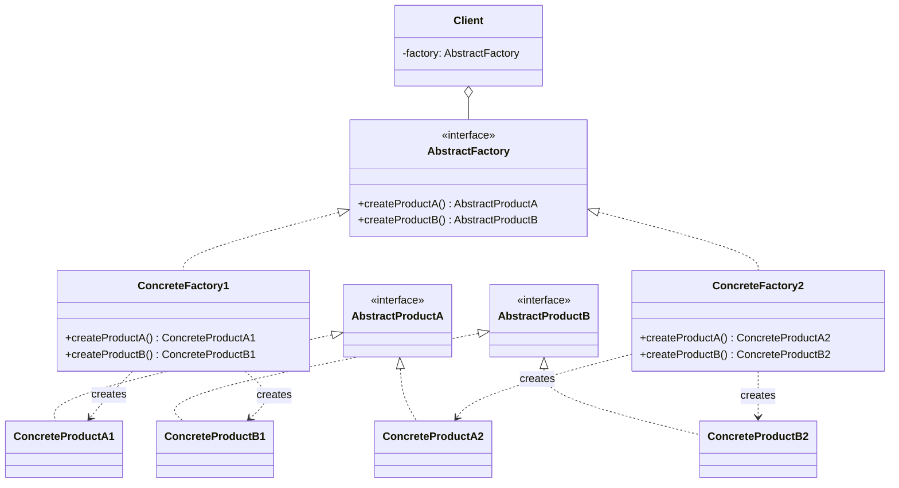

# Abstract Factory: The Factory of Factories

If the Factory Method is like a specialized machine on an assembly line that produces one specific part, the Abstract Factory is the entire factory floor plan. It's a pattern designed to create **families of related or dependent objects** without specifying their concrete classes.

It's a factory that creates other factories. Meta, right?

---

## 1. 🧩 What Problem Does This Solve?

You're building a user interface, and you want it to support multiple themes, like "Light Mode" and "Dark Mode". In each theme, all the UI elements—buttons, checkboxes, text inputs—need to match. A light mode button should be paired with a light mode checkbox. You should never mix a dark mode button with a light mode checkbox.

The problem is: how do you ensure that your application creates a consistent set of UI elements for a given theme, without scattering `if (theme === 'dark')` logic all over your codebase?

**The Naive (and terrible) Solution:**

```typescript
class UIBuilder {
  render(theme: 'light' | 'dark') {
    let button;
    let checkbox;

    if (theme === 'light') {
      button = new LightButton(); // Concrete dependency
      checkbox = new LightCheckbox(); // Concrete dependency
    } else if (theme === 'dark') {
      button = new DarkButton(); // Concrete dependency
      checkbox = new DarkCheckbox(); // Concrete dependency
    }

    button.paint();
    checkbox.paint();
  }
}
```

This is a maintenance nightmare.
1.  **Violation of Open/Closed Principle:** Adding a new theme like "Sepia Mode" requires modifying this `render` method.
2.  **Violation of Single Responsibility Principle:** The `UIBuilder` now has to know how to create every single UI element for every single theme.
3.  **Risk of Inconsistency:** A developer could accidentally write `button = new LightButton()` and `checkbox = new DarkCheckbox()` in the same block, creating a Frankenstein UI.

---

## 2. 🧠 Core Idea (No BS Version)

The Abstract Factory pattern solves this by creating an abstraction over the factory itself.

1.  Define an abstract factory **interface** (e.g., `UIFactory`) that lists creation methods for each product in the family (e.g., `createButton()`, `createCheckbox()`).
2.  Define interfaces for each product type (e.g., `Button`, `Checkbox`).
3.  Create families of concrete products that implement these interfaces (e.g., `LightButton` and `LightCheckbox`, `DarkButton` and `DarkCheckbox`).
4.  Create **concrete factory** classes that implement the abstract factory interface. Each concrete factory is responsible for creating products for one specific family (e.g., `LightThemeFactory` will only create `LightButton` and `LightCheckbox`).
5.  The client code works with the abstract factory and abstract product interfaces. It doesn't know (or care) which concrete factory it's using; it just knows that the factory will provide a consistent set of products.

---

## 3. 🏗️ Structure Diagram (Mermaid REQUIRED)


The `Client` depends on the `AbstractFactory` and the `AbstractProduct` interfaces. It gets a concrete factory injected and uses it to create a family of products without ever knowing their concrete types.

---

## 4. ⚙️ TypeScript Implementation

Let's build our UI theme example correctly.

```typescript
// 2. Abstract Product Interfaces
interface Button {
  paint(): void;
}
interface Checkbox {
  paint(): void;
}

// 3. Concrete Product Families

// Family 1: Light Theme
class LightButton implements Button {
  paint() {
    console.log('Painting a light-themed button.');
  }
}
class LightCheckbox implements Checkbox {
  paint() {
    console.log('Painting a light-themed checkbox.');
  }
}

// Family 2: Dark Theme
class DarkButton implements Button {
  paint() {
    console.log('Painting a dark-themed button.');
  }
}
class DarkCheckbox implements Checkbox {
  paint() {
    console.log('Painting a dark-themed checkbox.');
  }
}

// 1. The Abstract Factory Interface
interface UIFactory {
  createButton(): Button;
  createCheckbox(): Checkbox;
}

// 4. Concrete Factories
class LightThemeFactory implements UIFactory {
  createButton(): Button {
    return new LightButton();
  }
  createCheckbox(): Checkbox {
    return new LightCheckbox();
  }
}

class DarkThemeFactory implements UIFactory {
  createButton(): Button {
    return new DarkButton();
  }
  createCheckbox(): Checkbox {
    return new DarkCheckbox();
  }
}

// 5. The Client
class Application {
  private factory: UIFactory;
  private button: Button;

  constructor(factory: UIFactory) {
    this.factory = factory;
  }

  createUI() {
    console.log('Client: Creating UI elements...');
    this.button = this.factory.createButton();
    const checkbox = this.factory.createCheckbox(); // Guaranteed to be from the same family
    this.button.paint();
    checkbox.paint();
  }
}

// --- USAGE ---

function initializeApp(theme: 'light' | 'dark') {
  let factory: UIFactory;

  if (theme === 'dark') {
    factory = new DarkThemeFactory();
  } else {
    factory = new LightThemeFactory();
  }

  const app = new Application(factory);
  app.createUI();
}

console.log('Initializing with Light Theme:');
initializeApp('light');
// Output:
// Client: Creating UI elements...
// Painting a light-themed button.
// Painting a light-themed checkbox.

console.log('\nInitializing with Dark Theme:');
initializeApp('dark');
// Output:
// Client: Creating UI elements...
// Painting a dark-themed button.
// Painting a dark-themed checkbox.
```
The `Application` (client) has no idea what theme it's using. It just gets a factory and trusts it to produce a consistent set of components. If we want to add a "Sepia" theme, we just create `SepiaButton`, `SepiaCheckbox`, and `SepiaThemeFactory`, and the `Application` class remains untouched.

---

## 5. 🔥 Real-World Example

**Backend (Database Drivers):** This pattern is classic for database abstraction layers. Imagine you want your application to work with both PostgreSQL and MongoDB. These databases have completely different connection objects, query builders, and result set objects.

*   **Abstract Products:** `Connection`, `QueryBuilder`, `ResultSet` interfaces.
*   **Abstract Factory:** `DatabaseFactory` interface with `createConnection()`, `createQueryBuilder()`, etc.
*   **Concrete Factories:** `PostgresFactory` and `MongoDbFactory`.
*   **Concrete Products:** `PostgresConnection`, `MongoDbConnection`, etc.

Your application's data access layer would be given one of the concrete factories at startup and would then work entirely with the abstract interfaces, making your business logic database-agnostic.

---

## 6. ⚖️ When to Use

*   When your system needs to be independent of how its products are created, composed, and represented.
*   When you need to create **families of related objects** that are designed to be used together.
*   When you want to provide a class library of products, and you want to reveal just their interfaces, not their implementations.

---

## 7. 🚫 When NOT to Use

*   When you don't have families of related objects. If you're just creating one type of object, a **Factory Method** is simpler and more appropriate.
*   When the list of product types is not stable. If you're constantly adding new product types (e.g., a new UI element), you'll have to update the `AbstractFactory` interface and all its concrete subclasses. This can violate the Open/Closed principle for the factories themselves.

---

## 8. 💣 Common Mistakes

*   **Going too deep.** It's easy to get carried away and create factories of factories of factories. Keep it simple. One level of abstraction is usually enough.
*   **Confusing it with Factory Method.** This is the big one. Remember the key difference:
    *   **Factory Method** uses **inheritance** to let subclasses decide which class to instantiate. It's one method.
    *   **Abstract Factory** uses **composition** (the client holds an instance of a factory) to create families of objects. It's a whole object with multiple methods.

---

## 9. 🧠 Interview Notes

*   **How to explain it simply:** "It's a pattern for creating families of related objects without specifying their concrete classes. You define an interface for a factory, and then create concrete factories for each 'theme' or 'family'. The client code uses the factory to create objects, guaranteeing they are all from the same family."
*   **Key benefit:** "It ensures consistency. When you use a `DarkThemeFactory`, you're guaranteed to get a `DarkButton` and a `DarkCheckbox`, preventing you from mixing and matching components from different themes."

---

## 10. 🆚 Comparison With Similar Patterns

*   **Factory Method:** As discussed, Abstract Factory is a level of abstraction higher. You can think of an Abstract Factory as being composed of several Factory Methods.
*   **Builder:** An Abstract Factory creates objects immediately in a single call (e.g., `createButton()`). A Builder is for constructing a complex object step-by-step, with a final `build()` call to retrieve the result. Use Abstract Factory when you need a whole set of simple objects; use Builder when you need one highly complex, configurable object.
*   **Prototype:** Abstract Factory creates new objects from scratch via `new`. The Prototype pattern creates new objects by cloning an existing "prototype" object. If object creation is very expensive, you might have an Abstract Factory that returns cloned Prototypes instead of creating new objects each time.
