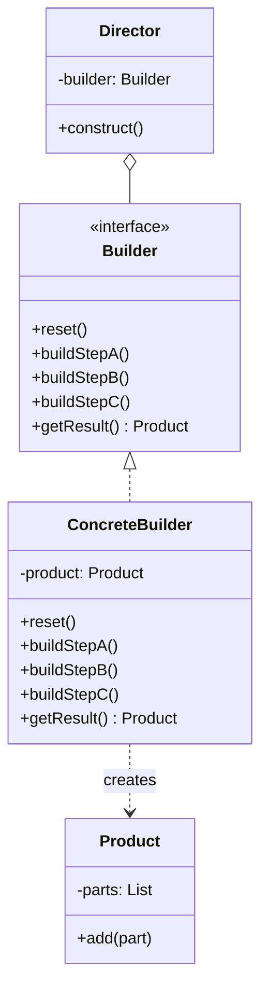

# Builder Pattern: Taming the Monster Constructor

You've seen it. The constructor with twelve arguments, half of which are `null` or `undefined` most of the time. It's a nightmare to call, impossible to read, and a breeding ground for bugs.

```typescript
// Don't do this. Ever.
const myThing = new Thing(
  'someId',
  'someName',
  null, // what was this again?
  true,
  false,
  'some-config-value',
  null,
  null,
  new Date(),
  undefined
);
```

The Builder pattern is a creational pattern designed to rescue you from this hell. It lets you construct complex objects step by step, using clear, fluent method calls. The final object is requested only when it's fully configured.

---

## 1. 🧩 What Problem Does This Solve?

The Builder pattern solves two main problems:

1.  **The Telescoping Constructor:** When you have an object with many optional parameters, you end up creating multiple constructor overloads, each taking a different set of parameters. This gets out of hand quickly and is ugly.
2.  **Immutability:** Often, you want to create an object whose state cannot be changed after it's been constructed. With a massive constructor, it's hard to enforce this. The Builder pattern allows you to build up the configuration and then create the final, immutable object in one go.

**Real-world scenario:**
You're building a query builder for a database. A query can have many parts: `SELECT` columns, a `FROM` table, multiple `WHERE` clauses, an `ORDER BY` clause, a `LIMIT`, and an `OFFSET`.

**The Naive (and impossible) Solution:**

```typescript
class Query {
  constructor(
    select: string[],
    from: string,
    where: string[],
    orderBy: string,
    limit: number,
    offset: number
  ) {
    // ...
  }
}

// How would you even call this for a simple query?
// new Query(['id', 'name'], 'users', ['age > 18'], null, null, null)
// This is terrible.
```

You need a way to construct the `Query` object piece by piece.

---

## 2. 🧠 Core Idea (No BS Version)

The Builder pattern separates the construction of a complex object from its representation.

1.  Create a `Builder` class or interface with a series of methods for configuring the parts of the object (e.g., `setTable()`, `addWhereClause()`).
2.  Each of these methods returns `this` (the builder instance itself), allowing you to chain the calls together fluently.
3.  The `Builder` has a final method, usually called `build()` or `getResult()`, that takes all the configured parts and creates the final, complex object (the "Product").
4.  The `Product`'s constructor is often made private or internal, forcing you to use the `Builder` to create it.

This separates the "how" (the step-by-step building process) from the "what" (the final object).

---

## 3. 🏗️ Structure Diagram (Mermaid REQUIRED)


*   **Product:** The complex object we want to create.
*   **Builder:** The interface that defines the steps to build the Product.
*   **ConcreteBuilder:** An implementation of the Builder that knows how to construct and assemble the parts of a specific Product. It keeps track of the representation it's building.
*   **Director (Optional):** A class that knows a specific sequence of building steps. It takes a builder and calls its methods in a certain order to create common configurations of the Product. This is useful for creating pre-canned object variations.

---

## 4. ⚙️ TypeScript Implementation

Let's implement our SQL query builder.

```typescript
// The "Product" - a complex object
class SQLQuery {
  public select: string[];
  public from: string;
  public where: string[];
  public orderBy: string | null = null;
  public limit: number | null = null;

  // The constructor is not public, forcing use of the builder
  constructor(builder: SQLQueryBuilder) {
    this.select = builder.select;
    this.from = builder.from;
    this.where = builder.where;
    this.orderBy = builder.orderBy;
    this.limit = builder.limit;
  }

  toString(): string {
    let query = `SELECT ${this.select.join(', ')} FROM ${this.from}`;
    if (this.where.length > 0) {
      query += ` WHERE ${this.where.join(' AND ')}`;
    }
    if (this.orderBy) {
      query += ` ORDER BY ${this.orderBy}`;
    }
    if (this.limit) {
      query += ` LIMIT ${this.limit}`;
    }
    return query + ';';
  }
}

// The "Builder"
class SQLQueryBuilder {
  // The builder holds the state needed for construction
  public select: string[];
  public from: string;
  public where: string[] = [];
  public orderBy: string | null = null;
  public limit: number | null = null;

  constructor(from: string, select: string[] = ['*']) {
    this.from = from;
    this.select = select;
  }

  // Configuration methods return `this` for chaining
  addWhere(clause: string): this {
    this.where.push(clause);
    return this;
  }

  setOrderBy(column: string): this {
    this.orderBy = column;
    return this;
  }

  setLimit(limit: number): this {
    this.limit = limit;
    return this;
  }

  // The final build method
  build(): SQLQuery {
    return new SQLQuery(this);
  }
}

// --- USAGE ---

const queryBuilder = new SQLQueryBuilder('users', ['name', 'email']);

const query = queryBuilder
  .addWhere('age > 18')
  .addWhere("status = 'active'")
  .setOrderBy('name')
  .setLimit(100)
  .build();

console.log(query.toString());
// Output: SELECT name, email FROM users WHERE age > 18 AND status = 'active' ORDER BY name LIMIT 100;

// We can reuse the builder to create a different query
const simpleQuery = new SQLQueryBuilder('products').build();
console.log(simpleQuery.toString());
// Output: SELECT * FROM products;
```

---

## 5. 🔥 Real-World Example

**Backend (NestJS):** The `Test` module in NestJS for e2e testing is a perfect example of the Builder pattern. You don't create a `TestModule` with a giant constructor. You build it step-by-step.

```typescript
// test.module.ts
import { Test, TestingModule } from '@nestjs/testing';
import { AppModule } from '../src/app.module';
import { SomeService } from '../src/some.service';

async function setup() {
  // `Test.createTestingModule(...)` returns a builder
  const moduleBuilder: TestingModuleBuilder = Test.createTestingModule({
    imports: [AppModule],
  });

  // You chain methods to configure the testing module
  const testingModule = await moduleBuilder
    .overrideProvider(SomeService) // .overrideProvider() is a builder step
    .useValue({ someMethod: () => 'mocked value' })
    .compile(); // .compile() is like the .build() method

  const app = testingModule.createNestApplication();
  await app.init();
}
```
Here, `Test.createTestingModule` gives you a builder. You then use methods like `.overrideProvider()` to configure it, and finally call `.compile()` to get the fully constructed `TestingModule` product.

---

## 6. ⚖️ When to Use

*   When you have a constructor with a large number of optional parameters.
*   When you need to create different representations of the same object (e.g., a simple query vs. a complex one).
*   When you want to create an immutable object, but its creation logic is too complex for a single constructor. The builder can accumulate the state, and the final `build()` method can create the immutable object.

---

## 7. 🚫 When NOT to Use

*   When the object is simple and has few parameters. A simple constructor is perfectly fine. Using a Builder here is over-engineering.
*   When all the parameters are required and there are no optional ones.

---

## 8. 💣 Common Mistakes

*   **Making the Product mutable.** A common mistake is to have the builder directly manipulate the product instance. The builder should configure itself, and only in the `build()` method should the final, often immutable, product be created.
*   **Confusing it with Factory.** A Factory is for creating different kinds of objects that share a common interface. A Builder is for creating one specific, but highly complex, kind of object. Factory is about *what* to create; Builder is about *how* to create it.

---

## 9. 🧠 Interview Notes

*   **How to explain it simply:** "It's a pattern that separates the construction of a complex object from its representation. You use a builder object with a fluent API to set up the configuration step-by-step, and then call a `build` method to get the final object. It's great for avoiding constructors with too many parameters."
*   **Key benefit:** "It makes your code much more readable and maintainable when creating complex objects. Instead of a long list of `null`s in a constructor, you have a clear, chainable set of method calls that describe exactly what you're building."

---

## 10. 🆚 Comparison With Similar Patterns

*   **Abstract Factory:** An Abstract Factory is used to create families of related *simple* objects (e.g., `createButton`, `createCheckbox`). A Builder is used to create a single *complex* object. You could, however, have an Abstract Factory that returns a Builder for a complex object.
*   **Factory Method:** A Factory Method is a single method that handles object creation in one shot. A Builder is a whole class dedicated to a multi-step creation process.
*   **Composite:** The Composite pattern is about treating a group of objects as a single object (a structural pattern). The Builder pattern is about constructing a single complex object (a creational pattern). They are unrelated.
