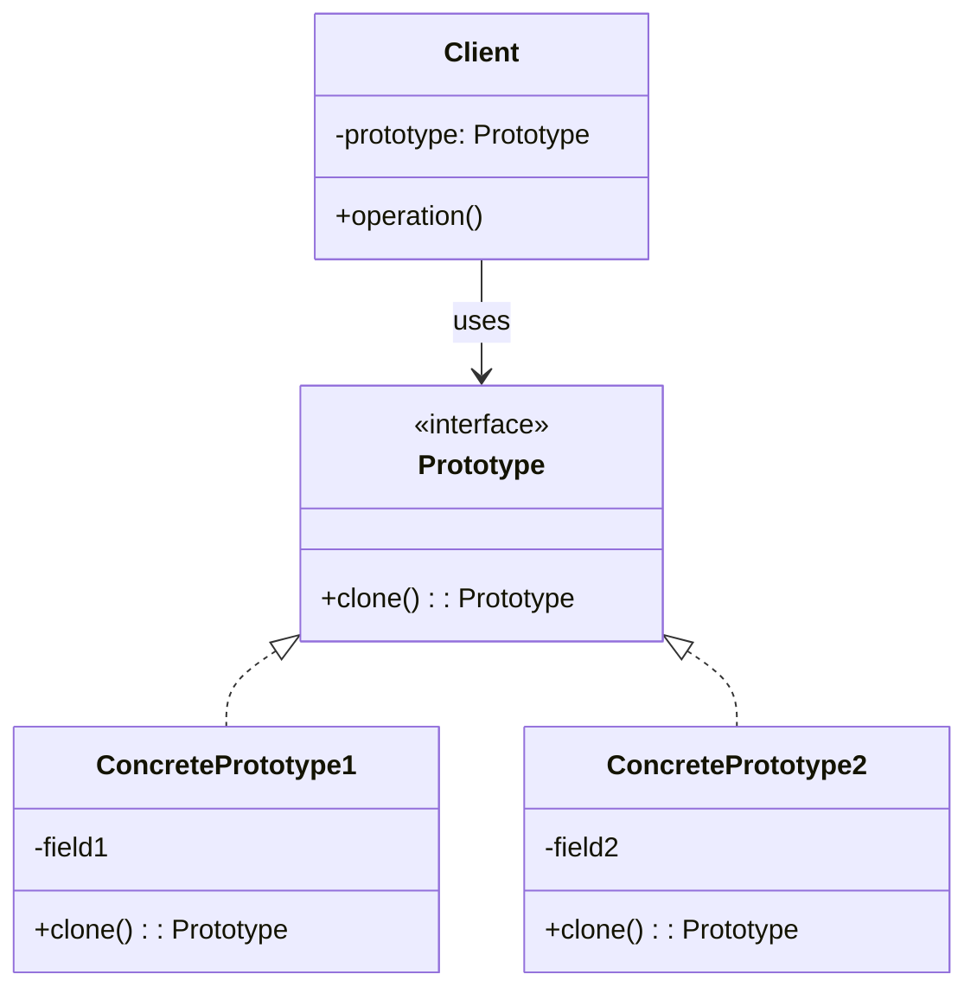

# Prototype Pattern: The Art of Cloning

The Prototype pattern is a creational pattern that lets you create new objects by copying an existing object, rather than creating one from scratch. Think of it as biological cloning for your code. Instead of going through a complex construction process every time, you just take a pre-built "prototype" and make a copy.

---

## 1. 🧩 What Problem Does This Solve?

Object creation can be expensive. It might involve database calls, network requests, or heavy computations. If you need to create many similar objects, performing this expensive setup process over and over is incredibly inefficient.

Furthermore, sometimes you don't know the exact class of the object you need to create at runtime. You just have an object, and you need another one just like it.

**Real-world scenario:**
Imagine you're building a video game. You have a complex `Enemy` object. Creating a new `Enemy` involves loading 3D models, textures, sound files, and setting up a complex AI behavior tree.

```typescript
class Enemy {
  constructor(level: number) {
    console.log(`Creating a level ${level} enemy...`);
    // 1. Load 3D model from disk (slow)
    // 2. Load texture files (slow)
    // 3. Load sound effects (slow)
    // 4. Initialize complex AI state machine (slow)
    console.log('Enemy created.');
  }
  // ... other methods
}
```

Now, you want to spawn a horde of 100 identical "Goblin" enemies. If you do `for (let i = 0; i < 100; i++) { new Enemy(5); }`, your game is going to freeze for several seconds while it loads the same assets 100 times.

You need a way to create the first Goblin, and then quickly stamp out 99 more copies.

---

## 2. 🧠 Core Idea (No BS Version)

The Prototype pattern's idea is simple: an object that can create a copy of itself.

1.  Create a common interface (e.g., `Cloneable`) that includes a `clone()` method.
2.  The object you want to copy (the "prototype") implements this interface.
3.  The `clone()` method is responsible for creating a new object that is a copy of the current one.
4.  The client code gets a pre-configured prototype object and calls `clone()` on it to get new, independent copies, bypassing the expensive constructor logic.

A key decision here is whether to perform a **shallow copy** or a **deep copy**.
*   **Shallow Copy:** Copies only the top-level properties. If a property is a reference to another object (like an array or another class instance), only the reference is copied, not the object itself. Both the original and the clone will point to the *same* underlying object. This is fast but dangerous.
*   **Deep Copy:** Recursively copies every level of the object. If a property is a reference to another object, that object is also cloned. This creates a completely independent copy but is slower.

Most of the time, you'll want a deep copy to avoid weird side effects.

---

## 3. 🏗️ Structure Diagram (Mermaid REQUIRED)


The `Client` isn't coupled to any `ConcretePrototype`. It just works with the `Prototype` interface. It can receive any prototype object and clone it to produce a new object, without knowing its specific class.

---

## 4. ⚙️ TypeScript Implementation

Let's solve our game enemy problem.

```typescript
// A complex object that's expensive to create
class AIBehavior {
  public behaviorTree: any;
  constructor() {
    // Imagine this is a very complex setup
    this.behaviorTree = { state: 'idle', target: null };
  }

  // For deep cloning, complex objects need their own clone method
  clone(): AIBehavior {
    const cloned = new AIBehavior();
    cloned.behaviorTree = JSON.parse(JSON.stringify(this.behaviorTree)); // Simple deep copy for demo
    return cloned;
  }
}

// 1. The Prototype Interface
interface ICloneable {
  clone(): this;
}

// 2. The Concrete Prototype
class Enemy implements ICloneable {
  public name: string;
  public model: string; // Represents a loaded 3D model
  public textures: string[]; // Represents loaded textures
  public ai: AIBehavior;

  // The constructor is expensive!
  constructor(name: string, modelPath: string, texturePaths: string[]) {
    console.log(`[CONSTRUCTOR] Loading assets for ${name}...`);
    this.name = name;
    this.model = `Loaded:${modelPath}`; // Simulate loading
    this.textures = texturePaths.map(p => `Loaded:${p}`); // Simulate loading
    this.ai = new AIBehavior();
    console.log(`[CONSTRUCTOR] Finished creating ${name}.`);
  }

  // 3. The clone method (implementing a deep copy)
  public clone(): this {
    console.log(`[CLONE] Cloning ${this.name}...`);
    // Create a new instance using a 'dummy' constructor call or by other means.
    // In a real scenario, you might have a private constructor for cloning.
    const cloned = Object.create(Object.getPrototypeOf(this));

    // Copy primitive properties
    cloned.name = this.name;
    cloned.model = this.model;
    cloned.textures = [...this.textures]; // Shallow copy is fine for array of strings

    // For complex object properties, call their clone method
    cloned.ai = this.ai.clone();

    console.log(`[CLONE] Finished cloning ${this.name}.`);
    return cloned;
  }
}

// --- USAGE ---

// A "Prototype Registry" to store our pre-configured enemies
class EnemyRegistry {
  private enemies: { [key: string]: Enemy } = {};

  add(key: string, enemy: Enemy) {
    this.enemies[key] = enemy;
  }

  get(key: string): Enemy | undefined {
    const prototype = this.enemies[key];
    return prototype ? prototype.clone() : undefined;
  }
}

// --- Game Initialization (runs once) ---
const registry = new EnemyRegistry();

// Create the prototypes once. This is the only time the expensive constructor runs.
const goblinPrototype = new Enemy('Goblin', 'models/goblin.obj', ['tex/goblin_skin.png']);
registry.add('goblin', goblinPrototype);

const skeletonPrototype = new Enemy('Skeleton', 'models/skeleton.obj', ['tex/bone.png']);
registry.add('skeleton', skeletonPrototype);

console.log('\n--- Spawning Enemies ---');

// Now, we can quickly create new enemies by cloning the prototypes.
const goblin1 = registry.get('goblin');
const goblin2 = registry.get('goblin');
const skeleton1 = registry.get('skeleton');

// Prove they are different instances with different AI states
if (goblin1 && goblin2 && goblin1 !== goblin2) {
  console.log('goblin1 and goblin2 are different instances.');
  goblin1.ai.behaviorTree.target = 'Player1';
  console.log('Goblin 1 AI:', goblin1.ai.behaviorTree);
  console.log('Goblin 2 AI:', goblin2.ai.behaviorTree); // Unchanged
}
```
**Output:**
```
[CONSTRUCTOR] Loading assets for Goblin...
[CONSTRUCTOR] Finished creating Goblin.
[CONSTRUCTOR] Loading assets for Skeleton...
[CONSTRUCTOR] Finished creating Skeleton.

--- Spawning Enemies ---
[CLONE] Cloning Goblin...
[CLONE] Finished cloning Goblin.
[CLONE] Cloning Goblin...
[CLONE] Finished cloning Goblin.
[CLONE] Cloning Skeleton...
[CLONE] Finished cloning Skeleton.
goblin1 and goblin2 are different instances.
Goblin 1 AI: { state: 'idle', target: 'Player1' }
Goblin 2 AI: { state: 'idle', target: null }
```
Notice the constructor was called only twice, but we created three new enemies via the fast `clone()` method.

---

## 5. 🔥 Real-World Example

**Frontend (UI Components):** Imagine a complex chart component in a dashboard. It has dozens of configuration options. A user might set up a specific chart (e.g., "Sales from Last 7 Days, Line Graph, Red Color") and then want to create a slight variation of it ("Sales from Last 30 Days..."). Instead of re-configuring a new chart from scratch, you could just `clone()` the existing one and then modify the one property that needs to change (the date range).

---

## 6. ⚖️ When to Use

*   When the cost of creating an object is more expensive or complex than the cost of cloning it.
*   When you want to avoid a proliferation of subclasses that only differ in how they initialize their objects. You can create a set of pre-configured prototypes instead.
*   When you want to create objects at runtime whose class you don't know beforehand.

---

## 7. 🚫 When NOT to Use

*   When your objects are simple and cheap to create. `new` is perfectly fine and easier to understand.
*   When your object's state is not easily cloneable (e.g., it holds onto network sockets, file handles, or other non-serializable resources).

---

## 8. 💣 Common Mistakes

*   **Shallow Copying by Accident:** This is the #1 mistake. A developer implements `clone()` but only does a shallow copy. Later, they modify a property on a cloned object and are shocked when the original prototype object also changes. Always be explicit about your copy strategy.
*   **Ignoring the Constructor:** The point of Prototype is often to *avoid* the constructor. The `clone` method should not be calling `new MyClass(...)` with all the expensive setup logic. It should be creating a new instance and copying state over as efficiently as possible.

---

## 9. 🧠 Interview Notes

*   **How to explain it simply:** "It's a pattern for creating new objects by copying an existing 'prototype' object, instead of creating them from scratch. It's useful when object creation is expensive. You create one master object, and then you can stamp out cheap copies of it."
*   **Key concept to mention:** "The most important decision is whether to use a shallow or deep copy. A deep copy is usually safer to avoid side effects, but it's more complex to implement."

---

## 10. 🆚 Comparison With Similar Patterns

*   **Factory Method / Abstract Factory:** Factories produce new objects from scratch, often based on some input. Prototypes produce new objects by copying an existing one. Factories don't require a prototype object to exist beforehand.
*   **Builder:** The Builder pattern is for constructing a complex object step-by-step from scratch. The Prototype pattern is for creating a copy of an already-constructed object in one step. They solve opposite problems: complex construction vs. bypassing construction.
*   **Singleton:** A Singleton guarantees only one instance. A Prototype is designed to create *many* instances from a single template.
