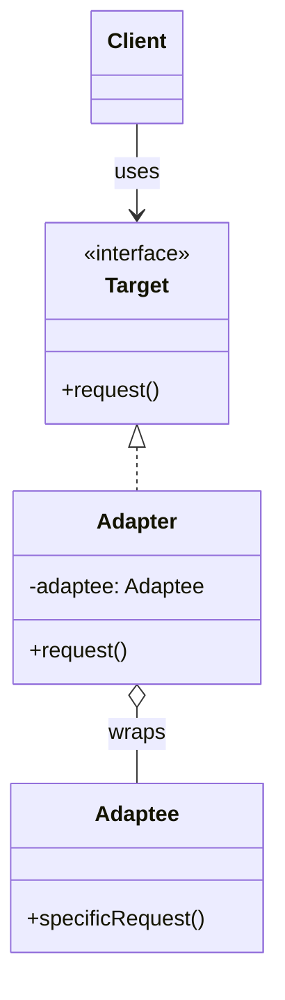

# Adapter Pattern: Making Things Fit

The Adapter pattern is like that universal power adapter you buy at the airport. You have a device with a European plug (your existing class), but the wall socket is American (the target interface you need to work with). The adapter doesn't change your device or the wall; it just sits in the middle, translating from one to the other so they can work together.

It's a structural pattern that allows objects with incompatible interfaces to collaborate.

---

## 1. 🧩 What Problem Does This Solve?

You have a piece of code (a client) that expects to work with a specific interface. But the object you want to use has a different interface. You can't (or don't want to) change the client code or the object you need to use.

**Real-world scenario:**
Your application uses a `Logger` interface that has a `.log(message)` and `.error(message)` method. It's used everywhere.

```typescript
interface AppLogger {
  log(message: string): void;
  error(message: string): void;
}
```

Now, your boss tells you to integrate a fancy new third-party logging library, `SuperLogger`. The problem? `SuperLogger` has a completely different API.

```typescript
// The incompatible 3rd-party class
class SuperLogger {
  public sendLog(level: 'INFO' | 'WARN' | 'CRITICAL', text: string, timestamp: Date): void {
    // ... sends log to a remote server
    console.log(`[SuperLogger]: ${timestamp.toISOString()} [${level}] - ${text}`);
  }
}
```

You can't just replace your `AppLogger` with `SuperLogger`. The method names are wrong, the parameters are different, and your entire application would break. You also can't change the `SuperLogger` class because it's from a vendor.

---

## 2. 🧠 Core Idea (No BS Version)

You create a new class, the `Adapter`, that "wraps" the incompatible object (the `Adaptee`). This `Adapter` class implements the interface your client code expects (the `Target`).

When the client calls a method on the `Adapter`, the adapter translates that call into one or more calls to the wrapped `Adaptee` object.

1.  **Client:** The existing code that is coupled to the `Target` interface.
2.  **Target:** The interface the `Client` expects to work with.
3.  **Adaptee:** The existing class with the incompatible interface that we want to use.
4.  **Adapter:** The class that implements the `Target` interface and holds a reference to the `Adaptee`. It does the translation work.

---

## 3. 🏗️ Structure Diagram (Mermaid REQUIRED)


The `Client` makes a call to `request()` on an object that implements the `Target` interface. The `Adapter` implements this interface. When its `request()` method is called, it turns around and calls `specificRequest()` on the `Adaptee` it's holding.

---

## 4. ⚙️ TypeScript Implementation

Let's build the adapter for our `SuperLogger`.

```typescript
// The "Target" interface our application uses
interface AppLogger {
  log(message: string): void;
  error(message: string): void;
}

// A simple logger that implements our interface (the original implementation)
class ConsoleLogger implements AppLogger {
  log(message: string) {
    console.log(`[ConsoleLogger]: ${message}`);
  }
  error(message: string) {
    console.error(`[ConsoleLogger ERROR]: ${message}`);
  }
}

// The "Adaptee" - the incompatible 3rd-party class
class SuperLogger {
  public sendLog(level: 'INFO' | 'WARN' | 'CRITICAL', text: string, timestamp: Date): void {
    console.log(`[SuperLogger]: ${timestamp.toISOString()} [${level}] - ${text}`);
  }
}

// The "Adapter" class
class SuperLoggerAdapter implements AppLogger {
  // It holds a reference to the adaptee
  private adaptee: SuperLogger;

  constructor() {
    this.adaptee = new SuperLogger();
  }

  // It implements the target interface and translates the calls
  public log(message: string): void {
    // Translate AppLogger.log() to SuperLogger.sendLog()
    this.adaptee.sendLog('INFO', message, new Date());
  }

  public error(message: string): void {
    // Translate AppLogger.error() to SuperLogger.sendLog()
    this.adaptee.sendLog('CRITICAL', message, new Date());
  }
}

// --- USAGE ---

// The client code only knows about the AppLogger interface
function runApplication(logger: AppLogger) {
  logger.log('Application has started.');
  // ... some logic
  logger.error('Something went terribly wrong!');
}

console.log('--- Using the original ConsoleLogger ---');
const consoleLogger = new ConsoleLogger();
runApplication(consoleLogger);

console.log('\n--- Using the new SuperLogger via the Adapter ---');
const adapter = new SuperLoggerAdapter();
runApplication(adapter); // The client code doesn't change at all!
```
Our `runApplication` function works with both the old and new loggers without any modification. We've successfully integrated the new library without a painful, application-wide refactor.

---

## 5. 🔥 Real-World Example

**Backend (API Aggregation):** This pattern is extremely common in backend systems, especially in a microservices architecture. Imagine you have a `UserService` that needs to get user data. It might get the user's profile from your own database, their payment history from the Stripe API, and their support tickets from the Zendesk API.

The Stripe and Zendesk APIs are `Adaptees` with incompatible interfaces. You would create a `StripeAdapter` and a `ZendeskAdapter` that both implement a common internal interface like `UserDataProvider`. Your `UserService` can then talk to these adapters in a uniform way, without needing to know the specific details of the Stripe or Zendesk SDKs.

---

## 6. ⚖️ When to Use

*   When you want to use an existing class, but its interface does not match the rest of your code.
*   When you want to create a reusable class that cooperates with unrelated or unforeseen classes that don't necessarily have compatible interfaces.
*   When you're working with a third-party library and you can't modify its source code.

---

## 7. 🚫 When NOT to Use

*   When you can just change the interface of the class you want to use. If you have control over the source code, sometimes a simple refactor is easier than introducing a new class (the adapter).
*   When the adaptation logic is trivial. If it's just one method name change, creating a whole new class might be overkill.

---

## 8. 💣 Common Mistakes

*   **Creating a "Fat Adapter":** Trying to adapt too much functionality in one adapter. If the adaptee is a huge class, you don't need to adapt every single one of its methods. Only adapt the ones your client actually needs (Interface Segregation Principle).
*   **Adding new functionality:** An adapter's job is to **translate**, not to add new business logic. If you find yourself adding a bunch of new logic inside the adapter, you might need a different pattern, like the Decorator.

---

## 9. 🧠 Interview Notes

*   **How to explain it simply:** "It's a wrapper that makes one class's interface compatible with another. You use it when you have code that expects a certain interface, but the class you want to use has a different one. The adapter sits in the middle and translates the calls."
*   **Real-world analogy:** "A USB-C to HDMI adapter. Your laptop (client) has a USB-C port (target interface), but your monitor (adaptee) has an HDMI port (incompatible interface). The adapter makes them work together."

---

## 10. 🆚 Comparison With Similar Patterns

*   **Decorator:** An Adapter **changes** an object's interface. A Decorator **enhances** an object's functionality but keeps the same interface. You wrap an object with a decorator to add new behaviors (like adding logging or caching). You wrap an object with an adapter to make it look like something else.
*   **Facade:** A Facade provides a **simpler** interface to a complex subsystem. It's about hiding complexity. An Adapter provides a **different** interface to a single object. It's about converting an interface. A facade might wrap many objects; an adapter usually wraps one.
*   **Proxy:** A Proxy has the **same** interface as the object it wraps. It's used to control access to the object (e.g., for lazy loading, caching, or security). An Adapter has a **different** interface from the object it wraps.
*   **Bridge:** Bridge is a more complex pattern designed up-front to decouple an abstraction from its implementation so they can vary independently. Adapter is a "retro-fit" pattern used to make existing, unrelated classes work together.
