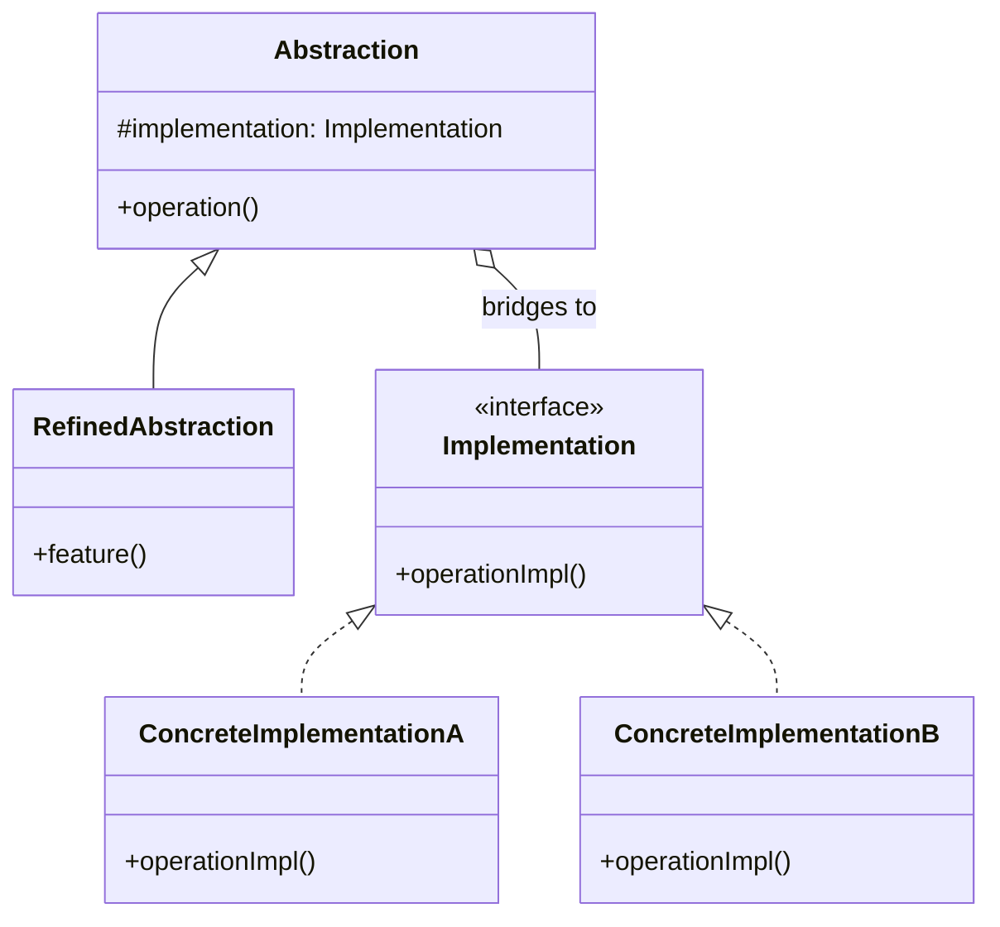

# Bridge Pattern: The Decoupling Powerhouse

The Bridge pattern is one of the more complex structural patterns, but it's incredibly powerful. Its main goal is to **"decouple an abstraction from its implementation so that the two can vary independently."**

That sounds super academic. Let's translate.

Imagine you have a shape, like a `Circle`. That's an "abstraction." Now, imagine how you might draw that circle: using the Windows API, the Mac API, or maybe rendering it to SVG for the web. Those are "implementations."

The Bridge pattern lets you write the `Circle` class without it knowing *anything* about how it's going to be drawn. You can add new shapes (like `Square`) and new drawing methods (like `OpenGL`) without them ever needing to know about each other.

---

## 1. 🧩 What Problem Does This Solve?

You have two independent dimensions of variation in your system, and you want to avoid a "Cartesian product" explosion of classes.

**Real-world scenario:**
You're building a remote control application. You have different types of remotes: a `BasicRemote` and an `AdvancedRemote` (with mute and channel memory). You also have different types of devices to control: a `TV` and a `Radio`.

**The Naive (and explosive) Solution using Inheritance:**

You'd create a class for every possible combination.

```
Remote
├── BasicRemote
│   ├── BasicTVRemote
│   └── BasicRadioRemote
└── AdvancedRemote
    ├── AdvancedTVRemote
    └── AdvancedRadioRemote
```

This is a nightmare.
*   **Class Explosion:** You have `2 x 2 = 4` classes. If you add a new remote type (`SmartRemote`) and a new device type (`StereoSystem`), you now need `3 x 3 = 9` classes. The number of classes grows exponentially.
*   **Code Duplication:** The logic for "mute" in `AdvancedTVRemote` is probably identical to the logic in `AdvancedRadioRemote`. You're duplicating code all over the place.
*   **Rigidity:** If you want to change how the `AdvancedRemote` works, you have to update multiple classes.

---

## 2. 🧠 Core Idea (No BS Version)

The Bridge pattern splits this monolithic hierarchy into two separate ones: one for the "abstraction" (the remotes) and one for the "implementation" (the devices).

1.  The **Abstraction** (`Remote`) contains the high-level control logic (like `togglePower`, `volumeUp`). It doesn't do the work itself.
2.  The **Implementation** (`Device`) is an interface that defines the low-level operations (like `setVolume`, `setChannel`).
3.  The Abstraction holds a **reference** to an object that implements the Implementation interface. This is the "bridge."
4.  When a method on the Abstraction is called (e.g., `remote.volumeUp()`), it delegates the actual work to the Implementation object it's holding (e.g., `device.setVolume(...)`).

Now, you can have `BasicRemote` and `AdvancedRemote` in one hierarchy, and `TV` and `Radio` in a completely separate one. You can then "link" any remote with any device at runtime.

---

## 3. 🏗️ Structure Diagram (Mermaid REQUIRED)


*   **Abstraction:** The high-level control layer (e.g., `Remote`).
*   **RefinedAbstraction:** A subclass of the abstraction that adds more features (e.g., `AdvancedRemote`).
*   **Implementation:** The interface for the low-level platform-specific work (e.g., `Device`).
*   **ConcreteImplementation:** The actual platform-specific classes (e.g., `Tv`, `Radio`).

The key is the `o--` relationship. The `Abstraction` has a reference to an `Implementation`. That's the bridge.

---

## 4. ⚙️ TypeScript Implementation

Let's build our remote control example correctly.

```typescript
// --- The "Implementation" Hierarchy ---

// 1. The Implementation Interface
interface Device {
  isEnabled(): boolean;
  enable(): void;
  disable(): void;
  getVolume(): number;
  setVolume(percent: number): void;
  getChannel(): number;
  setChannel(channel: number): void;
}

// 2. Concrete Implementations
class Tv implements Device {
  private on = false;
  private volume = 30;
  private channel = 1;

  isEnabled = () => this.on;
  enable = () => { this.on = true; console.log('TV enabled'); };
  disable = () => { this.on = false; console.log('TV disabled'); };
  getVolume = () => this.volume;
  setVolume = (percent: number) => { this.volume = percent; console.log(`TV volume set to ${percent}%`); };
  getChannel = () => this.channel;
  setChannel = (channel: number) => { this.channel = channel; console.log(`TV channel set to ${channel}`); };
}

class Radio implements Device {
  private on = false;
  private volume = 10;
  private channel = 99.5; // FM frequency

  isEnabled = () => this.on;
  enable = () => { this.on = true; console.log('Radio enabled'); };
  disable = () => { this.on = false; console.log('Radio disabled'); };
  getVolume = () => this.volume;
  setVolume = (percent: number) => { this.volume = percent; console.log(`Radio volume set to ${percent}%`); };
  getChannel = () => this.channel;
  setChannel = (channel: number) => { this.channel = channel; console.log(`Radio frequency set to ${channel} FM`); };
}


// --- The "Abstraction" Hierarchy ---

// 3. The Base Abstraction
class Remote {
  // The "Bridge" - a reference to a device
  protected device: Device;

  constructor(device: Device) {
    this.device = device;
  }

  togglePower() {
    if (this.device.isEnabled()) {
      this.device.disable();
    } else {
      this.device.enable();
    }
  }

  volumeUp() {
    const oldVolume = this.device.getVolume();
    this.device.setVolume(oldVolume + 10);
  }

  volumeDown() {
    const oldVolume = this.device.getVolume();
    this.device.setVolume(oldVolume - 10);
  }
}

// 4. A Refined Abstraction
class AdvancedRemote extends Remote {
  mute() {
    this.device.setVolume(0);
    console.log('Device muted.');
  }
}

// --- USAGE ---

const tv = new Tv();
const basicRemoteForTv = new Remote(tv);

console.log('--- Using Basic Remote with TV ---');
basicRemoteForTv.togglePower();
basicRemoteForTv.volumeUp();
console.log(`Current TV Volume: ${tv.getVolume()}`);

const radio = new Radio();
const advancedRemoteForRadio = new AdvancedRemote(radio);

console.log('\n--- Using Advanced Remote with Radio ---');
advancedRemoteForRadio.togglePower();
advancedRemoteForRadio.volumeDown();
advancedRemoteForRadio.mute();
console.log(`Current Radio Volume: ${radio.getVolume()}`);
```
We now have only 4 classes (`Remote`, `AdvancedRemote`, `Tv`, `Radio`) instead of an explosion. We can combine any remote with any device. If we add a `StereoSystem` device, we don't need to touch the remote classes at all. If we add a `SmartRemote`, we don't need to touch the device classes. They can **vary independently**.

---

## 5. 🔥 Real-World Example

**Cross-platform UI Frameworks:** This is a classic use case. You might have a hierarchy of UI elements (`Window`, `Button`, `Checkbox`) as your "Abstractions". Then you have an "Implementation" hierarchy for different operating systems (`WindowsDrawer`, `MacDrawer`, `LinuxDrawer`). Your `Button` class would hold a reference to a `Drawer` implementation. When you call `button.draw()`, it delegates to `drawer.drawButton()`. This way, your UI element logic is completely separate from the platform-specific drawing code.

---

## 6. ⚖️ When to Use

*   When you want to divide and organize a monolithic class that has several variants of some functionality (e.g., `BasicTVRemote`, `AdvancedTVRemote`).
*   When you need to be able to switch implementations at runtime. You could have a `remote.setDevice(newRadio)` method.
*   When you want to avoid a permanent binding between an abstraction and its implementation.
*   When both the abstractions and their implementations can have their own, independent subclass hierarchies.

---

## 7. 🚫 When NOT to Use

*   When you only have one fixed implementation. If your `Remote` will only ever work with a `TV`, the pattern is massive overkill. A simple, tightly-coupled class is fine.
*   When your problem domain is simple and you don't foresee the two dimensions of variation. Don't apply this pattern "just in case". It adds significant complexity.

---

## 8. 💣 Common Mistakes

*   **Confusing it with Adapter:** This is easy to do. Both involve separating interfaces.
    *   **Adapter** is a "retro-fit" pattern. It's used to make two *existing, incompatible* things work together. It's usually applied after the fact.
    *   **Bridge** is an "up-front" design pattern. You design your system this way from the start to prevent the problem in the first place.
*   **Making the Bridge too "fat":** The `Implementation` interface should be as minimal as possible. It should only contain the primitive operations needed by the `Abstraction`. Don't cram high-level concepts into the implementation.

---

## 9. 🧠 Interview Notes

*   **How to explain it simply:** "It's a pattern for splitting a large class or a set of related classes into two separate hierarchies—abstraction and implementation—so they can be developed independently. The abstraction holds a reference to an implementation, forming a 'bridge' between the two."
*   **Key benefit:** "It helps you avoid a 'class explosion'. Instead of creating a class for every combination of feature and platform, you manage the two hierarchies separately. It's an application of the 'favor composition over inheritance' principle."

---

## 10. 🆚 Comparison With Similar Patterns

*   **Adapter:** As mentioned, Adapter is about making existing things work together. Bridge is about designing things to be decoupled from the start.
*   **State:** The State pattern looks similar because you have a main object that delegates to a "state" object. However, in the State pattern, the goal is to change the main object's behavior when its *internal state* changes. The object itself might switch which state object it's pointing to. In the Bridge pattern, the implementation is usually fixed (or changed by the client) and doesn't change on its own.
*   **Abstract Factory:** An Abstract Factory can be used to *create* the concrete implementation that a Bridge will use. For example, you could have a `GUIFactory` that creates a `WindowsDrawer` or `MacDrawer`, and you would then pass that drawer object into the constructor of your `Button` (the abstraction).
