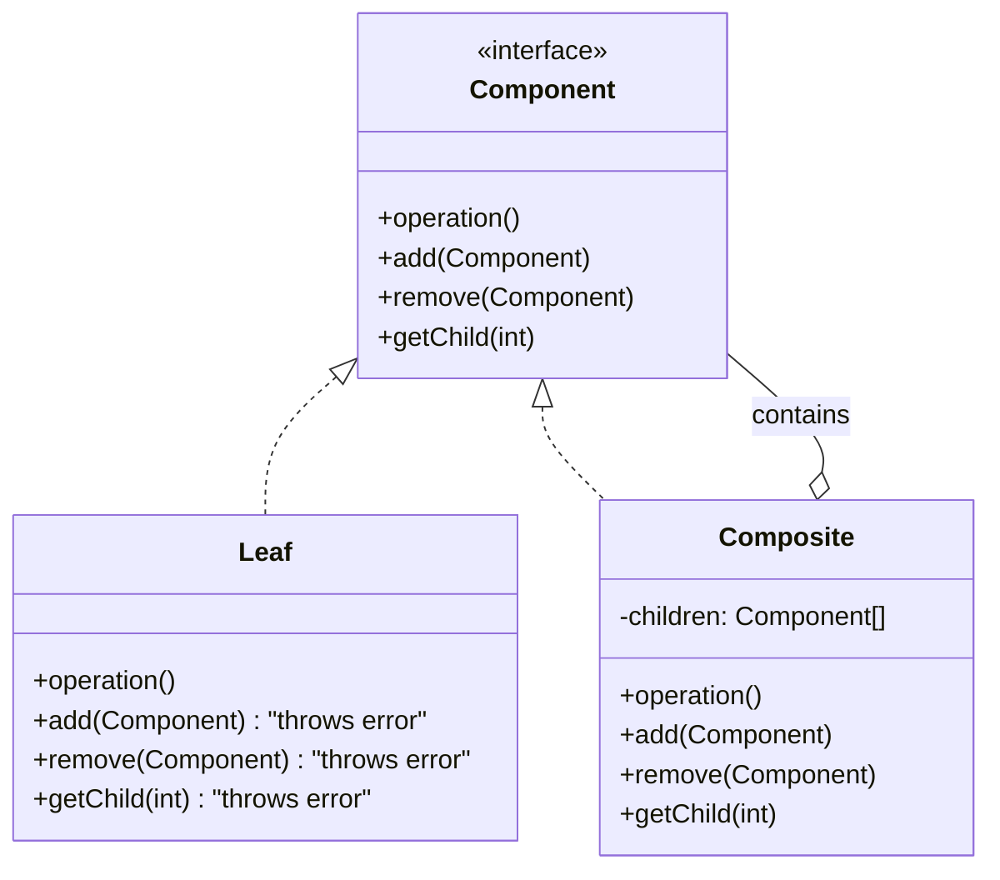

# Composite Pattern: The Art of Tree Structures

The Composite pattern is a structural pattern that lets you compose objects into **tree structures** and then work with these structures as if they were individual objects.

In simple terms, it allows you to treat a *group* of objects in the same way as a *single* object. This is incredibly useful for dealing with nested or hierarchical data.

---

## 1. 🧩 What Problem Does This Solve?

You're building a system that needs to represent a part-whole hierarchy. For example, a file system with folders and files, a GUI with panels containing buttons and other panels, or an organization chart with managers and employees.

You want to be able to run an operation on the entire hierarchy without having to write complex, recursive code that manually checks if an item is a single object or a container of other objects.

**Real-world scenario:**
Imagine you're building a graphics editor. You can draw simple shapes like `Circle` and `Square`. You can also group these shapes together to form a more complex `Picture`.

Now, you want to write a `draw()` function that can render anything on the screen.

**The Naive (and annoying) Solution:**

```typescript
class Circle { draw() { /* ... */ } }
class Square { draw() { /* ... */ } }

class Picture {
  private shapes: (Circle | Square | Picture)[]; // Messy array of mixed types

  draw() {
    for (const shape of this.shapes) {
      // This is the problem! We have to check the type of each item.
      if (shape instanceof Circle) {
        shape.draw();
      } else if (shape instanceof Square) {
        shape.draw();
      } else if (shape instanceof Picture) {
        shape.draw(); // And it's recursive!
      }
    }
  }
}
```

This code is brittle and complex.
*   **Violates Open/Closed Principle:** If you add a new shape, like `Triangle`, you have to go back and modify the `draw` method of the `Picture` class.
*   **Complex Client Code:** The client has to know the difference between a simple shape and a composite picture. It can't treat them uniformly.

---

## 2. 🧠 Core Idea (No BS Version)

The Composite pattern solves this by creating a common interface for both the individual objects ("leaves") and the container objects ("composites").

1.  Define a **Component** interface that is shared by all objects in the composition. It declares the common operations (e.g., `draw()`, `getPrice()`).
2.  Create **Leaf** classes, which are the individual, indivisible objects in the hierarchy (e.g., `Circle`, `File`, `Employee`). They implement the Component interface.
3.  Create **Composite** classes, which are the container objects (e.g., `Picture`, `Folder`, `Manager`). They also implement the Component interface.
4.  A Composite holds a collection of other Components (which can be either Leaves or other Composites).
5.  When an operation is called on a Composite, it iterates over its children and calls the same operation on them, delegating the work down the tree.

The magic is that the client code only needs to know about the Component interface. It can call `draw()` on a single `Circle` or on a `Picture` containing hundreds of shapes, and it doesn't have to care which is which.

---

## 3. 🏗️ Structure Diagram (Mermaid REQUIRED)


*   **Component:** The unified interface for both leaves and composites.
*   **Leaf:** The primitive object. It has no children, so methods like `add` and `remove` typically do nothing or throw an error.
*   **Composite:** The container object. It implements the child-management methods and its `operation` method usually calls `operation()` on all its children.

---

## 4. ⚙️ TypeScript Implementation

Let's model a simple file system structure.

```typescript
// 1. The Component Interface
interface FileSystemComponent {
  getName(): string;
  getSize(): number; // Common operation
}

// 2. The Leaf Class
class File implements FileSystemComponent {
  private name: string;
  private size: number;

  constructor(name: string, size: number) {
    this.name = name;
    this.size = size;
  }

  getName(): string {
    return this.name;
  }

  getSize(): number {
    console.log(`Calculating size of file: ${this.name}`);
    return this.size;
  }
}

// 3. The Composite Class
class Folder implements FileSystemComponent {
  private name: string;
  private children: FileSystemComponent[] = [];

  constructor(name: string) {
    this.name = name;
  }

  getName(): string {
    return this.name;
  }

  add(component: FileSystemComponent): void {
    this.children.push(component);
  }

  // The magic is here. The composite's operation delegates to its children.
  getSize(): number {
    console.log(`Calculating size of folder: ${this.name}`);
    let totalSize = 0;
    for (const child of this.children) {
      totalSize += child.getSize(); // Recursively call getSize()
    }
    return totalSize;
  }
}

// --- USAGE ---

// Create the leaf objects
const file1 = new File('image.jpg', 100);
const file2 = new File('document.pdf', 250);
const file3 = new File('archive.zip', 500);

// Create the composite objects (folders)
const root = new Folder('root');
const pictures = new Folder('pictures');
const documents = new Folder('documents');

// Build the tree structure
pictures.add(file1);
documents.add(file2);

root.add(pictures);
root.add(documents);
root.add(file3); // A file can be directly in the root folder

// The client code doesn't care if it's a file or a folder.
// It just calls getSize() on the top-level component.
console.log('\nCalculating total size of the root directory...');
const totalSize = root.getSize();

console.log(`\nTotal size of root directory: ${totalSize} KB`);
// Expected output: 100 + 250 + 500 = 850
```
The client code is beautifully simple. It just interacts with the `root` folder and calls `getSize()`. It doesn't need any `if/else` blocks or type checking to traverse the tree.

---

## 5. 🔥 Real-World Example

**Frontend (React/Vue/Angular Components):** This is the bread and butter of modern frontend frameworks. A component-based UI is a perfect example of the Composite pattern.
*   **Component:** The base `React.Component` or the concept of a component.
*   **Leaf:** A simple component with no children, like `<button>`, ``, or `<input>`.
*   **Composite:** A component that contains other components, like a `<form>`, a `<Card>`, or your main `<App>` component.

When you call `render()` on your top-level `<App>` component, React recursively calls `render()` on all its children, which in turn call `render()` on their children, until the entire UI tree is rendered. You, the developer, don't manage this recursion; you just declare the tree structure.

---

## 6. ⚖️ When to Use

*   When you need to represent a part-whole hierarchy of objects.
*   When you want clients to be able to treat individual objects and compositions of objects uniformly.
*   Any time you have a tree-like structure and need to perform operations on the whole tree.

---

## 7. 🚫 When NOT to Use

*   When your hierarchy is simple and not really a tree (e.g., it only ever has one level of nesting).
*   When you want the client to be able to distinguish between leaves and composites. The whole point of the pattern is to hide this difference. If you need to know the difference, the pattern might be adding unnecessary complexity.

---

## 8. 💣 Common Mistakes

*   **Fat Component Interface:** A classic debate is whether child-management methods like `add()` and `remove()` should be in the main `Component` interface.
    *   **"Safe" approach:** Put them only in the `Composite` class. This is safer because a `Leaf` can't have children, but it means the client has to check the type before trying to add a child.
    *   **"Transparent" approach:** Put them in the `Component` interface (as in the diagram above). This is more transparent because the client can treat everything as a composite, but it means you have to implement `add()` in the `Leaf` class, usually by throwing an error. The implementation above is a hybrid; the interface is implicit.
*   **Complex Parent References:** Sometimes a child needs a reference back to its parent. This can complicate the tree structure, especially when removing nodes, and can lead to memory leaks if not handled carefully.

---

## 9. 🧠 Interview Notes

*   **How to explain it simply:** "It's a pattern for building tree structures of objects. It lets you treat a single object and a group of objects the same way. You have a common interface, a 'leaf' for individual items, and a 'composite' for containers. When you call an operation on the composite, it just passes the call down to all its children."
*   **Key benefit:** "It simplifies the client code. The client doesn't need to write complex recursive logic to traverse the tree; it just talks to the top-level object."

---

## 10. 🆚 Comparison With Similar Patterns

*   **Decorator:** A Decorator adds responsibilities to an object, but it's focused on wrapping a single object, not composing a tree. A decorator typically has only one child, whereas a composite has many.
*   **Flyweight:** The Flyweight pattern is about sharing objects to save memory, which is a different concern. You could, however, use Flyweights as the `Leaf` nodes in a Composite tree.
*   **Iterator:** An Iterator provides a standard way to traverse a collection. A Composite is a type of collection, and you could implement an Iterator to traverse a Composite tree (e.g., a depth-first or breadth-first iterator).
