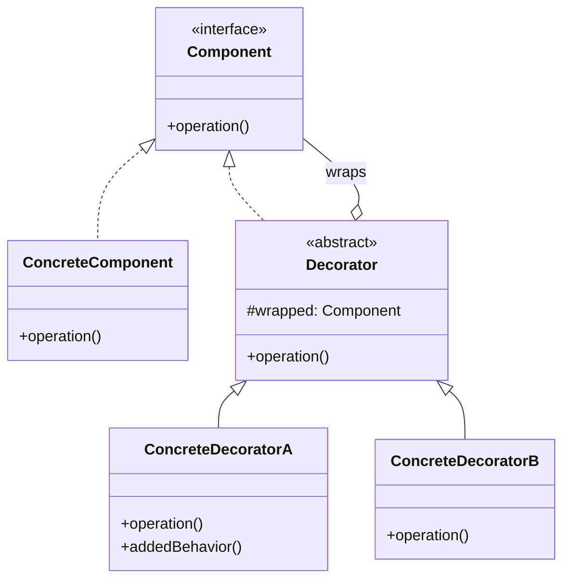

# Decorator Pattern: The Onion of OOP

The Decorator pattern is a structural pattern that lets you **attach new behaviors to objects dynamically** by placing these objects inside special wrapper objects that contain the behaviors.

Think of it like putting on clothes. You start with a base person (the object). You can then "decorate" that person with a shirt, then a jacket, then a scarf. Each piece of clothing adds a new feature or behavior without changing the person underneath. You can also add or remove them at runtime.

It's an alternative to subclassing for extending functionality. Instead of an `is-a` relationship, it uses a `has-a` relationship.

---

## 1. 🧩 What Problem Does This Solve?

You want to add extra responsibilities to an object, but you don't want to use inheritance for several reasons:
1.  **Inheritance is static:** You can't change an object's class at runtime. If you have a `FileStream`, you can't magically turn it into a `CompressedFileStream` after it's been created.
2.  **Class explosion:** If you have multiple features you want to add, you'd need to create a subclass for every possible combination. If you have `Compression` and `Encryption` features for your `FileStream`, you'd need `CompressedStream`, `EncryptedStream`, and `CompressedAndEncryptedStream`. This is unmanageable.

**Real-world scenario:**
You have a simple `Notifier` service that sends a message.

```typescript
interface Notifier {
  send(message: string): void;
}

class EmailNotifier implements Notifier {
  send(message: string) {
    console.log(`Sending email: "${message}"`);
  }
}
```

Now, you need to add more features. You want to be able to send notifications via SMS and Slack as well. You also want to be able to log every notification that is sent.

**The Naive (Subclassing Hell) Solution:**

```
Notifier
├── EmailNotifier
│   ├── SMSEmailNotifier
│   ├── SlackEmailNotifier
│   └── LoggedEmailNotifier
└── SMSNotifier
    ├── ... (and so on)
```
This is a disaster. You're creating a new class for every combination of features.

---

## 2. 🧠 Core Idea (No BS Version)

The Decorator pattern solves this by wrapping objects in other objects.

1.  Define a common **Component** interface that both the original object and the wrappers will follow.
2.  Create a concrete **Component** class, which is the base object you want to decorate.
3.  Create a base **Decorator** class. This class also implements the Component interface. Its key feature is that it **wraps** another Component object (it has a `has-a` relationship). It delegates all its work to the wrapped component.
4.  Create **Concrete Decorators** that extend the base Decorator. These are the "clothes." They override the methods of the component and add their own behavior **before or after** delegating the call to the parent decorator (and eventually, the original object).

Because the decorators and the original object all share the same interface, you can stack them on top of each other like layers of an onion.

---

## 3. 🏗️ Structure Diagram (Mermaid REQUIRED)


The `Decorator` both *is-a* `Component` (it implements the interface) and *has-a* `Component` (it wraps one). This is the key to the pattern. When `operation()` is called on a decorator, it adds its own logic and then calls `operation()` on the `wrapped` component.

---

## 4. ⚙️ TypeScript Implementation

Let's build our notification system correctly.

```typescript
// 1. The Component Interface
interface Notifier {
  send(message: string): void;
}

// 2. The Concrete Component
class EmailNotifier implements Notifier {
  send(message: string) {
    console.log(`Sending email with message: "${message}"`);
  }
}

// 3. The Base Decorator
abstract class BaseNotifierDecorator implements Notifier {
  // It wraps another Notifier
  protected wrappedNotifier: Notifier;

  constructor(notifier: Notifier) {
    this.wrappedNotifier = notifier;
  }

  // It delegates the call to the wrapped notifier.
  // Subclasses will override this to add behavior.
  send(message: string): void {
    this.wrappedNotifier.send(message);
  }
}

// 4. Concrete Decorators
class SMSNotifierDecorator extends BaseNotifierDecorator {
  send(message: string): void {
    // 1. Delegate to the wrapped component first
    super.send(message);
    // 2. Add its own behavior
    console.log(`Sending SMS with message: "${message}"`);
  }
}

class SlackNotifierDecorator extends BaseNotifierDecorator {
  send(message: string): void {
    super.send(message);
    console.log(`Sending Slack message: "${message}"`);
  }
}

class LoggingNotifierDecorator extends BaseNotifierDecorator {
  send(message: string): void {
    // 1. Add behavior *before* delegating
    console.log('[LOG] Preparing to send notification...');
    // 2. Delegate
    super.send(message);
    // 3. Add behavior *after* delegating
    console.log('[LOG] Notification sent.');
  }
}

// --- USAGE ---

// Start with a base notifier
const emailNotifier = new EmailNotifier();

console.log('--- Sending a simple email ---');
emailNotifier.send('Hello World!');

console.log('\n--- Sending email + SMS ---');
// Wrap the email notifier in an SMS decorator
const emailAndSms = new SMSNotifierDecorator(emailNotifier);
emailAndSms.send('Your order has shipped!');

console.log('\n--- Sending email + SMS + Slack, with logging ---');
// You can stack decorators like an onion
const allChannelsWithLogging = new LoggingNotifierDecorator(
  new SlackNotifierDecorator(
    new SMSNotifierDecorator(
      new EmailNotifier()
    )
  )
);
allChannelsWithLogging.send('Server is down!');
```
Look how flexible that is! We can mix and match responsibilities at runtime without creating a single new class for each combination.

---

## 5. 🔥 Real-World Example

**Backend (Middleware in Web Frameworks):** Middleware in frameworks like Express or NestJS is a perfect example of the Decorator pattern.
Your core request handler is the `ConcreteComponent`. Each piece of middleware (for logging, authentication, compression, CORS) is a `Decorator`.

```javascript
// Express.js example
const app = express();

// The request object is passed through a series of decorators (middleware)
app.use(cors()); // CORS decorator
app.use(compression()); // Compression decorator
app.use(morgan('dev')); // Logging decorator

// Finally, it reaches the concrete component (your route handler)
app.get('/', (req, res) => {
  res.send('Hello World!');
});
```
Each middleware function receives the request, adds some behavior, and then passes it down the chain to the next component.

---

## 6. ⚖️ When to Use

*   When you need to be able to assign extra behaviors to objects at runtime without breaking the code that uses these objects.
*   When it's impractical to use subclassing because you'd have a massive number of independent extensions.
*   When a class’s responsibilities can be withdrawn.

---

## 7. 🚫 When NOT to Use

*   When you just need to add a small number of static, permanent responsibilities. Subclassing might be simpler in that case.
*   When you need to change an object's interface. That's a job for the **Adapter** pattern. Decorator preserves the interface.

---

## 8. 💣 Common Mistakes

*   **Forgetting to delegate:** A decorator *must* call the method on its wrapped component. If it doesn't, it's not decorating; it's completely replacing the functionality, which breaks the chain.
*   **Creating a "fat" component interface:** If the main component interface has dozens of methods, your decorators will also have to implement or delegate all of them, which can be tedious. This is a sign your interface might be violating the Interface Segregation Principle.
*   **Order of decoration matters:** Wrapping A in B is not the same as wrapping B in A. In our example, if the `LoggingNotifierDecorator` was on the inside, it would only log the email, not the SMS or Slack messages. This can be a source of subtle bugs.

---

## 9. 🧠 Interview Notes

*   **How to explain it simply:** "It's a pattern for wrapping an object to add new functionality. The wrapper has the same interface as the object it wraps, so you can stack them. It's a flexible alternative to subclassing for adding responsibilities."
*   **Key benefit:** "It follows the Open/Closed Principle. You can add new decorators to introduce new features without modifying existing code. It also allows you to add and remove functionality at runtime."

---

## 10. 🆚 Comparison With Similar Patterns

*   **Adapter:** Decorator changes an object's responsibilities but not its interface. Adapter changes an object's interface but not its responsibilities.
*   **Composite:** Composite is about treating a *group* of objects as one. Decorator is about adding responsibilities to *one* object. They can be used together: you could decorate a whole Composite tree to apply a behavior to every object in the tree.
*   **Proxy:** A Proxy has the same interface as its object, just like a Decorator. However, a Proxy's purpose is to *control access* to an object (for lazy loading, security, etc.), not to add new behavior. A Decorator's purpose is to *add responsibilities*. Also, a Proxy usually manages its own lifecycle, whereas a Decorator's wrapper is composed by the client.
