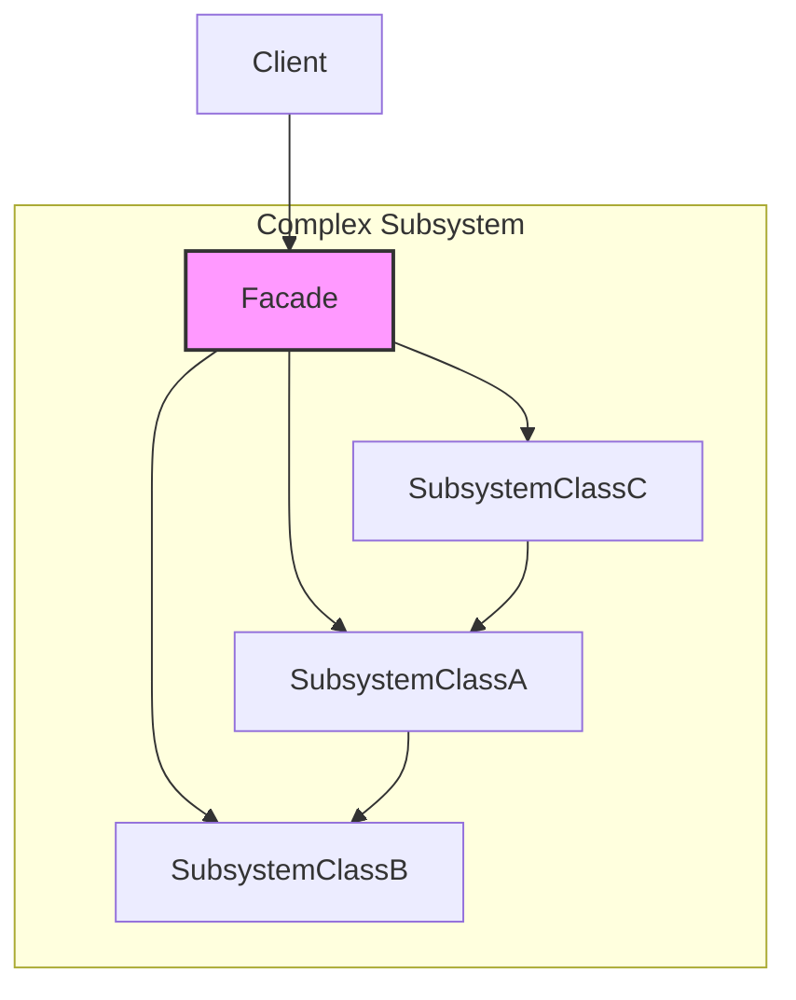

# Facade Pattern: The Simple Front

The Facade pattern is a structural pattern that provides a **simplified, higher-level interface** to a larger body of code, such as a complex subsystem or a library.

Think of it like the front desk of a fancy hotel. As a guest, you don't want to know how to book a room, arrange for housekeeping, call a taxi, and make a dinner reservation yourself. You just talk to the concierge (the Facade). You say, "I need a room and a taxi at 8 pm," and the concierge handles all the complex interactions with the hotel's various subsystems (booking, transport, etc.) for you.

The Facade doesn't add any new functionality; it just provides a more convenient, simpler entry point to the existing functionality.

---

## 1. 🧩 What Problem Does This Solve?

Modern applications are complex. They often involve interacting with multiple intricate subsystems, third-party libraries, or a spaghetti-like legacy codebase.

The problem is that you don't want your business logic to be tightly coupled to all this complexity. If your `OrderService` has to know how to interact with the `InventorySystem`, the `PaymentGateway`, the `ShippingProvider`, and the `NotificationService` directly, it will become a bloated, unmaintainable mess.

**Real-world scenario:**
You're building a video conversion service. The underlying library you're using is powerful but incredibly complex.

```typescript
// The complex, low-level library
class VideoFile { /* ... */ }
class OggCompressionCodec { /* ... */ }
class MPEG4CompressionCodec { /* ... */ }
class CodecFactory { /* ... */ }
class BitrateReader { /* ... */ }
class AudioMixer { /* ... */ }

// To convert a video, you have to do all this:
function convertVideo_UGLY(filename: string, format: 'mp4' | 'ogg'): File {
  const file = new VideoFile(filename);
  const sourceCodec = new CodecFactory().extract(file);
  let destinationCodec;
  if (format === 'mp4') {
    destinationCodec = new MPEG4CompressionCodec();
  } else {
    destinationCodec = new OggCompressionCodec();
  }
  const buffer = BitrateReader.read(filename, sourceCodec);
  let result = BitrateReader.convert(buffer, destinationCodec);
  result = new AudioMixer().fix(result);
  return new File(result);
}
```
This is a nightmare. Your client code has to know about a dozen different classes and the exact sequence of operations. If the library ever changes, you have to update this logic everywhere it's used.

---

## 2. 🧠 Core Idea (No BS Version)

The Facade pattern introduces a new class that acts as a simple "front" for the complex subsystem.

1.  Create a `Facade` class.
2.  The Facade holds references to all the various parts of the complex subsystem it needs to operate.
3.  The Facade provides a small number of simple, high-level methods that are easy for a client to use (e.g., `convertVideo(filename, format)`).
4.  When a client calls a method on the Facade, the Facade orchestrates the calls to the underlying subsystem objects to get the job done.

The client code now only talks to the Facade, completely decoupling it from the messy details.

---

## 3. 🏗️ Structure Diagram (Mermaid REQUIRED)


The `Client` only has one dependency: the `Facade`. The `Facade` acts as a buffer, hiding the tangled web of dependencies within the `Complex Subsystem`. The client is completely ignorant of `SubsystemClassA`, `B`, and `C`.

---

## 4. ⚙️ TypeScript Implementation

Let's create a Facade for our video conversion library.

```typescript
// --- The Complex Subsystem (imagine these are complex classes) ---
class VideoFile { constructor(public name: string) {} }
class CodecFactory { extract = (file: VideoFile) => 'ogg'; }
class MPEG4CompressionCodec { type = 'mp4'; }
class OggCompressionCodec { type = 'ogg'; }
class BitrateReader {
  static read = (filename: string, codec: string) => `[${filename}]-data`;
  static convert = (buffer: string, codec: any) => `[${buffer}]-converted-to-${codec.type}`;
}
class AudioMixer { fix = (result: string) => `[${result}]-audio-fixed`; }
// --- End of Complex Subsystem ---


// 1. The Facade Class
class VideoConverterFacade {
  // 2. The Facade knows about the subsystem parts
  private codecFactory = new CodecFactory();
  private audioMixer = new AudioMixer();

  // 3. It provides a simple, high-level method
  public convertVideo(filename: string, format: 'mp4' | 'ogg'): string {
    console.log('--- VideoConverterFacade: Starting conversion... ---');

    const file = new VideoFile(filename);
    const sourceCodec = this.codecFactory.extract(file);

    let destinationCodec;
    if (format === 'mp4') {
      destinationCodec = new MPEG4CompressionCodec();
    } else {
      destinationCodec = new OggCompressionCodec();
    }

    const buffer = BitrateReader.read(filename, sourceCodec);
    let result = BitrateReader.convert(buffer, destinationCodec);
    result = this.audioMixer.fix(result);

    console.log('--- VideoConverterFacade: Conversion finished. ---');
    return `${filename}-converted.${format}`;
  }
}

// --- USAGE ---

// The client code is now beautifully simple.
function runMyApplication() {
  const converter = new VideoConverterFacade();
  const mp4Video = converter.convertVideo('my-cat-video.mov', 'mp4');
  console.log(`Created video: ${mp4Video}`);
}

runMyApplication();
```
The client code is now clean, readable, and completely decoupled from the complex library. If we decide to switch to a different video processing library, we only have to update the `VideoConverterFacade`. The rest of our application remains untouched.

---

## 5. 🔥 Real-World Example

**Backend (Service Layer):** The Facade pattern is the essence of a well-designed service layer in a backend application.
Your `OrderService` is a Facade. Its `placeOrder` method might:
1.  Call the `ProductRepository` to check stock.
2.  Call the `PaymentGateway` to process the payment.
3.  Call the `OrderRepository` to save the order to the database.
4.  Call the `ShippingService` to schedule a delivery.
5.  Call the `EmailService` to send a confirmation.

Your `OrderController` (the client) doesn't know about any of those other services. It just calls `orderService.placeOrder()` and trusts the Facade to handle the complex orchestration.

---

## 6. ⚖️ When to Use

*   When you want to provide a simple interface to a complex subsystem.
*   When you want to decouple your client code from a messy or unstable subsystem or library.
*   When you want to structure a subsystem into layers. You can use a Facade to define an entry point to each layer.

---

## 7. 🚫 When NOT to Use

*   When the subsystem is already simple. Don't add a Facade just for the sake of it.
*   **Important:** The Facade should not block access to the underlying subsystem. A client that needs more fine-grained control should still be able to bypass the Facade and interact with the low-level classes directly if needed. If you want to *force* clients to go through your class, you might be looking for a Proxy or a different pattern.

---

## 8. 💣 Common Mistakes

*   **The Facade becomes a God Object:** A Facade can be tempted to do too much, accumulating more and more business logic until it becomes a bloated monolith itself. A Facade's job is to **orchestrate**, not to contain business logic.
*   **Coupling the Client to the Facade's return types:** If the Facade's methods return raw objects from the underlying subsystem, you haven't fully decoupled the client. It's often better for the Facade to return simple, primitive types or Data Transfer Objects (DTOs) that it owns.

---

## 9. 🧠 Interview Notes

*   **How to explain it simply:** "It's a simple, clean entry point to a complex system. You create a wrapper class that hides all the messy details of a library or subsystem behind a few easy-to-use methods. The client only talks to the facade, not the complex stuff behind it."
*   **Key benefit:** "It decouples your application from the implementation details of its dependencies. This makes your code easier to understand, use, and refactor. If you need to swap out a complex library, you only have to change the facade, not your entire application."

---

## 10. 🆚 Comparison With Similar Patterns

*   **Adapter:** An Adapter's goal is to **change an interface** to make it compatible with something else. A Facade's goal is to **simplify an interface**. An Adapter wraps a single object; a Facade typically wraps a whole system of objects.
*   **Abstract Factory:** An Abstract Factory is for creating families of related objects. A Facade is for simplifying access to existing objects. They solve different problems, but a Facade might *use* an Abstract Factory behind the scenes to create the objects it needs.
*   **Mediator:** A Mediator is about managing communication *between* a set of colleague objects so they don't have to talk to each other directly. A Facade is about providing a one-way, simplified view *into* a system for an external client.
