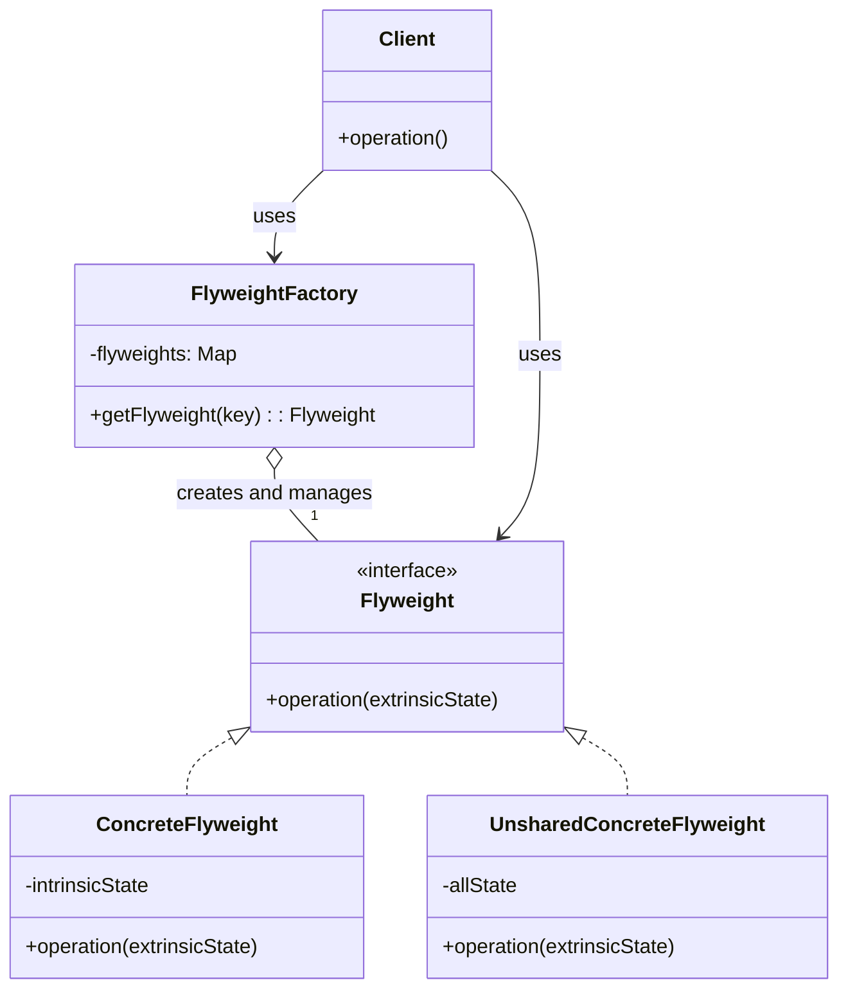

# Flyweight Pattern: The Memory Saver

The Flyweight pattern is a structural pattern focused on **performance and memory optimization**. It's all about sharing as much data as possible between similar objects to minimize memory usage.

The core idea is to split an object's state into two parts:
1.  **Intrinsic State:** The data that is shared, immutable, and context-independent. This is the "flyweight" part.
2.  **Extrinsic State:** The data that is unique, mutable, and context-dependent. This is passed in by the client.

Think of it like rendering text in a document. Every character 'A' on the screen has the same font, size, and glyph shape (intrinsic state). But each 'A' has a different position (x, y coordinates) on the page (extrinsic state). Instead of storing the font and glyph data for every single 'A', you create one 'A' flyweight object and reuse it, simply telling it *where* to draw itself each time.

---

## 1. 🧩 What Problem Does This Solve?

You need to create a huge number of objects, but they are all very similar and have a lot of overlapping state. Creating a full-blown object for each one would consume an enormous amount of RAM, potentially crashing your application.

**Real-world scenario:**
You're building a game, like a real-time strategy (RTS) game. You need to render a forest with thousands of trees on the screen. Each tree has a 3D model (mesh), a texture, and a color. These are large, memory-intensive assets.

**The Naive (and memory-hogging) Solution:**

```typescript
class Tree {
  // Each tree object holds its own copy of the mesh and texture!
  private mesh: number[]; // Represents a huge vertex array
  private texture: number[]; // Represents a huge pixel array
  private color: string;

  // Extrinsic state
  private x: number;
  private y: number;

  constructor(x: number, y: number, mesh: number[], texture: number[], color: string) {
    this.x = x;
    this.y = y;
    this.mesh = mesh;
    this.texture = texture;
    this.color = color;
  }

  draw() {
    // ... render this tree at (x, y)
  }
}

// If you have 10,000 oak trees, you're storing the same oak mesh and texture 10,000 times.
// This will eat all your RAM.
```

The problem is that the `mesh`, `texture`, and `color` are the same for all "Oak" trees. This is the intrinsic state that should be shared. The `x` and `y` coordinates are unique to each tree. This is the extrinsic state.

---

## 2. 🧠 Core Idea (No BS Version)

The Flyweight pattern extracts the intrinsic state into a separate "flyweight" object. The application then creates only a few of these flyweight objects, one for each variation (e.g., one for "Oak Tree", one for "Pine Tree").

1.  Split the `Tree` class into two.
    *   `TreeType` (The Flyweight): This class contains the intrinsic, shared state (`mesh`, `texture`, `color`).
    *   `Tree` (The Context): This class contains the extrinsic, unique state (`x`, `y`) and holds a *reference* to a `TreeType` flyweight object.
2.  Create a `TreeFactory` (or Flyweight Factory). This factory is responsible for creating and managing the flyweight objects.
3.  When a client requests a tree, it asks the factory for a `TreeType` with a certain mesh and texture.
    *   If the factory has already created a flyweight with that configuration, it returns the existing one.
    *   If not, it creates a new one, stores it in a cache, and then returns it.
4.  The client then creates a `Tree` (context) object, passing in the unique state (`x`, `y`) and the shared `TreeType` flyweight it got from the factory.

---

## 3. 🏗️ Structure Diagram (Mermaid REQUIRED)


*   **Flyweight:** The interface for the shared objects. It has a method that accepts the extrinsic state.
*   **ConcreteFlyweight:** The implementation that stores the intrinsic state.
*   **FlyweightFactory:** Manages a pool of flyweights and ensures they are shared.
*   **Client:** Calculates or stores the extrinsic state and passes it to the flyweight's methods.

---

## 4. ⚙️ TypeScript Implementation

Let's fix our forest rendering system.

```typescript
// 1. The Flyweight Class
// This contains the intrinsic (shared) state.
class TreeType {
  public readonly name: string;
  public readonly color: string;
  public readonly texture: string; // In real life, this would be a large binary object

  constructor(name: string, color: string, texture: string) {
    this.name = name;
    this.color = color;
    this.texture = texture;
  }

  // The operation method accepts the extrinsic state.
  public draw(canvas: any, x: number, y: number): void {
    console.log(`Drawing a ${this.name} tree at (${x}, ${y}) with color ${this.color}.`);
  }
}

// 2. The Flyweight Factory
class TreeFactory {
  private static treeTypes: Map<string, TreeType> = new Map();

  public static getTreeType(name: string, color: string, texture: string): TreeType {
    const key = `${name}-${color}-${texture}`;
    if (!this.treeTypes.has(key)) {
      console.log(`Factory: Creating a new flyweight for key: ${key}`);
      const newType = new TreeType(name, color, texture);
      this.treeTypes.set(key, newType);
    } else {
      console.log(`Factory: Reusing existing flyweight for key: ${key}`);
    }
    return this.treeTypes.get(key)!;
  }
}

// 3. The Context Class
// This contains the extrinsic (unique) state.
class Tree {
  private x: number;
  private y: number;
  private type: TreeType; // Reference to the shared flyweight

  constructor(x: number, y: number, type: TreeType) {
    this.x = x;
    this.y = y;
    this.type = type;
  }

  public draw(canvas: any): void {
    // Delegate the drawing to the flyweight, passing the extrinsic state.
    this.type.draw(canvas, this.x, this.y);
  }
}

// 4. The Client
class Forest {
  private trees: Tree[] = [];

  public plantTree(x: number, y: number, name: string, color: string, texture: string): void {
    const type = TreeFactory.getTreeType(name, color, texture);
    const tree = new Tree(x, y, type);
    this.trees.push(tree);
  }

  public draw(canvas: any): void {
    for (const tree of this.trees) {
      tree.draw(canvas);
    }
  }
}

// --- USAGE ---
const forest = new Forest();
const canvas = {}; // Mock canvas

console.log('--- Planting thousands of trees ---');
// Plant 5,000 oak trees
for (let i = 0; i < 5000; i++) {
  forest.plantTree(Math.random() * 500, Math.random() * 500, 'Oak', 'Green', 'oak_texture.png');
}
// Plant 5,000 pine trees
for (let i = 0; i < 5000; i++) {
  forest.plantTree(Math.random() * 500, Math.random() * 500, 'Pine', 'DarkGreen', 'pine_texture.png');
}

console.log('\n--- Drawing the forest ---');
// forest.draw(canvas); // This would draw all 10,000 trees

// The output will show that the factory only created TWO flyweight objects,
// one for Oak and one for Pine. These two objects are shared among all 10,000 Tree instances.
// This saves an enormous amount of memory.
```

---

## 5. 🔥 Real-World Example

**Text Editors / Word Processors:** As mentioned, rendering characters is a perfect use case. The character itself ('A', 'B', etc.) along with its font, size, and style is the flyweight. Its position in the document is the extrinsic state. This is how modern editors can handle millions of characters without using gigabytes of RAM.

**Object-Relational Mappers (ORMs):** Some ORMs use a form of the Flyweight pattern called an "Identity Map". When you fetch a user with ID `123` from the database, the ORM creates a `User` object. If you later ask for the user with ID `123` again in the same session, the ORM returns the *exact same* `User` object instance from its cache, ensuring data consistency and saving memory.

---

## 6. ⚖️ When to Use

*   When your application needs to support a huge number of objects.
*   When the objects have a lot of duplicated state that can be extracted and shared.
*   When the identity of each object doesn't matter. The client doesn't care if it gets the same `TreeType` object back every time; it only cares about the final rendered tree.

---

## 7. 🚫 When NOT to Use

*   When you don't have a large number of objects. The complexity of the pattern isn't worth it for a few dozen or hundred objects.
*   When the objects don't have much shared state. If every object is truly unique, there's nothing to share.
*   When the object's identity is important.

---

## 8. 💣 Common Mistakes

*   **Making the Flyweight mutable:** The intrinsic state in the flyweight object *must* be immutable. If one client could change the color of the "Oak" `TreeType` from green to red, all 5,000 oak trees in the forest would suddenly turn red. This would be a catastrophic side effect.
*   **Premature optimization:** This is a performance pattern. Don't apply it unless you have a demonstrated memory problem. Profile your application first. The added complexity is only justified by a real performance gain.

---

## 9. 🧠 Interview Notes

*   **How to explain it simply:** "It's a memory optimization pattern. You use it when you have a huge number of similar objects. You split the object's state into two parts: the shared part (intrinsic) and the unique part (extrinsic). You create a few 'flyweight' objects to hold the shared state, and then reuse them across all your objects, saving a ton of memory."
*   **Key benefit:** "It dramatically reduces the memory footprint of an application that needs to manage a large number of objects."

---

## 10. 🆚 Comparison With Similar Patterns

*   **Singleton:** A Singleton guarantees only one instance of a class, period. A Flyweight Factory guarantees that for each *key* (or configuration), there is only one instance. You can have multiple different flyweight instances (one for 'Oak', one for 'Pine').
*   **Composite:** You can use Flyweights to implement the leaf nodes of a Composite tree. For example, in a text editor, each character could be a flyweight leaf in the document composite structure.
*   **Instance Pooling (Object Pool Pattern):** An object pool is about reusing a limited number of objects to avoid the cost of creation and destruction (e.g., a database connection pool). The objects in a pool are not necessarily identical and can have different states. Flyweight is about sharing objects that have identical intrinsic state to save memory.
