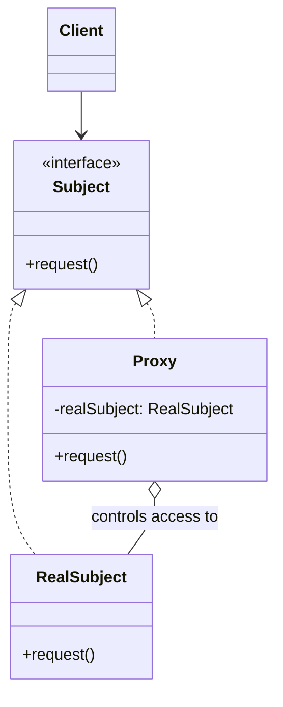

# Proxy Pattern: The Gatekeeper

The Proxy pattern is a structural pattern that provides a **surrogate or placeholder** for another object to control access to it.

Think of it like a corporate firewall. You don't connect directly to the internet. Your requests go through a proxy server. The proxy can log your requests, block access to certain sites, or cache common results, all without you even knowing it's there. It has the same interface as the real internet connection, but it adds a layer of control.

A Proxy is a wrapper that has the **exact same interface** as the real object it's controlling. This allows it to be substituted for the real object transparently.

---

## 1. 🧩 What Problem Does This Solve?

You need to add a layer of indirection or control to the access of an object, but you don't want the client to know about it. This control can be for various reasons:

*   **Lazy Initialization (Virtual Proxy):** The real object is very expensive to create (e.g., it loads a huge file or connects to a remote service). You want to delay its creation until it's absolutely needed.
*   **Access Control (Protection Proxy):** You want to check if the client has the necessary permissions before allowing it to execute a method on the real object.
*   **Logging (Logging Proxy):** You want to log all calls to an object's methods.
*   **Caching (Caching Proxy):** You want to cache the results of expensive operations and return the cached result for subsequent identical calls.
*   **Remote Access (Remote Proxy):** The real object lives on a different server. The proxy handles the network communication, making it look like the object is local.

---

## 2. 🧠 Core Idea (No BS Version)

The Proxy pattern is simple:

1.  Create a `Proxy` class that implements the **same interface** as the "Real Subject" (the object you want to control).
2.  The `Proxy` holds a reference to the `Real Subject`.
3.  The client interacts with the `Proxy` as if it were the `Real Subject`.
4.  When a client calls a method on the `Proxy`, the proxy can perform its extra logic (caching, logging, security check, etc.) and then, if appropriate, delegate the call to the `Real Subject`.

Because the Proxy and the Real Subject share the same interface, the client doesn't need to change. You can swap the real object with the proxy without the client ever knowing.

---

## 3. 🏗️ Structure Diagram (Mermaid REQUIRED)


The `Client` works with the `Subject` interface. It can be given either a `RealSubject` or a `Proxy` and it won't know the difference. The `Proxy` intercepts the `request()` call, does its thing, and then calls `request()` on the `RealSubject`.

---

## 4. ⚙️ TypeScript Implementation

Let's implement a **Protection Proxy** and a **Caching Proxy** for a "heavy" database query service.

```typescript
// The "Subject" interface
interface Database {
  query(sql: string): Promise<any[]>;
}

// The "Real Subject" - this is an expensive object to use.
class RealDatabase implements Database {
  public async query(sql: string): Promise<any[]> {
    console.log(`[RealDatabase] Executing query: ${sql}`);
    // Simulate a slow database call
    await new Promise(resolve => setTimeout(resolve, 1000));
    return [{ id: 1, name: 'John Doe' }, { id: 2, name: 'Jane Doe' }];
  }
}

// --- Proxy Implementation 1: Protection Proxy ---
class ProtectionProxy implements Database {
  private realDatabase: RealDatabase;
  private userRole: 'ADMIN' | 'USER';

  constructor(realDatabase: RealDatabase, userRole: 'ADMIN' | 'USER') {
    this.realDatabase = realDatabase;
    this.userRole = userRole;
  }

  public async query(sql: string): Promise<any[]> {
    console.log(`[ProtectionProxy] User with role '${this.userRole}' is attempting to query.`);
    // Access control logic
    if (this.userRole !== 'ADMIN' && sql.toLowerCase().includes('delete')) {
      throw new Error('Access denied: Only ADMINs can execute DELETE queries.');
    }
    // If access is granted, delegate to the real subject.
    return this.realDatabase.query(sql);
  }
}

// --- Proxy Implementation 2: Caching Proxy ---
class CachingProxy implements Database {
  private realDatabase: RealDatabase;
  private cache: Map<string, any[]> = new Map();

  constructor(realDatabase: RealDatabase) {
    this.realDatabase = realDatabase;
  }

  public async query(sql: string): Promise<any[]> {
    console.log(`[CachingProxy] Checking cache for query: ${sql}`);
    if (this.cache.has(sql)) {
      console.log('[CachingProxy] Cache hit! Returning cached result.');
      return this.cache.get(sql)!;
    }

    console.log('[CachingProxy] Cache miss. Delegating to real database.');
    const result = await this.realDatabase.query(sql);
    this.cache.set(sql, result);
    return result;
  }
}


// --- USAGE ---

async function clientCode() {
  const db = new RealDatabase();

  console.log('--- Scenario 1: Admin user using a Protection Proxy ---');
  const adminProxy = new ProtectionProxy(db, 'ADMIN');
  await adminProxy.query('SELECT * FROM users');
  await adminProxy.query('DELETE FROM users WHERE id = 1');

  console.log('\n--- Scenario 2: Regular user using a Protection Proxy ---');
  const userProxy = new ProtectionProxy(db, 'USER');
  await userProxy.query('SELECT * FROM users');
  try {
    await userProxy.query('DELETE FROM users WHERE id = 1');
  } catch (e: any) {
    console.error(e.message);
  }

  console.log('\n--- Scenario 3: Using a Caching Proxy ---');
  const cacheProxy = new CachingProxy(db);
  // First call is slow and goes to the real database
  await cacheProxy.query('SELECT * FROM products');
  // Second call is fast and comes from the cache
  await cacheProxy.query('SELECT * FROM products');
}

clientCode();
```
The client code just uses an object that conforms to the `Database` interface. It has no idea that its access is being controlled or that its results are being cached.

---

## 5. 🔥 Real-World Example

**Object-Relational Mappers (ORMs) and Lazy Loading:** This is a classic example of a **Virtual Proxy**. When you fetch a `User` object from the database, you might not want to immediately load all their `Posts`, especially if they have thousands of them.

```typescript
const user = await orm.users.find(1); // Fetches the user data
// At this point, user.posts is not an array of Post objects.
// It's a PROXY object that looks like an array.

console.log(user.name); // Works fine

// The first time you access user.posts, the proxy wakes up.
const posts = await user.posts; // The proxy executes the query to fetch the posts.

// Subsequent access might return the now-loaded collection.
```
The `user.posts` object acts as a proxy. It stands in for the real array of posts until the moment it's actually needed.

---

## 6. ⚖️ When to Use

*   Any time you need to control access to an object.
*   **Lazy initialization (Virtual Proxy):** To delay the creation of expensive objects.
*   **Access control (Protection Proxy):** To add a layer of security checks.
*   **Logging/Caching (Logging/Caching Proxy):** To add cross-cutting concerns without modifying the original object's code.
*   **Remote communication (Remote Proxy):** To hide the complexity of network requests.

---

## 7. 🚫 When NOT to Use

*   When you don't need to control access. If the client can just talk to the object directly without any issues, a proxy adds unnecessary complexity.
*   When you need to change the object's interface. That's a job for the **Adapter**.
*   When you need to add new public methods or state. That's a job for the **Decorator**.

---

## 8. 💣 Common Mistakes

*   **Confusing it with Decorator:** This is the most common point of confusion. They are very similar but have different intents.
    *   **Decorator:** Adds new responsibilities or behaviors. The client often composes the decorators themselves (stacking the onion). Its purpose is to *enhance* the object.
    *   **Proxy:** Controls access. The client usually doesn't know it's talking to a proxy; it's often created by a factory or DI container. Its purpose is to *manage* the object.
*   **Modifying the interface:** A proxy must have the *exact same* public interface as the real subject. If you add new methods, it's not a proxy anymore; it's probably a Decorator or an Adapter.

---

## 9. 🧠 Interview Notes

*   **How to explain it simply:** "It's a placeholder object that controls access to the real object. It has the same interface as the real object, so the client doesn't know it's talking to a proxy. You can use it for things like lazy loading, caching, or security checks."
*   **Key difference from Decorator:** "A Decorator's purpose is to add new functionality, while a Proxy's purpose is to control access. A Decorator can change the object's behavior, while a Proxy manages the object's lifecycle or access rights."

---

## 10. 🆚 Comparison With Similar Patterns

*   **Decorator:** As discussed above, the intent is different (add behavior vs. control access).
*   **Adapter:** An Adapter provides a **different** interface to its object. A Proxy provides the **same** interface.
*   **Facade:** A Facade provides a **simplified** interface to a whole subsystem. A Proxy provides the **same** interface to a single object.
