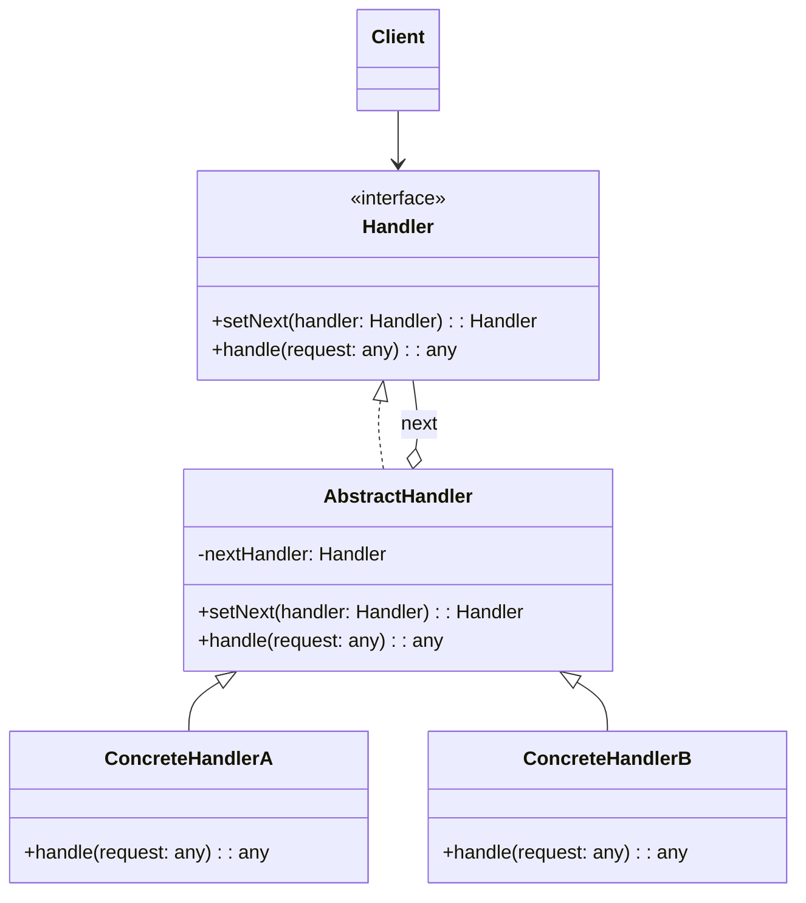

# Chain of Responsibility Pattern: Passing the Buck

The Chain of Responsibility pattern is a behavioral pattern that lets you pass a request along a chain of potential handlers. Upon receiving a request, each handler decides either to process the request or to pass it to the next handler in the chain.

Think of it like a customer support system. When you call, you first talk to a Level 1 operator (the first handler). If they can't solve your problem, they don't just give up; they pass you to a Level 2 technician. If the technician is stumped, they pass you to an engineer. The request (your problem) travels along the chain until someone can handle it.

The key benefit is that the sender of the request doesn't know who will ultimately handle it. The sender is decoupled from the receiver.

---

## 1. 🧩 What Problem Does This Solve?

You have a request that could be handled by one of several different objects, but you don't know which one in advance. You don't want to couple the sender of the request to every possible receiver.

**Real-world scenario:**
You're building a middleware system for a web server. Incoming HTTP requests need to go through a series of checks:
1.  **Authentication:** Is the user logged in?
2.  **Authorization:** Does the user have permission to access this resource?
3.  **Caching:** Do we have a cached response for this request?
4.  **Data Validation:** Is the request body well-formed?

You could write a single, monolithic function to do all this:

```typescript
function handleRequest(request) {
  if (!authenticate(request)) {
    return 'Error: Not Authenticated';
  }
  if (!authorize(request)) {
    return 'Error: Not Authorized';
  }
  if (isCached(request)) {
    return getFromCache(request);
  }
  // ... and so on
}
```
This is terrible.
*   **Rigid:** The order of operations is hardcoded. What if you want to change the order or add a new step (like logging)? You have to modify this giant function.
*   **Monolithic:** All the logic is crammed into one place, making it hard to read, test, and maintain.
*   **Not Reusable:** The authentication logic is stuck inside this specific request handler. You can't easily reuse it somewhere else.

---

## 2. 🧠 Core Idea (No BS Version)

The Chain of Responsibility pattern turns these individual checks into standalone objects called "handlers."

1.  Define a common `Handler` interface. This interface usually has two methods:
    *   `setNext(handler: Handler)`: To build the chain by linking one handler to the next.
    *   `handle(request: any)`: To process the request.
2.  Create concrete handler classes that implement the `Handler` interface.
3.  Inside its `handle` method, a handler:
    a.  Checks if it can process the request.
    b.  If it can, it does its work and, importantly, **decides whether to stop the chain or pass the request along**.
    c.  If it can't process the request, it simply passes the request to the `next` handler in the chain.
4.  The client builds the chain of handlers and then sends the request to the *first* handler in the chain.

---

## 3. 🏗️ Structure Diagram (Mermaid REQUIRED)


The `AbstractHandler` is optional but very common. It provides the boilerplate implementation for managing the `nextHandler` reference, so the concrete handlers only need to focus on their specific logic.

---

## 4. ⚙️ TypeScript Implementation

Let's build our web server middleware example correctly.

```typescript
// The request object that will be passed along the chain
interface HttpRequest {
  user?: { role: 'ADMIN' | 'USER' };
  path: string;
  body?: any;
}

// 1. The Handler Interface
interface Middleware {
  setNext(handler: Middleware): Middleware;
  handle(request: HttpRequest): string | null;
}

// 2. The Abstract Handler (optional but recommended)
abstract class AbstractMiddleware implements Middleware {
  private nextHandler?: Middleware;

  public setNext(handler: Middleware): Middleware {
    this.nextHandler = handler;
    return handler; // Allows for convenient chaining: a.setNext(b).setNext(c)
  }

  public handle(request: HttpRequest): string | null {
    if (this.nextHandler) {
      return this.nextHandler.handle(request);
    }
    return null; // End of the chain
  }
}

// 3. Concrete Handlers
class AuthenticationMiddleware extends AbstractMiddleware {
  public handle(request: HttpRequest): string | null {
    console.log('[Authentication] Checking request...');
    if (!request.user) {
      return 'Error: User is not authenticated.';
    }
    // Pass to the next handler
    return super.handle(request);
  }
}

class AuthorizationMiddleware extends AbstractMiddleware {
  public handle(request: HttpRequest): string | null {
    console.log('[Authorization] Checking request...');
    if (request.path.startsWith('/admin') && request.user?.role !== 'ADMIN') {
      return 'Error: User is not authorized to access admin resources.';
    }
    // Pass to the next handler
    return super.handle(request);
  }
}

class DataValidationMiddleware extends AbstractMiddleware {
  public handle(request: HttpRequest): string | null {
    console.log('[DataValidation] Checking request...');
    if (request.path === '/users' && !request.body?.username) {
      return 'Error: Request body is missing username.';
    }
    // Pass to the next handler
    return super.handle(request);
  }
}

// --- USAGE ---

// The client is responsible for building the chain.
const auth = new AuthenticationMiddleware();
const authz = new AuthorizationMiddleware();
const validation = new DataValidationMiddleware();

// Chain them together
auth.setNext(authz).setNext(validation);

// The server (client) sends the request to the *first* handler in the chain.
function server(request: HttpRequest) {
  console.log(`\n--- Processing request for path: ${request.path} ---`);
  const result = auth.handle(request);

  if (result) {
    console.log(`Request failed: ${result}`);
  } else {
    console.log('Request successful: Executing core application logic...');
  }
}

// Scenario 1: Successful request
server({ user: { role: 'ADMIN' }, path: '/admin/dashboard' });

// Scenario 2: Authorization failure
server({ user: { role: 'USER' }, path: '/admin/dashboard' });

// Scenario 3: Authentication failure
server({ path: '/users' });

// Scenario 4: Data validation failure
server({ user: { role: 'USER' }, path: '/users', body: { email: 'test@test.com' } });
```
This is much better! Each responsibility is encapsulated in its own class. We can easily reorder the chain (`validation.setNext(auth).setNext(authz)`) or add new middleware without touching the existing handler classes.

---

## 5. 🔥 Real-World Example

**Event Bubbling in the DOM:** When you click on a button inside a `div` on a web page, the `click` event is first handled by the button. If the button's event listener doesn't stop the propagation (`event.stopPropagation()`), the event "bubbles up" to the parent `div`, which can then handle it. Then it bubbles up to the `body`, then `html`, then `document`. This is a natural implementation of the Chain of Responsibility pattern. Each element in the DOM tree is a handler.

---

## 6. ⚖️ When to Use

*   When you want to decouple the sender of a request from its receivers.
*   When more than one object may handle a request, and the handler isn't known beforehand. The handler should be determined automatically.
*   When the set of handlers and their order can change dynamically at runtime.

---

## 7. 🚫 When NOT to Use

*   When the request must be handled by a specific object. If there's no "chain" and you always know exactly who the receiver is, the pattern is overkill.
*   When the chain is guaranteed to be very short (1-2 handlers). A simple `if/else` might be more readable.

---

## 8. 💣 Common Mistakes

*   **Creating a broken chain:** If a handler doesn't call `super.handle(request)` or `nextHandler.handle(request)`, it breaks the chain. The request will stop there, which may or may not be the intended behavior. This is a common source of bugs.
*   **Assuming a request will always be handled:** It's possible for a request to fall off the end of the chain without any handler processing it. The client code should be prepared for this (e.g., by checking for a `null` return).
*   **Creating cyclic chains:** If handler A links to B, and B links back to A, you'll get an infinite loop and a stack overflow.

---

## 9. 🧠 Interview Notes

*   **How to explain it simply:** "It's a pattern for processing a request through a series of handlers. Each handler has a chance to deal with the request. If it can't, it passes it to the next handler in the chain. The sender doesn't know or care which handler ultimately processes the request."
*   **Key benefit:** "It decouples the sender from the receivers and allows you to add or reorder handlers dynamically without changing the client's code. It's great for things like middleware, event processing, or approval workflows."

---

## 10. 🆚 Comparison With Similar Patterns

*   **Command:** The Command pattern encapsulates a request as an object, but it's usually sent to a specific receiver. Chain of Responsibility is about finding the right receiver from a group. You could, however, have a chain of handlers that process `Command` objects.
*   **Decorator:** A Decorator adds responsibilities to an object, and the execution flow typically goes through all decorators to the wrapped object. In a Chain of Responsibility, the chain might be broken at any point as soon as a handler completes the request.
*   **Mediator:** A Mediator centralizes communication between objects. In CoR, the communication is decentralized and flows in one direction along the chain.
