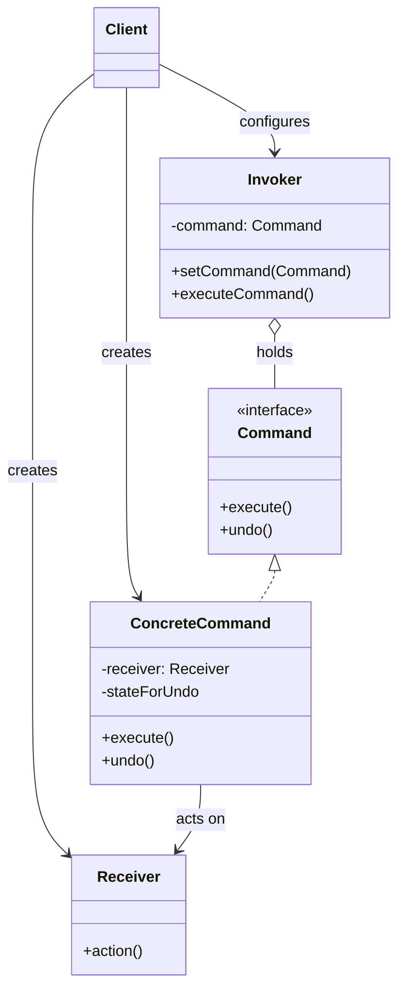

# Command Pattern: Encapsulating Actions

The Command pattern is a behavioral pattern that turns a request into a **stand-alone object** that contains all information about the request. This transformation lets you parameterize methods with different requests, delay or queue a request's execution, and support undoable operations.

Think of it like ordering food at a restaurant. You (the `Client`) decide what you want (e.g., "a burger and fries"). You give your order to the waiter (the `Invoker`). The waiter writes it down on a ticket (the `Command` object). The ticket has all the information needed to make the meal. The waiter then places the ticket on the kitchen counter. The chef (the `Receiver`) picks up the ticket and knows exactly what to do.

The waiter doesn't need to know how to cook. The chef doesn't need to know who the customer is. The order ticket is a self-contained unit of work that decouples the person who wants the thing from the person who does the thing.

---

## 1. 🧩 What Problem Does This Solve?

You have an object that needs to execute some action, but you want to decouple it from the object that performs the action. This is useful for several reasons:

*   **You want to specify, queue, and execute requests at different times.**
*   **You want to support undo/redo operations.**
*   **You want to log requests.**
*   **You want to build a user interface with buttons and menu items that perform actions.**

**Real-world scenario:**
You're building a simple text editor application. You have a `TextEditor` class with methods like `copy()`, `paste()`, `cut()`. You also have UI elements like `Button` and `MenuItem`.

**The Naive (and tightly-coupled) Solution:**

```typescript
class TextEditor {
  copy() { /* ... */ }
  paste() { /* ... */ }
}

class CopyButton {
  private editor: TextEditor;

  constructor(editor: TextEditor) {
    this.editor = editor;
  }

  onClick() {
    this.editor.copy(); // The button is directly coupled to the editor.
  }
}
```
This is problematic:
*   **Tight Coupling:** The `CopyButton` knows exactly what a `TextEditor` is and what its methods are. You can't reuse this button for copying an image in an `ImageEditor`.
*   **No Undo/Redo:** How would you implement undo? You'd have to add complex logic inside the `TextEditor` to track every action.
*   **No Queueing:** You can't easily create a macro that records a sequence of actions and replays them later.

---

## 2. 🧠 Core Idea (No BS Version)

The Command pattern introduces a "command" object for each action.

1.  Define a common `Command` interface, which usually has a single method: `execute()`.
2.  Create **Concrete Command** classes for each action (e.g., `CopyCommand`, `PasteCommand`).
    *   A concrete command holds a reference to the **Receiver**—the object that will actually do the work (e.g., the `TextEditor`).
    *   Its `execute()` method calls the appropriate method on the receiver.
3.  The **Invoker** (e.g., the `Button`) holds a reference to a `Command` object.
4.  When the invoker is triggered (e.g., `button.onClick()`), it simply calls `command.execute()`. The invoker has no idea what the command does or who the receiver is.
5.  The **Client** is responsible for creating the command and associating it with the correct receiver and invoker.

To support undo, you can add an `undo()` method to the `Command` interface. The `CopyCommand` would then need to store the state required to reverse the copy operation.

---

## 3. 🏗️ Structure Diagram (Mermaid REQUIRED)


*   **Invoker:** Asks the command to carry out the request.
*   **Command:** Knows about the receiver and invokes a method of the receiver.
*   **Receiver:** Knows how to perform the operations to carry out the request.
*   **Client:** Creates a ConcreteCommand and sets its receiver.

---

## 4. ⚙️ TypeScript Implementation

Let's build a simple remote control for a light.

```typescript
// --- The Receiver ---
// This class has the actual logic.
class Light {
  public turnOn(): void {
    console.log('Light is ON');
  }
  public turnOff(): void {
    console.log('Light is OFF');
  }
}

// --- The Command Hierarchy ---

// 1. The Command Interface
interface Command {
  execute(): void;
  undo(): void;
}

// 2. A Concrete Command
class TurnOnCommand implements Command {
  private light: Light;

  constructor(light: Light) {
    this.light = light;
  }

  execute(): void {
    this.light.turnOn();
  }

  undo(): void {
    this.light.turnOff();
  }
}

// 2. Another Concrete Command
class TurnOffCommand implements Command {
  private light: Light;

  constructor(light: Light) {
    this.light = light;
  }

  execute(): void {
    this.light.turnOff();
  }

  undo(): void {
    this.light.turnOn();
  }
}

// --- The Invoker ---
// This class is decoupled from the Light. It only knows about Commands.
class RemoteControl {
  private command?: Command;
  private history: Command[] = [];

  public setCommand(command: Command): void {
    this.command = command;
  }

  public pressButton(): void {
    if (this.command) {
      this.command.execute();
      this.history.push(this.command);
    } else {
      console.log('No command set.');
    }
  }

  public pressUndo(): void {
    const lastCommand = this.history.pop();
    if (lastCommand) {
      console.log('--- Undoing last action ---');
      lastCommand.undo();
    } else {
      console.log('Nothing to undo.');
    }
  }
}

// --- USAGE (The Client) ---

// Create the receiver
const livingRoomLight = new Light();

// Create the commands, linking them to the receiver
const turnOn = new TurnOnCommand(livingRoomLight);
const turnOff = new TurnOffCommand(livingRoomLight);

// Create the invoker
const remote = new RemoteControl();

// Configure the invoker with a command and use it
console.log('--- Turning light on ---');
remote.setCommand(turnOn);
remote.pressButton();

console.log('\n--- Turning light off ---');
remote.setCommand(turnOff);
remote.pressButton();

// Use the undo functionality
remote.pressUndo(); // Should turn the light back on
remote.pressUndo(); // Should turn the light back off
```
The `RemoteControl` is completely decoupled. We could create a `GarageDoorOpenCommand` and a `GarageDoor` receiver, and the same `RemoteControl` class would work without any changes. We also get a simple undo history for free.

---

## 5. 🔥 Real-World Example

**Transactional Systems & Rollbacks:** Database transactions are a great example. When you begin a transaction, every `INSERT`, `UPDATE`, or `DELETE` statement can be seen as a `Command` object being added to a queue. If you `COMMIT` the transaction, the system executes all the commands in the queue. If you `ROLLBACK`, the system iterates through the commands and calls their `undo()` methods, reverting the database to its original state.

---

## 6. ⚖️ When to Use

*   When you want to parameterize objects with an action to perform.
*   When you want to queue operations, schedule their execution, or execute them remotely.
*   When you want to implement reversible operations (undo/redo).

---

## 7. 🚫 When NOT to Use

*   When you have simple, direct method calls that don't need to be decoupled, queued, or made undoable. The pattern adds a layer of complexity (a whole new class for every action) that isn't always necessary.

---

## 8. 💣 Common Mistakes

*   **Putting business logic in the Command:** A command's job is to link a receiver and an action. It shouldn't contain the business logic itself. The logic belongs in the `Receiver`. The command is just a messenger.
*   **Creating "Smart" Commands:** Sometimes developers are tempted to make commands that can choose their receiver at runtime. This can complicate the pattern and blur the lines between the Command and other patterns like Strategy or Chain of Responsibility. Keep it simple: a command should be a dumb object that knows its receiver and what method to call.

---

## 9. 🧠 Interview Notes

*   **How to explain it simply:** "It's a pattern where you turn a request into an object. This object, the 'command', contains everything needed to perform an action. This lets you pass commands as method arguments, store them, or execute them later. It decouples the object that invokes the operation from the one that knows how to perform it."
*   **Key benefit:** "The biggest benefits are decoupling the invoker from the receiver and enabling undo/redo functionality. By encapsulating an action as an object, you can store a history of commands and execute their 'undo' methods to reverse them."

---

## 10. 🆚 Comparison With Similar Patterns

*   **Strategy:** The Strategy pattern is about providing different ways to do something. The algorithms (strategies) are swapped, but the action is usually executed immediately. The Command pattern is about encapsulating an action to be executed later, and it's not necessarily about having different ways to do it. However, you could have a `ConcreteCommand` that uses a `Strategy` object to perform its action.
*   **Mediator:** A Mediator centralizes communication between objects. A Command decentralizes it by creating small, self-contained action objects.
*   **Chain of Responsibility:** A CoR is about finding the right object to handle a request. A Command is about encapsulating a request to be handled by a known object.
