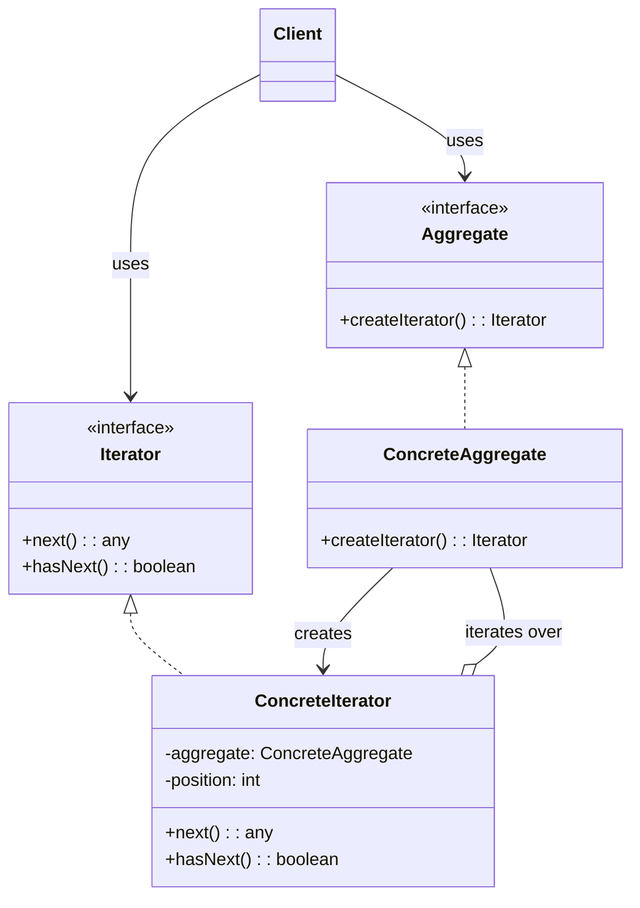

# Iterator Pattern: The Universal Remote for Collections

The Iterator pattern is a behavioral pattern that provides a way to **access the elements of an aggregate object (a collection) sequentially without exposing its underlying representation**.

Think of it like a TV remote control. Your TV has a collection of channels. The remote has "next" and "previous" buttons. You, the user, don't need to know how the TV stores its channels (is it a list? a tree? a hash map?). You just use the simple, universal interface of the remote (the Iterator) to traverse the collection.

The Iterator pattern moves the responsibility for traversal logic from the collection itself to a separate `Iterator` object.

---

## 1. 🧩 What Problem Does This Solve?

You have a complex data structure, like a tree or a graph, and you want to provide clients with an easy way to traverse it.

If you don't use an iterator, you have two bad options:
1.  **Expose the internal structure:** You could make the internal array or list of the collection public. This is a terrible violation of encapsulation. The client becomes tightly coupled to the collection's implementation. If you later decide to change your `ArrayList` to a `LinkedList`, all your client code breaks.
2.  **Add traversal methods to the collection:** You could add `getNext()`, `hasNext()`, etc., directly to your collection class. This bloats the collection's interface with traversal logic, which isn't its primary responsibility. Worse, what if you need multiple different ways to traverse the collection (e.g., depth-first vs. breadth-first for a tree)? You'd have to add all of them to the collection class, making it even more bloated. And you can't have two simultaneous traversals.

---

## 2. 🧠 Core Idea (No BS Version)

The Iterator pattern extracts the traversal behavior into a separate object.

1.  Define an `Iterator` interface. This interface declares the methods for traversal, such as `next()` (get the next element) and `hasNext()` (check if there are more elements).
2.  Define an `Iterable` (or `Aggregate`) interface. This interface has a single method, `createIterator()`, which returns an `Iterator` object.
3.  Your **Concrete Collection** (e.g., `UserList`, `BinaryTree`) implements the `Iterable` interface. Its `createIterator()` method creates and returns a new instance of a specific iterator for that collection.
4.  Create **Concrete Iterator** classes (e.g., `ListIterator`, `DepthFirstTreeIterator`). These classes implement the `Iterator` interface. An iterator object usually holds a reference to the collection it's traversing and keeps track of its own internal state (e.g., the current position or index).
5.  The **Client** gets an iterator from the collection and then uses it to traverse the elements. The client only knows about the `Iterator` and `Iterable` interfaces, not the concrete classes.

---

## 3. 🏗️ Structure Diagram (Mermaid REQUIRED)


The `Client` asks the `ConcreteAggregate` for an `Iterator`. The aggregate creates a `ConcreteIterator`, passing a reference of itself to the iterator's constructor. The client then uses the iterator's `next()` and `hasNext()` methods to loop through the elements.

---

## 4. ⚙️ TypeScript Implementation

In modern languages like TypeScript and JavaScript, the Iterator pattern is built directly into the language via the [Iterable and Iterator protocols](https://developer.mozilla.org/en-US/docs/Web/JavaScript/Reference/Iteration_protocols). You can make any object iterable by implementing a special method called `Symbol.iterator`.

Let's create a custom collection of words and make it iterable both forwards and backwards.

```typescript
// Our custom collection
class WordCollection {
  private words: string[] = [];

  public add(word: string): void {
    this.words.push(word);
  }

  // --- Implementation of the Iterator Pattern ---

  // This method makes the class "iterable" for the standard `for...of` loop.
  // This is the default, forward iterator.
  public [Symbol.iterator](): Iterator<string> {
    let position = 0;
    const words = this.words;

    return {
      next(): IteratorResult<string> {
        if (position < words.length) {
          return { value: words[position++], done: false };
        } else {
          return { done: true, value: undefined };
        }
      }
    };
  }

  // A custom method to get a different kind of iterator
  public getReverseIterator(): Iterable<string> {
    const words = this.words;
    
    // We return an object that has the [Symbol.iterator] method.
    // This makes the returned object itself iterable.
    return {
      [Symbol.iterator](): Iterator<string> {
        let position = words.length - 1;

        return {
          next(): IteratorResult<string> {
            if (position >= 0) {
              return { value: words[position--], done: false };
            } else {
              return { done: true, value: undefined };
            }
          }
        };
      }
    };
  }
}

// --- USAGE (The Client) ---

const collection = new WordCollection();
collection.add('First');
collection.add('Second');
collection.add('Third');

console.log('--- Traversing forwards (using default iterator) ---');
// The `for...of` loop automatically calls the [Symbol.iterator] method.
for (const word of collection) {
  console.log(word);
}

console.log('\n--- Traversing backwards (using custom reverse iterator) ---');
// We get the reverse iterator and loop over it.
const reverseIterable = collection.getReverseIterator();
for (const word of reverseIterable) {
  console.log(word);
}
```
The client code is clean and declarative. It doesn't know or care that `WordCollection` uses a simple array internally. We could change the internal storage to a `Map` or a linked list, and as long as we update the iterators, the client code would not change.

---

## 5. 🔥 Real-World Example

**The `for...of` loop in JavaScript/TypeScript:** This is the most common use of the Iterator pattern you'll encounter. Arrays, Strings, Maps, and Sets are all built-in iterables. When you write `for (const item of myArray)`, you are using an iterator under the hood.

**Database Cursors:** When you execute a query on a database that returns millions of records, the database doesn't load all of them into your application's memory at once. It gives you a `cursor`. This cursor is an iterator. You use methods like `fetchNext()` to get the next batch of records. This allows you to process huge datasets without running out of memory.

---

## 6. ⚖️ When to Use

*   When you have a complex data structure and you want to hide its complexity from clients.
*   To reduce the number of methods in your collection classes.
*   To allow clients to have multiple, simultaneous traversals of the same collection.

---

## 7. 🚫 When NOT to Use

*   When your collection is simple (like a basic list) and you don't need different traversal algorithms. In many modern languages, basic collections are already iterable, so you get the pattern for free without having to implement it yourself.

---

## 8. 💣 Common Mistakes

*   **Returning a single, stateful iterator:** If your `createIterator()` method returns the same iterator instance every time, you can't have multiple simultaneous traversals. Two `for` loops over the same collection would interfere with each other. `createIterator()` should almost always return a `new` iterator instance.
*   **Modifying the collection while iterating:** This can lead to unpredictable behavior. What happens if you remove an item from a list while you're iterating over it? Some iterators will throw a `ConcurrentModificationException` (fail-fast), while others might skip elements or enter an infinite loop (fail-safe). It's generally a bad practice.

---

## 9. 🧠 Interview Notes

*   **How to explain it simply:** "It's a pattern that lets you traverse a collection of objects without exposing how the collection is structured. You get an 'iterator' object from the collection, and you use its 'next' and 'hasNext' methods to loop through the items. It's like a universal remote for any kind of collection."
*   **Key benefit:** "It decouples the client from the collection's internal structure. The client can work with any collection that provides an iterator, and the collection can change its internal implementation without breaking the client."

---

## 10. 🆚 Comparison With Similar Patterns

*   **Composite:** The Composite pattern is often used with the Iterator pattern. You can create an iterator that knows how to traverse a Composite tree (e.g., using a depth-first or breadth-first algorithm).
*   **Factory Method:** The `createIterator()` method in the `Aggregate` interface is an example of a Factory Method. It's a method that's responsible for creating objects (in this case, iterator objects).
*   **Memento:** The Memento pattern can be used to capture the state of an iterator. This would allow you to save your position in a traversal and restore it later.
