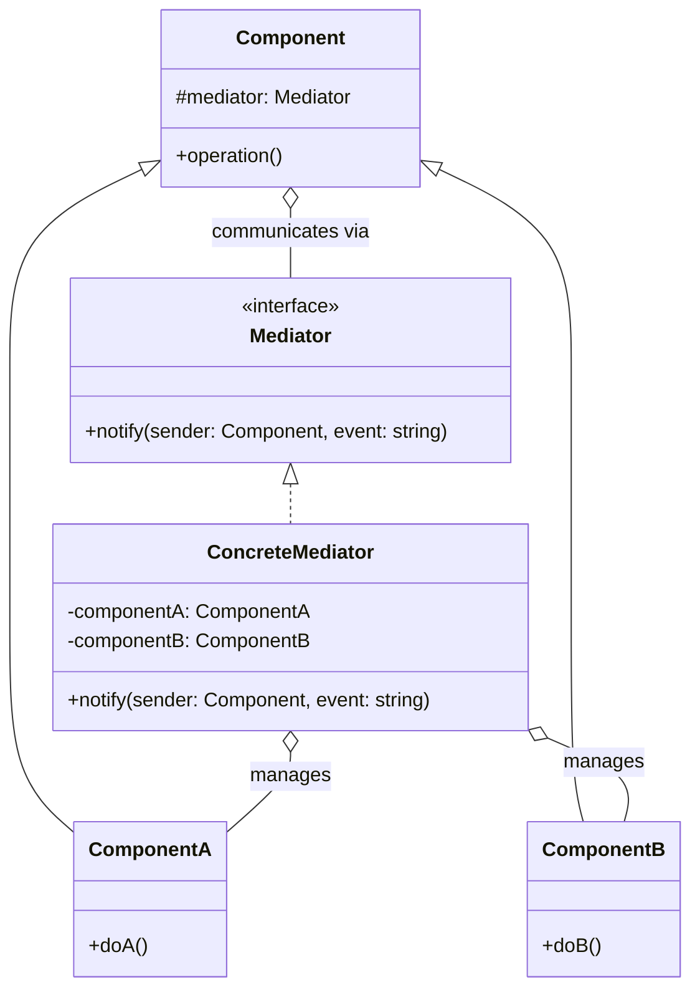

# Mediator Pattern: The Air Traffic Controller

The Mediator pattern is a behavioral pattern that restricts direct communications between objects and forces them to collaborate only via a **mediator object**. This reduces chaotic dependencies between objects and promotes loose coupling.

Think of an air traffic control tower at an airport. Dozens of airplanes are flying around. Without a control tower, each pilot would have to talk to every other pilot to coordinate takeoffs and landings. It would be absolute chaos, and the risk of collision would be huge.

The control tower (the `Mediator`) acts as the central hub. Each airplane (a `Colleague` or `Component`) only talks to the tower. The tower then relays instructions to other airplanes. The airplanes don't need to know about each other; they only need to know about the tower.

---

## 1. 🧩 What Problem Does This Solve?

You have a set of objects that need to communicate with each other. As the number of objects grows, the web of connections between them can become a tangled mess, often called "spaghetti code."

**Real-world scenario:**
You're building a dialog box for a user interface. It has several controls: a `TextBox`, a `Checkbox`, and a `Button`. They have complex interactions:
*   When the user types in the `TextBox`, the `Button` should become enabled.
*   When the user checks the `Checkbox`, the `TextBox` should be cleared and disabled.
*   When the `Button` is clicked, it needs to get the text from the `TextBox`.

**The Naive (and messy) Solution:**

Each component holds a direct reference to the other components it needs to talk to.

```typescript
class TextBox {
  public button: Button;
  public checkbox: Checkbox;
  onInput() { this.button.enable(); }
}
class Checkbox {
  public textbox: TextBox;
  onCheck() { this.textbox.clear(); this.textbox.disable(); }
}
class Button {
  public textbox: TextBox;
  onClick() { const text = this.textbox.getText(); }
}
```
This is a nightmare for several reasons:
*   **Many-to-Many Relationships:** Every component knows about every other component. If you add a new `Slider` control that also needs to interact with the `Button`, you have to modify both the `Slider` and `Button` classes.
*   **Low Reusability:** This `TextBox` is completely useless outside of this specific dialog because it's hardcoded to work with that specific `Button` and `Checkbox`.
*   **Hard to Maintain:** Understanding the flow of control is difficult because it's spread across all the component classes.

---

## 2. 🧠 Core Idea (No BS Version)

The Mediator pattern extracts all the interaction logic into a single, central object.

1.  The individual objects (`Colleagues`) no longer talk to each other directly. They only know about the `Mediator` object.
2.  Create a `Mediator` interface that declares methods for communication. These are usually generic notification methods (e.g., `notify(sender: object, event: string)`).
3.  The `Colleagues` are configured with an instance of the `Mediator`.
4.  When a `Colleague`'s state changes (e.g., the user types in a textbox), it doesn't tell other components. It tells the `Mediator`.
5.  The `Concrete Mediator` contains all the complex logic. When it receives a notification from a colleague, it knows how to react and which other colleagues need to be updated.

---

## 3. 🏗️ Structure Diagram (Mermaid REQUIRED)


The `Components` (Colleagues) only know about the `Mediator` interface. The `ConcreteMediator` knows about all the concrete components and orchestrates their interactions.

---

## 4. ⚙️ TypeScript Implementation

Let's fix our dialog box example.

```typescript
// --- The Mediator Interface and Base Component ---
interface Mediator {
  notify(sender: object, event: string): void;
}

class BaseComponent {
  protected mediator?: Mediator;

  public setMediator(mediator: Mediator): void {
    this.mediator = mediator;
  }
}

// --- The Colleague/Component Classes ---
// They are dumb. They only know how to do their job and notify the mediator.
class TextBox extends BaseComponent {
  private text = '';
  public onInput(newText: string): void {
    this.text = newText;
    console.log('TextBox: Text changed. Notifying mediator...');
    this.mediator?.notify(this, 'input');
  }
  public clear(): void { console.log('TextBox: Cleared.'); this.text = ''; }
  public getText(): string { return this.text; }
}

class Checkbox extends BaseComponent {
  public onCheck(): void {
    console.log('Checkbox: Checked. Notifying mediator...');
    this.mediator?.notify(this, 'check');
  }
}

class Button extends BaseComponent {
  private isEnabled = false;
  public enable(): void { console.log('Button: Enabled.'); this.isEnabled = true; }
  public disable(): void { console.log('Button: Disabled.'); this.isEnabled = false; }
  public click(): void {
    console.log('Button: Clicked. Notifying mediator...');
    this.mediator?.notify(this, 'click');
  }
}

// --- The Concrete Mediator ---
// All the complex logic lives here.
class AuthDialogMediator implements Mediator {
  private title: string;
  private textbox: TextBox;
  private checkbox: Checkbox;
  private button: Button;

  constructor() {
    this.title = 'Login';
    this.textbox = new TextBox();
    this.checkbox = new Checkbox();
    this.button = new Button();

    // Link the components to this mediator
    this.textbox.setMediator(this);
    this.checkbox.setMediator(this);
    this.button.setMediator(this);
  }

  // This is the heart of the pattern. It orchestrates everything.
  public notify(sender: object, event: string): void {
    if (sender === this.textbox && event === 'input') {
      console.log('Mediator: Reacting to textbox input.');
      this.button.enable();
    }

    if (sender === this.checkbox && event === 'check') {
      console.log('Mediator: Reacting to checkbox check.');
      this.textbox.clear();
    }

    if (sender === this.button && event === 'click') {
      console.log('Mediator: Reacting to button click.');
      const username = this.textbox.getText();
      console.log(`Attempting login with username: ${username}`);
    }
  }

  // Method to simulate user interaction
  public simulateUserActions(): void {
    console.log('--- Simulating user typing ---');
    this.textbox.onInput('JohnDoe');
    console.log('\n--- Simulating user clicking button ---');
    this.button.click();
    console.log('\n--- Simulating user checking box ---');
    this.checkbox.onCheck();
  }
}

// --- USAGE ---
const dialog = new AuthDialogMediator();
dialog.simulateUserActions();
```
The components are now completely decoupled and reusable. The `TextBox` has no idea what a `Button` is. All the complex interaction logic is centralized in the `AuthDialogMediator`, making it easy to understand and modify.

---

## 5. 🔥 Real-World Example

**GUI Frameworks (again!):** While many UI interactions can be seen as Observer or Command, complex dialogs are often a perfect fit for Mediator. The controller or component class that manages a form and all its inputs acts as a Mediator. It listens for events from the inputs (Colleagues) and updates other inputs accordingly.

**Chat Rooms:** A chat server is a classic Mediator. Users (Colleagues) send messages to the chat server (Mediator). The server then distributes the message to all other users in the room. No user is directly connected to any other user.

---

## 6. ⚖️ When to Use

*   When a set of objects communicate in complex but well-defined ways.
*   When you find yourself with a tangled web of connections between objects and it's hard to change one without affecting many others.
*   When you can't reuse an object in a different context because it's too tightly coupled to other objects.

---

## 7. 🚫 When NOT to Use

*   When the interactions between objects are simple and few. A direct connection might be easier to understand.
*   Be careful not to turn the Mediator into a **God Object**. If a mediator becomes responsible for too much, it can become a monolithic bottleneck that is impossible to maintain. If your mediator is getting too complex, you might need to break it down into smaller mediators or use a different pattern.

---

## 8. 💣 Common Mistakes

*   **The God Object Mediator:** As mentioned above, this is the biggest danger. The pattern is meant to centralize communication logic, not all application logic. The colleagues should still do their own work.
*   **Implementing Mediator as a Singleton:** While it might seem convenient, making the mediator a Singleton can make it harder to test and can introduce global state, which is often undesirable. It's usually better to inject the mediator into the colleagues.

---

## 9. 🧠 Interview Notes

*   **How to explain it simply:** "It's a pattern that manages communication between objects. Instead of objects talking directly to each other, they all talk to a central 'mediator'. The mediator receives events from objects and forwards them to the appropriate targets. It's like an air traffic controller for objects."
*   **Key benefit:** "It reduces coupling. Objects no longer need to know about each other, only about the mediator. This makes them much easier to reuse and maintain. It centralizes the interaction logic in one place instead of spreading it all over the codebase."

---

## 10. 🆚 Comparison With Similar Patterns

*   **Facade:** A Facade exposes a simplified interface to a subsystem, but it doesn't add new functionality. It's a one-way street; clients talk to the facade, but the subsystem doesn't talk back to the facade. A Mediator centralizes two-way communication between a set of colleague objects.
*   **Observer:** The Observer pattern establishes a one-to-many relationship where a subject notifies many observers. The communication is usually one-way. The subject and observers don't know much about each other. A Mediator can act like an Observer, but it's often more complex, with colleagues being able to both send and receive messages, and the mediator containing more complex orchestration logic.
*   **Chain of Responsibility:** This pattern creates a one-way chain for processing a request. A Mediator is more like a star-shaped communication hub.
