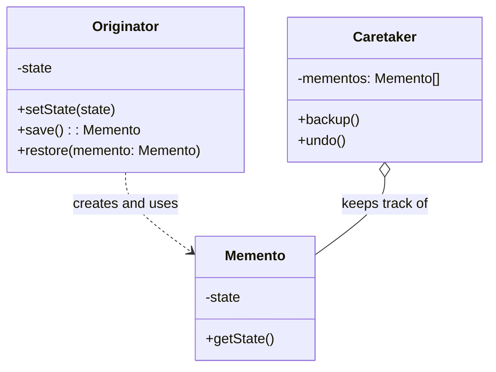

# Memento Pattern: The Time Machine

The Memento pattern is a behavioral pattern that lets you **save and restore the previous state of an object without revealing the details of its implementation**.

Think of it like the "Save Game" feature in a video game. At any point, you can save your progress. The game creates a save file (the `Memento`) that captures everything about your current state: your health, inventory, location, etc. Later, you can load that save file to restore your character to that exact state.

Crucially, you (the player) can't open the save file and edit your health to be 9999. The internal structure of the save file is hidden from you. You can only hold onto it and give it back to the game to restore.

---

## 1. 🧩 What Problem Does This Solve?

You need to implement an "undo" or "snapshot" feature for an object. The most obvious way to do this is to save the object's state somewhere. But this presents a dilemma:

*   If you try to save the state from *outside* the object, you might have to make all the object's fields public to access them. This breaks encapsulation, which is a cardinal sin of OOP.
*   If you make the object responsible for managing its own history, the object's primary logic gets cluttered with history management code.

The Memento pattern solves this by having the object itself create a "snapshot" of its state, but then hands that snapshot off to another object (the `Caretaker`) for safekeeping.

---

## 2. 🧠 Core Idea (No BS Version)

The pattern involves three key roles:

1.  **Originator:** This is the object whose state we want to save (e.g., the `TextEditor`, the `PlayerCharacter`).
    *   It has a `save()` method that creates a `Memento` object and copies its own current state into it.
    *   It has a `restore(memento)` method that takes a `Memento` object and uses it to overwrite its own state.
2.  **Memento:** This is a simple, dumb data object that stores the Originator's state.
    *   It should be **immutable** (or at least treated as such).
    *   Its internal fields should be inaccessible to anyone except the `Originator`. In some languages, this can be enforced with special access modifiers (like `friend` classes in C++ or private inner classes in Java). In TypeScript, we often rely on convention or interfaces.
3.  **Caretaker:** This object is responsible for keeping track of the mementos. It's the "keeper of history."
    *   It requests a new memento from the Originator when it wants to save the state.
    *   It stores a history of mementos (e.g., in a stack for undo/redo).
    *   It passes a memento back to the Originator when the user wants to restore a previous state.
    *   **Crucially, the Caretaker never inspects or modifies the Memento.** It just holds onto it.

---

## 3. 🏗️ Structure Diagram (Mermaid REQUIRED)


*   The `Originator` creates a `Memento` containing a snapshot of its current internal state.
*   The `Caretaker` holds onto the `Memento` but doesn't touch its contents.
*   The `Caretaker` can pass the `Memento` back to the `Originator` to restore a previous state.

---

## 4. ⚙️ TypeScript Implementation

Let's build a simple text editor that supports undo.

```typescript
// --- The Memento ---
// This object stores the state of the Originator.
// It's often an interface in TypeScript to hide implementation details.
interface EditorMemento {
  // A "marker" interface is often enough.
  // In a stricter implementation, you might add a private property
  // to ensure only the Originator can truly know what's inside.
  getState(): string;
}

// --- The Originator ---
// This is the object whose state we want to save.
class TextEditor {
  private content: string = '';

  public type(words: string): void {
    this.content += words;
  }

  public getContent(): string {
    return this.content;
  }

  // Creates a Memento containing a snapshot of the current state.
  public save(): EditorMemento {
    console.log('Editor: Saving state...');
    // We return a new instance of our concrete memento.
    return new ConcreteEditorMemento(this.content);
  }

  // Restores the state from a Memento object.
  public restore(memento: EditorMemento): void {
    // The Originator is the one that knows how to read the memento.
    this.content = memento.getState();
    console.log('Editor: State restored.');
  }

  // The concrete memento class is often a private inner class of the Originator
  // to enforce that only the Originator can create and access it.
  // TypeScript doesn't have private inner classes, so we use convention.
  private static ConcreteEditorMemento = class implements EditorMemento {
    private readonly state: string;
    private readonly date: Date;

    constructor(state: string) {
      this.state = state;
      this.date = new Date();
    }

    // This is the key method that the Originator uses to get the state back.
    public getState(): string {
      return this.state;
    }
    
    public getSaveDate(): Date {
        return this.date;
    }
  }
}


// --- The Caretaker ---
// This object is responsible for the "undo" history.
class History {
  private mementos: EditorMemento[] = [];
  private originator: TextEditor;

  constructor(originator: TextEditor) {
    this.originator = originator;
  }

  // Asks the originator to save its state and pushes it to the history stack.
  public backup(): void {
    console.log('\nHistory: Backing up editor state...');
    this.mementos.push(this.originator.save());
  }

  // Pops the last state from the stack and tells the originator to restore it.
  public undo(): void {
    if (!this.mementos.length) {
      console.log('History: No more states to undo.');
      return;
    }
    const memento = this.mementos.pop()!;
    console.log('History: Restoring previous state...');
    this.originator.restore(memento);
  }
}

// --- USAGE ---
const editor = new TextEditor();
const history = new History(editor);

// User types something
editor.type('This is the first sentence. ');
history.backup(); // Save the state

editor.type('This is the second sentence. ');
history.backup(); // Save the state

editor.type('And this is the third.');

console.log(`\nCurrent content: "${editor.getContent()}"`);

// Undo the last two changes
history.undo();
console.log(`After first undo: "${editor.getContent()}"`);

history.undo();
console.log(`After second undo: "${editor.getContent()}"`);

history.undo(); // Try to undo again
```
The `History` (Caretaker) class never looks inside the memento. It just pushes and pops them from a stack. The `TextEditor` (Originator) is the only one that knows how to create and consume the memento objects. This maintains perfect encapsulation.

---

## 5. 🔥 Real-World Example

**Undo/Redo in Software:** Any application that supports undo/redo (text editors, graphics programs like Photoshop, IDEs) uses a variation of the Memento pattern. A history of mementos is kept on a stack. "Undo" pops the last memento and restores it. "Redo" requires a second stack; when you undo, you pop from the undo stack and push the memento onto the redo stack.

**Database Transactions:** Before a transaction begins, the system can create a memento of the database's state. If the transaction fails or needs to be rolled back, the system can use the memento to restore the database to its original, clean state.

---

## 6. ⚖️ When to Use

*   When you need to produce snapshots of an object's state to be able to restore a previous state.
*   When direct access to the object's fields would violate its encapsulation.

---

## 7. 🚫 When NOT to Use

*   When the object's state is small and simple. The overhead of creating memento and caretaker classes might be too much.
*   When the cost of creating and storing the state is prohibitively high (e.g., saving the state of a multi-gigabyte file). In these cases, a more optimized approach or a different pattern (like Command for undoing specific actions) might be better.

---

## 8. 💣 Common Mistakes

*   **Violating Encapsulation:** The most common mistake is to make the `Memento` object's state public, allowing the `Caretaker` or other objects to modify it. A memento should be treated as an opaque token.
*   **Storing too much state:** A memento should only store the state that's necessary to restore the originator. Storing redundant or unnecessary data can lead to high memory consumption.
*   **Confusing Memento with Serialization:** While serialization can be used to implement the Memento pattern (by saving the object's state to a string or binary format), they are not the same thing. Memento is a behavioral pattern about the roles of Originator, Caretaker, and Memento, not the specific implementation of state storage.

---

## 9. 🧠 Interview Notes

*   **How to explain it simply:** "It's a pattern for saving and restoring an object's state. The object itself creates a 'memento'—a snapshot of its state. Another object, the 'caretaker', holds onto this memento without looking inside it. Later, the caretaker can give the memento back to the original object to restore its state. It's the classic way to implement an undo feature."
*   **Key benefit:** "It lets you save and restore state without breaking the object's encapsulation. The object that needs its state saved is the only one that knows how to read and write the snapshot."

---

## 10. 🆚 Comparison With Similar Patterns

*   **Command:** Both Command and Memento can be used to implement undo. The approaches are different:
    *   **Command:** Focuses on undoing an *action*. Each command object knows how to reverse the specific operation it performed. This is good when the object's state is huge and you only want to reverse small changes.
    *   **Memento:** Focuses on restoring a *state*. It takes a snapshot of the entire object. This is simpler to implement if the object's state is small.
    They can be used together: a command's `execute` method could store a memento of the object's state before it performs its action. Its `undo` method would then use that memento to restore the state.
*   **State:** The State pattern is about changing an object's behavior when its state changes. Memento is about saving and restoring an object's state without changing its behavior.
