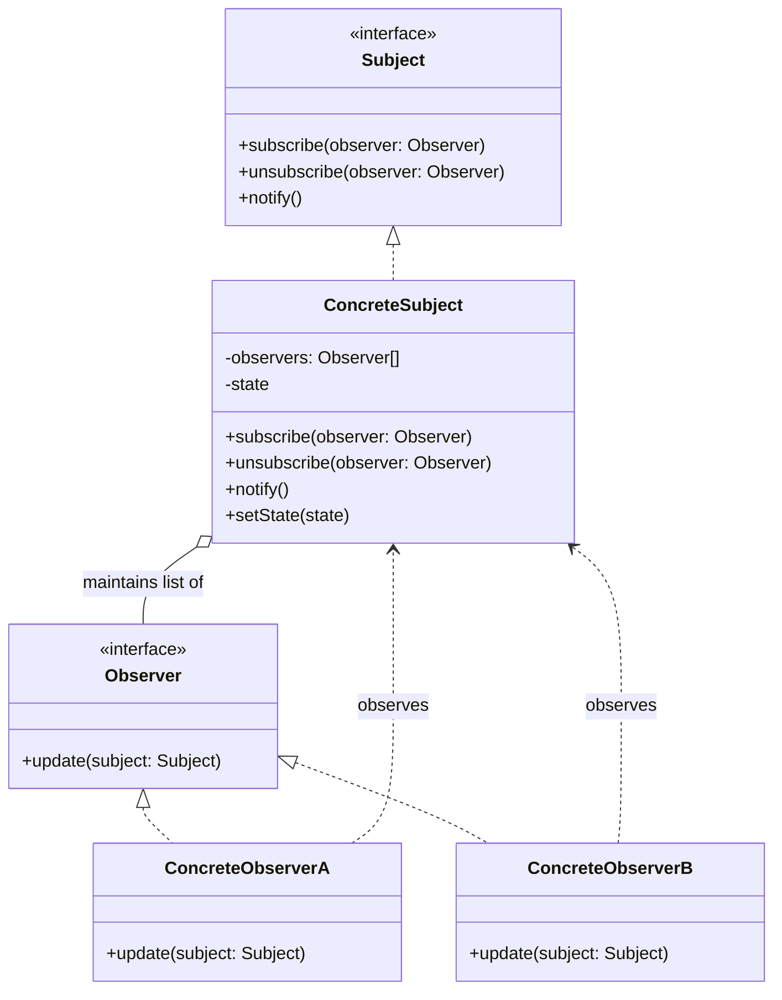

# Observer Pattern: The Newspaper Subscription

The Observer pattern is a behavioral pattern where an object, called the **Subject**, maintains a list of its dependents, called **Observers**, and notifies them automatically of any state changes.

Think of it like a newspaper subscription. The newspaper publisher (the `Subject`) doesn't know or care who its individual subscribers are. It just has a list of addresses. The subscribers (the `Observers`) have given their address to the publisher. When a new edition of the paper is published (a state change), the publisher goes through its list and sends a copy to every address.

The publisher and subscribers are loosely coupled. The publisher doesn't need to know anything about the subscribers other than that they have a "receive paper" function. New subscribers can be added or removed at any time without affecting the publisher.

---

## 1. 🧩 What Problem Does This Solve?

You have a "one-to-many" dependency between objects. When the state of one object (the "one") changes, many other objects need to be updated. You don't want to tightly couple the "one" object to the "many" objects, because:

*   The "one" object shouldn't have to know the concrete classes of the "many" objects.
*   The set of "many" objects might change dynamically at runtime.

**Real-world scenario:**
You're building a simple e-commerce application. You have a `Product` object. When the product's price changes, you need to:
1.  Update the product display on the website.
2.  Notify customers who have the product on their wishlist.
3.  Update the entry in a search index.

**The Naive (and tightly-coupled) Solution:**

```typescript
class Product {
  private price: number;
  // The Product has direct references to all its dependents!
  private display: ProductDisplay;
  private wishlistNotifier: WishlistNotifier;
  private searchIndexer: SearchIndexer;

  setPrice(newPrice: number) {
    this.price = newPrice;
    // It has to call each one manually.
    this.display.update(newPrice);
    this.wishlistNotifier.notify(this.price);
    this.searchIndexer.reindex(this);
  }
}
```
This is a maintenance nightmare.
*   **Tight Coupling:** The `Product` class is coupled to `ProductDisplay`, `WishlistNotifier`, and `SearchIndexer`.
*   **Violates Single Responsibility Principle:** The `Product`'s job is to manage product data, not to know how to update the UI or send notifications.
*   **Not Extensible:** If you want to add a new feature, like logging all price changes, you have to modify the `Product` class itself.

---

## 2. 🧠 Core Idea (No BS Version)

The Observer pattern decouples the subject from its observers.

1.  Define a `Subject` (or `Publisher`) interface. It should have methods for managing subscribers:
    *   `subscribe(observer)`
    *   `unsubscribe(observer)`
    *   `notify()`
2.  Define an `Observer` (or `Subscriber`) interface. It usually has a single method: `update()`.
3.  The **Concrete Subject** implements the `Subject` interface. It holds a list of observers. When its state changes, it calls its own `notify()` method. The `notify()` method then iterates through the list of observers and calls their `update()` method.
4.  **Concrete Observers** implement the `Observer` interface. They register themselves with a subject. When their `update()` method is called by the subject, they can pull the data they need from the subject to update their own state.

---

## 3. 🏗️ Structure Diagram (Mermaid REQUIRED)


The `ConcreteSubject` notifies its `Observers` when its state changes. The observers can then query the subject for its new state.

---

## 4. ⚙️ TypeScript Implementation

Let's fix our e-commerce example.

```typescript
// --- The Interfaces ---

// 2. The Observer Interface
interface Observer {
  // Receives an update from the subject.
  update(subject: Subject): void;
}

// 1. The Subject Interface
interface Subject {
  subscribe(observer: Observer): void;
  unsubscribe(observer: Observer): void;
  notify(): void;
}


// --- The Concrete Subject ---
class Product implements Subject {
  public price: number;
  private observers: Observer[] = [];

  constructor(initialPrice: number) {
    this.price = initialPrice;
  }

  // Subscription management methods
  public subscribe(observer: Observer): void {
    console.log('Subject: Attached an observer.');
    this.observers.push(observer);
  }

  public unsubscribe(observer: Observer): void {
    const observerIndex = this.observers.indexOf(observer);
    if (observerIndex !== -1) {
      this.observers.splice(observerIndex, 1);
      console.log('Subject: Detached an observer.');
    }
  }

  public notify(): void {
    console.log('Subject: Notifying observers...');
    for (const observer of this.observers) {
      observer.update(this);
    }
  }

  // The business logic that triggers the notification
  public setPrice(newPrice: number): void {
    console.log(`\nProduct price changed to ${newPrice}.`);
    this.price = newPrice;
    this.notify();
  }
}


// --- The Concrete Observers ---
class WishlistNotifier implements Observer {
  public update(subject: Subject): void {
    // Type guard to ensure the subject is a Product
    if (subject instanceof Product) {
      console.log(`WishlistNotifier: Product price is now ${subject.price}. Sending notifications to users.`);
    }
  }
}

class SearchIndexer implements Observer {
  public update(subject: Subject): void {
    if (subject instanceof Product) {
      console.log(`SearchIndexer: Product price changed to ${subject.price}. Re-indexing product.`);
    }
  }
}

// --- USAGE ---
const product = new Product(100);

const wishlist = new WishlistNotifier();
product.subscribe(wishlist);

const search = new SearchIndexer();
product.subscribe(search);

// Change the price, which will trigger notifications to all subscribed observers.
product.setPrice(95);

// Unsubscribe one of the observers
product.unsubscribe(search);

// Change the price again. Only the remaining observers will be notified.
product.setPrice(90);
```
The `Product` class is now clean. It has no knowledge of the `WishlistNotifier` or `SearchIndexer`. We can add new observers (like a `PriceChangeLogger`) without modifying the `Product` class at all.

---

## 5. 🔥 Real-World Example

**Event Listeners in UI Frameworks:** This is the most common implementation of the Observer pattern. In JavaScript, you use `addEventListener`.

```javascript
const button = document.getElementById('myButton');

// The button is the "Subject".
// The anonymous function is the "Observer".
// `addEventListener` is the `subscribe` method.
button.addEventListener('click', () => {
  console.log('Button was clicked!');
});
```
The button doesn't know or care what functions are listening to it. It just maintains a list of listeners for the 'click' event and calls all of them when it's clicked.

**Model-View-Controller (MVC) Architecture:** The model is the `Subject`, and the view is the `Observer`. When data in the model changes, it notifies the view, which then updates itself to reflect the new data.

---

## 6. ⚖️ When to Use

*   When changes to the state of one object need to be reflected in other, unrelated objects without keeping the objects tightly coupled.
*   When the set of interested objects changes dynamically.
*   When the subject object shouldn't need to know details about its observers.

---

## 7. 🚫 When NOT to Use

*   When the relationships are simple and static. If a `Product` will *always* and *only* ever update a `ProductDisplay`, a direct call is simpler and more readable.
*   For synchronous, chain-like processing. If you need a request to go through a specific sequence of handlers, the **Chain of Responsibility** pattern is a better fit.

---

## 8. 💣 Common Mistakes

*   **Memory Leaks (The Lapsed Listener Problem):** If an observer is destroyed but doesn't unsubscribe from the subject, the subject will still hold a reference to it. This prevents the observer from being garbage collected, leading to a memory leak. It's crucial to have a reliable way to unsubscribe observers when they are no longer needed (e.g., in a component's lifecycle cleanup method).
*   **Unexpected Update Chains:** An observer, in its `update` method, might decide to change the state of the subject. This can trigger another `notify` call, potentially leading to infinite loops or other unexpected behavior.

---

## 9. 🧠 Interview Notes

*   **How to explain it simply:** "It's a subscription mechanism. You have a 'subject' object and many 'observer' objects. The observers subscribe to the subject. When the subject's state changes, it automatically notifies all its subscribed observers. It's a way to create a one-to-many dependency while keeping the objects loosely coupled."
*   **Key benefit:** "Loose coupling. The subject doesn't know anything about its observers except that they have an 'update' method. You can add or remove observers at any time without changing the subject."

---

## 10. 🆚 Comparison With Similar Patterns

*   **Mediator:** The key difference is intent.
    *   **Observer:** Distributes information in a one-way direction from a subject to its observers. The goal is to keep a set of objects in sync with a source object.
    *   **Mediator:** Centralizes complex, two-way communication between a set of colleague objects. The goal is to prevent a "spaghetti" of connections between objects.
    Often, a Mediator will use the Observer pattern to get notifications from its colleagues.
*   **Chain of Responsibility:** CoR passes a request sequentially along a chain until it's handled. Observer broadcasts a notification to all subscribers.
