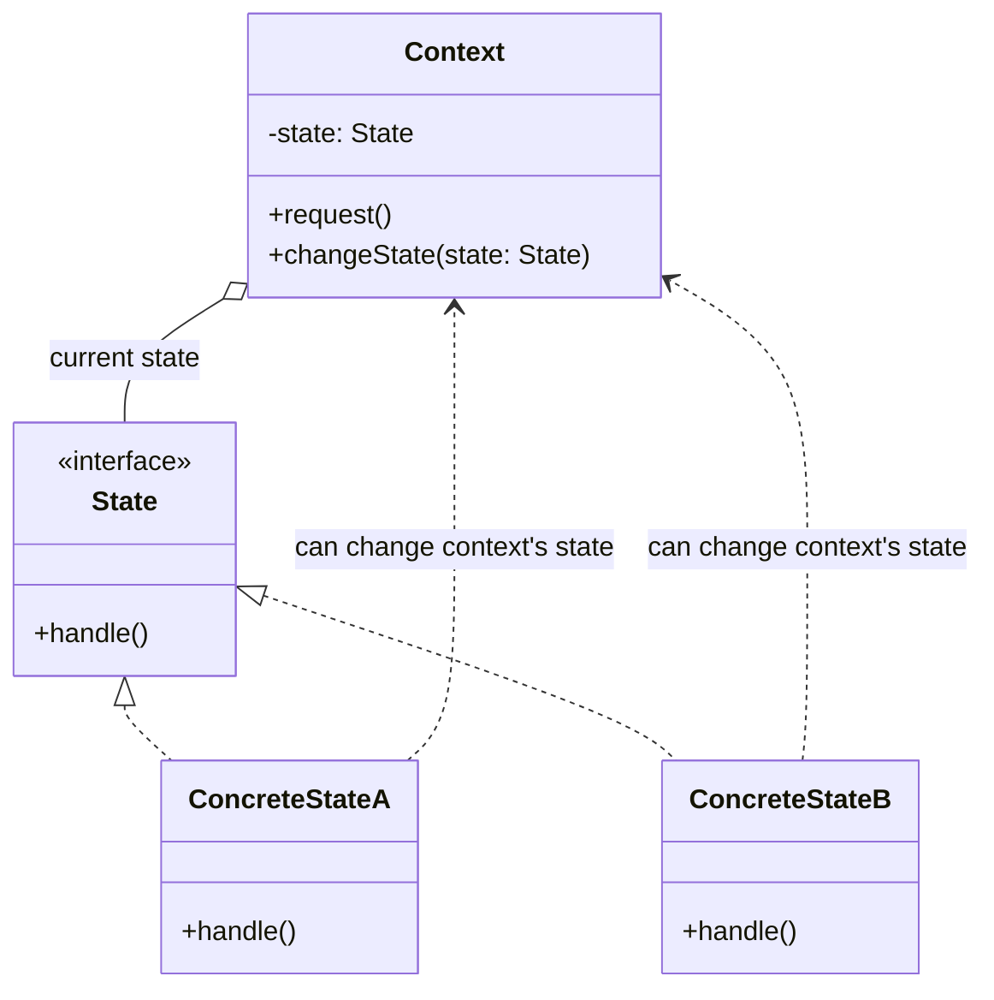

# State Pattern: The Object with a Personality Disorder

The State pattern is a behavioral pattern that allows an object to **alter its behavior when its internal state changes**. The object appears to change its class.

Think of it like a chameleon. A chameleon (the `Context` object) changes its color (its `behavior`) depending on its surroundings (its `state`). When it's on a leaf, it might be in the "Green State." When it's on a branch, it might transition to the "Brown State." To an outside observer, it looks like you're dealing with a completely different animal, but it's the same chameleon, just behaving differently.

The pattern extracts the state-specific logic into a set of separate `State` classes. The main object, called the `Context`, holds a reference to one of these state objects, which represents its current state, and delegates all the state-specific work to it.

---

## 1. 🧩 What Problem Does This Solve?

You have an object that behaves differently depending on its current state. The most direct way to implement this is with a massive `if/else` or `switch` statement in every method of the object.

**Real-world scenario:**
You're modeling a simple document publishing workflow. A `Document` can be in one of three states: `Draft`, `Moderation`, or `Published`. The behavior of the `render()` method changes based on the state:
*   In `Draft` state, only the author can render it.
*   In `Moderation` state, only moderators can render it.
*   In `Published` state, anyone can render it.

**The Naive (and ugly) Solution:**

```typescript
class Document {
  private state: 'Draft' | 'Moderation' | 'Published';
  private userRole: 'Author' | 'Moderator' | 'Public';

  public render() {
    switch (this.state) {
      case 'Draft':
        if (this.userRole === 'Author') {
          console.log('Rendering draft content...');
        } else {
          throw new Error('Not allowed');
        }
        break;
      case 'Moderation':
        if (this.userRole === 'Moderator' || this.userRole === 'Author') {
          console.log('Rendering content for moderation...');
        } else {
          throw new Error('Not allowed');
        }
        break;
      case 'Published':
        console.log('Rendering published content for everyone...');
        break;
    }
  }

  public publish() {
    switch (this.state) {
      case 'Draft':
        this.state = 'Moderation';
        break;
      case 'Moderation':
        this.state = 'Published';
        break;
      case 'Published':
        // Do nothing
        break;
    }
  }
  // ... and more methods with the same switch statement
}
```
This is a classic state machine implemented with conditionals. It's bad because:
*   **Violates Open/Closed Principle:** Adding a new state (e.g., `Archived`) requires modifying the `switch` statement in *every single method*.
*   **Code Duplication:** The state-checking logic is repeated everywhere.
*   **Hard to Read:** The logic for what it means to be in the "Draft" state is scattered across multiple methods.

---

## 2. 🧠 Core Idea (No BS Version)

The State pattern moves the state-specific logic into separate objects.

1.  Define a `State` interface that mirrors the methods of the main object that depend on the state (e.g., `render()`, `publish()`).
2.  Create a **Concrete State** class for each possible state (`DraftState`, `ModerationState`, `PublishedState`). Each class implements the state-specific behavior for its corresponding state.
3.  The main object, now called the **Context** (`Document`), holds a reference to a `State` object. This represents its current state.
4.  The Context delegates the state-dependent methods to its current `State` object.
5.  Crucially, the `State` objects are responsible for **transitioning** the Context to a new state. For example, when you call `publish()` on the `DraftState` object, it will tell the `Document` (Context) to change its state to a new `ModerationState`.

---

## 3. 🏗️ Structure Diagram (Mermaid REQUIRED)


The `Context` delegates its behavior to the current `State` object. The `State` objects can change the `Context`'s state, effectively changing the `Context`'s behavior from the outside.

---

## 4. ⚙️ TypeScript Implementation

Let's fix our document publishing workflow.

```typescript
// --- The Context Class ---
// It maintains a reference to the current state and delegates work to it.
class Document {
  private state: State;

  constructor() {
    // A document starts in the Draft state.
    this.state = new DraftState(this);
  }

  // The context allows changing the State object at runtime.
  public transitionTo(state: State): void {
    console.log(`Context: Transitioning to ${state.constructor.name}.`);
    this.state = state;
  }

  // The context delegates part of its behavior to the current State object.
  public render(): void {
    this.state.render();
  }

  public publish(): void {
    this.state.publish();
  }
}

// --- The State Hierarchy ---

// 1. The State Interface
interface State {
  render(): void;
  publish(): void;
}

// 2. Concrete States
class DraftState implements State {
  protected document: Document;

  constructor(doc: Document) {
    this.document = doc;
  }

  public render(): void {
    console.log('DraftState: Rendering document as a draft.');
  }

  public publish(): void {
    console.log('DraftState: Moving document to moderation.');
    // The state is responsible for the transition.
    this.document.transitionTo(new ModerationState(this.document));
  }
}

class ModerationState implements State {
  protected document: Document;

  constructor(doc: Document) {
    this.document = doc;
  }

  public render(): void {
    console.log('ModerationState: Rendering document for moderation.');
  }

  public publish(): void {
    console.log('ModerationState: Approving document. Moving to published.');
    this.document.transitionTo(new PublishedState(this.document));
  }
}

class PublishedState implements State {
  protected document: Document;

  constructor(doc: Document) {
    this.document = doc;
  }

  public render(): void {
    console.log('PublishedState: Rendering published document.');
  }

  public publish(): void {
    console.log('PublishedState: Document is already published. No action taken.');
  }
}

// --- USAGE ---
const doc = new Document();

console.log('--- Initial State: Draft ---');
doc.render(); // Renders as draft

console.log('\n--- Publishing from Draft ---');
doc.publish(); // Transitions to Moderation
doc.render(); // Renders for moderation

console.log('\n--- Publishing from Moderation ---');
doc.publish(); // Transitions to Published
doc.render(); // Renders as published

console.log('\n--- Publishing from Published ---');
doc.publish(); // Does nothing
doc.render(); // Still renders as published
```
All the `if/else` logic is gone. The logic for each state is neatly encapsulated in its own class. To add an `Archived` state, we just create a new `ArchivedState` class; we don't have to touch any of the existing state classes or the `Document` class.

---

## 5. 🔥 Real-World Example

**Vending Machines:** A vending machine is a classic state machine. It can be in states like `NoCoinState`, `HasCoinState`, `SoldState`, `EmptyState`.
*   In `NoCoinState`, inserting a coin transitions it to `HasCoinState`. Pressing a button does nothing.
*   In `HasCoinState`, inserting another coin might be rejected. Pressing a button transitions it to `SoldState`.
*   In `SoldState`, it dispenses the item and transitions back to `NoCoinState` (or `EmptyState`).

Each state handles the user's actions (inserting a coin, pressing a button) differently.

---

## 6. ⚖️ When to Use

*   When you have an object that behaves differently depending on its current state, and the number of states is large and changes frequently.
*   When the object's methods contain long, complex conditional statements that check the object's current state.
*   When you want to localize the logic for each state into its own class.

---

## 7. 🚫 When NOT to Use

*   When you only have a few states and the logic doesn't change often. A simple `if/else` or `switch` might be more straightforward and easier to read. The State pattern adds a lot of new classes, which can be overkill for simple cases.

---

## 8. 💣 Common Mistakes

*   **Context vs. State Responsibility:** Deciding where to put the transition logic can be tricky. Should the `Context` decide when to transition, or should the `State` objects decide? Placing the transition logic in the `State` objects (as in the example above) is generally more flexible and compliant with the Open/Closed Principle.
*   **Creating new State objects:** In the example, we create `new` state objects for every transition. If the state objects don't have any internal state of their own, you can make them Singletons (Flyweights) and reuse them to save memory.

---

## 9. 🧠 Interview Notes

*   **How to explain it simply:** "It's a pattern for managing an object's behavior as its state changes. You create separate classes for each possible state, and the main object (the 'context') delegates its work to its current state object. It's an object-oriented way to implement a state machine, avoiding big, messy conditional blocks."
*   **Key benefit:** "It cleans up your code by removing complex `if/else` or `switch` statements and putting the logic for each state into its own class. This makes it much easier to add new states without changing existing code, following the Open/Closed Principle."

---

## 10. 🆚 Comparison With Similar Patterns

*   **Strategy:** The State and Strategy patterns have identical structures, but their *intent* is different.
    *   **Strategy:** Is about having different ways to *do* something. The client usually provides the strategy object to the context. The focus is on having interchangeable algorithms.
    *   **State:** Is about an object's behavior changing *on its own* as its internal state changes. The context or the state objects themselves are responsible for the state transitions. The focus is on managing state transitions.
*   **Bridge:** The Bridge pattern is designed to separate an abstraction from its implementation so they can vary independently. It's a structural pattern for organizing classes up-front. The State pattern is a behavioral pattern for managing how an object behaves over its lifetime.
