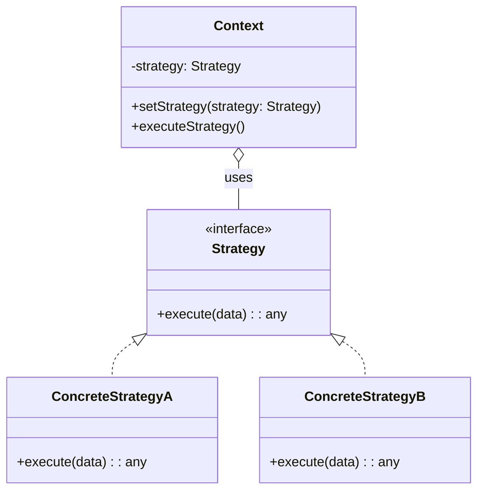

# Strategy Pattern: The Algorithm Swapper

The Strategy pattern is a behavioral pattern that enables selecting an algorithm at runtime. Instead of implementing a single algorithm directly, code receives run-time instructions as to which in a family of algorithms to use.

Think of it like a GPS navigation app. You (the `Context`) want to get from point A to point B. The app can offer you several different routes (the `Strategies`): the fastest route, the shortest route, the route that avoids tolls, or a scenic route. You can choose which strategy you want to use, and the app will execute it. You can even switch strategies mid-trip.

The key idea is to extract these different algorithms into separate classes with a common interface.

---

## 1. 🧩 What Problem Does This Solve?

You have a class that needs to perform some action, but there are multiple different ways (algorithms) to do it. You don't want to couple the class to a specific algorithm, and you want to be able to add new algorithms easily.

**Real-world scenario:**
You're building an e-commerce checkout system. You need to calculate the shipping cost for an order. The calculation method depends on the shipping company the user chooses: FedEx, UPS, or USPS.

**The Naive (and rigid) Solution:**

You could put all the logic inside the `Order` class using a big `if/else` or `switch` statement.

```typescript
class Order {
  public shippingMethod: 'FedEx' | 'UPS' | 'USPS';
  public weight: number;

  public calculateShippingCost(): number {
    switch (this.shippingMethod) {
      case 'FedEx':
        // Complex FedEx calculation logic
        return this.weight * 3.5;
      case 'UPS':
        // Complex UPS calculation logic
        return this.weight * 4.0;
      case 'USPS':
        // Complex USPS calculation logic
        return this.weight * 2.8;
      default:
        return 0;
    }
  }
}
```
This is bad because:
*   **Violates Open/Closed Principle:** To add a new shipping company (e.g., DHL), you have to modify the `Order` class.
*   **Violates Single Responsibility Principle:** The `Order` class shouldn't be responsible for knowing the details of every shipping company's pricing structure. Its job is to manage order details.
*   **Hard to Test:** You have to test the `Order` class with every possible shipping method.

---

## 2. 🧠 Core Idea (No BS Version)

The Strategy pattern extracts these algorithms into separate objects called "strategies."

1.  Define a `Strategy` interface that is common to all the different algorithms (e.g., `calculate(order)`).
2.  Create **Concrete Strategy** classes that implement this interface. Each class contains the logic for one specific algorithm (e.g., `FedExStrategy`, `UPSStrategy`).
3.  The main object, called the **Context** (e.g., the `Order` class), holds a reference to a `Strategy` object.
4.  The Context doesn't perform the action itself. It delegates the work to the strategy object it's holding.
5.  The client code is responsible for creating the appropriate strategy and passing it to the context.

---

## 3. 🏗️ Structure Diagram (Mermaid REQUIRED)


The `Context` is configured with a `ConcreteStrategy` and delegates the work to it. The `Context` is not aware of the specific type of strategy it's using; it only knows the `Strategy` interface.

---

## 4. ⚙️ TypeScript Implementation

Let's fix our shipping cost calculator.

```typescript
// --- The Context Class (for this example, it's just the order data) ---
class Order {
  constructor(public weight: number, public destination: string) {}
}

// 1. The Strategy Interface
interface ShippingStrategy {
  calculate(order: Order): number;
}

// 2. Concrete Strategies
class FedExStrategy implements ShippingStrategy {
  calculate(order: Order): number {
    console.log('Calculating shipping cost with FedEx...');
    // In a real app, this would be complex logic.
    return order.weight * 3.5;
  }
}

class UPSStrategy implements ShippingStrategy {
  calculate(order: Order): number {
    console.log('Calculating shipping cost with UPS...');
    return order.weight * 4.0;
  }
}

class USPSStrategy implements ShippingStrategy {
  calculate(order: Order): number {
    console.log('Calculating shipping cost with USPS...');
    return order.weight * 2.8;
  }
}

// 3. The Context that uses the strategy
class ShippingCostCalculator {
  private strategy: ShippingStrategy;

  // The strategy is injected via the constructor or a setter.
  constructor(strategy: ShippingStrategy) {
    this.strategy = strategy;
  }

  public setStrategy(strategy: ShippingStrategy): void {
    this.strategy = strategy;
  }

  public calculate(order: Order): number {
    // The context delegates the calculation to its strategy object.
    return this.strategy.calculate(order);
  }
}

// --- USAGE (The Client) ---

const order = new Order(10, '123 Main St');

// Scenario 1: User chooses FedEx
console.log('--- User selects FedEx ---');
const fedexStrategy = new FedExStrategy();
const calculator = new ShippingCostCalculator(fedexStrategy);
let cost = calculator.calculate(order);
console.log(`FedEx Shipping Cost: $${cost}`);

// Scenario 2: User changes their mind and chooses UPS
console.log('\n--- User selects UPS ---');
const upsStrategy = new UPSStrategy();
calculator.setStrategy(upsStrategy);
cost = calculator.calculate(order);
console.log(`UPS Shipping Cost: $${cost}`);
```
The `ShippingCostCalculator` is completely decoupled from the specific calculation logic. We can add a `DHLStrategy` without touching the calculator or any of the existing strategies. Each algorithm is neatly encapsulated in its own class.

---

## 5. 🔥 Real-World Example

**Sorting:** A `Sorter` class could be configured with different sorting strategies. You could pass it a `QuickSortStrategy`, a `MergeSortStrategy`, or a `BubbleSortStrategy` (if you're feeling nostalgic). The `Sorter` class itself doesn't know how to sort; it just knows how to call the `sort()` method on whatever strategy object it's given.

**Image Compression:** An image saving service could use different strategies for compression. A `PNGCompressionStrategy` would provide lossless compression, while a `JPEGCompressionStrategy` would provide lossy compression. The user could choose the strategy based on their quality requirements.

---

## 6. ⚖️ When to Use

*   When you want to use different variants of an algorithm within an object and be able to switch from one algorithm to another during runtime.
*   When you have a lot of similar classes that only differ in the way they execute some behavior.
*   To isolate the business logic of a class from the implementation details of its algorithms.

---

## 7. 🚫 When NOT to Use

*   When you only have one algorithm and it's unlikely to change. The pattern adds complexity that isn't justified in this case.
*   When the algorithms are very simple. A simple conditional might be more readable than creating a whole new set of classes.

---

## 8. 💣 Common Mistakes

*   **Over-engineering:** Applying the pattern for every minor variation in logic. Sometimes a simple function parameter is enough.
*   **Making the Strategy interface too broad:** The interface should be focused on a single task or algorithm. If your strategy interface has multiple methods, it might be a sign that it's doing too much and should be broken down.

---

## 9. 🧠 Interview Notes

*   **How to explain it simply:** "It's a pattern for swapping out algorithms at runtime. You define a family of algorithms, put each of them into a separate class, and make their objects interchangeable. The main object, called the context, holds a reference to one of these strategy objects and delegates the work to it."
*   **Key benefit:** "It lets you vary the algorithm independently from the client that uses it. It follows the Open/Closed Principle because you can introduce new strategies without changing the context's code."

---

## 10. 🆚 Comparison With Similar Patterns

*   **State:** The State and Strategy patterns are structurally identical, but their *intent* is different.
    *   **Strategy:** Focuses on providing different ways to do something, and the client usually chooses the algorithm.
    *   **State:** Focuses on an object's behavior changing as its internal state changes. The state transitions are managed internally by the context or the state objects themselves.
*   **Command:** A Command encapsulates an action to be executed later. A Strategy encapsulates an algorithm to be executed now. However, a command could be parameterized with a strategy to perform its action.
*   **Template Method:** The Template Method pattern uses inheritance to vary parts of an algorithm. The overall skeleton of the algorithm is fixed in a base class. The Strategy pattern uses composition to vary the entire algorithm. It's a classic example of "inheritance vs. composition."
