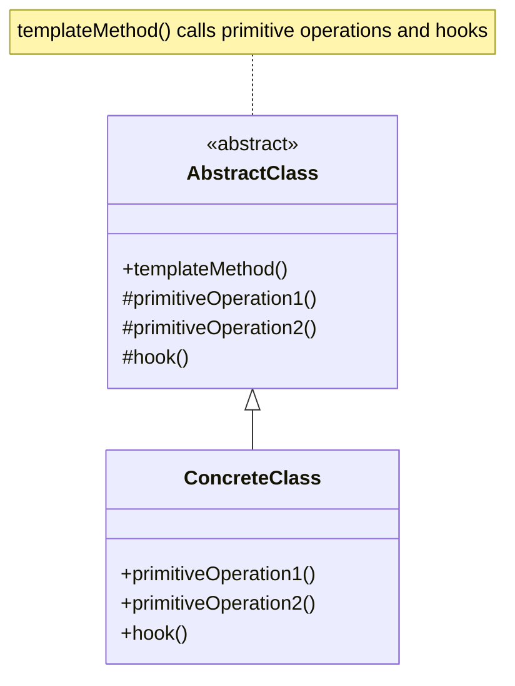

# Template Method Pattern: The Fill-in-the-Blanks Algorithm

The Template Method is a behavioral design pattern that defines the **skeleton of an algorithm** in a base class but lets subclasses override specific steps of the algorithm without changing its structure.

Think of it like making a sandwich. The "make sandwich" algorithm is always the same:
1.  Get two slices of bread.
2.  Add the main fillings.
3.  Add condiments.
4.  Put the slices of bread together.

This is the "template method." The base `Sandwich` class would define this structure. Now, you can have subclasses like `HamSandwich` or `VeggieSandwich`. They don't redefine the whole algorithm. The `HamSandwich` subclass would just override the "add main fillings" step to add ham and cheese. The `VeggieSandwich` would override it to add lettuce and tomato. The overall process remains the same, but the specific details can change.

---

## 1. 🧩 What Problem Does This Solve?

You have several classes that perform a similar process, but with some minor differences. If you implement the whole process in each class, you end up with a lot of duplicate code.

**Real-world scenario:**
You're building a data processing tool that can read data from different sources (CSV, JSON), process it, and then save a report. The overall process is the same for all data types:
1.  Open the file.
2.  Parse the data.
3.  Analyze the data.
4.  Generate a report.
5.  Close the file.

The `analyze` and `generate report` steps are always the same. However, the `open`, `parse`, and `close` steps are different for CSV and JSON files.

**The Naive (and duplicative) Solution:**

```typescript
class CsvDataProcessor {
  process() {
    console.log('Opening CSV file...'); // Specific
    console.log('Parsing CSV data...'); // Specific
    console.log('Analyzing data...'); // Generic
    console.log('Generating report...'); // Generic
    console.log('Closing CSV file...'); // Specific
  }
}

class JsonDataProcessor {
  process() {
    console.log('Opening JSON file...'); // Specific
    console.log('Parsing JSON data...'); // Specific
    console.log('Analyzing data...'); // Generic (Duplicated!)
    console.log('Generating report...'); // Generic (Duplicated!)
    console.log('Closing JSON file...'); // Specific
  }
}
```
The generic steps (`Analyzing data`, `Generating report`) are duplicated in both classes. If you need to change the analysis logic, you have to change it in multiple places.

---

## 2. 🧠 Core Idea (No BS Version)

The Template Method pattern uses inheritance to solve this problem.

1.  Create an **Abstract Base Class** (the "template").
2.  Implement a **Template Method** in this base class. This method defines the skeleton of the algorithm and calls a series of other methods to perform the actual steps. This method should be `final` (or non-overridable) to prevent subclasses from changing the algorithm's structure.
3.  Some of the steps in the template method can be implemented directly in the base class if they are generic and don't change.
4.  Other steps are declared as **abstract methods** (the "blanks" to be filled in). These must be implemented by the subclasses.
5.  Optionally, you can have "hooks," which are methods with a default (but empty) implementation in the base class. Subclasses can optionally override hooks to provide extra, non-essential steps.
6.  **Concrete Subclasses** extend the base class and provide their own implementations for the abstract methods and hooks.

---

## 3. 🏗️ Structure Diagram (Mermaid REQUIRED)


The `templateMethod()` is the core of the pattern. It defines the fixed sequence of calls. `primitiveOperation1()` and `primitiveOperation2()` are the abstract steps that `ConcreteClass` must implement. `hook()` is an optional step that can be overridden.

---

## 4. ⚙️ TypeScript Implementation

Let's fix our data processing example.

```typescript
// 1. The Abstract Base Class
abstract class DataProcessor {
  // 2. The Template Method. It's the main entry point.
  public process(): void {
    this.openFile();
    this.parseData();
    this.analyzeData(); // Generic step
    this.generateReport(); // Generic step
    this.closeFile();
    this.hook(); // Optional step
  }

  // 3. Generic steps implemented in the base class.
  private analyzeData(): void {
    console.log('Analyzing data: Finding patterns and insights...');
  }

  private generateReport(): void {
    console.log('Generating report: Creating charts and summaries...');
  }

  // 4. Abstract methods to be implemented by subclasses.
  protected abstract openFile(): void;
  protected abstract parseData(): void;
  protected abstract closeFile(): void;

  // 5. A hook. Subclasses can override this, but it's not required.
  protected hook(): void {}
}

// 6. Concrete Subclasses
class CsvDataProcessor extends DataProcessor {
  protected openFile(): void {
    console.log('Opening CSV file...');
  }
  protected parseData(): void {
    console.log('Parsing data from CSV format...');
  }
  protected closeFile(): void {
    console.log('Closing CSV file.');
  }
  // Overriding the hook
  protected hook(): void {
    console.log('CSV Processor Hook: Archiving the file.');
  }
}

class JsonDataProcessor extends DataProcessor {
  protected openFile(): void {
    console.log('Opening JSON file...');
  }
  protected parseData(): void {
    console.log('Parsing data from JSON format...');
  }
  protected closeFile(): void {
    console.log('Closing JSON file.');
  }
  // This class chooses not to override the hook.
}

// --- USAGE ---
console.log('--- Processing a CSV file ---');
const csvProcessor = new CsvDataProcessor();
csvProcessor.process();

console.log('\n--- Processing a JSON file ---');
const jsonProcessor = new JsonDataProcessor();
jsonProcessor.process();
```
The duplicate code is gone. The overall algorithm is defined in one place (`DataProcessor.process`), and the specific variations are neatly encapsulated in the subclasses.

---

## 5. 🔥 Real-World Example

**Backend Frameworks:** Many web frameworks use the Template Method pattern for things like request handling. A base `Controller` class might have a `handleRequest` template method that looks like this:
1.  `deserializeRequest()` (abstract)
2.  `authenticate()` (hook)
3.  `validate()` (abstract)
4.  `processBusinessLogic()` (abstract)
5.  `serializeResponse()` (abstract)

Your concrete controller class would then just fill in the blanks for deserializing, validating, and processing for that specific endpoint.

---

## 6. ⚖️ When to Use

*   When you want to let subclasses implement variable parts of an algorithm without changing the algorithm's structure.
*   When you have several classes that contain almost identical algorithms with some minor differences. By extracting the common parts into a base class, you can avoid code duplication.

---

## 7. 🚫 When NOT to Use

*   When the algorithm changes drastically between implementations. If the subclasses need to change the actual *structure* of the algorithm, this pattern is too restrictive. In that case, the **Strategy** pattern, which uses composition, is a better fit.

---

## 8. 💣 Common Mistakes

*   **Violating the Liskov Substitution Principle:** Subclasses should not do things that contradict the base class's assumptions. For example, a primitive operation shouldn't have a side effect that breaks a later step in the template method.
*   **Making the template method overridable:** The whole point of the pattern is to fix the skeleton of the algorithm. If subclasses can override the template method itself, the pattern loses its purpose.

---

## 9. 🧠 Interview Notes

*   **How to explain it simply:** "It's a pattern where you define the basic steps of an algorithm in a base class, but let subclasses provide the implementation for some of those steps. It's like a fill-in-the-blanks quiz. The base class gives you the questions (the structure), and the subclasses provide the answers (the implementation)."
*   **Key benefit:** "It promotes code reuse and avoids duplication. The common parts of the algorithm are defined in one place, in the base class."
*   **Template Method vs. Strategy:** "Template Method uses **inheritance** to vary parts of an algorithm. Strategy uses **composition** to vary the entire algorithm. If you only need to change a few specific steps, Template Method is often simpler. If you need to replace the entire algorithm, Strategy is more flexible."

---

## 10. 🆚 Comparison With Similar Patterns

*   **Strategy:** As mentioned, this is the classic "inheritance vs. composition" debate. Strategy is generally more flexible because you can switch strategies at runtime, whereas with Template Method, the implementation is fixed once you instantiate a concrete class.
*   **Factory Method:** Factory Method is a specialized version of the Template Method. A factory method is a method that subclasses must implement to create an object. A template method can call factory methods.
