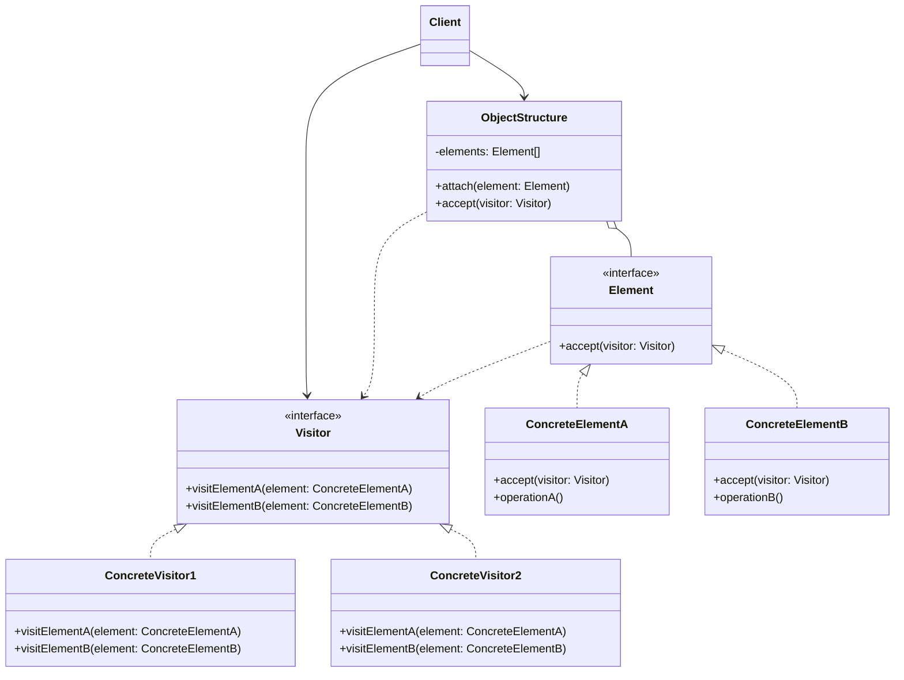

# Visitor Pattern: The Itinerant Operations Expert

The Visitor pattern is one of the most complex and powerful behavioral patterns. It provides a way of **separating an algorithm from an object structure on which it operates**. Essentially, it lets you add new operations to existing object structures without modifying those structures.

Think of it like a tax accountant visiting a company. The company has a structure of different departments: Engineering, Sales, HR, etc. (these are the `Elements`). The tax accountant (the `Visitor`) needs to perform an operation (calculate tax liability) on each department.

Instead of each department knowing how to calculate its own tax liability, the accountant "visits" each one. The department simply says, "Hi, I'm the Engineering department." The accountant then says, "Ah, for an Engineering department, I need to do X, Y, and Z." The logic for the operation is entirely within the accountant, not the departments. If a new law requires a different kind of audit (a new operation), you just hire a new kind of auditor (a new visitor); you don't have to change the structure of the company's departments at all.

---

## 1. 🧩 What Problem Does This Solve?

You have a complex object structure, like a Composite tree. You need to perform several different, unrelated operations on the objects in this structure.

If you put the logic for every operation inside the object classes themselves, you get a few problems:
*   **Violates Single Responsibility Principle:** A `Customer` class shouldn't be responsible for knowing how to export itself to XML, JSON, and CSV. Its job is to manage customer data.
*   **Violates Open/Closed Principle:** Every time you want to add a new operation (e.g., "export to YAML"), you have to modify *every single class* in your object structure to add the new method.
*   **Code is scattered:** The logic for the "XML export" operation is spread across all the different classes.

---

## 2. 🧠 Core Idea (No BS Version)

The Visitor pattern moves the operational logic into a separate "visitor" class. This is achieved through a clever trick called **double dispatch**.

1.  Define a `Visitor` interface. It must have a `visit()` method for **each concrete element type** in the object structure (e.g., `visitCustomer(customer)`, `visitOrder(order)`).
2.  Define an `Element` interface. It must have a single method: `accept(visitor: Visitor)`.
3.  Each **Concrete Element** (`Customer`, `Order`) implements the `Element` interface. Its `accept` method is just one line: `visitor.visitCustomer(this)` or `visitor.visitOrder(this)`.
4.  Create **Concrete Visitor** classes that implement the `Visitor` interface. Each visitor contains the logic for one specific operation (e.g., `XMLExportVisitor`, `JSONExportVisitor`).
5.  The **Client** creates a visitor object and makes it "visit" all the elements in the structure by calling their `accept` methods.

**The Double Dispatch Trick:**
1.  The client calls `element.accept(visitor)`. This is the first dispatch. The program chooses which `accept` method to call based on the element's concrete type.
2.  Inside the `accept` method, the element calls `visitor.visitSomeElement(this)`. This is the second dispatch. Now, the program chooses which `visit` method to call based on both the visitor's concrete type and the element's concrete type (which is now known because it was passed as `this`).

This allows the visitor to execute the correct code for the correct element type.

---

## 3. 🏗️ Structure Diagram (Mermaid REQUIRED)



---

## 4. ⚙️ TypeScript Implementation

Let's model a document with different elements (paragraphs and images) and create a visitor to export it to HTML.

```typescript
// --- The Visitor Interface ---
// It must have a visit method for each concrete element.
interface DocumentVisitor {
  visitParagraph(paragraph: Paragraph): void;
  visitImage(image: Image): void;
}

// --- The Element Hierarchy ---

// 1. The Element Interface
interface DocumentElement {
  accept(visitor: DocumentVisitor): void;
}

// 2. Concrete Elements
class Paragraph implements DocumentElement {
  constructor(public text: string) {}

  // The magic of double dispatch happens here.
  accept(visitor: DocumentVisitor): void {
    visitor.visitParagraph(this);
  }
}

class Image implements DocumentElement {
  constructor(public src: string) {}

  accept(visitor: DocumentVisitor): void {
    visitor.visitImage(this);
  }
}

// --- The Concrete Visitor ---
// This class contains the logic for a specific operation.
class HtmlExportVisitor implements DocumentVisitor {
  private output = '';

  visitParagraph(paragraph: Paragraph): void {
    this.output += `<p>${paragraph.text}</p>\n`;
  }

  visitImage(image: Image): void {
    this.output += `\n`;
  }

  getHtml(): string {
    return this.output;
  }
}

// Another concrete visitor for a different operation
class MarkdownExportVisitor implements DocumentVisitor {
    private output = '';
  
    visitParagraph(paragraph: Paragraph): void {
      this.output += `${paragraph.text}\n\n`;
    }
  
    visitImage(image: Image): void {
      this.output += `\n\n`;
    }
  
    getMarkdown(): string {
      return this.output;
    }
  }

// --- USAGE (The Client) ---

// The object structure
const documentElements: DocumentElement[] = [
  new Paragraph('This is the first paragraph.'),
  new Image('cat_photo.jpg'),
  new Paragraph('This is the second paragraph.'),
];

// Use the HTML visitor
console.log('--- Exporting to HTML ---');
const htmlVisitor = new HtmlExportVisitor();
for (const element of documentElements) {
  element.accept(htmlVisitor);
}
console.log(htmlVisitor.getHtml());

// Use the Markdown visitor. Note that we didn't change the element classes at all.
console.log('--- Exporting to Markdown ---');
const markdownVisitor = new MarkdownExportVisitor();
for (const element of documentElements) {
    element.accept(markdownVisitor);
}
console.log(markdownVisitor.getMarkdown());
```
We were able to add a completely new "export to Markdown" functionality without touching the `Paragraph` or `Image` classes. We just created a new visitor.

---

## 5. 🔥 Real-World Example

**Compilers and Abstract Syntax Trees (ASTs):** This is the canonical example. A compiler parses source code into an AST (a big Composite tree). Then, different visitors traverse the tree to perform operations:
*   A `TypeCheckingVisitor` traverses the tree to check for type errors.
*   An `OptimizationVisitor` traverses the tree to apply optimizations.
*   A `CodeGenerationVisitor` traverses the tree to generate machine code or bytecode.

The structure of the AST nodes (`IfStatement`, `VariableDeclaration`, etc.) remains stable. New compiler features can be added by creating new visitors.

---

## 6. ⚖️ When to Use

*   When you need to perform an operation on all elements of a complex object structure (e.g., a Composite tree).
*   When you want to avoid cluttering your element classes with logic for different operations.
*   When the set of operations needs to change frequently, but the object structure itself is stable.

---

## 7. 🚫 When NOT to Use

*   **When the object structure changes frequently.** This is the biggest drawback of the Visitor pattern. If you add a new `Video` element class, you have to update the `Visitor` interface to add a `visitVideo()` method. This, in turn, forces you to update *every single concrete visitor class* to implement the new method. The pattern makes it easy to add new operations but hard to add new elements.
*   When you don't need to perform operations on a whole structure, or when the operations are simple and few.

---

## 8. 💣 Common Mistakes

*   **Breaking Encapsulation:** For a visitor to do its job, it often needs access to the internal state of the elements it's visiting. This can lead to making fields public that should have been private, thus breaking encapsulation. This is a trade-off you have to accept when using this pattern.
*   **Using it when the hierarchy isn't stable:** As mentioned, this is the anti-pattern. If your element classes are constantly in flux, Visitor will cause more pain than it solves.

---

## 9. 🧠 Interview Notes

*   **How to explain it simply:** "It's a pattern for adding new operations to a set of classes without changing the classes themselves. You create a 'visitor' object that has a separate method for dealing with each class. You then 'accept' the visitor into your object structure, and it performs its operation as it traverses the structure. It's a way to separate algorithms from the objects they operate on."
*   **Key trade-off:** "The Visitor pattern makes it very easy to add new **operations** (just create a new visitor), but very hard to add new **element types** (because you have to update all existing visitors). You use it when your object structure is stable, but the operations you perform on it are not."

---

## 10. 🆚 Comparison With Similar Patterns

*   **Iterator:** An Iterator is for traversing a structure. A Visitor is for performing an operation on a structure. You can use an Iterator to help a Visitor traverse a structure.
*   **Command:** A Command encapsulates a single action. A Visitor encapsulates a set of related actions for different classes in a structure.
