# Processes and Filesystems

🟢 **Fundamentals**

---

## Why This Matters for DevOps

When your Docker container crashes, Kubernetes pod hangs, or deployment fails, you need to understand **what's actually happening at the OS level**.

You're not trying to become a Linux kernel developer. You're building a **mental model** so you can:
- Debug why your process is using 100% CPU
- Understand what a container *actually* is
- Know why your filesystem is full but `df` says otherwise
- Read logs that mention "PID", "inode", "fork", "signal"

---

## Processes: What They Actually Are

### Definition
A **process** is a running instance of a program.

But what does that *mean*?

```mermaid
graph TD
    A["Your program: main.go<br/>(text file on disk)"] -->|compile| B["Executable: ./myapp<br/>(binary on disk)"]
    B -->|run it| C["Process: Running instance in memory<br/>• Has a PID (process ID)<br/>• Has memory allocated<br/>• Has CPU time scheduled<br/>• Has file descriptors<br/>• Has an owner (user)"]
    
    style A fill:#ffe,stroke:#333,stroke-width:2px
    style B fill:#ffd,stroke:#333,stroke-width:2px
    style C fill:#bfb,stroke:#333,stroke-width:2px
```



---

### Viewing Processes

#### On Fedora (or any Linux):

```bash
# List all processes
ps aux

# More readable tree view
ps auxf

# Better: htop (install if needed)
sudo dnf install htop
htop
```

**Key columns:**
- `PID` — Process ID (unique number)
- `USER` — Who owns this process
- `%CPU` — CPU usage
- `%MEM` — Memory usage
- `COMMAND` — What's running

---

### Process Lifecycle


---

### Zombie Processes (Yes, Really)

A **zombie** is a process that has finished but hasn't been "reaped" by its parent.

**Why it exists:**
- Child process calls `exit(0)`
- Parent process needs to call `wait()` to read exit status
- Until then, the child is a zombie (defunct)

**How to see them:**
```bash
ps aux | grep defunct
```

**Why you care:**
- Zombies don't use CPU or memory (they're dead)
- But they still occupy a PID
- Too many zombies → can't create new processes (PID exhaustion)

**Common cause in Docker:**
- PID 1 doesn't reap children properly
- Solution: Use `tini` or `dumb-init` as PID 1

---

### Process Signals

**Signals** are how the OS communicates with processes.

Common signals:

| Signal | Number | Meaning | Can be caught? |
|--------|--------|---------|----------------|
| SIGTERM | 15 | "Please exit gracefully" | ✅ Yes |
| SIGKILL | 9 | "Die immediately" | ❌ No |
| SIGINT | 2 | Ctrl+C (interrupt) | ✅ Yes |
| SIGHUP | 1 | Terminal closed | ✅ Yes |
| SIGUSR1 | 10 | User-defined | ✅ Yes |

**Sending signals:**
```bash
# Graceful shutdown (gives process time to cleanup)
kill -SIGTERM <PID>
kill -15 <PID>
kill <PID>  # SIGTERM is default

# Force kill (immediate, no cleanup)
kill -SIGKILL <PID>
kill -9 <PID>
```

**Why this matters for containers:**
- Kubernetes sends SIGTERM, waits 30s (default), then SIGKILL
- If your app doesn't handle SIGTERM, it dies abruptly
- Databases, long-running jobs → must handle SIGTERM

---

### Catching Signals in Code

**Go example:**
```go
package main

import (
    "context"
    "fmt"
    "os"
    "os/signal"
    "syscall"
    "time"
)

func main() {
    // Create a channel to receive signals
    sigChan := make(chan os.Signal, 1)
    signal.Notify(sigChan, syscall.SIGTERM, syscall.SIGINT)

    // Simulate work
    ctx, cancel := context.WithCancel(context.Background())
    go doWork(ctx)

    // Wait for signal
    sig := <-sigChan
    fmt.Printf("Received signal: %v\n", sig)
    fmt.Println("Shutting down gracefully...")

    cancel() // Stop work
    time.Sleep(2 * time.Second) // Cleanup
    fmt.Println("Goodbye!")
}

func doWork(ctx context.Context) {
    for {
        select {
        case <-ctx.Done():
            return
        default:
            fmt.Println("Working...")
            time.Sleep(1 * time.Second)
        }
    }
}
```

**TypeScript example (Node.js):**
```typescript
process.on('SIGTERM', () => {
  console.log('Received SIGTERM, shutting down gracefully');
  
  // Close HTTP server gracefully
  server.close(() => {
    console.log('HTTP server closed');
    
    // Close database connections
    db.close(() => {
      console.log('Database connections closed');
      process.exit(0);
    });
  });
});
```

---

## Filesystems: Not Just "Folders"

### What Is a Filesystem?

A filesystem is how the OS organizes data on disk.

```mermaid
graph TB
    subgraph "Physical Reality"
        A["Hard drive<br/>spinning platters or flash cells<br/>just bytes at addresses"]
    end
    
    subgraph "Filesystem Abstraction"
        B["Linux Filesystem<br/>• Files and directories<br/>• Permissions, owners<br/>• Metadata (timestamps, sizes)"]
    end
    
    A -.->|abstracted by| B
    
    style A fill:#fdd,stroke:#333,stroke-width:2px
    style B fill:#bfb,stroke:#333,stroke-width:2px
```



---

### Common Linux Filesystems

| Filesystem | Use Case |
|------------|----------|
| ext4 | Default for most Linux installs |
| xfs | Better for large files, used by RHEL/Fedora |
| btrfs | Copy-on-write, snapshots, but young |
| tmpfs | RAM-based, disappears on reboot |
| overlay fs | How Docker layers work |

---

### Everything Is a File (Almost)

In Unix/Linux philosophy:

```
Regular files:   /home/user/data.txt
Directories:     /home/user/
Device files:    /dev/sda (hard drive)
                 /dev/null (bit bucket)
Sockets:         /var/run/docker.sock
Pipes:           /tmp/mypipe
Symlinks:        /usr/bin/python → /usr/bin/python3.11
```

**This matters because:**
- You can read/write hardware like files
- Docker daemon listens on `/var/run/docker.sock`
- Processes communicate via files

---

### File Descriptors (FDs)

When a process opens a file, it gets a **file descriptor** (an integer).

**Standard file descriptors:**
- `0` → stdin (input)
- `1` → stdout (output)
- `2` → stderr (errors)

**Viewing open file descriptors:**
```bash
# List all files a process has open
lsof -p <PID>

# See FDs for PID 1234
ls -la /proc/1234/fd/
```

**Why you care:**
- "Too many open files" errors → exhausted FD limit
- Kubernetes logs → captured from stdout/stderr (FD 1 and 2)
- Debugging file leaks

---

### Inodes

An **inode** is metadata about a file.

```mermaid
graph LR
    A["Filename: data.txt"] --> B["Inode #123456"]
    
    B --> C["• Size: 5000 bytes<br/>• Owner: user<br/>• Permissions: 0644<br/>• Timestamps: created, modified, accessed<br/>• Pointers to disk blocks"]
    
    style A fill:#ffe,stroke:#333,stroke-width:2px
    style B fill:#ffd,stroke:#333,stroke-width:2px
    style C fill:#bfb,stroke:#333,stroke-width:2px
```



**Key insight:**
- The *filename* is separate from the *inode*
- Multiple filenames can point to the same inode (hard links)
- Deleting a file → removes filename, but inode stays if still linked

**Viewing inodes:**
```bash
ls -i data.txt
```

**Why you care:**
- "No space left on device" but `df` shows free space → out of inodes
- Hard links vs symbolic links

---

### Disk Space vs. Inodes

```bash
# Check disk space
df -h

# Check inode usage
df -i
```

**War Story:**
A developer's container kept crashing with "no space left on device".

`df -h` showed:
```
Filesystem      Size  Used  Avail  Use%
/dev/sda1       100G   20G    80G   20%
```

But `df -i` showed:
```
Filesystem     Inodes  IUsed  IFree  IUse%
/dev/sda1        6.5M   6.5M      0  100%
```

**The problem:** App was creating millions of tiny log files. Ran out of inodes, not space.

**The fix:** Consolidate logs, increase inode count at filesystem creation.

---

### Permissions

Linux uses a simple permission model:


**Numeric representation:**
```
rwx = 4 + 2 + 1 = 7
rw- = 4 + 2 + 0 = 6
r-x = 4 + 0 + 1 = 5
```

**Common patterns:**
```bash
chmod 755 script.sh  # rwxr-xr-x (owner can write, others can read/execute)
chmod 644 data.txt   # rw-r--r-- (owner can write, others can read)
chmod 600 secret.key # rw------- (only owner can read/write)
```

**Why this matters for containers:**
- Files copied into Docker images inherit permissions
- If `chmod +x` wasn't run, your script won't execute
- Kubernetes runs containers as non-root → permission errors

---

### The `/proc` Filesystem (Magical Debugging Tool)

`/proc` is a **virtual filesystem** — it doesn't exist on disk, the kernel generates it.

**What's inside:**
```bash
/proc/<PID>/        # One directory per process
    ├── cmdline     # Command that started process
    ├── environ     # Environment variables
    ├── fd/         # Open file descriptors
    ├── limits      # Resource limits
    ├── status      # Memory, CPU, state
    └── cwd         # Current working directory (symlink)

/proc/meminfo       # System memory stats
/proc/cpuinfo       # CPU details
/proc/loadavg       # Load average
```

**Example: Debugging a running process**
```bash
# What command started PID 1234?
cat /proc/1234/cmdline

# What files does it have open?
ls -la /proc/1234/fd/

# What environment variables does it see?
cat /proc/1234/environ | tr '\0' '\n'

# What's its current working directory?
ls -la /proc/1234/cwd
```

---

## Key Takeaways

1. **Processes are isolated running programs** — each has a PID, memory, file descriptors
2. **Signals are how you communicate with processes** — SIGTERM for graceful, SIGKILL for immediate
3. **Filesystems abstract disks into files/directories** — but they're more complex (inodes, FDs)
4. **Everything is a file** — makes Unix powerful but confusing at first
5. **`/proc` is your debugging friend** — inspect any running process

---

## Exercises

1. **Find the memory hog:**
   - Run `ps aux --sort=-%mem | head -10`
   - Identify the process using the most memory
   - Inspect `/proc/<PID>/status` to see details

2. **Create a signal-handling script:**
   - Write a Go or TypeScript program that catches SIGTERM
   - Run it, send `kill -SIGTERM <PID>`, verify graceful shutdown

3. **Exhaust file descriptors (safely in a VM):**
   - Write a script that opens files in a loop without closing them
   - Observe "too many open files" error
   - Check `ulimit -n` (default FD limit)

---

**Next:** [02. Memory, CPU, and Threading →](./02-memory-cpu-threading.md)
