# Memory, CPU, and Threading

🟢 **Fundamentals** → 🟡 **Intermediate**

---

## Memory: Not Just RAM

When you allocate memory in your program, what's actually happening?

```mermaid
sequenceDiagram
    participant Code as Your Code
    participant Proc as Process
    participant Kern as Kernel
    participant RAM as Physical RAM
    
    Code->>Proc: const bigArray = new Array(1000000)
    Proc->>Kern: "I need memory"
    Kern->>Kern: Check if RAM is available
    Kern->>Proc: Give process VIRTUAL memory addresses
    Kern->>RAM: Map virtual → physical addresses (or swap)
    Note over Kern,RAM: If RAM is full → moves old pages to disk (swap)
```



---

## Virtual Memory

Every process thinks it has its own **giant, continuous memory space**.


**Why virtual memory exists:**
1. **Isolation** — Process A can't accidentally access Process B's memory
2. **Simplicity** — Every process sees the same address space layout
3. **Overcommit** — OS can allocate more memory than physically exists (using swap)

**How it works:**
- CPU has a **Memory Management Unit (MMU)**
- MMU translates virtual addresses → physical addresses
- Translation is done via **page tables** (managed by kernel)

---

## Memory Layout of a Process

```mermaid
graph TB
    subgraph "Memory Layout (High addresses at top)"
        A["Kernel space<br/>❌ Not accessible by user process"]
        B["Stack<br/>↓ grows down<br/>Local variables, function calls"]
        C["(unused)"]
        D["Heap<br/>↑ grows up<br/>Dynamic allocations (malloc, new)"]
        E["BSS (uninitialized)<br/>Global variables (zero-initialized)"]
        F["Data (initialized)<br/>Global variables (explicitly set)"]
        G["Text (code)<br/>Your compiled program"]
    end
    
    A --> B
    B --> C
    C --> D
    D --> E
    E --> F
    F --> G
    
    style A fill:#fbb,stroke:#333,stroke-width:2px
    style B fill:#bbf,stroke:#333,stroke-width:2px
    style C fill:#eee,stroke:#333,stroke-width:1px,stroke-dasharray: 5 5
    style D fill:#bfb,stroke:#333,stroke-width:2px
    style E fill:#ffd,stroke:#333,stroke-width:2px
    style F fill:#fda,stroke:#333,stroke-width:2px
    style G fill:#ddf,stroke:#333,stroke-width:2px
```



---

## Stack vs Heap

### Stack
- **What:** Fixed-size memory for function calls and local variables
- **Fast:** Allocation/deallocation is just moving a pointer
- **Limited size:** Typically 8 MB on Linux
- **Automatic:** Variables cleaned up when function returns

**Example:**
```go
func foo() {
    x := 42  // Allocated on stack
    y := 100 // Allocated on stack
    // When foo() returns, x and y are automatically cleaned up
}
```

**Stack overflow:**
```go
func infiniteRecursion() {
    infiniteRecursion()  // Each call adds stack frame
}
// Eventually: "runtime: goroutine stack exceeds 1000000000-byte limit"
```

---

### Heap
- **What:** Large, dynamic memory pool
- **Slower:** Allocation requires finding free space
- **Unlimited (ish):** Constrained by RAM + swap
- **Manual/garbage-collected:** Must be freed (Go/TS do this automatically)

**Example:**
```typescript
function createBigArray() {
    return new Array(1000000);  // Allocated on heap
    // Garbage collector will free it later (if no references remain)
}
```

**Heap exhaustion:**
```typescript
const leak = [];
setInterval(() => {
    leak.push(new Array(1000000));  // Never freed
    // Eventually: out of memory
}, 100);
```

---

## Memory Leaks (How Garbage Collection Fails)

Even in Go/TypeScript (garbage-collected languages), you can leak memory.

**Common causes:**

### 1. Unreleased references
```typescript
// Bad: event listeners never removed
element.addEventListener('click', () => {
    console.log(hugeObject);  // Keeps hugeObject alive forever
});
```

**Fix:**
```typescript
const handler = () => console.log(data);
element.addEventListener('click', handler);
// Later:
element.removeEventListener('click', handler);
```

---

### 2. Growing caches
```go
// Bad: cache grows forever
var cache = make(map[string][]byte)

func handler(w http.ResponseWriter, r *http.Request) {
    key := r.URL.Path
    if data, ok := cache[key]; ok {
        w.Write(data)
        return
    }
    data := expensiveOperation()
    cache[key] = data  // Never evicted
    w.Write(data)
}
```

**Fix:** Use LRU cache or TTL.

---

### 3. Goroutine leaks (Go-specific)
```go
// Bad: goroutine never exits
func leak() {
    ch := make(chan int)
    go func() {
        <-ch  // Blocks forever if nothing sends
    }()
    // `ch` goes out of scope, but goroutine still waits
}
```

---

## Monitoring Memory

### During development:
```bash
# Go: built-in profiler
go tool pprof http://localhost:6060/debug/pprof/heap

# Node.js: heap snapshots
node --inspect app.js
# Then use Chrome DevTools → Memory → Take snapshot
```

### In production (Linux):
```bash
# Total system memory
free -h

# Per-process memory
ps aux --sort=-%mem | head -10

# Detailed process memory
cat /proc/<PID>/status | grep -i mem

# Memory map of process
pmap <PID>
```

---

## CPU Scheduling

Your process doesn't run continuously — it **timeshares** the CPU with others.

```
Timeline:
[Process A runs 10ms] → [Process B runs 10ms] → [Process C runs 10ms] → [Process A runs 10ms] ...
```

**Linux scheduler:**
- Gives each process a **time slice** (quantum)
- Preempts (pauses) process when time is up
- Resumes later
- Goal: Fair sharing, low latency for interactive processes

---

## CPU-bound vs I/O-bound

### CPU-bound
- **Bottleneck:** CPU cycles
- **Example:** Video encoding, crypto, data processing
- **Behavior:** Uses 100% CPU
- **Scaling:** More CPUs = faster

### I/O-bound
- **Bottleneck:** Waiting for disk, network, database
- **Example:** Web server, file processor
- **Behavior:** Uses <10% CPU, lots of waiting
- **Scaling:** More concurrency (threads, async) = faster

**Identifying:**
```bash
# If %CPU is high → CPU-bound
# If %CPU is low but process is slow → I/O-bound
top
```

---

## Threads vs Processes

### Process
- **Fully isolated** — own memory space, own PID
- **Heavy** — creating/switching is expensive (milliseconds)
- **Safe** — crash in one process doesn't affect others

### Thread
- **Shares memory** — same address space as parent process
- **Lightweight** — creating/switching is cheap (microseconds)
- **Dangerous** — crash in one thread kills all threads

**When to use:**
- **Process:** True isolation needed (e.g., Chrome's multi-process architecture)
- **Thread:** Need concurrency within one program

---

## Threads in Go vs TypeScript

### Go: Goroutines (Not OS Threads!)
```go
// Goroutines are multiplexed onto OS threads
func main() {
    for i := 0; i < 10000; i++ {
        go func(n int) {
            fmt.Println(n)
        }(i)
    }
    time.Sleep(1 * time.Second)
}

// 10,000 goroutines ≠ 10,000 OS threads
// Go runtime schedules goroutines onto ~10 threads (by default)
```

**Why goroutines are better:**
- Extremely lightweight (2 KB stack vs 1 MB for OS threads)
- Can create millions
- Scheduled by Go runtime (faster than OS)

---

### TypeScript/Node.js: Event Loop (No Threads!)
```typescript
// Node.js is SINGLE-THREADED for JavaScript
async function fetchData() {
    const result = await fetch('https://api.example.com');
    // While waiting for fetch, event loop handles other tasks
    return result.json();
}

// This is NON-BLOCKING, but still single-threaded
```

**Node.js threading model:**
- JavaScript runs on **one thread**
- I/O operations run on **libuv thread pool** (C++ layer)
- For CPU-heavy work: use worker threads

```typescript
// Worker threads (for CPU-bound tasks)
import { Worker } from 'worker_threads';

const worker = new Worker('./heavy-computation.js');
worker.on('message', result => console.log(result));
```

---

## Context Switching

When the OS switches from one thread/process to another:

```
1. Save current process state (registers, stack pointer, etc.)
2. Load next process state
3. Resume execution

Cost: ~1-10 microseconds (depends on cache misses)
```

**Why this matters:**
- Too many threads → more time context switching than doing work
- **Thrashing:** System spends all time switching, no work gets done

**Rule of thumb:**
- Don't create more threads than CPU cores (for CPU-bound work)
- For I/O-bound work, more threads/goroutines is fine

---

## CPU Affinity

**Affinity** = pinning a process to specific CPU cores.

**Why:**
- Reduce cache misses
- Predictable performance

**How:**
```bash
# Run process on CPU cores 0 and 1 only
taskset -c 0,1 ./myapp

# Check current affinity
taskset -p <PID>
```

**When to use:**
- High-performance computing
- Real-time systems
- Usually **not needed** for typical web apps

---

## Load Average

```bash
$ uptime
10:30:15 up 5 days, 2:14, 1 user, load average: 0.52, 0.58, 0.59
                                                  1m   5m   15m
```

**What it means:**
- **Load average** = number of processes waiting for CPU
- `0.52` = on average, 0.52 processes are waiting/running
- `1.0` on a 1-CPU system = fully utilized
- `1.0` on a 4-CPU system = 25% utilized

**Interpreting:**
- Load < number of CPUs → idle capacity
- Load = number of CPUs → fully utilized
- Load > number of CPUs → overloaded (processes waiting)

---

## OOM Killer (Out of Memory Killer)

When Linux runs out of memory, it kills processes.

**How it decides:**
- Each process gets an **OOM score** (0-1000)
- Higher score = more likely to be killed
- Score based on: memory usage, process age, priority

**Viewing OOM scores:**
```bash
cat /proc/<PID>/oom_score
```

**Adjusting (don't do this lightly):**
```bash
# Make process less likely to be killed
echo -500 > /proc/<PID>/oom_score_adj

# Make process more likely to be killed
echo 500 > /proc/<PID>/oom_score_adj
```

**In Kubernetes:**
- Pods without memory limits → high OOM score
- Pods with `requests` < `limits` → can be OOMKilled

---

## Key Takeaways

1. **Virtual memory isolates processes** — each sees its own address space
2. **Stack is fast but limited** — heap is slower but large
3. **Memory leaks happen even with GC** — unreleased references, caches, goroutine leaks
4. **CPU-bound vs I/O-bound** — determines scaling strategy
5. **Threads share memory, processes don't** — tradeoff: speed vs safety
6. **Go uses goroutines (not threads)** — Node.js uses event loop (single-threaded)
7. **Context switching has cost** — too many threads = thrashing
8. **OOM killer is ruthless** — monitor memory or die

---

## Exercises

1. **Create a memory leak:**
   - Write a Go or TypeScript program that grows memory unbounded
   - Monitor with `top` or `htop`
   - Observe when it gets OOMKilled (in a VM!)

2. **CPU-bound vs I/O-bound:**
   - Write a CPU-bound task (e.g., calculate primes)
   - Write an I/O-bound task (e.g., read 1000 files)
   - Compare `top` output for each

3. **Thread explosion:**
   - Spawn 10,000 goroutines (Go) → works fine
   - Try creating 10,000 OS threads (Go with `runtime.GOMAXPROCS`) → see the pain

---

**Next:** [03. Networking Fundamentals →](./03-networking-fundamentals.md)
